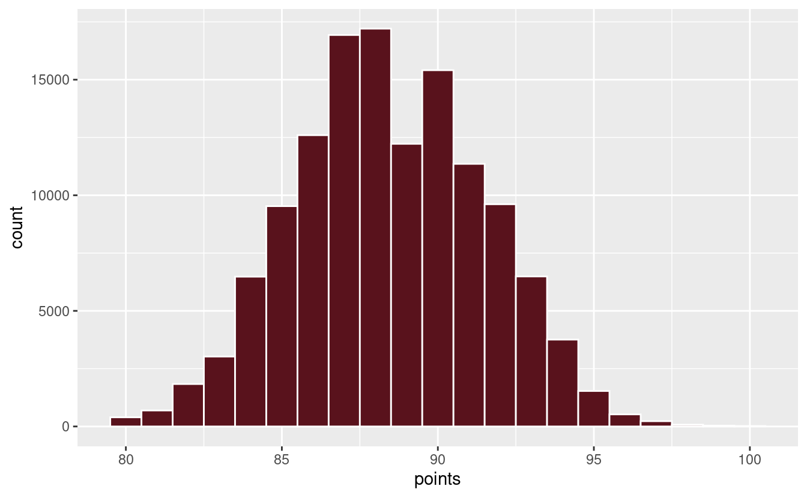
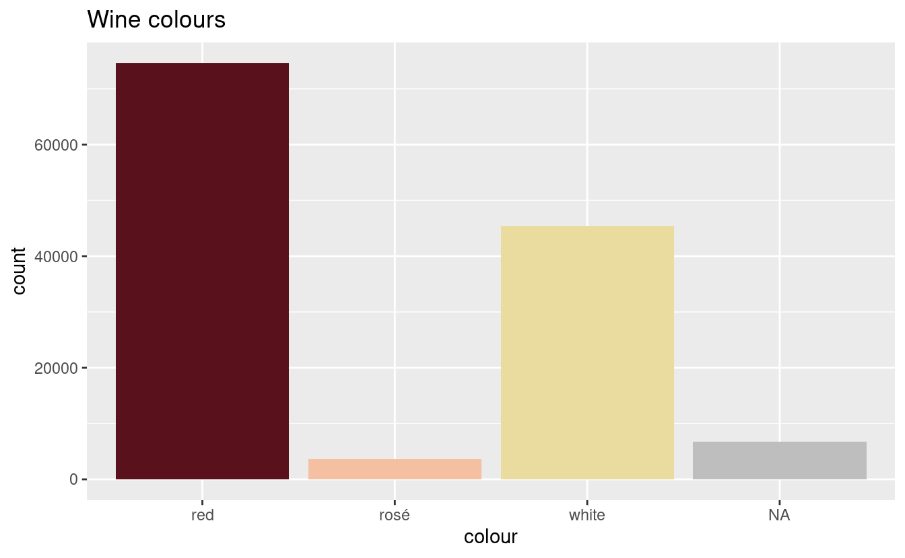
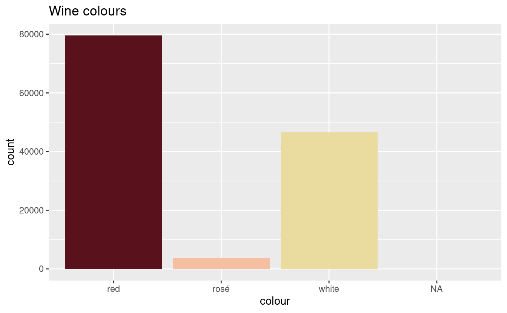

My knowledge of wine covers three facts:

1.  I like red wine.
2.  I do not like white wine.
3.  I love wine *data*.

I came across a great collection of around 130,000 wine reviews, each a paragraph long, on [Kaggle](https://www.kaggle.com/zynicide/wine-reviews). This is juicy stuff, and I can't wait to dig into it with some text analysis, or maybe build some sort of markov chain or neural network that generates new wine reviews.

But I wanted to start with something simple---a little bit of feature engineering. There's around 700 different *varieties* (eg. merlot, riesling) in here, and I thought it would be easy to add on whether or not they were red, white or rosé.

It was not.

I won't show you all the failed attempts; I'll just focus on what worked in the end. This is the process:

1.  Scrape wine colour data from Wikipedia
2.  Join the colours with the wine varieties
3.  Fix errors and duplicates
4.  Improve the wine colour data, and repeat
5.  When all else fails, manually classify what remains.

Classifying wine into three simple categories is a tough ask, and I can hear the connoisseurs tutting at me. Some grapes can be red and white, and I'm told that there's such a thing as "orange" wine (and no, it's not made from oranges---I did ask). Dessert wines and sparkling wines can probably be classified as red or white, but really they're off doing their own thing. I acknowledge how aggressive this classification is, but I'm going to charge ahead anyway.

Quick look at the data
----------------------

<pre class='chroma'><code class='language-r' data-lang='r'>knitr::<a href='https://rdrr.io/pkg/knitr/man/opts_chunk.html'>opts_chunk</a>$set(echo = TRUE, cache = TRUE)

<a href='https://rdrr.io/r/base/Random.html'>set.seed</a>(42275) # Chosen by fair dice roll. Guaranteed to be random.
 
<a href='https://rdrr.io/r/base/library.html'>library</a>(<a href='http://tidyverse.tidyverse.org'>tidyverse</a>)
<a href='https://rdrr.io/r/base/library.html'>library</a>(<a href='http://ggplot2.tidyverse.org'>ggplot2</a>) 
<a href='https://rdrr.io/r/base/library.html'>library</a>(<a href='http://rvest.tidyverse.org'>rvest</a>)

red_wine_colour &lt;- "#59121C"
white_wine_colour &lt;- "#EADB9F"
rose_wine_colour &lt;- "#F5C0A2"

wine &lt;- "wine_reviews.csv" %&gt;% 
    read_csv %&gt;% 
    mutate(variety = variety %&gt;% tolower)

wine %&gt;% str
#&gt; tibble [129,971 × 14] (S3: spec_tbl_df/tbl_df/tbl/data.frame)
#&gt;  $ X1                   : num [1:129971] 0 1 2 3 4 5 6 7 8 9 ...
#&gt;  $ country              : chr [1:129971] "Italy" "Portugal" "US" "US" ...
#&gt;  $ description          : chr [1:129971] "Aromas include tropical fruit, broom, brimstone and dried herb. The palate isn't overly expressive, offering un"| __truncated__ "This is ripe and fruity, a wine that is smooth while still structured. Firm tannins are filled out with juicy r"| __truncated__ "Tart and snappy, the flavors of lime flesh and rind dominate. Some green pineapple pokes through, with crisp ac"| __truncated__ "Pineapple rind, lemon pith and orange blossom start off the aromas. The palate is a bit more opulent, with note"| __truncated__ ...
#&gt;  $ designation          : chr [1:129971] "Vulkà Bianco" "Avidagos" NA "Reserve Late Harvest" ...
#&gt;  $ points               : num [1:129971] 87 87 87 87 87 87 87 87 87 87 ...
#&gt;  $ price                : num [1:129971] NA 15 14 13 65 15 16 24 12 27 ...
#&gt;  $ province             : chr [1:129971] "Sicily &amp; Sardinia" "Douro" "Oregon" "Michigan" ...
#&gt;  $ region_1             : chr [1:129971] "Etna" NA "Willamette Valley" "Lake Michigan Shore" ...
#&gt;  $ region_2             : chr [1:129971] NA NA "Willamette Valley" NA ...
#&gt;  $ taster_name          : chr [1:129971] "Kerin O’Keefe" "Roger Voss" "Paul Gregutt" "Alexander Peartree" ...
#&gt;  $ taster_twitter_handle: chr [1:129971] "@kerinokeefe" "@vossroger" "@paulgwine " NA ...
#&gt;  $ title                : chr [1:129971] "Nicosia 2013 Vulkà Bianco  (Etna)" "Quinta dos Avidagos 2011 Avidagos Red (Douro)" "Rainstorm 2013 Pinot Gris (Willamette Valley)" "St. Julian 2013 Reserve Late Harvest Riesling (Lake Michigan Shore)" ...
#&gt;  $ variety              : chr [1:129971] "white blend" "portuguese red" "pinot gris" "riesling" ...
#&gt;  $ winery               : chr [1:129971] "Nicosia" "Quinta dos Avidagos" "Rainstorm" "St. Julian" ...</code></pre>

I think this data will keep me entertained for a while. There's a lot to dig into here, and those reviews are going to be interesting when I can pull them apart. For example, 7 wines are described as tasting of tennis balls, and these wines are rated about average. It makes me think that I'm not spending enough time in life appreciating the taste of tennis balls. Dogs understand this.

Speaking of points, it appears as though wines are ranked on a scale from 80 to 100. Although, looking at the plot below, you'd be forgiven for thinking that the scale is from 80 to 97. Only 0.01% of wines make it to a rating of 100.

<pre class='chroma'><code class='language-r' data-lang='r'>wine %&gt;% <a href='https://ggplot2.tidyverse.org/reference/ggplot.html'>ggplot</a>(<a href='https://ggplot2.tidyverse.org/reference/aes.html'>aes</a>(x = points)) + 
    <a href='https://ggplot2.tidyverse.org/reference/geom_histogram.html'>geom_histogram</a>(
        bins = <a href='https://rdrr.io/r/base/nrow.html'>nrow</a>(wine %&gt;% distinct(points)),
        colour = "white",
        fill = red_wine_colour
    )
</code></pre>

The review below is for an 80-point wine, and it's certainly one of my favourite descriptions:

<pre class='chroma'><code class='language-r' data-lang='r'>wine %&gt;% 
    <a href='https://rdrr.io/r/stats/filter.html'>filter</a>(X1 == 11086) %&gt;% 
    select(description) %&gt;% 
    <a href='https://rdrr.io/r/base/paste.html'>paste0</a>('&gt; ', .) %&gt;% # print as quote
    cat
</code></pre>

> Picture grandma standing over a pot of stewed prunes, which fill the dusty old house with their sickly aromas. Cooked, earthy and rustic, this wine has little going for it. Just barely acceptable.
> 

One wine, indexed 86909, has a missing variety. Fortunately, we can recover the information from the review:

<pre class='chroma'><code class='language-r' data-lang='r'>wine %&gt;% 
    <a href='https://rdrr.io/r/stats/filter.html'>filter</a>(X1 == 86909) %&gt;% 
    select(description) %&gt;% 
    <a href='https://rdrr.io/r/base/paste.html'>paste0</a>('&gt; ', .) %&gt;% # print as quote
    cat
</code></pre>

> A chalky, dusty mouthfeel nicely balances this Petite Syrah's bright, full blackberry and blueberry fruit. Wheat-flour and black-pepper notes add interest to the bouquet; the wine finishes with herb and an acorny nuttiness. A good first Chilean wine for those more comfortable with the Californian style. It's got tannins to lose, but it's very good.
> 

<pre class='chroma'><code class='language-r' data-lang='r'>wine &lt;- wine %&gt;% mutate(
  variety = <a href='https://rdrr.io/r/base/ifelse.html'>ifelse</a>(X1 == 86909, "petite syrah", variety)
)</code></pre>

Scraping Wikipedia
------------------

In order to classify the wines as red, white or rosé, we're going to scrape wine data from the [List of grape varieties](https://en.wikipedia.org/wiki/List_of_grape_varieties) Wikipedia page, using the `rvest` package. The first three tables of this page give red, white and rosé wines, in that order.

We're going to use an older version of the article, dated 2018-06-29, for consistency. Wikipedia displays a notice that the user is reading an older version of the article. This counts as a table, and so the code below refers to tables 2, 3 and 4. If using the live version, replace these figures with 1, 2 and 3.

<pre class='chroma'><code class='language-r' data-lang='r'># Use an old revision of the article for consistency
wiki_tables &lt;- "https://en.wikipedia.org/w/index.php?title=List_of_grape_varieties&amp;oldid=847983339" %&gt;% 
    read_html %&gt;% 
    <a href='https://rvest.tidyverse.org/reference/html_nodes.html'>html_nodes</a>("table")
red_wines &lt;- wiki_tables[[1]] %&gt;% html_table %&gt;% <a href='https://rdrr.io/r/base/cbind.html'>cbind</a>(colour = "red")
white_wines &lt;- wiki_tables[[2]] %&gt;% html_table %&gt;% <a href='https://rdrr.io/r/base/cbind.html'>cbind</a>(colour = "white")
rose_wines &lt;- wiki_tables[[3]] %&gt;% html_table %&gt;% <a href='https://rdrr.io/r/base/cbind.html'>cbind</a>(colour = "rosé")
all_wines &lt;- <a href='https://rdrr.io/r/base/cbind.html'>rbind</a>(red_wines, white_wines, rose_wines)
all_wines %&gt;% 
    select(`Common Name(s)`, `All Synonyms`, colour) %&gt;% 
    <a href='https://rdrr.io/r/utils/head.html'>head</a>(1)
#&gt;   Common Name(s)   All Synonyms colour
#&gt; 1        Abbuoto Aboto, Cecubo.    red</code></pre>

We're interested in three columns here: `Common Name(s)`, `All Synonyms` and the `colour` column we defined from the table scraping. We will take the opportunity to rename the columns to match the tidyverse style.

Apart from synonyms, some wines can also have multiple common names, eg. "shiraz / syrah". The synonyms seem to be very broad, and can include some unexpected results: pinot grigio (also known as pinot gris) is used to produce white wine, yet it appears as a synonym to canari noir, which is used to make red wine.

We're going to preference the common names over the synonyms, so that in any conflict we use the colour as given by the common name. To do this, we're going to `unnest` the common names and clean the results so that all entries are in lower-case, the results are distinct, and certain stray bits of punctuation are removed. We're then going to do the same with the synonyms, but when we combine the results we will ignore all entries that are already provided by the common names.

The end result will be a single table with two columns: `variety`, and `colour`. The table may very well still contain duplicates, but certainly less than we would have had if we had treated common names and synonyms as equals.

<pre class='chroma'><code class='language-r' data-lang='r'>all_wines_cleaned &lt;- all_wines %&gt;% 
    rename(
        common_names = `Common Name(s)`,
        synonyms = `All Synonyms`
    ) %&gt;% 
    mutate_all(tolower) %&gt;% 
    select(common_names, synonyms, colour)

common_names &lt;- all_wines_cleaned %&gt;%
    unnest(common_names = <a href='https://rdrr.io/r/base/strsplit.html'>strsplit</a>(common_names, " / ")) %&gt;% # split common names into separate rows
    rename(variety = common_names) %&gt;% 
    mutate(
        variety = <a href='https://rdrr.io/r/base/grep.html'>gsub</a>("\\.", "", variety), # remove periods 
        variety = <a href='https://rdrr.io/r/base/grep.html'>gsub</a>("\\s*\\([^\\)]+\\)", "", variety), # remove brackets and anything within
        variety = <a href='https://rdrr.io/r/base/grep.html'>gsub</a>("\\s*\\[[^\\)]+\\]", "", variety) # same for square brackets
    ) %&gt;% 
    select(variety, colour)
#&gt; Warning: unnest() has a new interface. See ?unnest for details.
#&gt; Try `df %&gt;% unnest(c(common_names))`, with `mutate()` if needed

synonyms &lt;- all_wines_cleaned %&gt;% 
    unnest(synonyms = <a href='https://rdrr.io/r/base/strsplit.html'>strsplit</a>(synonyms, ", ")) %&gt;% # split the synonyms into multiple rows
    rename(variety = synonyms) %&gt;% 
    mutate(
        variety = <a href='https://rdrr.io/r/base/grep.html'>gsub</a>("\\.", "", variety), # remove periods 
        variety = <a href='https://rdrr.io/r/base/grep.html'>gsub</a>("\\s*\\([^\\)]+\\)", "", variety), # remove brackets and anything within
        variety = <a href='https://rdrr.io/r/base/grep.html'>gsub</a>("\\s*\\[[^\\)]+\\]", "", variety) # same for square brackets
    ) %&gt;% 
    select(variety, colour) %&gt;% 
    anti_join(common_names, by = "variety") # remove synonyms if we have a common name
#&gt; Warning: unnest() has a new interface. See ?unnest for details.
#&gt; Try `df %&gt;% unnest(c(synonyms))`, with `mutate()` if needed

variety_colours &lt;- <a href='https://rdrr.io/r/base/cbind.html'>rbind</a>(common_names, synonyms) %&gt;% 
    distinct %&gt;% 
    arrange(variety)

variety_colours %&gt;% head
#&gt; # A tibble: 6 x 2
#&gt;   variety             colour
#&gt;   &lt;chr&gt;               &lt;chr&gt; 
#&gt; 1 " barbera dolce"    red   
#&gt; 2 " cosses barbusen"  red   
#&gt; 3 " limberger blauer" red   
#&gt; 4 "22 a baco"         white 
#&gt; 5 "abbondosa"         white 
#&gt; 6 "abboudossa"        white</code></pre>

The end result is 8469 rows, with plenty of repeated entries to accommodate for multiple names or variations in spelling.

Joining the colour data
-----------------------

Now we join the colours with the wine data. If there are any missing values, we can attempt to fill them in based on obvious clues in the variety (eg. a "Red blend" can safely be assumed to be a red wine). We're going to repeat this join as we iteratively improve the `variety_colours` data, so we'll define it as a function.

<pre class='chroma'><code class='language-r' data-lang='r'>join_with_variety_colours &lt;- function(wine, variety_colours) {
    wine %&gt;% 
        left_join(
            variety_colours %&gt;% select(variety, colour),
            by = "variety"
        ) %&gt;% 
        mutate(
            colour = case_when(
                !<a href='https://rdrr.io/r/base/NA.html'>is.na</a>(colour) ~ colour,
                <a href='https://rdrr.io/r/base/grep.html'>grepl</a>("sparkling", variety, ignore.case = TRUE) ~ "white",
                <a href='https://rdrr.io/r/base/grep.html'>grepl</a>("champagne", variety, ignore.case = TRUE) ~ "white",
                <a href='https://rdrr.io/r/base/grep.html'>grepl</a>("red", variety, ignore.case = TRUE) ~ "red",
                <a href='https://rdrr.io/r/base/grep.html'>grepl</a>("white", variety, ignore.case = TRUE) ~ "white",
                <a href='https://rdrr.io/r/base/grep.html'>grepl</a>("rosé", variety, ignore.case = TRUE) ~ "rosé",
                <a href='https://rdrr.io/r/base/grep.html'>grepl</a>("rose", variety, ignore.case = TRUE) ~ "rosé"
            )
        )
}

wine_colours &lt;- wine %&gt;% join_with_variety_colours(variety_colours)

plot_wine_colours &lt;- function(wine_colours) {
    wine_colours %&gt;% 
    <a href='https://ggplot2.tidyverse.org/reference/ggplot.html'>ggplot</a>(<a href='https://ggplot2.tidyverse.org/reference/aes.html'>aes</a>(x = colour, fill = colour)) + 
    <a href='https://ggplot2.tidyverse.org/reference/geom_bar.html'>geom_bar</a>() + 
    <a href='https://ggplot2.tidyverse.org/reference/scale_manual.html'>scale_fill_manual</a>(values = <a href='https://rdrr.io/r/base/c.html'>c</a>(
        "red" = red_wine_colour, 
        "white" = white_wine_colour, 
        "rosé" = rose_wine_colour),
        na.value = "grey"
    ) + 
    <a href='https://ggplot2.tidyverse.org/reference/labs.html'>ggtitle</a>("Wine colours") +
    <a href='https://ggplot2.tidyverse.org/reference/theme.html'>theme</a>(legend.position="none")
}

plot_wine_colours(wine_colours)
</code></pre>

All but 6734 wines have been classified. We still have some colours missing, but first we consider the wines that have been classified as multiple colours:

<pre class='chroma'><code class='language-r' data-lang='r'>wine_colours %&gt;% 
    distinct(variety, colour) %&gt;% 
    count(variety) %&gt;% 
    <a href='https://rdrr.io/r/stats/filter.html'>filter</a>(n &gt; 1)
#&gt; # A tibble: 4 x 2
#&gt;   variety           n
#&gt;   &lt;chr&gt;         &lt;int&gt;
#&gt; 1 alicante          2
#&gt; 2 grignolino        2
#&gt; 3 malvasia fina     2
#&gt; 4 sauvignon         2</code></pre>

We use web searches to manually classify the varieties based on the colour of the wine that is most often produced from them.

<pre class='chroma'><code class='language-r' data-lang='r'>variety_colours &lt;- variety_colours %&gt;% 
    <a href='https://rdrr.io/r/stats/filter.html'>filter</a>(!(variety == "alicante" &amp; colour != "red")) %&gt;%     
    <a href='https://rdrr.io/r/stats/filter.html'>filter</a>(!(variety == "grignolino" &amp; colour != "red")) %&gt;% 
    <a href='https://rdrr.io/r/stats/filter.html'>filter</a>(!(variety == "malvasia fina" &amp; colour != "white")) %&gt;% # rarely red
    <a href='https://rdrr.io/r/stats/filter.html'>filter</a>(!(variety == "sauvignon" &amp; colour != "white"))</code></pre>

The below suggests that blends are not being classified:

<pre class='chroma'><code class='language-r' data-lang='r'>wine_colours %&gt;% 
    <a href='https://rdrr.io/r/stats/filter.html'>filter</a>(<a href='https://rdrr.io/r/base/NA.html'>is.na</a>(colour)) %&gt;% 
    count(variety, sort = TRUE) %&gt;% 
    <a href='https://rdrr.io/r/utils/head.html'>head</a>(10)
#&gt; # A tibble: 10 x 2
#&gt;    variety                           n
#&gt;    &lt;chr&gt;                         &lt;int&gt;
#&gt;  1 port                            668
#&gt;  2 corvina, rondinella, molinara   619
#&gt;  3 tempranillo blend               588
#&gt;  4 carmenère                       575
#&gt;  5 meritage                        260
#&gt;  6 g-s-m                           181
#&gt;  7 mencía                          178
#&gt;  8 cabernet sauvignon-merlot       117
#&gt;  9 nerello mascalese               117
#&gt; 10 rosato                          103</code></pre>

We operate under the assumption that if multiple wines are listed, the first wine determines the colour. For example, cabernet is red and sauvignon is white, but cabernet sauvignon is red. We try to classify the unclassified wines again but using only the first word in their varieties. We split the variety by either spaces or dashes.

<pre class='chroma'><code class='language-r' data-lang='r'>blend_colours &lt;- 
    wine_colours %&gt;% 
    <a href='https://rdrr.io/r/stats/filter.html'>filter</a>(<a href='https://rdrr.io/r/base/NA.html'>is.na</a>(colour)) %&gt;% 
    select(variety) %&gt;% 
    rowwise %&gt;% 
    mutate(first_variety = <a href='https://rdrr.io/r/base/unlist.html'>unlist</a>(<a href='https://rdrr.io/r/base/strsplit.html'>strsplit</a>(variety, "\\-|\\ | "))[1]) %&gt;% 
    <a href='https://rdrr.io/r/base/merge.html'>merge</a>(variety_colours, by.x = "first_variety", by.y = "variety") %&gt;% 
    select(variety, colour) %&gt;% 
    distinct</code></pre>

Now we can rebuild the wine colours using these new blend results:

<pre class='chroma'><code class='language-r' data-lang='r'>wine_colours &lt;- wine %&gt;% join_with_variety_colours(
    <a href='https://rdrr.io/r/base/cbind.html'>rbind</a>(variety_colours, blend_colours)
) 

plot_wine_colours(wine_colours)
</code></pre>

All but 4091 wines have been classified. This is an improvement, but we still have to classify the rest.

Manual classifications
----------------------

We manually classify the remaining 154 varieties using web searches or the `description`s (reviews) associated with the wines.

<pre class='chroma'><code class='language-r' data-lang='r'>manual_colours &lt;- "manually_classified.csv" %&gt;% read_csv
#&gt; Parsed with column specification:
#&gt; cols(
#&gt;   variety = col_character(),
#&gt;   colour = col_character()
#&gt; )

wine_colours &lt;- wine %&gt;% join_with_variety_colours(
    <a href='https://rdrr.io/r/base/cbind.html'>rbind</a>(variety_colours, blend_colours, manual_colours)
) 

plot_wine_colours(wine_colours)
</code></pre>

And we're there! As I said earlier, this is a somewhat aggressive classification. But we've got the most popular wines---the pinot noirs and the chardonnays---classified, and we can hope that any errors are only "kind of wrong" rather than "totally wrong", and limited to the varieties that only appear once or twice.

Data sources
------------

To avoid any potential licencing issues, I prefer not to post Kaggle data directly here. I encourage you to download the csv [directly from Kaggle](https://www.kaggle.com/zynicide/wine-reviews/). This will require a (free) Kaggle account. I've renamed the file here to `wine_reviews.csv`, but otherwise the data is unchanged before it is read. Other data used here:

-   My manual classification of variety colours: [manually\_classified.csv](/data/manually_classified.csv)
-   The final outcome, giving just varieties and colours: [variety\_colours.csv](/data/variety_colours.csv)

The header image at the top of this page is in the [public domain](https://www.pexels.com/photo/abundance-alcohol-berries-berry-357742/).

------------------------------------------------------------------------

<pre class='chroma'><code class='language-r' data-lang='r'>devtools::<a href='https://rdrr.io/pkg/sessioninfo/man/session_info.html'>session_info</a>()
#&gt; ─ Session info ───────────────────────────────────────────────────────────────
#&gt;  setting  value                       
#&gt;  version  R version 4.0.0 (2020-04-24)
#&gt;  os       Ubuntu 20.04 LTS            
#&gt;  system   x86_64, linux-gnu           
#&gt;  ui       X11                         
#&gt;  language en_AU:en                    
#&gt;  collate  en_AU.UTF-8                 
#&gt;  ctype    en_AU.UTF-8                 
#&gt;  tz       Australia/Melbourne         
#&gt;  date     2020-06-13                  
#&gt; 
#&gt; ─ Packages ───────────────────────────────────────────────────────────────────
#&gt;  package     * version    date       lib source                            
#&gt;  assertthat    0.2.1      2019-03-21 [1] CRAN (R 4.0.0)                    
#&gt;  backports     1.1.7      2020-05-13 [1] CRAN (R 4.0.0)                    
#&gt;  broom         0.5.6      2020-04-20 [1] CRAN (R 4.0.0)                    
#&gt;  callr         3.4.3      2020-03-28 [1] CRAN (R 4.0.0)                    
#&gt;  cellranger    1.1.0      2016-07-27 [1] CRAN (R 4.0.0)                    
#&gt;  cli           2.0.2      2020-02-28 [1] CRAN (R 4.0.0)                    
#&gt;  codetools     0.2-16     2018-12-24 [4] CRAN (R 4.0.0)                    
#&gt;  colorspace    1.4-1      2019-03-18 [1] CRAN (R 4.0.0)                    
#&gt;  crayon        1.3.4      2017-09-16 [1] CRAN (R 4.0.0)                    
#&gt;  curl          4.3        2019-12-02 [1] CRAN (R 4.0.0)                    
#&gt;  DBI           1.1.0      2019-12-15 [1] CRAN (R 4.0.0)                    
#&gt;  dbplyr        1.4.3      2020-04-19 [1] CRAN (R 4.0.0)                    
#&gt;  desc          1.2.0      2018-05-01 [1] CRAN (R 4.0.0)                    
#&gt;  devtools      2.3.0      2020-04-10 [1] CRAN (R 4.0.0)                    
#&gt;  digest        0.6.25     2020-02-23 [1] CRAN (R 4.0.0)                    
#&gt;  downlit       0.0.0.9000 2020-06-12 [1] Github (r-lib/downlit@87fb1af)    
#&gt;  dplyr       * 0.8.5      2020-03-07 [1] CRAN (R 4.0.0)                    
#&gt;  ellipsis      0.3.1      2020-05-15 [1] CRAN (R 4.0.0)                    
#&gt;  evaluate      0.14       2019-05-28 [1] CRAN (R 4.0.0)                    
#&gt;  fansi         0.4.1      2020-01-08 [1] CRAN (R 4.0.0)                    
#&gt;  farver        2.0.3      2020-01-16 [1] CRAN (R 4.0.0)                    
#&gt;  forcats     * 0.5.0      2020-03-01 [1] CRAN (R 4.0.0)                    
#&gt;  fs            1.4.1      2020-04-04 [1] CRAN (R 4.0.0)                    
#&gt;  generics      0.0.2      2018-11-29 [1] CRAN (R 4.0.0)                    
#&gt;  ggplot2     * 3.3.0      2020-03-05 [1] CRAN (R 4.0.0)                    
#&gt;  glue          1.4.1      2020-05-13 [1] CRAN (R 4.0.0)                    
#&gt;  gtable        0.3.0      2019-03-25 [1] CRAN (R 4.0.0)                    
#&gt;  haven         2.2.0      2019-11-08 [1] CRAN (R 4.0.0)                    
#&gt;  highr         0.8        2019-03-20 [1] CRAN (R 4.0.0)                    
#&gt;  hms           0.5.3      2020-01-08 [1] CRAN (R 4.0.0)                    
#&gt;  htmltools     0.4.0      2019-10-04 [1] CRAN (R 4.0.0)                    
#&gt;  httr          1.4.1      2019-08-05 [1] CRAN (R 4.0.0)                    
#&gt;  hugodown      0.0.0.9000 2020-06-12 [1] Github (r-lib/hugodown@6812ada)   
#&gt;  jsonlite      1.6.1      2020-02-02 [1] CRAN (R 4.0.0)                    
#&gt;  kableExtra  * 1.1.0      2019-03-16 [1] CRAN (R 4.0.0)                    
#&gt;  knitr         1.28       2020-02-06 [1] CRAN (R 4.0.0)                    
#&gt;  labeling      0.3        2014-08-23 [1] CRAN (R 4.0.0)                    
#&gt;  lattice       0.20-41    2020-04-02 [4] CRAN (R 4.0.0)                    
#&gt;  lifecycle     0.2.0      2020-03-06 [1] CRAN (R 4.0.0)                    
#&gt;  lubridate     1.7.8      2020-04-06 [1] CRAN (R 4.0.0)                    
#&gt;  magrittr      1.5        2014-11-22 [1] CRAN (R 4.0.0)                    
#&gt;  memoise       1.1.0.9000 2020-05-09 [1] Github (hadley/memoise@4aefd9f)   
#&gt;  modelr        0.1.6      2020-02-22 [1] CRAN (R 4.0.0)                    
#&gt;  munsell       0.5.0      2018-06-12 [1] CRAN (R 4.0.0)                    
#&gt;  nlme          3.1-145    2020-03-04 [4] CRAN (R 4.0.0)                    
#&gt;  pillar        1.4.4      2020-05-05 [1] CRAN (R 4.0.0)                    
#&gt;  pkgbuild      1.0.7      2020-04-25 [1] CRAN (R 4.0.0)                    
#&gt;  pkgconfig     2.0.3      2019-09-22 [1] CRAN (R 4.0.0)                    
#&gt;  pkgload       1.0.2      2018-10-29 [1] CRAN (R 4.0.0)                    
#&gt;  prettyunits   1.1.1      2020-01-24 [1] CRAN (R 4.0.0)                    
#&gt;  processx      3.4.2      2020-02-09 [1] CRAN (R 4.0.0)                    
#&gt;  ps            1.3.3      2020-05-08 [1] CRAN (R 4.0.0)                    
#&gt;  purrr       * 0.3.4      2020-04-17 [1] CRAN (R 4.0.0)                    
#&gt;  R6            2.4.1      2019-11-12 [1] CRAN (R 4.0.0)                    
#&gt;  Rcpp          1.0.4.6    2020-04-09 [1] CRAN (R 4.0.0)                    
#&gt;  readr       * 1.3.1      2018-12-21 [1] CRAN (R 4.0.0)                    
#&gt;  readxl        1.3.1      2019-03-13 [1] CRAN (R 4.0.0)                    
#&gt;  remotes       2.1.1      2020-02-15 [1] CRAN (R 4.0.0)                    
#&gt;  reprex        0.3.0      2019-05-16 [1] CRAN (R 4.0.0)                    
#&gt;  rlang         0.4.6      2020-05-02 [1] CRAN (R 4.0.0)                    
#&gt;  rmarkdown     2.2.3      2020-06-12 [1] Github (rstudio/rmarkdown@4ee96c8)
#&gt;  rprojroot     1.3-2      2018-01-03 [1] CRAN (R 4.0.0)                    
#&gt;  rstudioapi    0.11       2020-02-07 [1] CRAN (R 4.0.0)                    
#&gt;  rvest       * 0.3.5      2019-11-08 [1] CRAN (R 4.0.0)                    
#&gt;  scales        1.1.0      2019-11-18 [1] CRAN (R 4.0.0)                    
#&gt;  selectr       0.4-2      2019-11-20 [1] CRAN (R 4.0.0)                    
#&gt;  sessioninfo   1.1.1      2018-11-05 [1] CRAN (R 4.0.0)                    
#&gt;  stringi       1.4.6      2020-02-17 [1] CRAN (R 4.0.0)                    
#&gt;  stringr     * 1.4.0      2019-02-10 [1] CRAN (R 4.0.0)                    
#&gt;  testthat      2.3.2      2020-03-02 [1] CRAN (R 4.0.0)                    
#&gt;  tibble      * 3.0.1      2020-04-20 [1] CRAN (R 4.0.0)                    
#&gt;  tidyr       * 1.0.2      2020-01-24 [1] CRAN (R 4.0.0)                    
#&gt;  tidyselect    1.0.0      2020-01-27 [1] CRAN (R 4.0.0)                    
#&gt;  tidyverse   * 1.3.0      2019-11-21 [1] CRAN (R 4.0.0)                    
#&gt;  usethis       1.6.1      2020-04-29 [1] CRAN (R 4.0.0)                    
#&gt;  vctrs         0.3.1      2020-06-05 [1] CRAN (R 4.0.0)                    
#&gt;  viridisLite   0.3.0      2018-02-01 [1] CRAN (R 4.0.0)                    
#&gt;  webshot       0.5.2      2019-11-22 [1] CRAN (R 4.0.0)                    
#&gt;  withr         2.2.0      2020-04-20 [1] CRAN (R 4.0.0)                    
#&gt;  xfun          0.14       2020-05-20 [1] CRAN (R 4.0.0)                    
#&gt;  xml2        * 1.3.2      2020-04-23 [1] CRAN (R 4.0.0)                    
#&gt;  yaml          2.2.1      2020-02-01 [1] CRAN (R 4.0.0)                    
#&gt; 
#&gt; [1] /home/mdneuzerling/R/x86_64-pc-linux-gnu-library/4.0
#&gt; [2] /usr/local/lib/R/site-library
#&gt; [3] /usr/lib/R/site-library
#&gt; [4] /usr/lib/R/library</code></pre>

