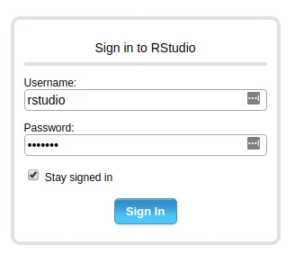
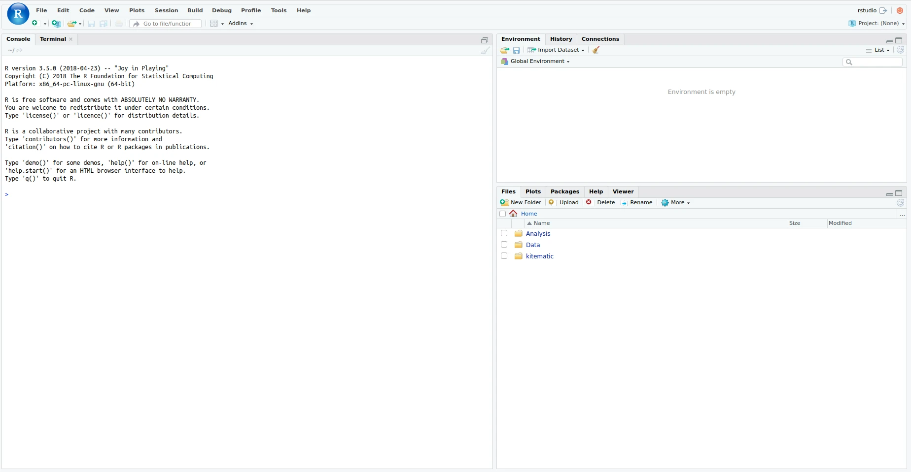
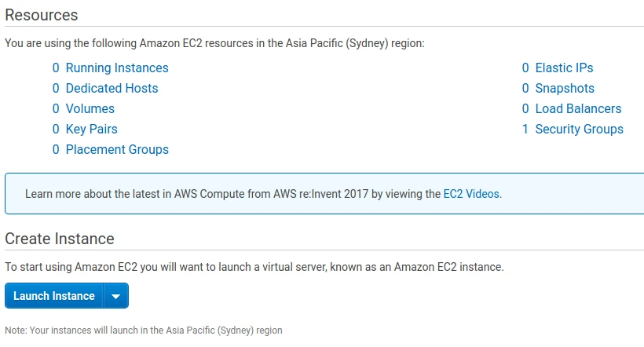
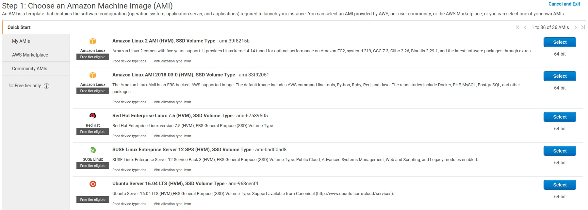
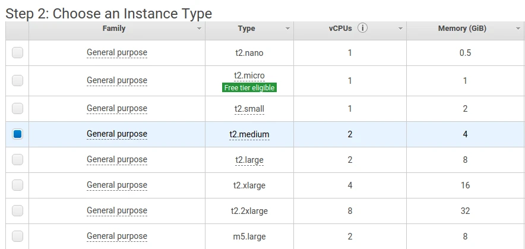
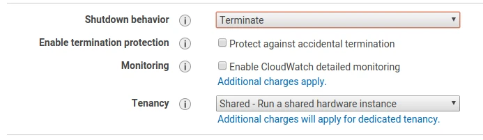
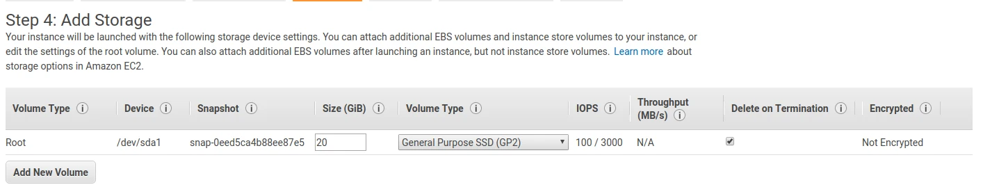
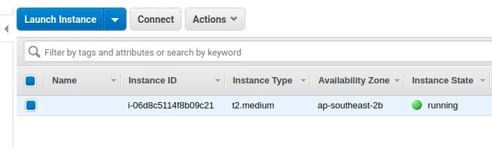
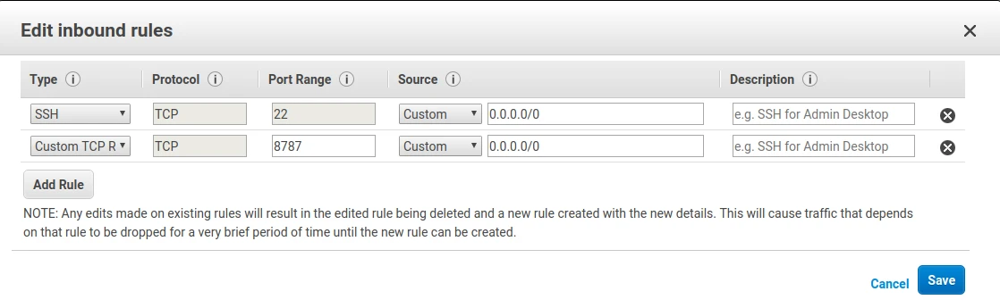

These are my notes for the super helpful tutorial given by [Elizabeth Stark](https://twitter.com/tech_is_dead) on the first day of the UseR 2018 conference. This was an introduction to Docker for R users who have no prior experience with Docker (which was me!).

-   [Elizabeth's slides](https://github.com/SymbolixAU/useR_docker_tutorial)
-   [Elizabeth's exercises and examples](https://github.com/SymbolixAU/R_docker_hello)

This tutorial took me through setting up an RStudio Server container. I'm on a Linux machine, but I'm particularly interested by the idea that you could run these traditionally Linux-only servers on a Windows machine through Docker.

Docker glossary
---------------

-   A container is like a virtual machine, but it just has the user-space stuff. It consists of:
    -   A Docker image. This is an ["ordered collection of root filesystem changes and the corresponding execution parameters for use within a container runtime."](https://docs.docker.com/glossary/?term=image)
    -   An execution environment
    -   A standard set of instructions
-   A Dockerfile is like source code for an image.
-   Docker is software that builds images and runs containers. Its logo is an adorable whale/cargo ship.

I will admit, the difference between an image and a container confuses me. From what I can tell, you `build` an **image**, and then when you `run` the image it turns into a **container**. Images are layered on top of one another. The `run` command takes an image, adds a file system, and executes some instructions.

It sounds like a virtual machine to me, though. But a virtual machine has a guest operating system, whereas a container doesn't. Docker provides the guest operating system, and the container provides the application and the libraries. The advantage here is that a virtual machine has to boot, which can take a long time, whereas Docker images can be run in seconds.

Containers are ephemeral. Any changes to a running container, such as new user data, will disappear as soon as Docker stops running the container.

Running docker images
---------------------

Docker images require `sudo` by default. You can do without `sudo` by adding your use to the docker group, but this carries some security implications. In particular, users in the group will have unmoderated access to the root filesystem. I've added myself to the group for the duration of this tutorial. [This article](https://www.projectatomic.io/blog/2015/08/why-we-dont-let-non-root-users-run-docker-in-centos-fedora-or-rhel/) gives a good rundown of why you might *not* want to allow non-root access to Docker.

The first Docker image you ever `run` is likely to be `hello-world`. If you've never run it before, Docker will download it from [Docker Hub](https://hub.docker.com).

<pre class='chroma'><code class='language-r' data-lang='r'>docker run hello-world

#> 
#> Hello from Docker!
#> This message shows that your installation appears to be working correctly.
#> 
#> To generate this message, Docker took the following steps:
#>  1. The Docker client contacted the Docker daemon.
#>  2. The Docker daemon pulled the "hello-world" image from the Docker Hub.
#>     (amd64)
#>  3. The Docker daemon created a new container from that image which runs the
#>     executable that produces the output you are currently reading.
#>  4. The Docker daemon streamed that output to the Docker client, which sent it
#>     to your terminal.
#> 
#> To try something more ambitious, you can run an Ubuntu container with:
#>  $ docker run -it ubuntu bash
#> 
#> Share images, automate workflows, and more with a free Docker ID:
#>  https://hub.docker.com/
#> 
#> For more examples and ideas, visit:
#>  https://docs.docker.com/get-started/
</code></pre>

Quick aside: yes, this is me running a Docker image in an R Markdown file. Remember that R Markdown can handle languages other than R, including bash! This code chunk is `{bash docker_hello_world}`, which tells `knitr` to run this chunk (called `docker_hello_world`) with bash. I imagine this only works because the `hello-world` container outputs to `stdout`.

Rocker
------

[Rocker](https://hub.docker.com/u/rocker/) exists on [Docker Hub](https://hub.docker.com) and contains a whole bunch of images relevant to R users.

Dockerfiles (the source code for images) start `FROM` a base image. We can `COPY` files, `RUN` commands, or set `ENV` variables. Here's the head of the RStudio Dockerfile:

<pre class='chroma'><code class='language-r' data-lang='r'>FROM rocker/r-ver:latest

ARG RSTUDIO_VERSION
ENV PATH=/usr/lib/rstudio-server/bin:$PATH

## Download and install RStudio server & dependencies
## Attempts to get detect latest version, otherwise falls back to version given in $VER
## Symlink pandoc, pandoc-citeproc so they are available system-wide
RUN apt-get update \
  && apt-get install -y --no-install-recommends \
    file \
    git \
    libapparmor1 \
    libcurl4-openssl-dev \
    libedit2 \
    libssl-dev \
    lsb-release \
    psmisc \
    procps \
    python-setuptools \
    sudo \
    wget \
  && wget -O libssl1.0.0.deb http://ftp.debian.org/debian/pool/main/o/openssl/libssl1.0.0_1.0.1t-1+deb8u8_amd64.deb \
  && dpkg -i libssl1.0.0.deb \
  && rm libssl1.0.0.deb \
  && RSTUDIO_LATEST=$(wget --no-check-certificate -qO- https://s3.amazonaws.com/rstudio-server/current.ver) \
  && [ -z "$RSTUDIO_VERSION" ] && RSTUDIO_VERSION=$RSTUDIO_LATEST || true \
  && wget -q http://download2.rstudio.org/rstudio-server-${RSTUDIO_VERSION}-amd64.deb \
</code></pre>

R hello world
-------------

We're going to build and run the example R hello world image linked at the top of this page. This is following Elizabeth Stark's [blog post](https://www.symbolix.com.au/blog-main/r-docker-hello). First, clone the repository at the top of this page and `cd` into the newly created directory.

Here's the Dockerfile, which tells us what is going on here. Note the base image, RStudio, and a `requirements.R` file. The required R packages for the image are stored in this file. When the image is built, the libraries are installed.

<pre class='chroma'><code class='language-r' data-lang='r'># Base image https://hub.docker.com/u/rocker/
FROM rocker/rstudio

## Install extra R packages using requirements.R
## Specify requirements as R install commands e.g.
## 
## install.packages("<myfavouritepacakge>") or
## devtools::install("SymbolixAU/googleway")

## Copy requirements.R to container directory /tmp
COPY ./DockerConfig/requirements.R /tmp/requirements.R 
## install required libs on container
RUN Rscript /tmp/requirements.R

# create an R user
ENV USER rstudio

## Copy your working files over
## The $USER defaults to `rstudio` but you can change this at runtime
COPY ./Analysis /home/$USER/Analysis
COPY ./Data /home/$USER/Data
</code></pre>

Run the following command to `build` the image:

<pre class='chroma'><code class='language-r' data-lang='r'>docker build --rm --force-rm -t rstudio/hello-world .
</code></pre>

The `--rm --force-rm` command tells Docker to delete the container once it's run. This keeps the server clean. The `-t rstudio/hello-world` option names the resulting image. We can see our installed Docker images, including the `hello-world` image we just built, by running the following command:

<pre class='chroma'><code class='language-r' data-lang='r'>docker image list

#> REPOSITORY          TAG                 IMAGE ID            CREATED             SIZE
#> hello-world         latest              bf756fb1ae65        5 months ago        13.3kB
</code></pre>

Now we can `run` the image. We `--name` the container `hello-world`. You may be aware that RStudio server runs on port 8787 by default, but here we `run` the container on port 28787.

<pre class='chroma'><code class='language-r' data-lang='r'>docker run -d --rm -p 28787:8787 --name hello-world rstudio/hello-world
</code></pre>

The command runs and then we are returned to the terminal. At first I thought nothing had happened and I had managed to break something this early on. But when I opened my browser and went to <a href="http://127.0.0.1:28787" class="uri">http://127.0.0.1:28787</a> I saw a login page!

The default username and password are both `rstudio`. Logging in, I see a familiar interface.

We can stop the container with the `stop` command. This will interrupt the RStudio Server instance and delete any inputted data.

<pre class='chroma'><code class='language-r' data-lang='r'>docker stop hello-world
</code></pre>

### Playing with the `hello-world` image

-   The `docker ps` command lists running images.
-   You can run the same container more than once, but they have to have different names and run on different ports.
-   If you add a package to the requirements.R and rebuild, it will install the package and all dependencies.
-   Set environment variables when running an image by using the `-e` option, eg. `-e USERID=$UID -e PASSWORD=SoSecret!`
-   Save data to a persistent location by mounting a volume using the `-v` option, eg. `-v $DATA_DIR:/home/rstudio/Data`

### A note on security

For security reasons, you often can't access environment variables (such as those set by `ENV` or `-e`) from RStudio Server or Shiny. Instead, you could include an `.Renviron` file in the build context. Be sure to configure your `.gitignore` file so that you don't accidentally upload secrets to GitHub!

Elizabeth went through an example with the `googleway` package, which uses Google Maps API keys. In the Dockerbuild file, she includes a `COPY` command to copy the API key to `/home/$USER`.

### Managing Docker without leaving R

Like many R users, I don't like having to do anything outside of R. The `docker` R package uses Python (through `reticulate`) to manage Docker. See the [vignette](https://cran.r-project.org/web/packages/docker/vignettes/Getting_Started_with_Docker.html).

Docker on AWS
-------------

Elizabeth kindly offered to taked us through launching an EC2 instance on AWS and running Docker on it.

We're going to be a little bit lazy with some of the settings here under the assumption that we'll delete everything when we're done. If you don't do this, you may be charged more than you intended!

I already have an AWS account, although I haven't used it in a while. You can see my 0 EC2 instances below:

I'm going to launch a new instance. I will first be prompted to choose the type of image. I'm going to go with the generic Ubuntu image at the bottom of the picture below:

I'll next be asked to choose the specifications of my machine. I'm going to launch an instance with 4GB of RAM. As of now, this will charge me USD 0.0584 per hour to run the instance in Sydney. I don't see myself needing it for more than an hour.

Click on "Next: Configure Instance Details". On the next page we're going to change the shutdown behaviour from "Stop" to "Terminate". This will permanently remove the instance when it is stopped, which is okay for now because we only want a temporary instance.

On the next screen, we'll give ourselves some storage. I'm choosing 20GB here, which should be enough for this machine's temporary purpose.

When you go to launch the instance, you'll be asked about key pairs. Create a new key and be sure to download the pem file. I'm going to call the keypair "temp\_docker".

Proceed to see that your instance is launched! You can click through here to see your EC2 instance up and running. Take note of the IPv4 public IP here: we will need this to SSH into the machine, and to access our RStudio server.

You can click on the instance and then on the "Connect" button to view detailed instructions on how to SSH into your newly created instance. Once you've SSH'd into the machine, run the following bash command to install the Community Edition of Docker. If the command fails, try to install `docker-ce` instead.

<pre class='chroma'><code class='language-r' data-lang='r'>sudo apt-get update && sudo apt-get install -y docker-io
</code></pre>

You can test that the installation works by running `sudo docker run hello-world`, as we did locally earlier. Docker will first install the `hello-world` image, since it hasn't been `run` before.

<pre class='chroma'><code class='language-r' data-lang='r'>sudo docker pull rocker/rstudio
</code></pre>

It's a big install (around a gigabyte) so you may have to wait a few minutes. Now we can run our server:

<pre class='chroma'><code class='language-r' data-lang='r'>sudo docker run --rm -p 8787:8787 --name rstudio rocker/rstudio
</code></pre>

Remember that IPv4 address you noted earlier? Put that in the address bar of your browser, followed by the default RStudio port 8787. For my example, I went to 13.211.29.244:8787, but your instance will be running on a different IP address.

And it won't work!

You'll notice that the page will try to load for a while but won't get anywhere. This smells like a firewall issue to me. Go back to your EC2 dashboard and scroll to the right to see the securty group in use by your EC2 instance. Click on the security group, which for me was "launch-wizard-1". Click on "Actions" and "Edit inbound rules".

You'll see that SSH is allowed through port 22 to an ip address range 0.0.0.0/0. This actually refers to every IP address. We're going to add a new "Custom TCP" rule and allow all access to port 8787 from 0.0.0.0/0.

Usually we would be very concerned about security here; in general we don't want everyone in the world to be able to access our R Studio server! But this short-lived machine isn't used for anything important, so we can skip along here.

Save your changes and return to your instances ip address, which for me was 13.211.29.244:8787. You should see the same RStudio log-in screen that appeared when we ran the R `hello-world` image earlier. At this point, feel free to log in using the default username and password, `rstudio`.

As a final step, be sure to go to your AWS dashboard to stop (and therefore terminate) your EC2 instance. The storage volume we created earlier *should* be deleted alongside the EC2 instance, but you may wish to double-check.

And that's it!
--------------

That's the end of the workshop. Many thanks to Elizabeth for her time, and for a great start to useR 2018!

------------------------------------------------------------------------

<pre class='chroma'><code class='language-r' data-lang='r'>devtools::<a href='https://rdrr.io/pkg/sessioninfo/man/session_info.html'>session_info</a>()
#&gt; ─ Session info ───────────────────────────────────────────────────────────────
#&gt;  setting  value                       
#&gt;  version  R version 4.0.0 (2020-04-24)
#&gt;  os       Ubuntu 20.04 LTS            
#&gt;  system   x86_64, linux-gnu           
#&gt;  ui       X11                         
#&gt;  language en_AU:en                    
#&gt;  collate  en_AU.UTF-8                 
#&gt;  ctype    en_AU.UTF-8                 
#&gt;  tz       Australia/Melbourne         
#&gt;  date     2020-06-20                  
#&gt; 
#&gt; ─ Packages ───────────────────────────────────────────────────────────────────
#&gt;  package     * version    date       lib source                            
#&gt;  assertthat    0.2.1      2019-03-21 [1] CRAN (R 4.0.0)                    
#&gt;  backports     1.1.7      2020-05-13 [1] CRAN (R 4.0.0)                    
#&gt;  callr         3.4.3      2020-03-28 [1] CRAN (R 4.0.0)                    
#&gt;  cli           2.0.2      2020-02-28 [1] CRAN (R 4.0.0)                    
#&gt;  crayon        1.3.4      2017-09-16 [1] CRAN (R 4.0.0)                    
#&gt;  desc          1.2.0      2018-05-01 [1] CRAN (R 4.0.0)                    
#&gt;  devtools      2.3.0      2020-04-10 [1] CRAN (R 4.0.0)                    
#&gt;  digest        0.6.25     2020-02-23 [1] CRAN (R 4.0.0)                    
#&gt;  ellipsis      0.3.1      2020-05-15 [1] CRAN (R 4.0.0)                    
#&gt;  evaluate      0.14       2019-05-28 [1] CRAN (R 4.0.0)                    
#&gt;  fansi         0.4.1      2020-01-08 [1] CRAN (R 4.0.0)                    
#&gt;  fs            1.4.1      2020-04-04 [1] CRAN (R 4.0.0)                    
#&gt;  glue          1.4.1      2020-05-13 [1] CRAN (R 4.0.0)                    
#&gt;  htmltools     0.4.0      2019-10-04 [1] CRAN (R 4.0.0)                    
#&gt;  hugodown      0.0.0.9000 2020-06-17 [1] local                             
#&gt;  knitr         1.28       2020-02-06 [1] CRAN (R 4.0.0)                    
#&gt;  magrittr      1.5        2014-11-22 [1] CRAN (R 4.0.0)                    
#&gt;  memoise       1.1.0.9000 2020-05-09 [1] Github (hadley/memoise@4aefd9f)   
#&gt;  pkgbuild      1.0.7      2020-04-25 [1] CRAN (R 4.0.0)                    
#&gt;  pkgload       1.0.2      2018-10-29 [1] CRAN (R 4.0.0)                    
#&gt;  prettyunits   1.1.1      2020-01-24 [1] CRAN (R 4.0.0)                    
#&gt;  processx      3.4.2      2020-02-09 [1] CRAN (R 4.0.0)                    
#&gt;  ps            1.3.3      2020-05-08 [1] CRAN (R 4.0.0)                    
#&gt;  R6            2.4.1      2019-11-12 [1] CRAN (R 4.0.0)                    
#&gt;  Rcpp          1.0.4.6    2020-04-09 [1] CRAN (R 4.0.0)                    
#&gt;  remotes       2.1.1      2020-02-15 [1] CRAN (R 4.0.0)                    
#&gt;  rlang         0.4.6      2020-05-02 [1] CRAN (R 4.0.0)                    
#&gt;  rmarkdown     2.2.5      2020-06-15 [1] Github (rstudio/rmarkdown@f1fd6e4)
#&gt;  rprojroot     1.3-2      2018-01-03 [1] CRAN (R 4.0.0)                    
#&gt;  sessioninfo   1.1.1      2018-11-05 [1] CRAN (R 4.0.0)                    
#&gt;  stringi       1.4.6      2020-02-17 [1] CRAN (R 4.0.0)                    
#&gt;  stringr       1.4.0      2019-02-10 [1] CRAN (R 4.0.0)                    
#&gt;  testthat      2.3.2      2020-03-02 [1] CRAN (R 4.0.0)                    
#&gt;  usethis       1.6.1      2020-04-29 [1] CRAN (R 4.0.0)                    
#&gt;  withr         2.2.0      2020-04-20 [1] CRAN (R 4.0.0)                    
#&gt;  xfun          0.14       2020-05-20 [1] CRAN (R 4.0.0)                    
#&gt;  yaml          2.2.1      2020-02-01 [1] CRAN (R 4.0.0)                    
#&gt; 
#&gt; [1] /home/mdneuzerling/R/x86_64-pc-linux-gnu-library/4.0
#&gt; [2] /usr/local/lib/R/site-library
#&gt; [3] /usr/lib/R/site-library
#&gt; [4] /usr/lib/R/library</code></pre>

