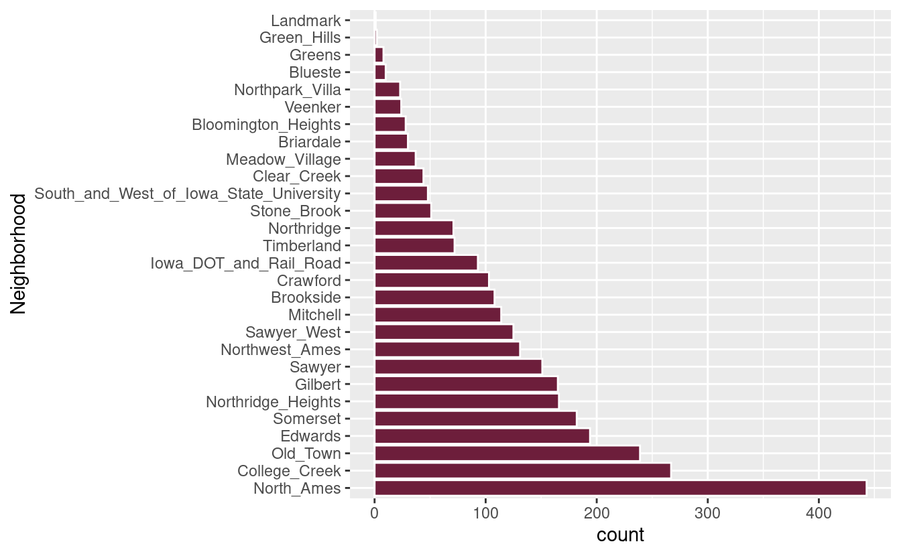

These are my notes for the tutorial given by [Max Kuhn](https://twitter.com/topepos) on the afternoon of the first day of the UseR 2018 conference.

Full confession here: I was having trouble deciding between this tutorial and another one, and eventually decided on the other one. But then I accidentally came to the wrong room and I took it as a sign that it was time to learn more about preprocessing.

Also, the `recipes` package is *adorable*.

<!--html_preserve-->

I'm going to follow along with [Max's slides](https://github.com/topepo/user2018), making some comments along the way.

Required packages:

<pre class='chroma'><code class='language-r' data-lang='r'><a href='https://rdrr.io/r/utils/install.packages.html'>install.packages</a>(<a href='https://rdrr.io/r/base/c.html'>c</a>("AmesHousing", "broom", "kknn", "recipes", "rsample",
                   "tidyverse", "yardstick", "caret"))</code></pre>

The data set we'll use is the AMES IA housing data. This includes sale price (our target) along with 81 predictors, such as location, house components (eg. swimming pool), number of bedrooms, and so on. The raw data can be found at <https://ww2.amstat.org/publications/jse/v19n3/decock/AmesHousing.txt> but we will be using the processed version found in the `AmesHousing` package.

Reasons for modifying the data
------------------------------

Sometimes you need to *do stuff* to your data before you can use it. Moreover, you're often dealing with data that's split into train/test sets. In this case you need to work out what to do with your data based solely on the training set and then apply that---without changing your method---to the test set. If you're dealing with $K$-fold cross-validation, then you've got $K$ training sets and $K$ test sets, and so you need to repeat this $K$ times.

A good example is missing value imputation, where you have some missing data in your train/test sets and you need to fill them in via some imputation method. I'm no expert on the topic (but I hope to be after the missing value imputation tutorial tomorrow!) but I've seen this done wrong before in StackExchange answers and in Kaggle solutions: the imputation is done *before* the data is split into train/test. This is called *data leakage*, and models assessed using the test set will appear more accurate than they are, because they've already had a sneak preview of the data.

So the mindset is clear: don't touch the test set until the last possible moment. The `recipes` package follows this mindset. First you create a `recipe`, which is a blueprint for how you will process your data. At this point, no data has been modified. Then you `prep` the recipe using your training set, which is where the actual processing is defined and all the parameters worked out. Finally, you can `bake` the training set, test set, or any other data set with similar columns, and in this step the actual modification takes place.

Missing value **imputation** isn't the only reason to process data, though. Processing can involve:

-   **Centering** and **scaling** the predictors. Some models (K-NN, SBMs, PLS, neural networks) require that the predictor variables have the same units.
-   Applying **filters** or **PCA signal extraction** to deal with correlation between predictors.
-   **Encoding data**, such as turning factors into Boolean dummy variables, or turning dates into days of the week.
-   Developing new features (ie. **feature engineering**).

The `ames` data
---------------

We load the data with the `make_ames` function from the `AmesHousing` package.

<pre class='chroma'><code class='language-r' data-lang='r'>ames &lt;- AmesHousing::<a href='https://rdrr.io/pkg/AmesHousing/man/make_ames.html'>make_ames</a>()
ames %&gt;% str
#&gt; tibble [2,930 × 81] (S3: tbl_df/tbl/data.frame)
#&gt;  $ MS_SubClass       : Factor w/ 16 levels "One_Story_1946_and_Newer_All_Styles",..: 1 1 1 1 6 6 12 12 12 6 ...
#&gt;  $ MS_Zoning         : Factor w/ 7 levels "Floating_Village_Residential",..: 3 2 3 3 3 3 3 3 3 3 ...
#&gt;  $ Lot_Frontage      : num [1:2930] 141 80 81 93 74 78 41 43 39 60 ...
#&gt;  $ Lot_Area          : int [1:2930] 31770 11622 14267 11160 13830 9978 4920 5005 5389 7500 ...
#&gt;  $ Street            : Factor w/ 2 levels "Grvl","Pave": 2 2 2 2 2 2 2 2 2 2 ...
#&gt;  $ Alley             : Factor w/ 3 levels "Gravel","No_Alley_Access",..: 2 2 2 2 2 2 2 2 2 2 ...
#&gt;  $ Lot_Shape         : Factor w/ 4 levels "Regular","Slightly_Irregular",..: 2 1 2 1 2 2 1 2 2 1 ...
#&gt;  $ Land_Contour      : Factor w/ 4 levels "Bnk","HLS","Low",..: 4 4 4 4 4 4 4 2 4 4 ...
#&gt;  $ Utilities         : Factor w/ 3 levels "AllPub","NoSeWa",..: 1 1 1 1 1 1 1 1 1 1 ...
#&gt;  $ Lot_Config        : Factor w/ 5 levels "Corner","CulDSac",..: 1 5 1 1 5 5 5 5 5 5 ...
#&gt;  $ Land_Slope        : Factor w/ 3 levels "Gtl","Mod","Sev": 1 1 1 1 1 1 1 1 1 1 ...
#&gt;  $ Neighborhood      : Factor w/ 28 levels "North_Ames","College_Creek",..: 1 1 1 1 7 7 17 17 17 7 ...
#&gt;  $ Condition_1       : Factor w/ 9 levels "Artery","Feedr",..: 3 2 3 3 3 3 3 3 3 3 ...
#&gt;  $ Condition_2       : Factor w/ 8 levels "Artery","Feedr",..: 3 3 3 3 3 3 3 3 3 3 ...
#&gt;  $ Bldg_Type         : Factor w/ 5 levels "OneFam","TwoFmCon",..: 1 1 1 1 1 1 5 5 5 1 ...
#&gt;  $ House_Style       : Factor w/ 8 levels "One_and_Half_Fin",..: 3 3 3 3 8 8 3 3 3 8 ...
#&gt;  $ Overall_Qual      : Factor w/ 10 levels "Very_Poor","Poor",..: 6 5 6 7 5 6 8 8 8 7 ...
#&gt;  $ Overall_Cond      : Factor w/ 10 levels "Very_Poor","Poor",..: 5 6 6 5 5 6 5 5 5 5 ...
#&gt;  $ Year_Built        : int [1:2930] 1960 1961 1958 1968 1997 1998 2001 1992 1995 1999 ...
#&gt;  $ Year_Remod_Add    : int [1:2930] 1960 1961 1958 1968 1998 1998 2001 1992 1996 1999 ...
#&gt;  $ Roof_Style        : Factor w/ 6 levels "Flat","Gable",..: 4 2 4 4 2 2 2 2 2 2 ...
#&gt;  $ Roof_Matl         : Factor w/ 8 levels "ClyTile","CompShg",..: 2 2 2 2 2 2 2 2 2 2 ...
#&gt;  $ Exterior_1st      : Factor w/ 16 levels "AsbShng","AsphShn",..: 4 14 15 4 14 14 6 7 6 14 ...
#&gt;  $ Exterior_2nd      : Factor w/ 17 levels "AsbShng","AsphShn",..: 11 15 16 4 15 15 6 7 6 15 ...
#&gt;  $ Mas_Vnr_Type      : Factor w/ 5 levels "BrkCmn","BrkFace",..: 5 4 2 4 4 2 4 4 4 4 ...
#&gt;  $ Mas_Vnr_Area      : num [1:2930] 112 0 108 0 0 20 0 0 0 0 ...
#&gt;  $ Exter_Qual        : Factor w/ 4 levels "Excellent","Fair",..: 4 4 4 3 4 4 3 3 3 4 ...
#&gt;  $ Exter_Cond        : Factor w/ 5 levels "Excellent","Fair",..: 5 5 5 5 5 5 5 5 5 5 ...
#&gt;  $ Foundation        : Factor w/ 6 levels "BrkTil","CBlock",..: 2 2 2 2 3 3 3 3 3 3 ...
#&gt;  $ Bsmt_Qual         : Factor w/ 6 levels "Excellent","Fair",..: 6 6 6 6 3 6 3 3 3 6 ...
#&gt;  $ Bsmt_Cond         : Factor w/ 6 levels "Excellent","Fair",..: 3 6 6 6 6 6 6 6 6 6 ...
#&gt;  $ Bsmt_Exposure     : Factor w/ 5 levels "Av","Gd","Mn",..: 2 4 4 4 4 4 3 4 4 4 ...
#&gt;  $ BsmtFin_Type_1    : Factor w/ 7 levels "ALQ","BLQ","GLQ",..: 2 6 1 1 3 3 3 1 3 7 ...
#&gt;  $ BsmtFin_SF_1      : num [1:2930] 2 6 1 1 3 3 3 1 3 7 ...
#&gt;  $ BsmtFin_Type_2    : Factor w/ 7 levels "ALQ","BLQ","GLQ",..: 7 4 7 7 7 7 7 7 7 7 ...
#&gt;  $ BsmtFin_SF_2      : num [1:2930] 0 144 0 0 0 0 0 0 0 0 ...
#&gt;  $ Bsmt_Unf_SF       : num [1:2930] 441 270 406 1045 137 ...
#&gt;  $ Total_Bsmt_SF     : num [1:2930] 1080 882 1329 2110 928 ...
#&gt;  $ Heating           : Factor w/ 6 levels "Floor","GasA",..: 2 2 2 2 2 2 2 2 2 2 ...
#&gt;  $ Heating_QC        : Factor w/ 5 levels "Excellent","Fair",..: 2 5 5 1 3 1 1 1 1 3 ...
#&gt;  $ Central_Air       : Factor w/ 2 levels "N","Y": 2 2 2 2 2 2 2 2 2 2 ...
#&gt;  $ Electrical        : Factor w/ 6 levels "FuseA","FuseF",..: 5 5 5 5 5 5 5 5 5 5 ...
#&gt;  $ First_Flr_SF      : int [1:2930] 1656 896 1329 2110 928 926 1338 1280 1616 1028 ...
#&gt;  $ Second_Flr_SF     : int [1:2930] 0 0 0 0 701 678 0 0 0 776 ...
#&gt;  $ Low_Qual_Fin_SF   : int [1:2930] 0 0 0 0 0 0 0 0 0 0 ...
#&gt;  $ Gr_Liv_Area       : int [1:2930] 1656 896 1329 2110 1629 1604 1338 1280 1616 1804 ...
#&gt;  $ Bsmt_Full_Bath    : num [1:2930] 1 0 0 1 0 0 1 0 1 0 ...
#&gt;  $ Bsmt_Half_Bath    : num [1:2930] 0 0 0 0 0 0 0 0 0 0 ...
#&gt;  $ Full_Bath         : int [1:2930] 1 1 1 2 2 2 2 2 2 2 ...
#&gt;  $ Half_Bath         : int [1:2930] 0 0 1 1 1 1 0 0 0 1 ...
#&gt;  $ Bedroom_AbvGr     : int [1:2930] 3 2 3 3 3 3 2 2 2 3 ...
#&gt;  $ Kitchen_AbvGr     : int [1:2930] 1 1 1 1 1 1 1 1 1 1 ...
#&gt;  $ Kitchen_Qual      : Factor w/ 5 levels "Excellent","Fair",..: 5 5 3 1 5 3 3 3 3 3 ...
#&gt;  $ TotRms_AbvGrd     : int [1:2930] 7 5 6 8 6 7 6 5 5 7 ...
#&gt;  $ Functional        : Factor w/ 8 levels "Maj1","Maj2",..: 8 8 8 8 8 8 8 8 8 8 ...
#&gt;  $ Fireplaces        : int [1:2930] 2 0 0 2 1 1 0 0 1 1 ...
#&gt;  $ Fireplace_Qu      : Factor w/ 6 levels "Excellent","Fair",..: 3 4 4 6 6 3 4 4 6 6 ...
#&gt;  $ Garage_Type       : Factor w/ 7 levels "Attchd","Basment",..: 1 1 1 1 1 1 1 1 1 1 ...
#&gt;  $ Garage_Finish     : Factor w/ 4 levels "Fin","No_Garage",..: 1 4 4 1 1 1 1 3 3 1 ...
#&gt;  $ Garage_Cars       : num [1:2930] 2 1 1 2 2 2 2 2 2 2 ...
#&gt;  $ Garage_Area       : num [1:2930] 528 730 312 522 482 470 582 506 608 442 ...
#&gt;  $ Garage_Qual       : Factor w/ 6 levels "Excellent","Fair",..: 6 6 6 6 6 6 6 6 6 6 ...
#&gt;  $ Garage_Cond       : Factor w/ 6 levels "Excellent","Fair",..: 6 6 6 6 6 6 6 6 6 6 ...
#&gt;  $ Paved_Drive       : Factor w/ 3 levels "Dirt_Gravel",..: 2 3 3 3 3 3 3 3 3 3 ...
#&gt;  $ Wood_Deck_SF      : int [1:2930] 210 140 393 0 212 360 0 0 237 140 ...
#&gt;  $ Open_Porch_SF     : int [1:2930] 62 0 36 0 34 36 0 82 152 60 ...
#&gt;  $ Enclosed_Porch    : int [1:2930] 0 0 0 0 0 0 170 0 0 0 ...
#&gt;  $ Three_season_porch: int [1:2930] 0 0 0 0 0 0 0 0 0 0 ...
#&gt;  $ Screen_Porch      : int [1:2930] 0 120 0 0 0 0 0 144 0 0 ...
#&gt;  $ Pool_Area         : int [1:2930] 0 0 0 0 0 0 0 0 0 0 ...
#&gt;  $ Pool_QC           : Factor w/ 5 levels "Excellent","Fair",..: 4 4 4 4 4 4 4 4 4 4 ...
#&gt;  $ Fence             : Factor w/ 5 levels "Good_Privacy",..: 5 3 5 5 3 5 5 5 5 5 ...
#&gt;  $ Misc_Feature      : Factor w/ 6 levels "Elev","Gar2",..: 3 3 2 3 3 3 3 3 3 3 ...
#&gt;  $ Misc_Val          : int [1:2930] 0 0 12500 0 0 0 0 0 0 0 ...
#&gt;  $ Mo_Sold           : int [1:2930] 5 6 6 4 3 6 4 1 3 6 ...
#&gt;  $ Year_Sold         : int [1:2930] 2010 2010 2010 2010 2010 2010 2010 2010 2010 2010 ...
#&gt;  $ Sale_Type         : Factor w/ 10 levels "COD","Con","ConLD",..: 10 10 10 10 10 10 10 10 10 10 ...
#&gt;  $ Sale_Condition    : Factor w/ 6 levels "Abnorml","AdjLand",..: 5 5 5 5 5 5 5 5 5 5 ...
#&gt;  $ Sale_Price        : int [1:2930] 215000 105000 172000 244000 189900 195500 213500 191500 236500 189000 ...
#&gt;  $ Longitude         : num [1:2930] -93.6 -93.6 -93.6 -93.6 -93.6 ...
#&gt;  $ Latitude          : num [1:2930] 42.1 42.1 42.1 42.1 42.1 ...</code></pre>

Now we will split the data into test and train. We'll reserve 25% of of the data for testing.

<pre class='chroma'><code class='language-r' data-lang='r'><a href='https://rdrr.io/r/base/library.html'>library</a>(<a href='https://tidymodels.github.io/rsample'>rsample</a>)
<a href='https://rdrr.io/r/base/Random.html'>set.seed</a>(4595)
data_split &lt;- <a href='https://rdrr.io/pkg/rsample/man/initial_split.html'>initial_split</a>(ames, strata = "Sale_Price", p = 0.75)
ames_train &lt;- <a href='https://rdrr.io/pkg/rsample/man/initial_split.html'>training</a>(data_split)
ames_test &lt;- <a href='https://rdrr.io/pkg/rsample/man/initial_split.html'>testing</a>(data_split)</code></pre>

A simple log-transform
----------------------

The first of Max's examples is a really simple log transform of `Sale_Price`. Suppose we use the formula `log10(Sale_Price) ~ Longitude + Latitude`. The steps are:

1.  Assign `Sale_Price` to the outcome.
2.  Assign `Longitude` and `Latittude` as predictors.
3.  Log transform the outcome.

The way to define this in `recipes` is as follows:

<pre class='chroma'><code class='language-r' data-lang='r'>mod_rec &lt;- <a href='https://rdrr.io/pkg/recipes/man/recipe.html'>recipe</a>(Sale_Price ~ Longitude + Latitude, data = ames_train) %&gt;% 
    <a href='https://rdrr.io/pkg/recipes/man/step_log.html'>step_log</a>(Sale_Price, base = 10)</code></pre>

Infrequently occurring levels
-----------------------------

We usually encode factors as Boolean dummy variables, with R often taking care of this in the background. If there are `C` levels of the factor, only `C - 1` dummy variables are required. But what if you have very few values for a particular level? For example, the `Neighborhood` predictor in our `ames` data:

<pre class='chroma'><code class='language-r' data-lang='r'>ames %&gt;% 
    <a href='https://ggplot2.tidyverse.org/reference/ggplot.html'>ggplot</a>(<a href='https://ggplot2.tidyverse.org/reference/aes.html'>aes</a>(x = Neighborhood)) +
    <a href='https://ggplot2.tidyverse.org/reference/geom_bar.html'>geom_bar</a>(fill = "#6d1e3b", colour = "white") + # I don't like the default grey
    <a href='https://ggplot2.tidyverse.org/reference/coord_flip.html'>coord_flip</a>()
</code></pre>

In fact, there's only one data point with a `Neighborhood` of Landmark. This is called a "zero-variance predictor". There are two main approaches here:

1.  remove any data points with infrequently occurring values, or
2.  group all of the infrequently occurring values into an "Other" level.

This is a job for the `recipes` package, and Max takes us through the example.

We can take care of the infrequently occurring levels here using the `step_other` function. In this case, we "other" any level that occurs fewer than 5% of the time. We can then create dummy variables for all factor variables with `step_dummy`:

<pre class='chroma'><code class='language-r' data-lang='r'>mod_rec &lt;- <a href='https://rdrr.io/pkg/recipes/man/recipe.html'>recipe</a>(Sale_Price ~ Longitude + Latitude + Neighborhood, 
                  data = ames_train) %&gt;% 
    <a href='https://rdrr.io/pkg/recipes/man/step_log.html'>step_log</a>(Sale_Price, base = 10) %&gt;% # The log-transform from earlier
    <a href='https://rdrr.io/pkg/recipes/man/step_other.html'>step_other</a>(Neighborhood, threshold = 0.05) %&gt;%
    <a href='https://rdrr.io/pkg/recipes/man/step_dummy.html'>step_dummy</a>(<a href='https://rdrr.io/pkg/recipes/man/has_role.html'>all_nominal</a>())</code></pre>

The `recipes` process
---------------------

Recipes work in a three-step process: `recipe` --&gt; `prepare` --&gt; `bake`/`juice`. We can think of this as: define --&gt; estimate --&gt; apply. `juice` only applies to the original data set defined in the recipe, the idea at the core of `bake` is that it can be applied to an *arbitrary* data set.

First we `prep` the data using the recipe in Max's example:

<pre class='chroma'><code class='language-r' data-lang='r'>mod_rec_trained &lt;- mod_rec %&gt;% 
    <a href='https://rdrr.io/pkg/recipes/man/prep.html'>prep</a>(training = ames_train, retain = TRUE)
mod_rec_trained
#&gt; Data Recipe
#&gt; 
#&gt; Inputs:
#&gt; 
#&gt;       role #variables
#&gt;    outcome          1
#&gt;  predictor          3
#&gt; 
#&gt; Training data contained 2199 data points and no missing data.
#&gt; 
#&gt; Operations:
#&gt; 
#&gt; Log transformation on Sale_Price [trained]
#&gt; Collapsing factor levels for Neighborhood [trained]
#&gt; Dummy variables from Neighborhood [trained]</code></pre>

We can now `bake` the recipe, applying it to the test set we defined earlier:

<pre class='chroma'><code class='language-r' data-lang='r'>ames_test_dummies &lt;- mod_rec_trained %&gt;% <a href='https://rdrr.io/pkg/recipes/man/bake.html'>bake</a>(new_data = ames_test)
<a href='https://rdrr.io/r/base/names.html'>names</a>(ames_test_dummies)
#&gt;  [1] "Longitude"                       "Latitude"                       
#&gt;  [3] "Sale_Price"                      "Neighborhood_College_Creek"     
#&gt;  [5] "Neighborhood_Old_Town"           "Neighborhood_Edwards"           
#&gt;  [7] "Neighborhood_Somerset"           "Neighborhood_Northridge_Heights"
#&gt;  [9] "Neighborhood_Gilbert"            "Neighborhood_Sawyer"            
#&gt; [11] "Neighborhood_other"</code></pre>

Other uses
----------

I have to admit that the rest got away from me a little bit, because I'm not overly familiar with all of the transformations/methods that were used (what is a Yeo-Johnson Power Transformation?!).

However, there's a tonne of cool stuff in the slides that I'll be coming back to later, I'm sure. Max used `recipes` and `rsample` to:

-   deal with interactions between predictors,
-   apply processing to all of the folds of a 10-fold cross-validation,
-   train 10 linear models on that same 10-fold cross-validation,
-   assess and plot the performance of those linear models, and
-   train and asses 10 nearest-neighbour models on the 10-fold cross-validation.

I know I'll be using this `recipes` package *a lot*.

------------------------------------------------------------------------

<pre class='chroma'><code class='language-r' data-lang='r'>devtools::<a href='https://rdrr.io/pkg/sessioninfo/man/session_info.html'>session_info</a>()
#&gt; ─ Session info ───────────────────────────────────────────────────────────────
#&gt;  setting  value                       
#&gt;  version  R version 4.0.0 (2020-04-24)
#&gt;  os       Ubuntu 20.04 LTS            
#&gt;  system   x86_64, linux-gnu           
#&gt;  ui       X11                         
#&gt;  language en_AU:en                    
#&gt;  collate  en_AU.UTF-8                 
#&gt;  ctype    en_AU.UTF-8                 
#&gt;  tz       Australia/Melbourne         
#&gt;  date     2020-06-13                  
#&gt; 
#&gt; ─ Packages ───────────────────────────────────────────────────────────────────
#&gt;  package      * version    date       lib source                            
#&gt;  AmesHousing    0.0.3      2017-12-17 [1] CRAN (R 4.0.0)                    
#&gt;  assertthat     0.2.1      2019-03-21 [1] CRAN (R 4.0.0)                    
#&gt;  backports      1.1.7      2020-05-13 [1] CRAN (R 4.0.0)                    
#&gt;  blogdown       0.19       2020-05-22 [1] CRAN (R 4.0.0)                    
#&gt;  broom          0.5.6      2020-04-20 [1] CRAN (R 4.0.0)                    
#&gt;  callr          3.4.3      2020-03-28 [1] CRAN (R 4.0.0)                    
#&gt;  caret        * 6.0-86     2020-03-20 [1] CRAN (R 4.0.0)                    
#&gt;  cellranger     1.1.0      2016-07-27 [1] CRAN (R 4.0.0)                    
#&gt;  class          7.3-17     2020-04-26 [4] CRAN (R 4.0.0)                    
#&gt;  cli            2.0.2      2020-02-28 [1] CRAN (R 4.0.0)                    
#&gt;  codetools      0.2-16     2018-12-24 [4] CRAN (R 4.0.0)                    
#&gt;  colorspace     1.4-1      2019-03-18 [1] CRAN (R 4.0.0)                    
#&gt;  crayon         1.3.4      2017-09-16 [1] CRAN (R 4.0.0)                    
#&gt;  data.table     1.12.8     2019-12-09 [1] CRAN (R 4.0.0)                    
#&gt;  DBI            1.1.0      2019-12-15 [1] CRAN (R 4.0.0)                    
#&gt;  dbplyr         1.4.3      2020-04-19 [1] CRAN (R 4.0.0)                    
#&gt;  desc           1.2.0      2018-05-01 [1] CRAN (R 4.0.0)                    
#&gt;  devtools       2.3.0      2020-04-10 [1] CRAN (R 4.0.0)                    
#&gt;  dials          0.0.6      2020-04-03 [1] CRAN (R 4.0.0)                    
#&gt;  DiceDesign     1.8-1      2019-07-31 [1] CRAN (R 4.0.0)                    
#&gt;  digest         0.6.25     2020-02-23 [1] CRAN (R 4.0.0)                    
#&gt;  downlit        0.0.0.9000 2020-06-12 [1] Github (r-lib/downlit@87fb1af)    
#&gt;  dplyr        * 0.8.5      2020-03-07 [1] CRAN (R 4.0.0)                    
#&gt;  ellipsis       0.3.1      2020-05-15 [1] CRAN (R 4.0.0)                    
#&gt;  evaluate       0.14       2019-05-28 [1] CRAN (R 4.0.0)                    
#&gt;  fansi          0.4.1      2020-01-08 [1] CRAN (R 4.0.0)                    
#&gt;  farver         2.0.3      2020-01-16 [1] CRAN (R 4.0.0)                    
#&gt;  forcats      * 0.5.0      2020-03-01 [1] CRAN (R 4.0.0)                    
#&gt;  foreach        1.5.0      2020-03-30 [1] CRAN (R 4.0.0)                    
#&gt;  fs             1.4.1      2020-04-04 [1] CRAN (R 4.0.0)                    
#&gt;  furrr          0.1.0      2018-05-16 [1] CRAN (R 4.0.0)                    
#&gt;  future         1.17.0     2020-04-18 [1] CRAN (R 4.0.0)                    
#&gt;  generics       0.0.2      2018-11-29 [1] CRAN (R 4.0.0)                    
#&gt;  ggplot2      * 3.3.0      2020-03-05 [1] CRAN (R 4.0.0)                    
#&gt;  globals        0.12.5     2019-12-07 [1] CRAN (R 4.0.0)                    
#&gt;  glue           1.4.1      2020-05-13 [1] CRAN (R 4.0.0)                    
#&gt;  gower          0.2.1      2019-05-14 [1] CRAN (R 4.0.0)                    
#&gt;  GPfit          1.0-8      2019-02-08 [1] CRAN (R 4.0.0)                    
#&gt;  gtable         0.3.0      2019-03-25 [1] CRAN (R 4.0.0)                    
#&gt;  haven          2.2.0      2019-11-08 [1] CRAN (R 4.0.0)                    
#&gt;  hms            0.5.3      2020-01-08 [1] CRAN (R 4.0.0)                    
#&gt;  htmltools      0.4.0      2019-10-04 [1] CRAN (R 4.0.0)                    
#&gt;  httr           1.4.1      2019-08-05 [1] CRAN (R 4.0.0)                    
#&gt;  hugodown       0.0.0.9000 2020-06-12 [1] Github (r-lib/hugodown@6812ada)   
#&gt;  ipred          0.9-9      2019-04-28 [1] CRAN (R 4.0.0)                    
#&gt;  iterators      1.0.12     2019-07-26 [1] CRAN (R 4.0.0)                    
#&gt;  jsonlite       1.6.1      2020-02-02 [1] CRAN (R 4.0.0)                    
#&gt;  knitr          1.28       2020-02-06 [1] CRAN (R 4.0.0)                    
#&gt;  labeling       0.3        2014-08-23 [1] CRAN (R 4.0.0)                    
#&gt;  lattice      * 0.20-41    2020-04-02 [4] CRAN (R 4.0.0)                    
#&gt;  lava           1.6.7      2020-03-05 [1] CRAN (R 4.0.0)                    
#&gt;  lhs            1.0.2      2020-04-13 [1] CRAN (R 4.0.0)                    
#&gt;  lifecycle      0.2.0      2020-03-06 [1] CRAN (R 4.0.0)                    
#&gt;  listenv        0.8.0      2019-12-05 [1] CRAN (R 4.0.0)                    
#&gt;  lubridate      1.7.8      2020-04-06 [1] CRAN (R 4.0.0)                    
#&gt;  magrittr       1.5        2014-11-22 [1] CRAN (R 4.0.0)                    
#&gt;  MASS           7.3-51.6   2020-04-26 [4] CRAN (R 4.0.0)                    
#&gt;  Matrix         1.2-18     2019-11-27 [4] CRAN (R 4.0.0)                    
#&gt;  memoise        1.1.0.9000 2020-05-09 [1] Github (hadley/memoise@4aefd9f)   
#&gt;  ModelMetrics   1.2.2.2    2020-03-17 [1] CRAN (R 4.0.0)                    
#&gt;  modelr         0.1.6      2020-02-22 [1] CRAN (R 4.0.0)                    
#&gt;  munsell        0.5.0      2018-06-12 [1] CRAN (R 4.0.0)                    
#&gt;  nlme           3.1-145    2020-03-04 [4] CRAN (R 4.0.0)                    
#&gt;  nnet           7.3-14     2020-04-26 [4] CRAN (R 4.0.0)                    
#&gt;  parsnip        0.1.0      2020-04-09 [1] CRAN (R 4.0.0)                    
#&gt;  pillar         1.4.4      2020-05-05 [1] CRAN (R 4.0.0)                    
#&gt;  pkgbuild       1.0.7      2020-04-25 [1] CRAN (R 4.0.0)                    
#&gt;  pkgconfig      2.0.3      2019-09-22 [1] CRAN (R 4.0.0)                    
#&gt;  pkgload        1.0.2      2018-10-29 [1] CRAN (R 4.0.0)                    
#&gt;  plyr           1.8.6      2020-03-03 [1] CRAN (R 4.0.0)                    
#&gt;  prettyunits    1.1.1      2020-01-24 [1] CRAN (R 4.0.0)                    
#&gt;  pROC           1.16.2     2020-03-19 [1] CRAN (R 4.0.0)                    
#&gt;  processx       3.4.2      2020-02-09 [1] CRAN (R 4.0.0)                    
#&gt;  prodlim        2019.11.13 2019-11-17 [1] CRAN (R 4.0.0)                    
#&gt;  ps             1.3.3      2020-05-08 [1] CRAN (R 4.0.0)                    
#&gt;  purrr        * 0.3.4      2020-04-17 [1] CRAN (R 4.0.0)                    
#&gt;  R6             2.4.1      2019-11-12 [1] CRAN (R 4.0.0)                    
#&gt;  Rcpp           1.0.4.6    2020-04-09 [1] CRAN (R 4.0.0)                    
#&gt;  readr        * 1.3.1      2018-12-21 [1] CRAN (R 4.0.0)                    
#&gt;  readxl         1.3.1      2019-03-13 [1] CRAN (R 4.0.0)                    
#&gt;  recipes      * 0.1.10     2020-03-18 [1] CRAN (R 4.0.0)                    
#&gt;  remotes        2.1.1      2020-02-15 [1] CRAN (R 4.0.0)                    
#&gt;  reprex         0.3.0      2019-05-16 [1] CRAN (R 4.0.0)                    
#&gt;  reshape2       1.4.4      2020-04-09 [1] CRAN (R 4.0.0)                    
#&gt;  rlang          0.4.6      2020-05-02 [1] CRAN (R 4.0.0)                    
#&gt;  rmarkdown      2.2.3      2020-06-12 [1] Github (rstudio/rmarkdown@4ee96c8)
#&gt;  rpart          4.1-15     2019-04-12 [4] CRAN (R 4.0.0)                    
#&gt;  rprojroot      1.3-2      2018-01-03 [1] CRAN (R 4.0.0)                    
#&gt;  rsample      * 0.0.6      2020-03-31 [1] CRAN (R 4.0.0)                    
#&gt;  rstudioapi     0.11       2020-02-07 [1] CRAN (R 4.0.0)                    
#&gt;  rvest          0.3.5      2019-11-08 [1] CRAN (R 4.0.0)                    
#&gt;  scales         1.1.0      2019-11-18 [1] CRAN (R 4.0.0)                    
#&gt;  sessioninfo    1.1.1      2018-11-05 [1] CRAN (R 4.0.0)                    
#&gt;  stringi        1.4.6      2020-02-17 [1] CRAN (R 4.0.0)                    
#&gt;  stringr      * 1.4.0      2019-02-10 [1] CRAN (R 4.0.0)                    
#&gt;  survival       3.1-12     2020-04-10 [4] CRAN (R 4.0.0)                    
#&gt;  testthat       2.3.2      2020-03-02 [1] CRAN (R 4.0.0)                    
#&gt;  tibble       * 3.0.1      2020-04-20 [1] CRAN (R 4.0.0)                    
#&gt;  tidyr        * 1.0.2      2020-01-24 [1] CRAN (R 4.0.0)                    
#&gt;  tidyselect     1.0.0      2020-01-27 [1] CRAN (R 4.0.0)                    
#&gt;  tidyverse    * 1.3.0      2019-11-21 [1] CRAN (R 4.0.0)                    
#&gt;  timeDate       3043.102   2018-02-21 [1] CRAN (R 4.0.0)                    
#&gt;  usethis        1.6.1      2020-04-29 [1] CRAN (R 4.0.0)                    
#&gt;  vctrs          0.3.1      2020-06-05 [1] CRAN (R 4.0.0)                    
#&gt;  withr          2.2.0      2020-04-20 [1] CRAN (R 4.0.0)                    
#&gt;  workflows      0.1.1      2020-03-17 [1] CRAN (R 4.0.0)                    
#&gt;  xfun           0.14       2020-05-20 [1] CRAN (R 4.0.0)                    
#&gt;  xml2           1.3.2      2020-04-23 [1] CRAN (R 4.0.0)                    
#&gt;  yaml           2.2.1      2020-02-01 [1] CRAN (R 4.0.0)                    
#&gt; 
#&gt; [1] /home/mdneuzerling/R/x86_64-pc-linux-gnu-library/4.0
#&gt; [2] /usr/local/lib/R/site-library
#&gt; [3] /usr/lib/R/site-library
#&gt; [4] /usr/lib/R/library</code></pre>

