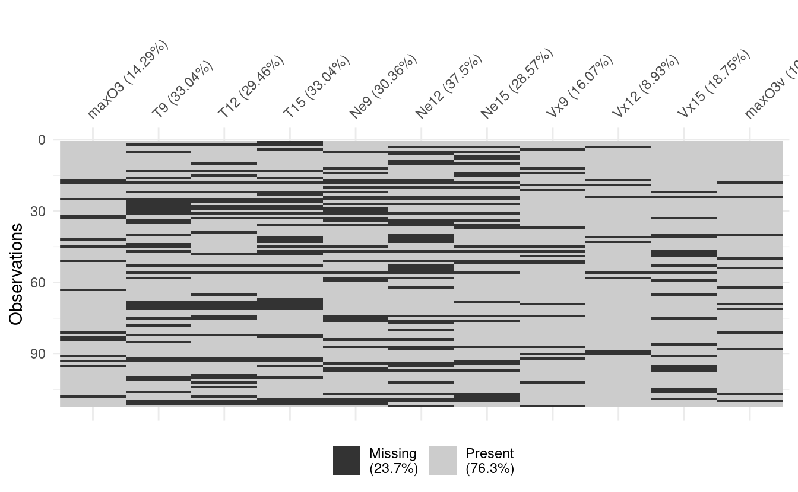
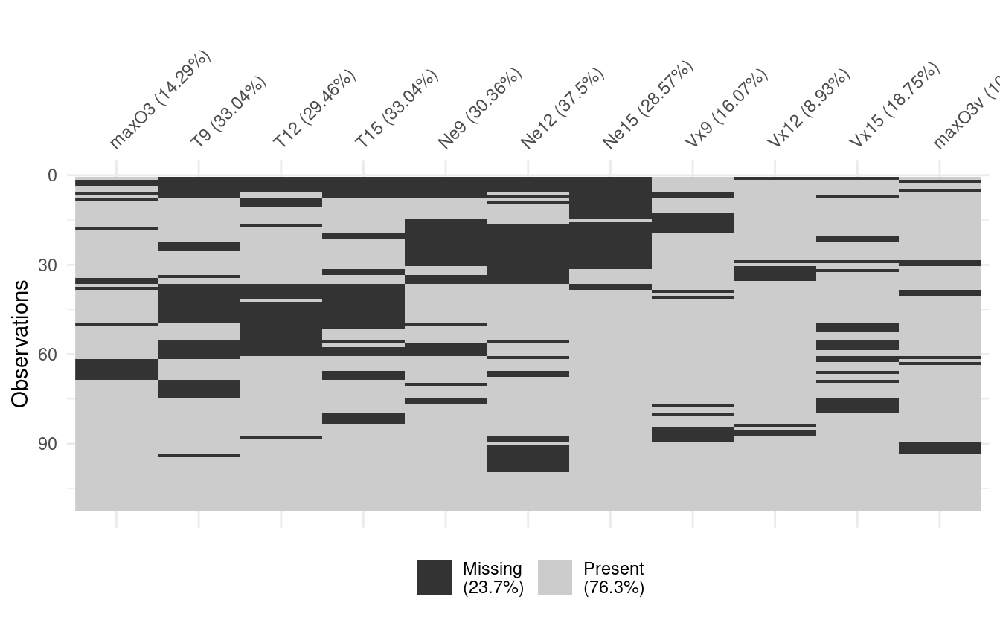
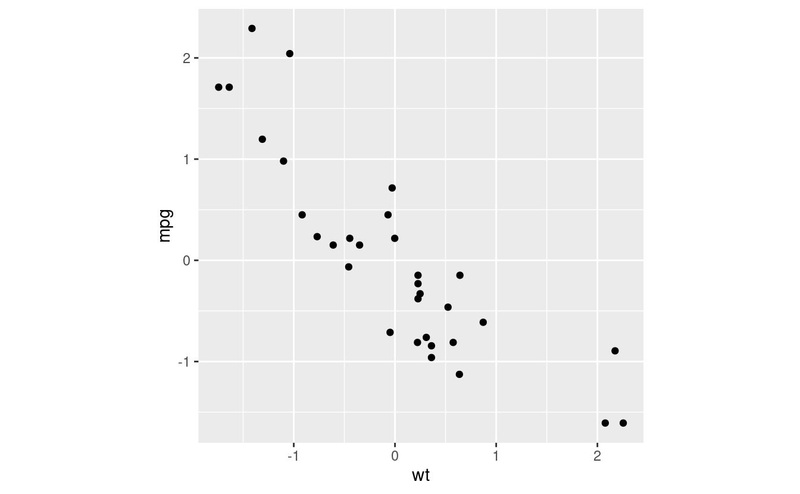
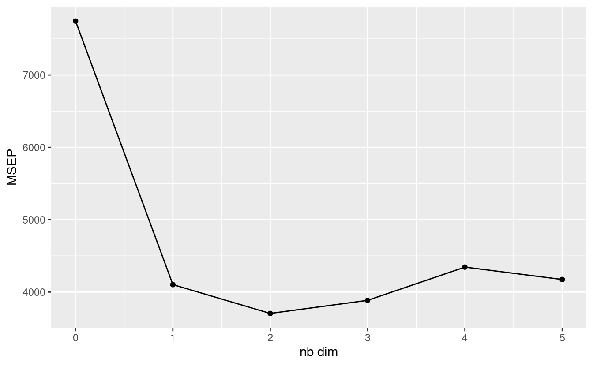

These are my notes for the third and final tutorial of useR2018, and the tutorial I was looking forward to the most. I *struggle* with missing value imputation. It's one of those things which I kind of get the theory of, but fall over when trying to *do*. So I was keen to hear [Julie Joss](https://twitter.com/juliejossestat) and [Nick Tierney](https://twitter.com/nj_tierney) talk about their techniques and associated R packages.

<!--html_preserve-->
tweet removed due to API changes

I ran into a wall pretty early on here in that I wasn't very comfortable with Principal Component Analysis (PCA). I took the opportunity to learn a bit more about this common technique, and try to understand the intuition behind it.

The data and slides for Julie's and Nick's tutorial are available on [Nick's GitHub](https://github.com/njtierney/user2018-missing-data-tutorial).

Required packages:

<pre class='chroma'><code class='language-r' data-lang='r'><a href='https://rdrr.io/r/utils/install.packages.html'>install.packages</a>(<a href='https://rdrr.io/r/base/c.html'>c</a>("tidyverse", "ggplot2", "naniar", "visdat", "missMDA"))</code></pre>

`Ozone` data set
----------------

The data in use today is the Ozone data set from Airbreizh, a French association that monitors air quality. We're only going to focus on the quantitative variables here, so we will drop the `WindDirection` variable.

<pre class='chroma'><code class='language-r' data-lang='r'>ozone &lt;- read_csv("ozoneNA.csv") %&gt;% 
    select(-X1, -WindDirection) # unnecessary row index
#&gt; Parsed with column specification:
#&gt; cols(
#&gt;   X1 = col_double(),
#&gt;   maxO3 = col_double(),
#&gt;   T9 = col_double(),
#&gt;   T12 = col_double(),
#&gt;   T15 = col_double(),
#&gt;   Ne9 = col_double(),
#&gt;   Ne12 = col_double(),
#&gt;   Ne15 = col_double(),
#&gt;   Vx9 = col_double(),
#&gt;   Vx12 = col_double(),
#&gt;   Vx15 = col_double(),
#&gt;   maxO3v = col_double(),
#&gt;   WindDirection = col_character()
#&gt; )</code></pre>

Patterns of missing data
------------------------

The easiest way to deal with missing data is to delete it. But this ignores any pattern in the missing data, as well as any mechanism that leads to missing values. Some data sets can also contain a majority of values that have at least one missing value, and so deleting missing values would delete most of the data!

Missing values occur in three main patterns based on their relationship with the observed and even the unobserved variables of the data:

-   Missing Completely at Random (**MCAR**): probability of data being missing is independent of the observed and unobserved variables.
-   Missing at Random (**MAR**): probability is not independent of the observed values (ie. is not random) but the observed variables do not fully account for the pattern. In this case, there may be unobserved variables affecting the probability that the data will be missing.
-   Missing not at random (**MNAR**): probability of data being missing depends on the observed values of the data.

Visualising missing data
------------------------

*Multiple correspondence analysis* visualises data in such a way that relationships between missing values are often made apparent. One implementation of this is the `naniar` package:

<pre class='chroma'><code class='language-r' data-lang='r'><a href='http://visdat.njtierney.com//reference/vis_miss.html'>vis_miss</a>(ozone)
</code></pre>

We can repeat the visualisation with an option to `cluster` the missing values, making it easier to spot patterns, if any.

<pre class='chroma'><code class='language-r' data-lang='r'><a href='http://visdat.njtierney.com//reference/vis_miss.html'>vis_miss</a>(ozone, cluster = TRUE)
</code></pre>

Dealing with missing values
---------------------------

Suppose we *don't* want to delete our missing data and pretend that everything is fine. Then we might look to *impute* the missing values. That is to say, we might want to look at the data we do have to determine what the missing values might have been.

One of the easiest methods of imputation is that of *mean imputation*. In this case, we replace all of the missing values by the mean of the present values of the given variable.

We could also define a model on the present values of the data to predict what the missing value might have been. A simple linear regression might suffice.

A more sophisticated method involves the use of Principal Component Analysis.

A refresher on PCA
------------------

I don't understand Principal Component Analysis (PCA). Believe me, I've tried.

The goal of PCA is to find the subspace that best represents the data. The outcome of PCA is a set of uncorrelated variables called *principal components*.

[This is a wonderful (but long) article on PCA](http://www.cs.otago.ac.nz/cosc453/student_tutorials/principal_components.pdf) (pdf). It's gentle without being patronising. I'll highlight some points in the article here, but it's well worth finding the time to read the article in full.

First of all, recall the definition of an *eigenvector*. You probably encountered this in your first or second year of university, and then promptly forgot it. In the example below, the column vector $(6, 4)^T$ is an eigenvector of the square matrix, because the result of the matrix multiplication is a scale multiple of $(6, 4)^T$. In other words, the square matrix makes the eigenvector *bigger*, but it doesn't change its *direction*. The scalar multiple is $4$, and that's the *eigenvalue* associated with the eigenvector.

$$
\left(\begin{array}{cc} 
2 & 3 \\
2 & 1
\end{array}\right) \times
\left(\begin{array}{c} 
6 \\
4
\end{array}\right) = 
\left(\begin{array}{c} 
24 \\
16
\end{array}\right) = 
4 \left(\begin{array}{c} 
6 \\
4
\end{array}\right)
$$ But how does this relate to stats? Well a data set gives rise to a *covariance matrix*, in which the $ij$th cell of the matrix is the covariance between the $i$th variable and the $j$th variable (the variance of each variable sits along the diagonal). This is a square matrix, so we can find some eigenvectors.

I don't remember a whole lot of the linear algebra I learnt a long time ago, so I had to be reminded of two quick theorems in play here. A covariance matrix is symmetric, so we can make use of the following:

-   Eigenvectors of real symmetric matrices are real
-   Eigenvectors of real symmetric matrices are orthogonal

tweet removed due to API changes

Let's go through an example. Take the classic `mtcars` data set, and draw a scatterplot between `wt` (weight) and `mpg` (miles per gallon). We're going to work on data that's been centered and rescaled so as to make the eigenvectors look right, as well as for other reasons that will become apparent soon.

<pre class='chroma'><code class='language-r' data-lang='r'>mtcars_scaled &lt;- mtcars %&gt;% 
    select(wt, mpg) %&gt;% 
    mutate_all(scale)
mtcars_scaled %&gt;% <a href='https://ggplot2.tidyverse.org/reference/ggplot.html'>ggplot</a>(<a href='https://ggplot2.tidyverse.org/reference/aes.html'>aes</a>(x = wt, y = mpg)) + 
    <a href='https://ggplot2.tidyverse.org/reference/geom_point.html'>geom_point</a>() + 
    <a href='https://ggplot2.tidyverse.org/reference/coord_fixed.html'>coord_fixed</a>() # makes the plot square
</code></pre>

Let's calculate the PCA eigenvectors. These are eigenvectors of the covariance matrix. Because we have two variables we have two eigenvectors (another property of symmetric matrices), which we'll call `PC1` and `PC2`. You don't need a install a package to calculate these, as we can use the preinstalled `prcomp` function.

<pre class='chroma'><code class='language-r' data-lang='r'>PC &lt;- <a href='https://rdrr.io/r/stats/prcomp.html'>prcomp</a>(~ wt + mpg, data = mtcars_scaled)
PC
#&gt; Standard deviations (1, .., p=2):
#&gt; [1] 1.3666233 0.3637865
#&gt; 
#&gt; Rotation (n x k) = (2 x 2):
#&gt;            PC1       PC2
#&gt; wt   0.7071068 0.7071068
#&gt; mpg -0.7071068 0.7071068</code></pre>

<pre class='chroma'><code class='language-r' data-lang='r'>PC1 &lt;- PC$rotation[,1]
PC2 &lt;- PC$rotation[,2]

mtcars_scaled %&gt;% <a href='https://ggplot2.tidyverse.org/reference/ggplot.html'>ggplot</a>(<a href='https://ggplot2.tidyverse.org/reference/aes.html'>aes</a>(x = wt, y = mpg)) + 
    <a href='https://ggplot2.tidyverse.org/reference/geom_point.html'>geom_point</a>() +
    <a href='https://ggplot2.tidyverse.org/reference/geom_segment.html'>geom_segment</a>(<a href='https://ggplot2.tidyverse.org/reference/aes.html'>aes</a>(x = 0, xend = PC1[["wt"]], y = 0, yend = PC1[["mpg"]]), arrow = <a href='https://rdrr.io/r/grid/arrow.html'>arrow</a>(length = <a href='https://rdrr.io/r/grid/unit.html'>unit</a>(0.5, "cm")), col = "red") + 
    <a href='https://ggplot2.tidyverse.org/reference/geom_segment.html'>geom_segment</a>(<a href='https://ggplot2.tidyverse.org/reference/aes.html'>aes</a>(x = 0, xend = PC2[["wt"]], y = 0, yend = PC2[["mpg"]]), arrow = <a href='https://rdrr.io/r/grid/arrow.html'>arrow</a>(length = <a href='https://rdrr.io/r/grid/unit.html'>unit</a>(0.5, "cm")), col = "red") + 
    <a href='https://ggplot2.tidyverse.org/reference/coord_fixed.html'>coord_fixed</a>() # makes the plot square
</code></pre>

Look at those eigenvectors! The eigenvectors used in PCA are always normalised, so that the magnitude of the vectors are all $1$. That is, we have some mutually orthogonal unit vectors...it's a **change of basis**! Any point in the data set can be described by the original $x$ and $y$ axes, but it can also be described by a linear combination of our new PC eigenvectors!

So we haven't done anything to the data yet, apart from some basic scaling and centering. But every eigenvector has an associated eigenvalue. In this case, the higher the eigenvalue, the more the eigenvector is stretched by the (modified) covariance matrix. That is to say, the higher the eigenvalue, **the more variance explained by the eigenvector**. This is why we had to rescale the data so that each variable starts with a variance of $1$---if we didn't, the variables with higher variance, such as `mpg`, would appear artifically more important.

<pre class='chroma'><code class='language-r' data-lang='r'><a href='https://rdrr.io/r/base/summary.html'>summary</a>(PC)
#&gt; Importance of components:
#&gt;                           PC1     PC2
#&gt; Standard deviation     1.3666 0.36379
#&gt; Proportion of Variance 0.9338 0.06617
#&gt; Cumulative Proportion  0.9338 1.00000</code></pre>

PCA's primary use is for dimension reduction. You can use the ranking of the eigenvalues to determine what eigenvectors contribute the most to the variance of the data. You'll drop a dimension by losing some of your information, but it will be the least valuable information.

PCA imputation
--------------

At this point I had re-learnt enough PCA to get by, Time to revisit the matter of missing data!

Here's how this works. First we need to choose a number of dimensions $S$ to keep at each step (more about this later).

1.  Start with mean imputation, which assigns the variable mean to every missing value.
2.  Apply PCA and keep $S$ dimensions.
3.  Re-impute the missing values with the new mean.
4.  Repeat steps 2 and 3 until the values converge.

The `missMDA` package handles this for us. First we need to work out how many dimensions we want to keep when doing our PCA. The `missMDA` package contains an `estim_ncpPCA` function that helps us determine the value of $S$ that minimises the **mean squared error of prediction (MSEP)**.

<pre class='chroma'><code class='language-r' data-lang='r'>nb &lt;- <a href='https://rdrr.io/pkg/missMDA/man/estim_ncpPCA.html'>estim_ncpPCA</a>(ozone, method.cv = "Kfold")</code></pre>

<pre class='chroma'><code class='language-r' data-lang='r'><a href='https://ggplot2.tidyverse.org/reference/ggplot.html'>ggplot</a>(data = NULL, <a href='https://ggplot2.tidyverse.org/reference/aes.html'>aes</a>(x = 0:5, y = nb$criterion)) + 
    <a href='https://ggplot2.tidyverse.org/reference/geom_point.html'>geom_point</a>() + 
    <a href='https://ggplot2.tidyverse.org/reference/geom_path.html'>geom_line</a>() + 
    <a href='https://ggplot2.tidyverse.org/reference/labs.html'>xlab</a>("nb dim") + 
    <a href='https://ggplot2.tidyverse.org/reference/labs.html'>ylab</a>("MSEP")
</code></pre>

We can see that the MSEP is minimised when the $S$ is 2, a number we can also access with `nb$ncp`. We can now perform the actual PCA imputation. This doesn't work with tibbles, so I convert the data to a data frame before piping it into the impute function.

<pre class='chroma'><code class='language-r' data-lang='r'>ozone_comp &lt;- ozone %&gt;% as.data.frame %&gt;% <a href='https://rdrr.io/pkg/missMDA/man/imputePCA.html'>imputePCA</a>(ncp = nb$ncp)</code></pre>

Now let's compare the original data to the complete data. The `imputePCA` function returns a list, which we convert to a tibble. There are also some new columns containing fitted values, which we'll set aside for an easier comparison.

We'll also remove the `completedObs.` prefix of the variable names. The regex pattern used here, `".*(?<=\\.)"`, matches everything up to and including the last dot in the column names. I use this pattern \* a lot\*. Note that you'll need `perl = TRUE` to use the lookahead.

<pre class='chroma'><code class='language-r' data-lang='r'>ozone %&gt;% head
#&gt; # A tibble: 6 x 11
#&gt;   maxO3    T9   T12   T15   Ne9  Ne12  Ne15    Vx9   Vx12   Vx15 maxO3v
#&gt;   &lt;dbl&gt; &lt;dbl&gt; &lt;dbl&gt; &lt;dbl&gt; &lt;dbl&gt; &lt;dbl&gt; &lt;dbl&gt;  &lt;dbl&gt;  &lt;dbl&gt;  &lt;dbl&gt;  &lt;dbl&gt;
#&gt; 1    87  15.6  18.5  NA       4     4     8  0.695 -1.71  -0.695     84
#&gt; 2    82  NA    NA    NA       5     5     7 -4.33  -4     -3         87
#&gt; 3    92  15.3  17.6  19.5     2    NA    NA  2.95  NA      0.521     82
#&gt; 4   114  16.2  19.7  NA       1     1     0 NA      0.347 -0.174     92
#&gt; 5    94  NA    20.5  20.4    NA    NA    NA -0.5   -2.95  -4.33     114
#&gt; 6    80  17.7  19.8  18.3     6    NA     7 -5.64  -5     -6         94
ozone_comp %&gt;% 
    as.data.frame %&gt;% # seems to need this intermediate step?
    as_tibble %&gt;% 
    select(contains("complete")) %&gt;% 
    rename_all(gsub, pattern = ".*(?&lt;=\\.)", replacement = '', perl = TRUE) %&gt;%  
    head
#&gt; # A tibble: 6 x 11
#&gt;   maxO3    T9   T12   T15   Ne9  Ne12  Ne15    Vx9   Vx12   Vx15 maxO3v
#&gt;   &lt;dbl&gt; &lt;dbl&gt; &lt;dbl&gt; &lt;dbl&gt; &lt;dbl&gt; &lt;dbl&gt; &lt;dbl&gt;  &lt;dbl&gt;  &lt;dbl&gt;  &lt;dbl&gt;  &lt;dbl&gt;
#&gt; 1    87  15.6  18.5  20.5  4     4     8     0.695 -1.71  -0.695     84
#&gt; 2    82  18.5  20.9  21.8  5     5     7    -4.33  -4     -3         87
#&gt; 3    92  15.3  17.6  19.5  2     3.98  3.81  2.95   1.95   0.521     82
#&gt; 4   114  16.2  19.7  24.7  1     1     0     2.04   0.347 -0.174     92
#&gt; 5    94  19.0  20.5  20.4  5.29  5.27  5.06 -0.5   -2.95  -4.33     114
#&gt; 6    80  17.7  19.8  18.3  6     7.02  7    -5.64  -5     -6         94</code></pre>

I missed a lot
--------------

Because I was catching up on PCA, I missed a fair chunk of the tutorial. In particular, I missed a whole discussion on evaluating how well the missing data was imputed. I also missed some stuff on random forests, and I love random forests!

But I learnt a tonne, and I'm grateful for the opportunity to dig into two topics I usually struggle with: PCA and missing value imputation. Thank you to Julie and Nick for the tutorial.

Now, onward to the official launch of the \#useR2018!

------------------------------------------------------------------------

<pre class='chroma'><code class='language-r' data-lang='r'>devtools::<a href='https://rdrr.io/pkg/sessioninfo/man/session_info.html'>session_info</a>()
#&gt; ─ Session info ───────────────────────────────────────────────────────────────
#&gt;  setting  value                       
#&gt;  version  R version 4.0.0 (2020-04-24)
#&gt;  os       Ubuntu 20.04 LTS            
#&gt;  system   x86_64, linux-gnu           
#&gt;  ui       X11                         
#&gt;  language en_AU:en                    
#&gt;  collate  en_AU.UTF-8                 
#&gt;  ctype    en_AU.UTF-8                 
#&gt;  tz       Australia/Melbourne         
#&gt;  date     2020-06-13                  
#&gt; 
#&gt; ─ Packages ───────────────────────────────────────────────────────────────────
#&gt;  package       * version    date       lib source                            
#&gt;  assertthat      0.2.1      2019-03-21 [1] CRAN (R 4.0.0)                    
#&gt;  backports       1.1.7      2020-05-13 [1] CRAN (R 4.0.0)                    
#&gt;  blogdown        0.19       2020-05-22 [1] CRAN (R 4.0.0)                    
#&gt;  broom           0.5.6      2020-04-20 [1] CRAN (R 4.0.0)                    
#&gt;  callr           3.4.3      2020-03-28 [1] CRAN (R 4.0.0)                    
#&gt;  cellranger      1.1.0      2016-07-27 [1] CRAN (R 4.0.0)                    
#&gt;  cli             2.0.2      2020-02-28 [1] CRAN (R 4.0.0)                    
#&gt;  cluster         2.1.0      2019-06-19 [4] CRAN (R 4.0.0)                    
#&gt;  codetools       0.2-16     2018-12-24 [4] CRAN (R 4.0.0)                    
#&gt;  colorspace      1.4-1      2019-03-18 [1] CRAN (R 4.0.0)                    
#&gt;  crayon          1.3.4      2017-09-16 [1] CRAN (R 4.0.0)                    
#&gt;  DBI             1.1.0      2019-12-15 [1] CRAN (R 4.0.0)                    
#&gt;  dbplyr          1.4.3      2020-04-19 [1] CRAN (R 4.0.0)                    
#&gt;  desc            1.2.0      2018-05-01 [1] CRAN (R 4.0.0)                    
#&gt;  devtools        2.3.0      2020-04-10 [1] CRAN (R 4.0.0)                    
#&gt;  digest          0.6.25     2020-02-23 [1] CRAN (R 4.0.0)                    
#&gt;  doParallel      1.0.15     2019-08-02 [1] CRAN (R 4.0.0)                    
#&gt;  downlit         0.0.0.9000 2020-06-12 [1] Github (r-lib/downlit@87fb1af)    
#&gt;  dplyr         * 0.8.5      2020-03-07 [1] CRAN (R 4.0.0)                    
#&gt;  ellipsis        0.3.1      2020-05-15 [1] CRAN (R 4.0.0)                    
#&gt;  evaluate        0.14       2019-05-28 [1] CRAN (R 4.0.0)                    
#&gt;  FactoMineR      2.3        2020-02-29 [1] CRAN (R 4.0.0)                    
#&gt;  fansi           0.4.1      2020-01-08 [1] CRAN (R 4.0.0)                    
#&gt;  farver          2.0.3      2020-01-16 [1] CRAN (R 4.0.0)                    
#&gt;  flashClust      1.01-2     2012-08-21 [1] CRAN (R 4.0.0)                    
#&gt;  forcats       * 0.5.0      2020-03-01 [1] CRAN (R 4.0.0)                    
#&gt;  foreach         1.5.0      2020-03-30 [1] CRAN (R 4.0.0)                    
#&gt;  fs              1.4.1      2020-04-04 [1] CRAN (R 4.0.0)                    
#&gt;  generics        0.0.2      2018-11-29 [1] CRAN (R 4.0.0)                    
#&gt;  ggplot2       * 3.3.0      2020-03-05 [1] CRAN (R 4.0.0)                    
#&gt;  ggrepel         0.8.2      2020-03-08 [1] CRAN (R 4.0.0)                    
#&gt;  glue            1.4.1      2020-05-13 [1] CRAN (R 4.0.0)                    
#&gt;  gtable          0.3.0      2019-03-25 [1] CRAN (R 4.0.0)                    
#&gt;  haven           2.2.0      2019-11-08 [1] CRAN (R 4.0.0)                    
#&gt;  hms             0.5.3      2020-01-08 [1] CRAN (R 4.0.0)                    
#&gt;  htmltools       0.4.0      2019-10-04 [1] CRAN (R 4.0.0)                    
#&gt;  httr            1.4.1      2019-08-05 [1] CRAN (R 4.0.0)                    
#&gt;  hugodown        0.0.0.9000 2020-06-12 [1] Github (r-lib/hugodown@6812ada)   
#&gt;  iterators       1.0.12     2019-07-26 [1] CRAN (R 4.0.0)                    
#&gt;  jsonlite        1.6.1      2020-02-02 [1] CRAN (R 4.0.0)                    
#&gt;  knitr           1.28       2020-02-06 [1] CRAN (R 4.0.0)                    
#&gt;  labeling        0.3        2014-08-23 [1] CRAN (R 4.0.0)                    
#&gt;  lattice         0.20-41    2020-04-02 [4] CRAN (R 4.0.0)                    
#&gt;  leaps           3.1        2020-01-16 [1] CRAN (R 4.0.0)                    
#&gt;  lifecycle       0.2.0      2020-03-06 [1] CRAN (R 4.0.0)                    
#&gt;  lubridate       1.7.8      2020-04-06 [1] CRAN (R 4.0.0)                    
#&gt;  magrittr        1.5        2014-11-22 [1] CRAN (R 4.0.0)                    
#&gt;  MASS            7.3-51.6   2020-04-26 [4] CRAN (R 4.0.0)                    
#&gt;  memoise         1.1.0.9000 2020-05-09 [1] Github (hadley/memoise@4aefd9f)   
#&gt;  mice            3.9.0      2020-05-14 [1] CRAN (R 4.0.0)                    
#&gt;  missMDA       * 1.17       2020-05-19 [1] CRAN (R 4.0.0)                    
#&gt;  modelr          0.1.6      2020-02-22 [1] CRAN (R 4.0.0)                    
#&gt;  munsell         0.5.0      2018-06-12 [1] CRAN (R 4.0.0)                    
#&gt;  mvtnorm         1.1-0      2020-02-24 [1] CRAN (R 4.0.0)                    
#&gt;  naniar        * 0.5.1      2020-04-30 [1] CRAN (R 4.0.0)                    
#&gt;  nlme            3.1-145    2020-03-04 [4] CRAN (R 4.0.0)                    
#&gt;  pillar          1.4.4      2020-05-05 [1] CRAN (R 4.0.0)                    
#&gt;  pkgbuild        1.0.7      2020-04-25 [1] CRAN (R 4.0.0)                    
#&gt;  pkgconfig       2.0.3      2019-09-22 [1] CRAN (R 4.0.0)                    
#&gt;  pkgload         1.0.2      2018-10-29 [1] CRAN (R 4.0.0)                    
#&gt;  prettyunits     1.1.1      2020-01-24 [1] CRAN (R 4.0.0)                    
#&gt;  processx        3.4.2      2020-02-09 [1] CRAN (R 4.0.0)                    
#&gt;  ps              1.3.3      2020-05-08 [1] CRAN (R 4.0.0)                    
#&gt;  purrr         * 0.3.4      2020-04-17 [1] CRAN (R 4.0.0)                    
#&gt;  R6              2.4.1      2019-11-12 [1] CRAN (R 4.0.0)                    
#&gt;  Rcpp            1.0.4.6    2020-04-09 [1] CRAN (R 4.0.0)                    
#&gt;  readr         * 1.3.1      2018-12-21 [1] CRAN (R 4.0.0)                    
#&gt;  readxl          1.3.1      2019-03-13 [1] CRAN (R 4.0.0)                    
#&gt;  remotes         2.1.1      2020-02-15 [1] CRAN (R 4.0.0)                    
#&gt;  reprex          0.3.0      2019-05-16 [1] CRAN (R 4.0.0)                    
#&gt;  rlang           0.4.6      2020-05-02 [1] CRAN (R 4.0.0)                    
#&gt;  rmarkdown       2.2.3      2020-06-12 [1] Github (rstudio/rmarkdown@4ee96c8)
#&gt;  rprojroot       1.3-2      2018-01-03 [1] CRAN (R 4.0.0)                    
#&gt;  rstudioapi      0.11       2020-02-07 [1] CRAN (R 4.0.0)                    
#&gt;  rvest           0.3.5      2019-11-08 [1] CRAN (R 4.0.0)                    
#&gt;  scales          1.1.0      2019-11-18 [1] CRAN (R 4.0.0)                    
#&gt;  scatterplot3d   0.3-41     2018-03-14 [1] CRAN (R 4.0.0)                    
#&gt;  sessioninfo     1.1.1      2018-11-05 [1] CRAN (R 4.0.0)                    
#&gt;  stringi         1.4.6      2020-02-17 [1] CRAN (R 4.0.0)                    
#&gt;  stringr       * 1.4.0      2019-02-10 [1] CRAN (R 4.0.0)                    
#&gt;  testthat        2.3.2      2020-03-02 [1] CRAN (R 4.0.0)                    
#&gt;  tibble        * 3.0.1      2020-04-20 [1] CRAN (R 4.0.0)                    
#&gt;  tidyr         * 1.0.2      2020-01-24 [1] CRAN (R 4.0.0)                    
#&gt;  tidyselect      1.0.0      2020-01-27 [1] CRAN (R 4.0.0)                    
#&gt;  tidyverse     * 1.3.0      2019-11-21 [1] CRAN (R 4.0.0)                    
#&gt;  usethis         1.6.1      2020-04-29 [1] CRAN (R 4.0.0)                    
#&gt;  utf8            1.1.4      2018-05-24 [1] CRAN (R 4.0.0)                    
#&gt;  vctrs           0.3.1      2020-06-05 [1] CRAN (R 4.0.0)                    
#&gt;  visdat        * 0.5.3      2019-02-15 [1] CRAN (R 4.0.0)                    
#&gt;  withr           2.2.0      2020-04-20 [1] CRAN (R 4.0.0)                    
#&gt;  xfun            0.14       2020-05-20 [1] CRAN (R 4.0.0)                    
#&gt;  xml2            1.3.2      2020-04-23 [1] CRAN (R 4.0.0)                    
#&gt;  yaml            2.2.1      2020-02-01 [1] CRAN (R 4.0.0)                    
#&gt; 
#&gt; [1] /home/mdneuzerling/R/x86_64-pc-linux-gnu-library/4.0
#&gt; [2] /usr/local/lib/R/site-library
#&gt; [3] /usr/lib/R/site-library
#&gt; [4] /usr/lib/R/library</code></pre>

