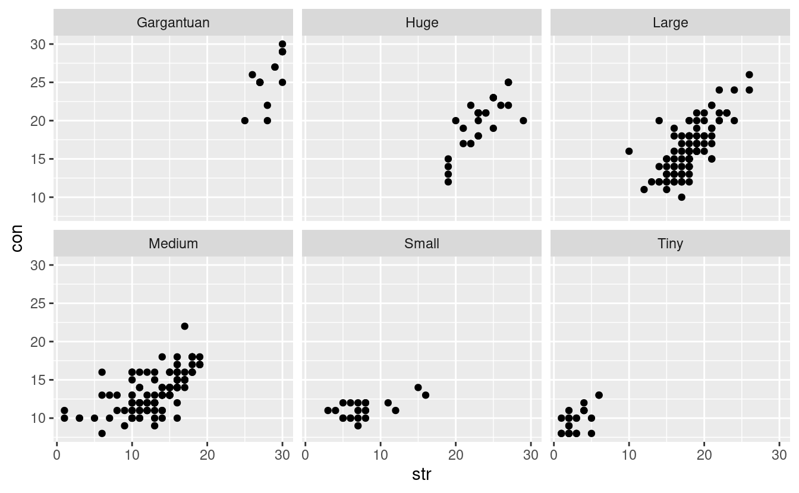

Whenever I take an interest in something I think to myself, "How can I combine this with R?"

This post is the result of applying that attitude to Dungeons and Dragons.

So how would I combine D&D with R? A good start would be to have a nice data set of Dungeons and Dragons monsters, with all of their statistics, abilities and attributes. One of the core D&D rule books is the [Monster Manual](http://dnd.wizards.com/products/tabletop-games/rpg-products/monster-manual). I could attempt to scrape the Monster Manual but I figured that the lovely people behind D&D wouldn't be too happy if I uploaded most of the book to GitHub!

Fortunately, Wizards of the Coast have included around 300 monsters in the [Systems Reference Document](http://dnd.wizards.com/articles/features/systems-reference-document-srd) (SRD) for 5th edition D&D. This is made available under the Open Gaming License Version 1.0a.

I started off trying to scrape the SRD directly, but scraping a PDF was looking to be a nightmare. Fortunately, [vitusventure had already converted the SRD to markdown documents](https://github.com/vitusventure/5thSRD) to host the content on the (rather pretty) <https://5thsrd.org/>. I figured it would be easier to scrape markdown files, since they are structured but simple text. Here's an example of a monster's "stat block" written in markdown:

------------------------------------------------------------------------

name: Medusa type: monstrosity cr: 6

Medusa
======

*Medium monstrosity, lawful evil*

**Armor Class** 15 (natural armor)  
**Hit Points** 127 (17d8 + 51)  
**Speed** 30 ft.

| STR     | DEX     | CON     | INT     | WIS     | CHA     |
|---------|---------|---------|---------|---------|---------|
| 10 (+0) | 15 (+2) | 16 (+3) | 12 (+1) | 13 (+1) | 15 (+2) |

**Skills** Deception +5, Insight +4, Perception +4, Stealth +5  
**Senses** darkvision 60 ft., passive Perception 14  
**Languages** Common  
**Challenge** 6 (2,300 XP)

**Petrifying Gaze.** When a creature that can see the medusa's eyes starts its turn within 30 feet of the medusa, the medusa can force it to make a DC 14 Constitution saving throw if the medusa isn't incapacitated and can see the creature. If the saving throw fails by 5 or more, the creature is instantly petrified. Otherwise, a creature that fails the save begins to turn to stone and is restrained. The restrained creature must repeat the saving throw at the end of its next turn, becoming petrified on a failure or ending the effect on a success. The petrification lasts until the creature is freed by the greater restoration spell or other magic.  
Unless surprised, a creature can avert its eyes to avoid the saving throw at the start of its turn. If the creature does so, it can't see the medusa until the start of its next turn, when it can avert its eyes again. If the creature looks at the medusa in the meantime, it must immediately make the save.  
If the medusa sees itself reflected on a polished surface within 30 feet of it and in an area of bright light, the medusa is, due to its curse, affected by its own gaze.

### Actions

**Multiattack.** The medusa makes either three melee attacks--one with its snake hair and two with its shortsword--or two ranged attacks with its longbow.  
**Snake Hair.** *Melee Weapon Attack:* +5 to hit, reach 5 ft., one creature. *Hit:* 4 (1d4 + 2) piercing damage plus 14 (4d6) poison damage.  
**Shortsword.** *Melee Weapon Attack:* +5 to hit, reach 5 ft., one target. *Hit:* 5 (1d6 + 2) piercing damage.  
**Longbow.** *Ranged Weapon Attack:* +5 to hit, range 150/600 ft., one target. *Hit:* 6 (1d8 + 2) piercing damage plus 7 (2d6) poison damage.

------------------------------------------------------------------------

I put the scraped monsters in the SRD into the `monsters` data set and uploaded it to a quickly created `monstr` package. You can access the data set by installing the package with [`devtools::install_github("mdneuzerling/monstr")`](https://devtools.r-lib.org//reference/remote-reexports.html).

<pre class='chroma'><code class='language-r' data-lang='r'>monsters &lt;- monstr::<a href='https://rdrr.io/pkg/monstr/man/monsters.html'>monsters</a>
skimr::<a href='https://docs.ropensci.org/skimr/reference/skim.html'>skim</a>(monsters)
</code></pre>

|                                                  |          |
|:-------------------------------------------------|:---------|
| Name                                             | monsters |
| Number of rows                                   | 317      |
| Number of columns                                | 39       |
| \_\_\_\_\_\_\_\_\_\_\_\_\_\_\_\_\_\_\_\_\_\_\_   |          |
| Column type frequency:                           |          |
| character                                        | 10       |
| list                                             | 1        |
| numeric                                          | 28       |
| \_\_\_\_\_\_\_\_\_\_\_\_\_\_\_\_\_\_\_\_\_\_\_\_ |          |
| Group variables                                  | None     |

**Variable type: character**

| skim\_variable |  n\_missing|  complete\_rate|  min|  max|  empty|  n\_unique|  whitespace|
|:---------------|-----------:|---------------:|----:|----:|------:|----------:|-----------:|
| name           |           0|            1.00|    3|   25|      0|        317|           0|
| type           |           0|            1.00|    3|   30|      0|         35|           0|
| size           |           0|            1.00|    4|   10|      0|          6|           0|
| alignment      |           0|            1.00|    7|   40|      0|         16|           0|
| ac\_note       |         108|            0.66|    5|   23|      0|         22|           0|
| hp             |           0|            1.00|    3|   11|      0|        168|           0|
| senses         |           0|            1.00|   20|  170|      0|         88|           0|
| languages      |           0|            1.00|    1|   91|      0|         86|           0|
| speed          |           0|            1.00|    4|   52|      0|         90|           0|
| description    |         274|            0.14|   96|  654|      0|         43|           0|

**Variable type: list**

| skim\_variable |  n\_missing|  complete\_rate|  n\_unique|  min\_length|  max\_length|
|:---------------|-----------:|---------------:|----------:|------------:|------------:|
| actions        |           3|            0.99|        305|            1|           10|

**Variable type: numeric**

| skim\_variable    |  n\_missing|  complete\_rate|     mean|        sd|   p0|    p25|  p50|   p75|    p100| hist  |
|:------------------|-----------:|---------------:|--------:|---------:|----:|------:|----:|-----:|-------:|:------|
| cr                |           0|               1|     4.60|      5.91|    0|    0.5|    2|     6|      30| ▇▁▁▁▁ |
| xp                |           0|               1|  4275.30|  12436.13|    0|  100.0|  450|  2300|  155000| ▇▁▁▁▁ |
| ac                |           0|               1|    14.07|      3.27|    5|   12.0|   13|    17|      25| ▁▇▅▂▁ |
| hp\_avg           |           0|               1|    82.31|     99.88|    1|   18.0|   45|   114|     676| ▇▁▁▁▁ |
| str               |           0|               1|    15.34|      6.63|    1|   11.0|   16|    19|      30| ▂▃▇▃▂ |
| dex               |           0|               1|    12.61|      3.22|    1|   10.0|   13|    15|      28| ▁▅▇▁▁ |
| con               |           0|               1|    15.16|      4.50|    8|   12.0|   14|    18|      30| ▇▇▅▂▁ |
| int               |           0|               1|     7.86|      5.69|    1|    2.0|    7|    12|      25| ▇▅▃▂▁ |
| wis               |           0|               1|    11.72|      2.98|    0|   10.0|   12|    13|      25| ▁▅▇▁▁ |
| cha               |           0|               1|     9.79|      5.76|    0|    5.0|    8|    14|      30| ▇▇▅▂▁ |
| acrobatics        |           0|               1|     1.12|      1.64|   -5|    0.0|    1|     2|       9| ▁▅▇▁▁ |
| animal\_handling  |           0|               1|     0.66|      1.49|   -5|    0.0|    1|     1|       7| ▁▁▇▁▁ |
| arcana            |           0|               1|    -1.07|      3.46|   -5|   -4.0|   -2|     1|      18| ▇▅▁▁▁ |
| athletics         |           0|               1|     2.55|      3.48|   -5|    0.0|    3|     4|      14| ▂▆▇▂▁ |
| deception         |           0|               1|    -0.11|      3.37|   -5|   -3.0|   -1|     2|      11| ▇▅▃▂▁ |
| history           |           0|               1|    -1.05|      3.46|   -5|   -4.0|   -2|     1|      13| ▇▅▂▁▁ |
| insight           |           0|               1|     0.95|      2.12|   -5|    0.0|    1|     1|      10| ▁▇▂▁▁ |
| intimidation      |           0|               1|    -0.35|      2.94|   -5|   -3.0|   -1|     2|      10| ▇▅▃▁▁ |
| investigation     |           0|               1|    -1.26|      2.94|   -5|   -4.0|   -2|     1|       7| ▇▃▆▂▁ |
| medicine          |           0|               1|     0.68|      1.55|   -5|    0.0|    1|     1|       7| ▁▁▇▁▁ |
| nature            |           0|               1|    -1.26|      2.93|   -5|   -4.0|   -2|     1|       7| ▇▃▆▂▁ |
| perception        |           0|               1|     2.87|      4.02|   -5|    0.0|    2|     4|      17| ▂▇▃▁▁ |
| performance       |           0|               1|    -0.36|      2.94|   -5|   -3.0|   -1|     2|      10| ▇▅▃▁▁ |
| persuasion        |           0|               1|    -0.19|      3.34|   -5|   -3.0|   -1|     2|      16| ▇▅▂▁▁ |
| religion          |           0|               1|    -1.18|      3.12|   -5|   -4.0|   -2|     1|      15| ▇▅▁▁▁ |
| sleight\_of\_hand |           0|               1|     1.11|      1.62|   -5|    0.0|    1|     2|       9| ▁▅▇▁▁ |
| stealth           |           0|               1|     2.30|      2.56|   -5|    0.0|    2|     4|      10| ▁▇▇▃▁ |
| survival          |           0|               1|     0.70|      1.54|   -5|    0.0|    1|     1|       7| ▁▁▇▁▁ |

Because it's an R crime to introduce a new data set without a ggplot, here we can see the relationship between strength and constitution, faceted by monster size:

<pre class='chroma'><code class='language-r' data-lang='r'>monsters %&gt;% 
    ggplot(aes(x = str, y = con)) + 
    geom_point() + 
    facet_wrap(. ~ size, nrow = 2)
</code></pre>

One note before we go on: "monster" is a generic term. This data set contains bandits which, while of questionable moral character, are not necessarily monstrous. You can also find a simple frog in this data set, capable of nothing more than a ribbit. We refer to them all as "monsters", perhaps unfairly!

Scraping line-by-line
---------------------

Let's take the Medusa `monster` above, loaded as a single string. I'm going to make life easier for myself by separating the string into lines. At first I tried to do this myself with `strsplit`, but please take my advice: use the `stringi` package. You'll notice that I turn the resulting list into a single-column tibble. I won't lie: I find manipulating lists directly difficult, so being able to use `dplyr` verbs makes me happy. I'm also going to remove the italics (represented in markdown by underscores) since I won't need them here.

<pre class='chroma'><code class='language-r' data-lang='r'>lines &lt;- monster %&gt;% 
        stringi::<a href='https://rdrr.io/pkg/stringi/man/stri_split_lines.html'>stri_split_lines</a>(omit_empty = TRUE) %&gt;% 
        unlist %&gt;% 
        as_tibble %&gt;% # much easier to deal with than lists
        mutate_all(trimws) %&gt;% 
        mutate_all(function(x) <a href='https://rdrr.io/r/base/grep.html'>gsub</a>("_", "", x)) # remove italics
<a href='https://rdrr.io/r/base/print.html'>print</a>(lines, n = <a href='https://rdrr.io/r/base/nrow.html'>nrow</a>(lines))
#&gt; # A tibble: 23 x 1
#&gt;    value                                                                        
#&gt;    &lt;chr&gt;                                                                        
#&gt;  1 name: Medusa                                                                 
#&gt;  2 type: monstrosity                                                            
#&gt;  3 cr: 6                                                                        
#&gt;  4 # Medusa                                                                     
#&gt;  5 Medium monstrosity, lawful evil                                              
#&gt;  6 **Armor Class** 15 (natural armor)                                           
#&gt;  7 **Hit Points** 127 (17d8 + 51)                                               
#&gt;  8 **Speed** 30 ft.                                                             
#&gt;  9 | STR     | DEX     | CON     | INT     | WIS     | CHA     |                
#&gt; 10 |---------|---------|---------|---------|---------|---------|                
#&gt; 11 | 10 (+0) | 15 (+2) | 16 (+3) | 12 (+1) | 13 (+1) | 15 (+2) |                
#&gt; 12 **Skills** Deception +5, Insight +4, Perception +4, Stealth +5               
#&gt; 13 **Senses** darkvision 60 ft., passive Perception 14                          
#&gt; 14 **Languages** Common                                                         
#&gt; 15 **Challenge** 6 (2,300 XP)                                                   
#&gt; 16 **Petrifying Gaze.** When a creature that can see the medusa's eyes starts i…
#&gt; 17 Unless surprised, a creature can avert its eyes to avoid the saving throw at…
#&gt; 18 If the medusa sees itself reflected on a polished surface within 30 feet of …
#&gt; 19 ### Actions                                                                  
#&gt; 20 **Multiattack.** The medusa makes either three melee attacks--one with its s…
#&gt; 21 **Snake Hair.** Melee Weapon Attack: +5 to hit, reach 5 ft., one creature. H…
#&gt; 22 **Shortsword.** Melee Weapon Attack: +5 to hit, reach 5 ft., one target. Hit…
#&gt; 23 **Longbow.** Ranged Weapon Attack: +5 to hit, range 150/600 ft., one target.…</code></pre>

Scraping monster name, type and CR
----------------------------------

The wonderful thing about these markdown files is that they have a nifty couple of lines up the top listing the name, type and challenge rating (cr) of the monster. These are marked by headings with colons, so we'll define a function to extract the data based on that.

<pre class='chroma'><code class='language-r' data-lang='r'>extract_from_colon_heading &lt;- function(lines, heading) {
    lines %&gt;% 
        <a href='https://rdrr.io/r/stats/filter.html'>filter</a>(<a href='https://rdrr.io/r/base/grep.html'>grepl</a>(<a href='https://rdrr.io/r/base/paste.html'>paste0</a>(heading, ":"), value)) %&gt;% 
        <a href='https://rdrr.io/r/base/grep.html'>gsub</a>(<a href='https://rdrr.io/r/base/paste.html'>paste0</a>(heading, ":"), "", .) %&gt;% 
        as.character %&gt;% 
        trimws
}

<a href='https://rdrr.io/r/base/c.html'>c</a>(
    extract_from_colon_heading(lines, "name"),
    extract_from_colon_heading(lines, "type"),
    extract_from_colon_heading(lines, "cr")
)
#&gt; [1] "Medusa"      "monstrosity" "6"</code></pre>

I should offer some explanations for those new to D&D! The "type" of a monster is a category like beast, undead or---in the case of the Medusa---monstrosity. The challenge rating is a rough measure of difficulty. The Medusa has a challenge rating of 6, so is a suitable encounter for 4 players with characters of level 6. Characters begin at level 1 and move up to level 20 (if the campaign lasts that long).

Scraping based on bold text
---------------------------

Most of the information we need is labelled by bold text, represented in markdown by double asterisks. We'll define three functions:

1.  `identify_bold_text` looks for a given `bold_text` in a string `x`, and returns a Boolean value.
2.  `strip_bold_text` removes *all* bolded text from a string `x`, and trims white space from either end of the result.
3.  `extract_from_bold_text` looks through a list of lines (like the `lines` defined above) for a particular `bold_text`. It will return all text in the string *except* the `bold_text`. This function uses the two above.

<pre class='chroma'><code class='language-r' data-lang='r'>identify_bold_text &lt;- function(x, bold_text) {
    <a href='https://rdrr.io/r/base/grep.html'>grepl</a>(<a href='https://rdrr.io/r/base/paste.html'>paste0</a>("\\*\\*", bold_text, "\\*\\*"), x, ignore.case = TRUE)
}

strip_bold_text &lt;- function(x) {
    <a href='https://rdrr.io/r/base/grep.html'>gsub</a>("\\*\\*(.*?)\\*\\*", "", x, ignore.case = TRUE) %&gt;% trimws
}

extract_from_bold_text &lt;- function(lines, bold_text) {
    lines %&gt;% 
        <a href='https://rdrr.io/r/stats/filter.html'>filter</a>(identify_bold_text(value, bold_text)) %&gt;% 
        as.character %&gt;% 
        strip_bold_text
}

extract_from_bold_text(lines, "Languages")
#&gt; [1] "Common"</code></pre>

Scraping based on brackets
--------------------------

Some of the data we need is found in bracketed information. The `extract_bracketed` function returns all text inside the first set of brackets found in a string `x`, or returns `NA` if no bracketed text is found.

<pre class='chroma'><code class='language-r' data-lang='r'>extract_bracketed &lt;- function(x) {
    if (!<a href='https://rdrr.io/r/base/grep.html'>grepl</a>("\\(.*\\)", x)) {
        <a href='https://rdrr.io/r/base/function.html'>return</a>(NA)
    } else {
        <a href='https://rdrr.io/r/base/grep.html'>gsub</a>(".*\\((.*?)\\).*", "\\1", x)
    }
}

lines %&gt;% extract_from_bold_text("Armor Class") %&gt;% extract_bracketed
#&gt; [1] "natural armor"</code></pre>

A monster's armor class (AC) determines how hard it is to hit the creature with a weapon or certain spells. The Medusa has an AC of 15. To attack the Medusa, a player will roll a 20-sided die (d20) and add certain modifiers based on their character's skills and proficiencies. If the result is at least 15, the attack hits. The "natural armor" note means that the Medusa's armor class is provided by thickened skin or scales, and not a separate piece of armour.

Abilities
---------

Player characters and monsters in D&D have six ability scores that influence almost everything that they do: strength, dexterity, constitution, intelligence, wisdom and charisma. These abilities are represented by numeric scores that usually (but not always) fall between 10 and 20, with 10 being "average" and 20 being superb.

In the markdown files, these ability scores are tables. We look for the table header and find the ability scores two rows below.

<pre class='chroma'><code class='language-r' data-lang='r'>ability_header &lt;- <a href='https://rdrr.io/r/base/Extremes.html'>min</a>(<a href='https://rdrr.io/r/base/which.html'>which</a>(<a href='https://rdrr.io/r/base/grep.html'>grepl</a>("\\| STR", lines$value), arr.ind = TRUE))
ability_text &lt;- lines$value[ability_header + 2]
ability_vector &lt;- ability_text %&gt;% <a href='https://rdrr.io/r/base/strsplit.html'>strsplit</a>("\\|") %&gt;% unlist
monster_ability &lt;- readr::<a href='https://readr.tidyverse.org/reference/parse_number.html'>parse_number</a>(ability_vector[!(ability_vector == "")])
<a href='https://rdrr.io/r/base/names.html'>names</a>(monster_ability) &lt;- <a href='https://rdrr.io/r/base/c.html'>c</a>("STR", "DEX", "CON", "INT", "WIS", "CHA")
monster_ability    
#&gt; STR DEX CON INT WIS CHA 
#&gt;  10  15  16  12  13  15</code></pre>

Skills
------

Skills represent the monster's ability to perform activities. There are 18 skills, and each skill is associated with one of the 6 ability scores.

<pre class='chroma'><code class='language-r' data-lang='r'>skill_ability &lt;- tribble(
~skill, ~ability_code_upper,
#-------|------------------
"athletics", "STR",
"acrobatics", "DEX",
"sleight_of_hand", "DEX",
"stealth", "DEX",
"arcana", "INT",
"history", "INT",
"investigation", "INT",
"nature", "INT",
"religion", "INT",
"animal_handling", "WIS",
"insight", "WIS",
"medicine", "WIS",
"perception", "WIS",
"survival", "WIS",
"deception", "CHA",
"intimidation", "CHA",
"performance", "CHA",
"persuasion", "CHA",
)</code></pre>

All skills begin with a roll of a d20 for an element of chance. Modifiers, which can be negative, are then added to the result to determine how well the monster did. The Medusa has a +5 bonus to Deception, which would be added to the roll.

If a skill isn't listed in the Medusa's stat block, she can still use it. In this case, she would rely instead on her ability scores. For example, the Medusa isn't trained in acrobatics, but her high dexterity would give her a slight advantage nevertheless.

Modifiers can be calculated from ability scores with a simple formula, defined below. Note that modifiers can be negative. Zombies, for example, are not known for their high intelligence, and have a history modifier of -4.

<pre class='chroma'><code class='language-r' data-lang='r'>modifier &lt;- function(x) {
    <a href='https://rdrr.io/r/base/Round.html'>floor</a>((x - 10) / 2)
}

monster_modifiers &lt;- monster_ability %&gt;% 
    as.list %&gt;% # preserves list names as column names
    as_tibble %&gt;% 
    mutate_all(modifier) %&gt;% # convert raw ability to modifiers
    gather(key = ability_code_upper, value = modifier) # convert to long
monster_modifiers
#&gt; # A tibble: 6 x 2
#&gt;   ability_code_upper modifier
#&gt;   &lt;chr&gt;                 &lt;dbl&gt;
#&gt; 1 STR                       0
#&gt; 2 DEX                       2
#&gt; 3 CON                       3
#&gt; 4 INT                       1
#&gt; 5 WIS                       1
#&gt; 6 CHA                       2</code></pre>

We're going to list every skill modifier for each monster. We start with the `base_skills`, determined solely by the monster's ability scores.

<pre class='chroma'><code class='language-r' data-lang='r'>base_skills &lt;- skill_ability %&gt;% 
    left_join(monster_modifiers, by = "ability_code_upper") %&gt;% 
    select(skill, modifier)
<a href='https://rdrr.io/r/utils/head.html'>head</a>(base_skills, 6)
#&gt; # A tibble: 6 x 2
#&gt;   skill           modifier
#&gt;   &lt;chr&gt;              &lt;dbl&gt;
#&gt; 1 athletics              0
#&gt; 2 acrobatics             2
#&gt; 3 sleight_of_hand        2
#&gt; 4 stealth                2
#&gt; 5 arcana                 1
#&gt; 6 history                1</code></pre>

Now we find the `listed_skills`, which are those explicitly provided in the markdown. We use the `extract_from_bold_text` function, and split the resulting line along the commas into a vector. The words in an element name the skill, while the number gives the modifier.

This chain of piped functions has a peculiar `unlist %>% as.list`, which seems to be necessary to preserve the vector names. I'd love to do without this code, since it seems very ugly!

<pre class='chroma'><code class='language-r' data-lang='r'>listed_skills &lt;- lines %&gt;% 
    extract_from_bold_text("Skills") %&gt;% 
    <a href='https://rdrr.io/r/base/strsplit.html'>strsplit</a>(", ") %&gt;% 
        unlist %&gt;%  
        <a href='https://rdrr.io/r/base/lapply.html'>lapply</a>(function(x) {
            skill_name &lt;- word(x)
            skill_modifier &lt;- <a href='https://rdrr.io/r/base/c.html'>c</a>(readr::<a href='https://readr.tidyverse.org/reference/parse_number.html'>parse_number</a>(x))
            <a href='https://rdrr.io/r/base/names.html'>names</a>(skill_modifier) &lt;- <a href='https://rdrr.io/r/base/chartr.html'>tolower</a>(skill_name)
            skill_modifier
        }) %&gt;% 
        unlist %&gt;% # This is 
        as.list %&gt;% # so weird
        as_tibble %&gt;% 
        gather(key = skill, value = modifier) %&gt;% 
        mutate(skill = <a href='https://rdrr.io/r/base/grep.html'>gsub</a>(" ", "_", skill)) # keep naming conventions (underscores)
listed_skills
#&gt; # A tibble: 4 x 2
#&gt;   skill      modifier
#&gt;   &lt;chr&gt;         &lt;dbl&gt;
#&gt; 1 deception         5
#&gt; 2 insight           4
#&gt; 3 perception        4
#&gt; 4 stealth           5</code></pre>

Finally, we combine `listed_skills` and `base_skills`, allowing listed skills to override base skills.

<pre class='chroma'><code class='language-r' data-lang='r'>monster_skills &lt;- if (<a href='https://rdrr.io/r/base/length.html'>length</a>(listed_skills) == 0) {
    base_skills
} else {
    listed_skills %&gt;% <a href='https://rdrr.io/r/base/cbind.html'>rbind</a>(
        anti_join(base_skills, listed_skills, by = "skill")
    )
}
monster_skills &lt;- monster_skills[<a href='https://rdrr.io/r/base/match.html'>match</a>(base_skills$skill, monster_skills$skill),] # maintain skill order
<a href='https://rdrr.io/r/utils/head.html'>head</a>(monster_skills, 6)
#&gt; # A tibble: 6 x 2
#&gt;   skill           modifier
#&gt;   &lt;chr&gt;              &lt;dbl&gt;
#&gt; 1 athletics              0
#&gt; 2 acrobatics             2
#&gt; 3 sleight_of_hand        2
#&gt; 4 stealth                5
#&gt; 5 arcana                 1
#&gt; 6 history                1</code></pre>

Monster actions
---------------

Actions are are a tough one. Take a look at the last 5 lines of the markdown:

<pre class='chroma'><code class='language-r' data-lang='r'><a href='https://rdrr.io/r/utils/head.html'>tail</a>(lines, 5)
#&gt; # A tibble: 5 x 1
#&gt;   value                                                                         
#&gt;   &lt;chr&gt;                                                                         
#&gt; 1 ### Actions                                                                   
#&gt; 2 **Multiattack.** The medusa makes either three melee attacks--one with its sn…
#&gt; 3 **Snake Hair.** Melee Weapon Attack: +5 to hit, reach 5 ft., one creature. Hi…
#&gt; 4 **Shortsword.** Melee Weapon Attack: +5 to hit, reach 5 ft., one target. Hit:…
#&gt; 5 **Longbow.** Ranged Weapon Attack: +5 to hit, range 150/600 ft., one target. …</code></pre>

We're going to look for an actions h3 heading (three hashes) "Actions". The lines that correspond to actions begin after this `Actions` subheading. The last action is determined by finding either:

1.  the line before the next h3 heading or, failing that,
2.  the last line.

We then have a list of lines that correspond to monster actions. We're going to turn these lines into a named vector, in which the name of the action (taken from the bold text) corresponds to the action text.

<pre class='chroma'><code class='language-r' data-lang='r'>header_rows &lt;- <a href='https://rdrr.io/r/base/which.html'>which</a>(<a href='https://rdrr.io/r/base/grep.html'>grepl</a>("###", lines$value), arr.ind = TRUE)
    actions_header_row &lt;- <a href='https://rdrr.io/r/base/which.html'>which</a>(lines == "### Actions", arr.ind = TRUE)[,"row"]
    if (<a href='https://rdrr.io/r/base/length.html'>length</a>(actions_header_row) == 0) { # This monster has no actions
        monster_actions &lt;- NA
    } else {
        if (<a href='https://rdrr.io/r/base/Extremes.html'>max</a>(header_rows) == actions_header_row) {
            last_action = <a href='https://rdrr.io/r/base/nrow.html'>nrow</a>(lines) # in this case, the actions are the last lines
        } else {
            last_action &lt;-  <a href='https://rdrr.io/r/base/Extremes.html'>min</a>(header_rows[header_rows &gt; actions_header_row]) - 1 # the row before the heading that comes after ### Actions
        }
        action_rows &lt;-  <a href='https://rdrr.io/r/base/seq.html'>seq</a>(actions_header_row + 1, last_action)
        monster_actions &lt;- lines$value[action_rows]
        monster_actions &lt;- monster_actions %&gt;% purrr::<a href='https://purrr.tidyverse.org/reference/map.html'>map</a>(function(x) {
            action_name &lt;- <a href='https://rdrr.io/r/base/grep.html'>gsub</a>(".*\\*\\*(.*?)\\.\\*\\*.*", "\\1", x)
            action &lt;- x %&gt;% strip_bold_text %&gt;% trimws
            <a href='https://rdrr.io/r/base/names.html'>names</a>(action) &lt;- action_name
            action
        }) %&gt;% purrr::<a href='https://purrr.tidyverse.org/reference/reduce.html'>reduce</a>(c)
    }
monster_actions
#&gt;                                                                                                                                 Multiattack 
#&gt; "The medusa makes either three melee attacks--one with its snake hair and two with its shortsword--or two ranged attacks with its longbow." 
#&gt;                                                                                                                                  Snake Hair 
#&gt;                  "Melee Weapon Attack: +5 to hit, reach 5 ft., one creature. Hit: 4 (1d4 + 2) piercing damage plus 14 (4d6) poison damage." 
#&gt;                                                                                                                                  Shortsword 
#&gt;                                                "Melee Weapon Attack: +5 to hit, reach 5 ft., one target. Hit: 5 (1d6 + 2) piercing damage." 
#&gt;                                                                                                                                     Longbow 
#&gt;              "Ranged Weapon Attack: +5 to hit, range 150/600 ft., one target. Hit: 6 (1d8 + 2) piercing damage plus 7 (2d6) poison damage."</code></pre>

Putting it all together
-----------------------

We can now put everything together into a single-row tibble:

<pre class='chroma'><code class='language-r' data-lang='r'>tibble(
    name = lines %&gt;% extract_from_colon_heading("name"),
    type = lines %&gt;% extract_from_colon_heading("type"),
    cr = lines %&gt;% extract_from_colon_heading("cr") %&gt;% as.numeric,
    xp = lines %&gt;% extract_from_bold_text("challenge") %&gt;% extract_bracketed %&gt;% readr::<a href='https://readr.tidyverse.org/reference/parse_number.html'>parse_number</a>(),
    ac = lines %&gt;% extract_from_bold_text("Armor Class") %&gt;% readr::<a href='https://readr.tidyverse.org/reference/parse_number.html'>parse_number</a>(),
    ac_note = lines %&gt;% extract_from_bold_text("Armor Class") %&gt;% extract_bracketed,
    hp_avg = lines %&gt;% extract_from_bold_text("Hit Points") %&gt;% readr::<a href='https://readr.tidyverse.org/reference/parse_number.html'>parse_number</a>(),
    hp = lines %&gt;% extract_from_bold_text("Hit Points") %&gt;% extract_bracketed,
    str = monster_ability["STR"],
    dex = monster_ability["DEX"],
    con = monster_ability["CON"],
    int = monster_ability["INT"],
    wis = monster_ability["WIS"],
    cha = monster_ability["CHA"],
    senses = lines %&gt;% extract_from_bold_text("Senses"),
    languages = lines %&gt;% extract_from_bold_text("Languages"),
    speed = lines %&gt;% extract_from_bold_text("Speed"),
    actions = monster_actions %&gt;% list
    ) %&gt;% 
    <a href='https://rdrr.io/r/base/cbind.html'>cbind</a>(spread(monster_skills, skill, modifier)) %&gt;% 
    as_tibble
#&gt; # A tibble: 1 x 36
#&gt;   name  type     cr    xp    ac ac_note hp_avg hp      str   dex   con   int
#&gt;   &lt;chr&gt; &lt;chr&gt; &lt;dbl&gt; &lt;dbl&gt; &lt;dbl&gt; &lt;chr&gt;    &lt;dbl&gt; &lt;chr&gt; &lt;dbl&gt; &lt;dbl&gt; &lt;dbl&gt; &lt;dbl&gt;
#&gt; 1 Medu… mons…     6  2300    15 natura…    127 17d8…    10    15    16    12
#&gt; # … with 24 more variables: wis &lt;dbl&gt;, cha &lt;dbl&gt;, senses &lt;chr&gt;,
#&gt; #   languages &lt;chr&gt;, speed &lt;chr&gt;, actions &lt;list&gt;, acrobatics &lt;dbl&gt;,
#&gt; #   animal_handling &lt;dbl&gt;, arcana &lt;dbl&gt;, athletics &lt;dbl&gt;, deception &lt;dbl&gt;,
#&gt; #   history &lt;dbl&gt;, insight &lt;dbl&gt;, intimidation &lt;dbl&gt;, investigation &lt;dbl&gt;,
#&gt; #   medicine &lt;dbl&gt;, nature &lt;dbl&gt;, perception &lt;dbl&gt;, performance &lt;dbl&gt;,
#&gt; #   persuasion &lt;dbl&gt;, religion &lt;dbl&gt;, sleight_of_hand &lt;dbl&gt;, stealth &lt;dbl&gt;,
#&gt; #   survival &lt;dbl&gt;</code></pre>

There are a few more fields that I haven't covered here (size, alignment and description, for example). I've put the full version of the `parse_monster.R` script in a [gist](https://gist.github.com/mdneuzerling/1a70a2da97300c478186aba226053595).

Of course, this is how to parse just one monster. Fortunately, the `purrr` package exists. Here's how to scrape every monster:

1.  Clone [vitusventure's 5th edition SRD repository](https://github.com/vitusventure/5thSRD)
2.  Set the `/docs/gamemaster_rules/monsters` directory to a variable `monster_dir`
3.  Run the following code:

<pre class='chroma'><code class='language-r' data-lang='r'>monsters &lt;- <a href='https://rdrr.io/r/base/list.files.html'>list.files</a>(monster_dir, full.names = TRUE) %&gt;% 
    purrr::<a href='https://purrr.tidyverse.org/reference/map.html'>map</a>(function(x) <a href='https://rdrr.io/r/base/readChar.html'>readChar</a>(x, <a href='https://rdrr.io/r/base/file.info.html'>file.info</a>(x)$size)) %&gt;% # read files as strings
    purrr::<a href='https://purrr.tidyverse.org/reference/map.html'>map</a>(parse_monster) %&gt;% 
    purrr::<a href='https://purrr.tidyverse.org/reference/reduce.html'>reduce</a>(rbind)</code></pre>

What's next
-----------

A few things are missing here:

-   Damage/condition immunities and resistances are not being scraped.
-   Monster traits, such as the ability to breathe underwater, are not being scraped. I think this is a matter of finding any bold heading that isn't "standard" and treating it as a trait.
-   Some monsters have complicated armor classes. For example, the werewolf has an AC of "11 in humanoid form, 12 (natural armor) in wolf or hybrid form". This doesn't fit the template of `ac` and `ac_note`.

I'd like to incorporate the spells in the SRD, as well as some basic mechanics. Imagine being able to generate an encounter in R according to a specific party level!

Sources
-------

The Medusa and all Dungeons and Dragons 5th edition mechanics are available in the [Systems Reference Document under the Open Gaming License Version 1.0a](https://media.wizards.com/2016/downloads/DND/SRD-OGL_V5.1.pdf). The `monsters` data set in the `monstr` package is available under the same license.

------------------------------------------------------------------------

<pre class='chroma'><code class='language-r' data-lang='r'>devtools::<a href='https://rdrr.io/pkg/sessioninfo/man/session_info.html'>session_info</a>()
#&gt; ─ Session info ───────────────────────────────────────────────────────────────
#&gt;  setting  value                       
#&gt;  version  R version 4.0.0 (2020-04-24)
#&gt;  os       Ubuntu 20.04 LTS            
#&gt;  system   x86_64, linux-gnu           
#&gt;  ui       X11                         
#&gt;  language en_AU:en                    
#&gt;  collate  en_AU.UTF-8                 
#&gt;  ctype    en_AU.UTF-8                 
#&gt;  tz       Australia/Melbourne         
#&gt;  date     2020-06-13                  
#&gt; 
#&gt; ─ Packages ───────────────────────────────────────────────────────────────────
#&gt;  package     * version    date       lib source                              
#&gt;  assertthat    0.2.1      2019-03-21 [1] CRAN (R 4.0.0)                      
#&gt;  backports     1.1.7      2020-05-13 [1] CRAN (R 4.0.0)                      
#&gt;  base64enc     0.1-3      2015-07-28 [1] CRAN (R 4.0.0)                      
#&gt;  broom         0.5.6      2020-04-20 [1] CRAN (R 4.0.0)                      
#&gt;  callr         3.4.3      2020-03-28 [1] CRAN (R 4.0.0)                      
#&gt;  cellranger    1.1.0      2016-07-27 [1] CRAN (R 4.0.0)                      
#&gt;  cli           2.0.2      2020-02-28 [1] CRAN (R 4.0.0)                      
#&gt;  colorspace    1.4-1      2019-03-18 [1] CRAN (R 4.0.0)                      
#&gt;  crayon        1.3.4      2017-09-16 [1] CRAN (R 4.0.0)                      
#&gt;  DBI           1.1.0      2019-12-15 [1] CRAN (R 4.0.0)                      
#&gt;  dbplyr        1.4.3      2020-04-19 [1] CRAN (R 4.0.0)                      
#&gt;  desc          1.2.0      2018-05-01 [1] CRAN (R 4.0.0)                      
#&gt;  devtools      2.3.0      2020-04-10 [1] CRAN (R 4.0.0)                      
#&gt;  digest        0.6.25     2020-02-23 [1] CRAN (R 4.0.0)                      
#&gt;  downlit       0.0.0.9000 2020-06-12 [1] Github (r-lib/downlit@87fb1af)      
#&gt;  dplyr       * 0.8.5      2020-03-07 [1] CRAN (R 4.0.0)                      
#&gt;  ellipsis      0.3.1      2020-05-15 [1] CRAN (R 4.0.0)                      
#&gt;  evaluate      0.14       2019-05-28 [1] CRAN (R 4.0.0)                      
#&gt;  fansi         0.4.1      2020-01-08 [1] CRAN (R 4.0.0)                      
#&gt;  farver        2.0.3      2020-01-16 [1] CRAN (R 4.0.0)                      
#&gt;  forcats     * 0.5.0      2020-03-01 [1] CRAN (R 4.0.0)                      
#&gt;  fs            1.4.1      2020-04-04 [1] CRAN (R 4.0.0)                      
#&gt;  generics      0.0.2      2018-11-29 [1] CRAN (R 4.0.0)                      
#&gt;  ggplot2     * 3.3.0      2020-03-05 [1] CRAN (R 4.0.0)                      
#&gt;  glue          1.4.1      2020-05-13 [1] CRAN (R 4.0.0)                      
#&gt;  gtable        0.3.0      2019-03-25 [1] CRAN (R 4.0.0)                      
#&gt;  haven         2.2.0      2019-11-08 [1] CRAN (R 4.0.0)                      
#&gt;  highr         0.8        2019-03-20 [1] CRAN (R 4.0.0)                      
#&gt;  hms           0.5.3      2020-01-08 [1] CRAN (R 4.0.0)                      
#&gt;  htmltools     0.4.0      2019-10-04 [1] CRAN (R 4.0.0)                      
#&gt;  httr          1.4.1      2019-08-05 [1] CRAN (R 4.0.0)                      
#&gt;  hugodown      0.0.0.9000 2020-06-12 [1] Github (r-lib/hugodown@6812ada)     
#&gt;  jsonlite      1.6.1      2020-02-02 [1] CRAN (R 4.0.0)                      
#&gt;  knitr         1.28       2020-02-06 [1] CRAN (R 4.0.0)                      
#&gt;  labeling      0.3        2014-08-23 [1] CRAN (R 4.0.0)                      
#&gt;  lattice       0.20-41    2020-04-02 [4] CRAN (R 4.0.0)                      
#&gt;  lifecycle     0.2.0      2020-03-06 [1] CRAN (R 4.0.0)                      
#&gt;  lubridate     1.7.8      2020-04-06 [1] CRAN (R 4.0.0)                      
#&gt;  magrittr      1.5        2014-11-22 [1] CRAN (R 4.0.0)                      
#&gt;  memoise       1.1.0.9000 2020-05-09 [1] Github (hadley/memoise@4aefd9f)     
#&gt;  modelr        0.1.6      2020-02-22 [1] CRAN (R 4.0.0)                      
#&gt;  monstr        0.0.0.9000 2020-06-13 [1] Github (mdneuzerling/monstr@dc7e102)
#&gt;  munsell       0.5.0      2018-06-12 [1] CRAN (R 4.0.0)                      
#&gt;  nlme          3.1-145    2020-03-04 [4] CRAN (R 4.0.0)                      
#&gt;  pillar        1.4.4      2020-05-05 [1] CRAN (R 4.0.0)                      
#&gt;  pkgbuild      1.0.7      2020-04-25 [1] CRAN (R 4.0.0)                      
#&gt;  pkgconfig     2.0.3      2019-09-22 [1] CRAN (R 4.0.0)                      
#&gt;  pkgload       1.0.2      2018-10-29 [1] CRAN (R 4.0.0)                      
#&gt;  prettyunits   1.1.1      2020-01-24 [1] CRAN (R 4.0.0)                      
#&gt;  processx      3.4.2      2020-02-09 [1] CRAN (R 4.0.0)                      
#&gt;  ps            1.3.3      2020-05-08 [1] CRAN (R 4.0.0)                      
#&gt;  purrr       * 0.3.4      2020-04-17 [1] CRAN (R 4.0.0)                      
#&gt;  R6            2.4.1      2019-11-12 [1] CRAN (R 4.0.0)                      
#&gt;  Rcpp          1.0.4.6    2020-04-09 [1] CRAN (R 4.0.0)                      
#&gt;  readr       * 1.3.1      2018-12-21 [1] CRAN (R 4.0.0)                      
#&gt;  readxl        1.3.1      2019-03-13 [1] CRAN (R 4.0.0)                      
#&gt;  remotes       2.1.1      2020-02-15 [1] CRAN (R 4.0.0)                      
#&gt;  repr          1.1.0      2020-01-28 [1] CRAN (R 4.0.0)                      
#&gt;  reprex        0.3.0      2019-05-16 [1] CRAN (R 4.0.0)                      
#&gt;  rlang         0.4.6      2020-05-02 [1] CRAN (R 4.0.0)                      
#&gt;  rmarkdown     2.2.3      2020-06-12 [1] Github (rstudio/rmarkdown@4ee96c8)  
#&gt;  rprojroot     1.3-2      2018-01-03 [1] CRAN (R 4.0.0)                      
#&gt;  rstudioapi    0.11       2020-02-07 [1] CRAN (R 4.0.0)                      
#&gt;  rvest         0.3.5      2019-11-08 [1] CRAN (R 4.0.0)                      
#&gt;  scales        1.1.0      2019-11-18 [1] CRAN (R 4.0.0)                      
#&gt;  sessioninfo   1.1.1      2018-11-05 [1] CRAN (R 4.0.0)                      
#&gt;  skimr         2.1.1      2020-04-16 [1] CRAN (R 4.0.0)                      
#&gt;  stringi       1.4.6      2020-02-17 [1] CRAN (R 4.0.0)                      
#&gt;  stringr     * 1.4.0      2019-02-10 [1] CRAN (R 4.0.0)                      
#&gt;  testthat      2.3.2      2020-03-02 [1] CRAN (R 4.0.0)                      
#&gt;  tibble      * 3.0.1      2020-04-20 [1] CRAN (R 4.0.0)                      
#&gt;  tidyr       * 1.0.2      2020-01-24 [1] CRAN (R 4.0.0)                      
#&gt;  tidyselect    1.0.0      2020-01-27 [1] CRAN (R 4.0.0)                      
#&gt;  tidyverse   * 1.3.0      2019-11-21 [1] CRAN (R 4.0.0)                      
#&gt;  usethis       1.6.1      2020-04-29 [1] CRAN (R 4.0.0)                      
#&gt;  utf8          1.1.4      2018-05-24 [1] CRAN (R 4.0.0)                      
#&gt;  vctrs         0.3.1      2020-06-05 [1] CRAN (R 4.0.0)                      
#&gt;  withr         2.2.0      2020-04-20 [1] CRAN (R 4.0.0)                      
#&gt;  xfun          0.14       2020-05-20 [1] CRAN (R 4.0.0)                      
#&gt;  xml2          1.3.2      2020-04-23 [1] CRAN (R 4.0.0)                      
#&gt;  yaml          2.2.1      2020-02-01 [1] CRAN (R 4.0.0)                      
#&gt; 
#&gt; [1] /home/mdneuzerling/R/x86_64-pc-linux-gnu-library/4.0
#&gt; [2] /usr/local/lib/R/site-library
#&gt; [3] /usr/lib/R/site-library
#&gt; [4] /usr/lib/R/library</code></pre>

