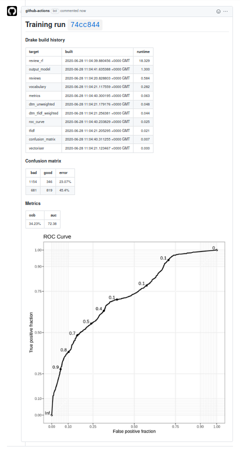
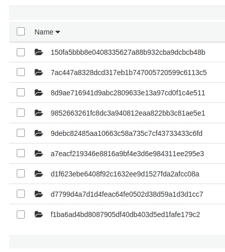

**As of 2023 the material in this post no longer functions [due to changes in GitHub Actions](https://github.com/orgs/community/discussions/25989#).**

Machine learning models get stuck at the deployment stage all the time. This stuff is hard.

[GitHub Actions](https://help.github.com/en/actions) is a tool for automating tasks associated with a repository. I wanted to see if I could implement some sort of end-to-end automatic training, deployment and execution of a model. And I'm going to use R because people keep telling me that this sort of stuff can't be done with R.

I want a git repository with two main branches: *trunk* and *production*. When I push new code to *trunk*, my unit tests are automatically run. When I create a pull request from *trunk* to *production*, my model is automatically trained, and results commented in the pull request. When I merge, my model is deployed. On a schedule, my model is executed. I've heard this sort of automation referred to as "MLOps", the machine learning analogue of DevOps.



I've put all of this into [a repository with a toy model](https://github.com/mdneuzerling/ReviewSentiment). The picture above is the comment for [this pull request](https://github.com/mdneuzerling/ReviewSentiment/pull/29).

I was inspired by a similar post on the [GitHub Blog](https://github.blog/2020-06-17-using-github-actions-for-mlops-data-science/) by [Hamel Husain](https://github.com/hamelsmu). Hamel used an external tool (Argo) to train the model, but I wanted to see if I could make do with just GitHub Actions and some persistent storage. I used S3, but I imagine any sort of cloud storage service would work here.

## Automated unit tests

I've created my model as an R package, using drake to define the model training and execution plans. Check out [my previous post on drake](/post/upgrade-your-workflow-with-drake/) for a little more detail about how this model is put together. In short, the model functions can be loaded with [`devtools::load_all()`](https://devtools.r-lib.org/reference/load_all.html), the plan specified with `training_plan()` or `execution_plan()`, and the run with `drake::make`. But before we even get to that, there are unit tests on the functions in the package. I want these unit tests to run every time I push to the default *trunk* branch.

The `usethis` package makes this incredibly easy. If you've already set up git in your RStudio project, you can just run [`usethis::use_github_actions()`](https://usethis.r-lib.org/reference/github_actions.html) to set up a standard `R CMD check` on push and pull request, using a MacOS runner. It even automatically puts a status badge in your README. It's that easy, I swear.

```yaml
# The GitHub workflow created by usethis::use_github_actions(), taken from
# https://github.com/r-lib/actions/blob/master/examples/check-release.yaml

on:
  push:
    branches:
      - master
  pull_request:
    branches:
      - master

name: R-CMD-check

jobs:
  R-CMD-check:
    runs-on: macOS-latest
    steps:
      - uses: actions/checkout@v2
      - uses: r-lib/actions/setup-r@master
      - name: Install dependencies
        run: |
          install.packages(c("remotes", "rcmdcheck"))
          remotes::install_deps(dependencies = TRUE)
        shell: Rscript {0}
      - name: Check
        run: rcmdcheck::rcmdcheck(args = "--no-manual", error_on = "error")
        shell: Rscript {0}
```

But I wanted to go a bit further and ensure I was creating a reproducible environment, and also using a Linux runner with a fast setup time.

Reproducibility matters here, and that means we need to lock down the operating system, R version, and package versions. I've used [renv](https://rstudio.github.io/renv/) to lock down the package versions, and I'll specify the operating system and R version in the GitHub Actions workflows themselves. I initialise the `renv` lockfile and associated objects with [`renv::activate()`](https://rstudio.github.io/renv/reference/activate.html). By running [`renv::restore()`](https://rstudio.github.io/renv/reference/restore.html) I can install the packages with the exact same versions I used when developing my model locally.

For most purposes, MacOS is a great candidate for a runner. But my development environment is Linux, and I wanted my workflows to match. Moreover, for billing in private repositories, 1 minute of a MacOS job is worth **10 minutes** of a Linux job. The problem with using a Linux runner is that R packages are installed from source, and that can take a long time. On a similar project, I was looking at a 32 minute `R CMD check` workflow on Linux, versus 4 minutes on MacOS!

RStudio recently made their [Package Manager](https://packagemanager.rstudio.com/client/#/) publicly available. This is kind of like CRAN, but has precompiled binaries for common Linux distributions. By using this repo I can complete the `R CMD check` in about 6 minutes; it's a bit slower than MacOS, but given the difference in billing I think the trade-off is well worth it. If I really wanted to trim down the check time, I could cache the installed packages, but I think the time is acceptable as is.

Here's the workflow I settled on. Note also that I install system dependencies such as `libcurl` based on the `DESCRIPTION` file in the model package:

```yaml
# My expanded R CMD check workflow

on:
  push:
    branches:
      - trunk
  pull_request:
    branches:
      - trunk

name: R-CMD-check

jobs:
  R-CMD-check:
    env:
      CRAN_REPO: https://packagemanager.rstudio.com/all/__linux__/bionic/latest
    runs-on: ubuntu-18.04
    steps:
      - uses: actions/checkout@v2
      - uses: r-lib/actions/setup-r@master
        with:
          r-version: '4.0.0'
      - name: Install remotes
        run: |
          install.packages("remotes", repos = c("CRAN" = Sys.getenv("CRAN_REPO")))
        shell: Rscript {0}
      - name: Install system dependencies
        env:
          RHUB_PLATFORM: linux-x86_64-ubuntu-gcc
        run: |
          Rscript -e "remotes::install_github('r-hub/sysreqs')"
          sysreqs=$(Rscript -e "cat(sysreqs::sysreq_commands('DESCRIPTION'))")
          sudo -s eval "$sysreqs"
      - name: Restore dependencies from renv lockfile
        run: |
          cran_repo <- c("CRAN" = Sys.getenv("CRAN_REPO"))
          install.packages(c("renv", "rcmdcheck"), repos = cran_repo)
          renv::restore(repos = cran_repo)
        shell: Rscript {0}
      - name: Check
        run: rcmdcheck::rcmdcheck(args = "--no-manual", error_on = "error")
        shell: Rscript {0}
```

For the most part, this action runs silently. If there's an error in the check, such as a failing unit test or the package can't be installed, then I'll get an email about it. I could even set up a requirement that this check must pass before I merge into the *production* branch.

## Model training

This is the longest workflow. I need to accomplish the following:

1.  Set up R as in the `R CMD check` workflow
2.  Run `drake::make` on the training plan
3.  Maintain a text file `bot-comment.txt` which contains the markdown for the pull request comment
4.  Upload the ggplot to S3
5.  Post the comment
6.  Upload the trained model to S3

```yaml
on:
  pull_request:
    branches:
      - production

name: model-training

jobs:
  model-training:
    env:
      S3_BUCKET: ${{ secrets.AWS_S3_BUCKET }}
      COMMIT_HASH: ${{ github.event.pull_request.head.sha }}
      CRAN_REPO: https://packagemanager.rstudio.com/all/__linux__/bionic/latest
    runs-on: ubuntu-18.04
    steps:
      - uses: actions/checkout@v2
      - uses: r-lib/actions/setup-r@master
        with:
          r-version: '4.0.0'
      - name: Install remotes
        run: |
          install.packages("remotes", repos = c("CRAN" = Sys.getenv("CRAN_REPO")))
        shell: Rscript {0}
      - name: Install system dependencies
        env:
          RHUB_PLATFORM: linux-x86_64-ubuntu-gcc
        run: |
          Rscript -e "remotes::install_github('r-hub/sysreqs')"
          sysreqs=$(Rscript -e "cat(sysreqs::sysreq_commands('DESCRIPTION'))")
          sudo -s eval "$sysreqs"
      - name: Restore and install dependencies
        run: |
          cran_repo <- c("CRAN" = Sys.getenv("CRAN_REPO"))
          install.packages(c("renv", "rcmdcheck"), repos = cran_repo)
          renv::restore(repos = cran_repo)
          if (!require("drake")) install.packages("drake", repos = cran_repo)
          if (!require("knitr")) install.packages("knitr", repos = cran_repo)
          if (!require("digest")) install.packages("digest", repos = cran_repo)
        shell: Rscript {0}
      - name: drake-make
        run: |
          devtools::load_all()
          plan <- training_plan()
          seed <- digest::digest2int(Sys.getenv("COMMIT_HASH"))
          set.seed(seed)
          drake::make(plan)
          his <- drake::drake_history()[c("target", "built", "runtime")]
          his <- his[with(his, order(-runtime)), ]
          writeLines(paste0("# Training run ", Sys.getenv("COMMIT_HASH"), "\n\n"), "bot-comment.txt")
          write("\n### Drake build history\n\n", "bot-comment.txt", append = TRUE)
          write(knitr::kable(his, format = "markdown"), "bot-comment.txt", append = TRUE)
        shell: Rscript {0}
      - name: Convert metrics tables to markdown
        run: |
          cm <- readr::read_rds("artefacts/confusion_matrix.rds")
          metrics <- readr::read_rds("artefacts/metrics.rds")
          write("\n\n### Confusion matrix\n", "bot-comment.txt", append = TRUE)
          write(knitr::kable(cm, format = "markdown"), "bot-comment.txt", append = TRUE)
          write("\n\n### Metrics\n", "bot-comment.txt", append = TRUE)
          write(knitr::kable(metrics, format = "markdown"), "bot-comment.txt", append = TRUE)
        shell: Rscript {0}
      - name: Configure AWS Credentials
        uses: aws-actions/configure-aws-credentials@v1
        with:
          aws-access-key-id: ${{ secrets.AWS_ACCESS_KEY_ID }}
          aws-secret-access-key: ${{ secrets.AWS_SECRET_ACCESS_KEY }}
          aws-region: ${{ secrets.AWS_REGION }}
      - name: Upload metrics image
        run: |
          METRICS_PNG_KEY=$"$GITHUB_REPOSITORY/$GITHUB_WORKFLOW/$COMMIT_HASH/metrics.png"
          aws s3api put-object --bucket "$S3_BUCKET" --key "$METRICS_PNG_KEY" --content-type "image/png" --acl "public-read" --body "artefacts/metrics.png"
          METRICS_PNG_URL=$"https://$S3_BUCKET.s3.amazonaws.com/$METRICS_PNG_KEY"
          METRICS_PNG_MARKDOWN=$'!'"[]($METRICS_PNG_URL)"
          echo -e "\n\n$METRICS_PNG_MARKDOWN" >> bot-comment.txt
      - name: Comment on pull request
        uses: machine-learning-apps/pr-comment@master
        env:
          GITHUB_TOKEN: ${{ secrets.GITHUB_TOKEN }}
        with:
          path: bot-comment.txt
      - name: Tar artefacts as candidate model
        run: tar czf candidate-model.tar.gz artefacts
      - name: Upload candidate_model to S3
        run: |
          CANDIDATE_MODEL_KEY=$"$GITHUB_REPOSITORY/candidate-models/$COMMIT_HASH/candidate-model.tar.gz"
          aws s3api put-object --bucket "$S3_BUCKET" --key "$CANDIDATE_MODEL_KEY" --acl "public-read" --body "candidate-model.tar.gz"
```

I want a common identifier for everything I'm doing here, and that's going to be a commit hash. I'll use it to identify model artefacts uploaded to S3, and as a heading in the pull request comment. If another commit is made while the PR is still open, then there will be a new hash to identify the new training run. To make sure that everything is entirely reproducible, I'll also use the commit hash as a random seed[^1] right before I run `drake::make`. I'm using the commit hash of the pull request "head", which means nothing to me, but it matches the hash that I have in mind.

The `bot-comment.txt` is a file maintained throughout. Variables aren't maintained between steps in a job, so a file is a good way to store data that needs to exist until the job is done. I initialise it with a heading with the commit hash, and then append the drake build history. This will give me an idea of what's taking time when the model is trained.[^2] I'll also append a confusion matrix and table of metrics created in the training plan. I use [`knitr::kable`](https://rdrr.io/pkg/knitr/man/kable.html) to convert R data frames to markdown tables.

There's no persistent storage with GitHub Actions, so I use S3 to store images which I can embed within the markdown comment. The `aws-actions/configure-aws-credentials` action is provided by AWS, and sets up the runner so that it can interact with S3. I obviously don't want to expose my AWS credentials in the workflow, so I set them up as [secrets](https://help.github.com/en/actions/configuring-and-managing-workflows/creating-and-storing-encrypted-secrets). Then, instead of putting my AWS secret access key in plain text I can refer to it with `{{ secrets.AWS_SECRET_ACCESS_KEY }}`.

I use the AWS CLI to upload the image. In the S3 Management Console I had to configure the bucket to allow objects with public read permissions. This doesn't make everything in the bucket public. I still have to upload the image with the `--acl "public-read"` option to make that specific object publicly available. One other thing that tripped me up was the content type: without setting `--content-type "image/png"` the image won't appear in the comment.[^3]

Everything is kept linked to the commit hash. Take a look at the object path I use:

    $GITHUB_REPOSITORY/$GITHUB_WORKFLOW/$COMMIT_HASH/metrics.png

Those first two environment variables will automatically exist in every workflow. After multiple training runs, the S3 bucket looks like this in the "mdneuzerling/ReviewSentiment/model-training" directory:



Now we can post the comment. I found the [`machine-learning-apps/pr-comment`](https://github.com/marketplace/actions/pr-comment-from-file) action on the [GitHub Action Marketplace](https://github.com/marketplace) to do this for me. It requires the `GITHUB_TOKEN` environment variable which is provided automatically.

Finally, I need to do something with the model I made. So far I've been using the `artefacts` directory to store everything related to the model. I tar it and upload it to S3 as a "candidate model", again using the commit hash as an identifier.

## Model deployment

Models are deployed when a pull request to the *production* branch is merged. I'm using a really basic form of "deployment" here --- the candidate model is copied to a specific object in S3. There are other tools out there to handle deployments (like, say, [through GitHub](https://developer.github.com/v3/guides/delivering-deployments/)) but I wanted to keep things simple and within the scope of GitHub Actions and S3.

There's a real risk here of accumulating a large number of candidate models. Machine learning models tends to be quite large, so there's a chance of accumulating some billing costs here. An option is to set a retention period on candidate models, so that they're automatically deleted after a set time. But my models are less than a megabyte, so I'll leave it be.

```yaml
on:
  pull_request:
    branches:
      - production
    types:
      - closed

name: model-deployment

jobs:
  merge-PR:
    env:
      S3_BUCKET: ${{ secrets.AWS_S3_BUCKET }}
      COMMIT_HASH: ${{ github.event.pull_request.head.sha }}
    if: github.event.pull_request.merged == true
    runs-on: ubuntu-18.04
    steps:
      - uses: actions/checkout@v2
      - name: Configure AWS Credentials
        uses: aws-actions/configure-aws-credentials@v1
        with:
          aws-access-key-id: ${{ secrets.AWS_ACCESS_KEY_ID }}
          aws-secret-access-key: ${{ secrets.AWS_SECRET_ACCESS_KEY }}
          aws-region: ${{ secrets.AWS_REGION }}
      - name: Copy candidate_model to production_model
        run: |
          CANDIDATE_MODEL_KEY=$"$GITHUB_REPOSITORY/candidate-models/$COMMIT_HASH/candidate-model.tar.gz"
          PRODUCTION_MODEL_KEY=$"$GITHUB_REPOSITORY/production-model.tar.gz"
          aws s3api copy-object --bucket "$S3_BUCKET" --copy-source "$S3_BUCKET/$CANDIDATE_MODEL_KEY" --acl "public-read" --key "$PRODUCTION_MODEL_KEY"
```

## Model execution

Model execution is similar to model training. The production model is downloaded from S3 and untarred. This creates and populates the `artefact` folder to be exactly as it was after model training. From there, I run `execution_plan()` with `drake::make`.

```yaml
on:
  push:
    branches:
      - production
  schedule:
    - cron: '0 12 * * 1'

name: model-execution

jobs:
  model-execution:
    env:
      S3_BUCKET: ${{ secrets.AWS_S3_BUCKET }}
      CRAN_REPO: https://packagemanager.rstudio.com/all/__linux__/bionic/latest
    runs-on: ubuntu-18.04
    steps:
      - uses: actions/checkout@v2
      - name: Configure AWS Credentials
        uses: aws-actions/configure-aws-credentials@v1
        with:
          aws-access-key-id: ${{ secrets.AWS_ACCESS_KEY_ID }}
          aws-secret-access-key: ${{ secrets.AWS_SECRET_ACCESS_KEY }}
          aws-region: ${{ secrets.AWS_REGION }}
      - name: Upload candidate_model to S3
        run: |
          PRODUCTION_MODEL_KEY=$"$GITHUB_REPOSITORY/production-model.tar.gz"
          aws s3api get-object --bucket "$S3_BUCKET" --key "$PRODUCTION_MODEL_KEY" production-model.tar.gz
      - name: Un-tar artefacts from production model
        run: tar -xvf production-model.tar.gz
      - uses: r-lib/actions/setup-r@master
        with:
          r-version: '4.0.0'
      - name: Install remotes
        run: |
          install.packages("remotes", repos = c("CRAN" = Sys.getenv("CRAN_REPO")))
        shell: Rscript {0}
      - name: Install system dependencies
        env:
          RHUB_PLATFORM: linux-x86_64-ubuntu-gcc
        run: |
          Rscript -e "remotes::install_github('r-hub/sysreqs')"
          sysreqs=$(Rscript -e "cat(sysreqs::sysreq_commands('DESCRIPTION'))")
          sudo -s eval "$sysreqs"
      - name: Restore and install dependencies
        run: |
          cran_repo <- c("CRAN" = Sys.getenv("CRAN_REPO"))
          install.packages(c("renv", "rcmdcheck"), repos = cran_repo)
          renv::restore(repos = cran_repo)
          if (!require("drake")) install.packages("drake", repos = cran_repo)
        shell: Rscript {0}
      - name: drake-make
        run: |
          devtools::load_all()
          plan <- execution_plan()
          seed <- digest::digest2int(Sys.getenv("GITHUB_SHA"))
          set.seed(seed)
          drake::make(plan)
          print(paste("Model executed with SHA as seed:", Sys.getenv("GITHUB_SHA")))
        shell: Rscript {0}
      - name: Upload predictions as GitHub Actions artifact
        uses: actions/upload-artifact@v2
        with:
          name: predictions
          path: artefacts/predictions.txt
```

This is very much a simulated process. The "new" data that comes in is just a set of 10 pre-selected values. I don't really know how what to do with the output of a toy model, so I've settled here for uploading the predictions as a github artifact. These are files that are associated with the run, and are deleted after 90 days.

One of the triggers for this job is a schedule --- it runs every Monday at 12pm. So the model can actually be scheduled and executed entirely within GitHub Actions.

## Limitations in GitHub Actions

Don't let the below limitations discourage you from GitHub Actions. This is a very powerful and easy-to-use tool, and it's worth checking out. I'll certainly be using the `R CMD check` workflow for every R project I create from now on.

The most obvious limitation is that of the runner --- with only 7GB of RAM and 14GB of storage, many models and data workflows are excluded. The solution is to use what GitHub actions calls a [self-hosted runner](https://help.github.com/en/actions/hosting-your-own-runners/about-self-hosted-runners) - a self-managed machine which can have whatever specs you can afford. [This is not recommended for public repositories due to security reasons](https://help.github.com/en/actions/hosting-your-own-runners/about-self-hosted-runners#self-hosted-runner-security-with-public-repositories). Someone could fork the repository, insert malicious code, and submit a pull request which executes the code on the runner. There may be an upcoming solution for this. The same problem would exist with secrets, for example, but instead forked repositories do not have access to the secrets.

A great option here would be to spin up really powerful machines that are immediately killed after the workflow is run. There's a great potential here for spot instances as well --- I'm happy to let the occasional training run fail if it means paying a fraction of on-demand compute costs. Unfortunately, there's currently no way to spin up and declare a self-hosted runner on the fly, as self-hosted runners must be set up through the GitHub UI.

There's a race condition here that I don't like: when a pull request is merged, this triggers the "deployment" which copies the candidate model over to the production model. It also triggers the model execution workflow. If the execution workflow gets there first, then it will execute on the previous version of the model. There are alternatives to push triggers, like leaning into GitHub's deployment features, or using [a dispatch event](https://help.github.com/en/actions/reference/events-that-trigger-workflows#external-events-repository_dispatch). The latter is my preference here, since we don't necessarily need to the full suite of features that comes with GitHub deployments. Unfortunately, repository dispatches only work on the default branch ([for now](https://github.community/t/how-to-trigger-repository-dispatch-event-for-non-default-branch/14470/2?u=mdneuzerling)).

There's no true support for "merge" triggers. What I've done instead is use the below bit of code, taken from [a GitHub actions help thread](https://github.community/t/trigger-workflow-only-on-pull-request-merge/17359/3). I then have a `if: github.event.pull_request.merged == true` condition for each job in the workflow. It seems to work, but I'd feel more comfortable with an official "pull request merge" trigger. Especially since I have to use the condition for each job in the workflow/

```yaml
on:
  pull_request:
    branches:
      - production
    types:
      - closed
```

There's no persistent, easy storage for the ggplot image I attach in the pull request comments. I have to upload the image to an S3 bucket with public read access. This isn't a big deal for my demo, but I imagine that for private/professional machine learning projects you don't necessarily want to reveal your model details to the world. Hopefully one day there will be some sort of GitHub storage which inherits the access permissions of the repository with which it's associated. See also the problem of private GitHub pages for private repositories.

This last point is really minor, but I wouldn't mind a UI option for loading parameters that aren't secret into the workflows as environment variables. The best example here is S3-bucket: the name of my S3 bucket isn't really a secret, but I don't necessarily want to hardcode it into the workflows. I wouldn't mind an option that's similar to repository secrets, but not secret.

## Limitations in my approach

The major limitation in my approach here is that my model takes care of absolutely everything internally. I can't give my model new data to score, since it fetches new data itself. This doesn't seem like a big deal, but imagine if my model were an abstract service that I could give arbitrary data and get predictions out. Then I could create *challenger* models that are set up in the same way, and it would be easy to compare the performance of the two; a workflow could feed the same data to both the current (champion) model and the challenger model, and compare the outputs. It could comment on a pull request with metrics comparing the two models. It would make it much easier to compare, update, and replace models.

This would also open up a very powerful feature. The data behind this model is static, but suppose that instead we had new data coming in every day. This model would then be susceptible to *domain drift* (I've also heard this referred to as *concept drift*). The theory here is that my model was trained at a fixed point in time, but the domain on which it operates is constantly changing. A model I train might be wonderfully accurate now, but terribly inaccurate in 6 months. How's this for a workflow idea: every month, a fork is created, the model is retrained with the same parameters but new data, and the new model is compared against the model that's currently in deployment. If the metrics differ by more than $x\\%$ then the domain has drifted, and I'm alerted. Or, if I'm feeling brave, the new model might automatically be merged!

This is magic stuff, right? But it requires models to be implemented as microservices. In other words, regardless of the internal workings of the model, I need to be able to feed the "training component" data and get a "model component" out of it. Regardless of the internal workings of the "model component", I need to be able to feed it new data and get predictions out of it. When a new model comes along, I should be able to unplug the old model and plug the new one in without any other changes. That doesn't sound easy to me.

## Serving machine learning models

Python has "solved" this problem. Tools like [mlflow](https://mlflow.org/) and [kubeflow](https://www.kubeflow.org/) abstract away Python models exactly like that. There's supposedly R support (directly in mlflow and through [Seldon Core](https://www.seldon.io/tech/products/core/) with Kubeflow) but documentation and examples are hard to find. (My impression here is that these are Python tools, with token support for R, but **please** tell me if I'm wrong. I want to be wrong.)

Model serving is a bit easier in Python because you have a handful of major frameworks; you can rip out a scikit-learn or pytorch object and stick it in a serving layer. But this can be a limitation, since it makes it hard to work outside of those frameworks. I've trained models in Python using obscure modules that are no where near the major frameworks, and if I wanted to deploy those through a popular serving tool I would have to twist them into a scikit-learn object. At that point, the tools are leading the machine learning, and not the other way around.

I do like the approach that mlflow takes to serving R models through the `carrier` package: the user declares a predict function, along with a list of required artefacts. It's a little more fiddly than just uploading a scikit-learn object, and I haven't properly tested its limitations, but I *much prefer* the idea behind this approach. There's plenty of scope here for automated dependency detection, just like how `drake` does it, and it's as flexible as it gets.

I'm yet to see a fundamental reason why you can't put R models in production, despite the folk wisdom. But I do see a place for more documentation and examples.

------------------------------------------------------------------------

<div class="highlight">

<pre class='chroma'><code class='language-r' data-lang='r'><span><span class='nf'>devtools</span><span class='nf'>::</span><span class='nf'><a href='https://r-lib.github.io/sessioninfo/reference/session_info.html'>session_info</a></span><span class='o'>(</span><span class='o'>)</span></span>
<span><span class='c'>#&gt; <span style='color: #00BBBB; font-weight: bold;'>─ Session info ───────────────────────────────────────────────────────────────</span></span></span>
<span><span class='c'>#&gt;  <span style='color: #555555; font-style: italic;'>setting </span> <span style='color: #555555; font-style: italic;'>value</span></span></span>
<span><span class='c'>#&gt;  version  R version 4.2.1 (2022-06-23)</span></span>
<span><span class='c'>#&gt;  os       macOS Big Sur 11.3</span></span>
<span><span class='c'>#&gt;  system   aarch64, darwin20</span></span>
<span><span class='c'>#&gt;  ui       X11</span></span>
<span><span class='c'>#&gt;  language (EN)</span></span>
<span><span class='c'>#&gt;  collate  en_AU.UTF-8</span></span>
<span><span class='c'>#&gt;  ctype    en_AU.UTF-8</span></span>
<span><span class='c'>#&gt;  tz       Australia/Melbourne</span></span>
<span><span class='c'>#&gt;  date     2023-01-27</span></span>
<span><span class='c'>#&gt;  pandoc   2.18 @ /Applications/RStudio.app/Contents/MacOS/quarto/bin/tools/ (via rmarkdown)</span></span>
<span><span class='c'>#&gt; </span></span>
<span><span class='c'>#&gt; <span style='color: #00BBBB; font-weight: bold;'>─ Packages ───────────────────────────────────────────────────────────────────</span></span></span>
<span><span class='c'>#&gt;  <span style='color: #555555; font-style: italic;'>package    </span> <span style='color: #555555; font-style: italic;'>*</span> <span style='color: #555555; font-style: italic;'>version   </span> <span style='color: #555555; font-style: italic;'>date (UTC)</span> <span style='color: #555555; font-style: italic;'>lib</span> <span style='color: #555555; font-style: italic;'>source</span></span></span>
<span><span class='c'>#&gt;  cachem        1.0.6      <span style='color: #555555;'>2021-08-19</span> <span style='color: #555555;'>[1]</span> <span style='color: #555555;'>CRAN (R 4.2.0)</span></span></span>
<span><span class='c'>#&gt;  callr         3.7.1      <span style='color: #555555;'>2022-07-13</span> <span style='color: #555555;'>[1]</span> <span style='color: #555555;'>CRAN (R 4.2.0)</span></span></span>
<span><span class='c'>#&gt;  cli           3.6.0      <span style='color: #555555;'>2023-01-09</span> <span style='color: #555555;'>[1]</span> <span style='color: #555555;'>CRAN (R 4.2.0)</span></span></span>
<span><span class='c'>#&gt;  crayon        1.5.2      <span style='color: #555555;'>2022-09-29</span> <span style='color: #555555;'>[1]</span> <span style='color: #555555;'>CRAN (R 4.2.0)</span></span></span>
<span><span class='c'>#&gt;  devtools      2.4.4      <span style='color: #555555;'>2022-07-20</span> <span style='color: #555555;'>[1]</span> <span style='color: #555555;'>CRAN (R 4.2.0)</span></span></span>
<span><span class='c'>#&gt;  digest        0.6.31     <span style='color: #555555;'>2022-12-11</span> <span style='color: #555555;'>[1]</span> <span style='color: #555555;'>CRAN (R 4.2.0)</span></span></span>
<span><span class='c'>#&gt;  ellipsis      0.3.2      <span style='color: #555555;'>2021-04-29</span> <span style='color: #555555;'>[1]</span> <span style='color: #555555;'>CRAN (R 4.2.0)</span></span></span>
<span><span class='c'>#&gt;  evaluate      0.20       <span style='color: #555555;'>2023-01-17</span> <span style='color: #555555;'>[1]</span> <span style='color: #555555;'>CRAN (R 4.2.0)</span></span></span>
<span><span class='c'>#&gt;  fastmap       1.1.0      <span style='color: #555555;'>2021-01-25</span> <span style='color: #555555;'>[1]</span> <span style='color: #555555;'>CRAN (R 4.2.0)</span></span></span>
<span><span class='c'>#&gt;  fs            1.6.0      <span style='color: #555555;'>2023-01-23</span> <span style='color: #555555;'>[1]</span> <span style='color: #555555;'>CRAN (R 4.2.0)</span></span></span>
<span><span class='c'>#&gt;  glue          1.6.2      <span style='color: #555555;'>2022-02-24</span> <span style='color: #555555;'>[1]</span> <span style='color: #555555;'>CRAN (R 4.2.0)</span></span></span>
<span><span class='c'>#&gt;  htmltools     0.5.4      <span style='color: #555555;'>2022-12-07</span> <span style='color: #555555;'>[1]</span> <span style='color: #555555;'>CRAN (R 4.2.0)</span></span></span>
<span><span class='c'>#&gt;  htmlwidgets   1.5.4      <span style='color: #555555;'>2021-09-08</span> <span style='color: #555555;'>[1]</span> <span style='color: #555555;'>CRAN (R 4.2.0)</span></span></span>
<span><span class='c'>#&gt;  httpuv        1.6.5      <span style='color: #555555;'>2022-01-05</span> <span style='color: #555555;'>[1]</span> <span style='color: #555555;'>CRAN (R 4.2.0)</span></span></span>
<span><span class='c'>#&gt;  hugodown      <span style='color: #BB00BB; font-weight: bold;'>0.0.0.9000</span> <span style='color: #555555;'>2023-01-26</span> <span style='color: #555555;'>[1]</span> <span style='color: #BB00BB; font-weight: bold;'>Github (r-lib/hugodown@f6f23dd)</span></span></span>
<span><span class='c'>#&gt;  knitr         1.42       <span style='color: #555555;'>2023-01-25</span> <span style='color: #555555;'>[1]</span> <span style='color: #555555;'>CRAN (R 4.2.0)</span></span></span>
<span><span class='c'>#&gt;  later         1.3.0      <span style='color: #555555;'>2021-08-18</span> <span style='color: #555555;'>[1]</span> <span style='color: #555555;'>CRAN (R 4.2.0)</span></span></span>
<span><span class='c'>#&gt;  lifecycle     1.0.3      <span style='color: #555555;'>2022-10-07</span> <span style='color: #555555;'>[1]</span> <span style='color: #555555;'>CRAN (R 4.2.0)</span></span></span>
<span><span class='c'>#&gt;  magrittr      2.0.3      <span style='color: #555555;'>2022-03-30</span> <span style='color: #555555;'>[1]</span> <span style='color: #555555;'>CRAN (R 4.2.0)</span></span></span>
<span><span class='c'>#&gt;  memoise       2.0.1      <span style='color: #555555;'>2021-11-26</span> <span style='color: #555555;'>[1]</span> <span style='color: #555555;'>CRAN (R 4.2.0)</span></span></span>
<span><span class='c'>#&gt;  mime          0.12       <span style='color: #555555;'>2021-09-28</span> <span style='color: #555555;'>[1]</span> <span style='color: #555555;'>CRAN (R 4.2.0)</span></span></span>
<span><span class='c'>#&gt;  miniUI        0.1.1.1    <span style='color: #555555;'>2018-05-18</span> <span style='color: #555555;'>[1]</span> <span style='color: #555555;'>CRAN (R 4.2.0)</span></span></span>
<span><span class='c'>#&gt;  pkgbuild      1.3.1      <span style='color: #555555;'>2021-12-20</span> <span style='color: #555555;'>[1]</span> <span style='color: #555555;'>CRAN (R 4.2.0)</span></span></span>
<span><span class='c'>#&gt;  pkgload       1.3.0      <span style='color: #555555;'>2022-06-27</span> <span style='color: #555555;'>[1]</span> <span style='color: #555555;'>CRAN (R 4.2.0)</span></span></span>
<span><span class='c'>#&gt;  prettyunits   1.1.1      <span style='color: #555555;'>2020-01-24</span> <span style='color: #555555;'>[1]</span> <span style='color: #555555;'>CRAN (R 4.2.0)</span></span></span>
<span><span class='c'>#&gt;  processx      3.8.0      <span style='color: #555555;'>2022-10-26</span> <span style='color: #555555;'>[1]</span> <span style='color: #555555;'>CRAN (R 4.2.0)</span></span></span>
<span><span class='c'>#&gt;  profvis       0.3.7      <span style='color: #555555;'>2020-11-02</span> <span style='color: #555555;'>[1]</span> <span style='color: #555555;'>CRAN (R 4.2.0)</span></span></span>
<span><span class='c'>#&gt;  promises      1.2.0.1    <span style='color: #555555;'>2021-02-11</span> <span style='color: #555555;'>[1]</span> <span style='color: #555555;'>CRAN (R 4.2.0)</span></span></span>
<span><span class='c'>#&gt;  ps            1.7.2      <span style='color: #555555;'>2022-10-26</span> <span style='color: #555555;'>[1]</span> <span style='color: #555555;'>CRAN (R 4.2.0)</span></span></span>
<span><span class='c'>#&gt;  purrr         1.0.1      <span style='color: #555555;'>2023-01-10</span> <span style='color: #555555;'>[1]</span> <span style='color: #555555;'>CRAN (R 4.2.0)</span></span></span>
<span><span class='c'>#&gt;  R6            2.5.1      <span style='color: #555555;'>2021-08-19</span> <span style='color: #555555;'>[1]</span> <span style='color: #555555;'>CRAN (R 4.2.0)</span></span></span>
<span><span class='c'>#&gt;  Rcpp          1.0.10     <span style='color: #555555;'>2023-01-22</span> <span style='color: #555555;'>[1]</span> <span style='color: #555555;'>CRAN (R 4.2.0)</span></span></span>
<span><span class='c'>#&gt;  remotes       2.4.2      <span style='color: #555555;'>2021-11-30</span> <span style='color: #555555;'>[1]</span> <span style='color: #555555;'>CRAN (R 4.2.0)</span></span></span>
<span><span class='c'>#&gt;  rlang         1.0.6      <span style='color: #555555;'>2022-09-24</span> <span style='color: #555555;'>[1]</span> <span style='color: #555555;'>CRAN (R 4.2.0)</span></span></span>
<span><span class='c'>#&gt;  rmarkdown     2.20       <span style='color: #555555;'>2023-01-19</span> <span style='color: #555555;'>[1]</span> <span style='color: #555555;'>CRAN (R 4.2.0)</span></span></span>
<span><span class='c'>#&gt;  rstudioapi    0.14       <span style='color: #555555;'>2022-08-22</span> <span style='color: #555555;'>[1]</span> <span style='color: #555555;'>CRAN (R 4.2.0)</span></span></span>
<span><span class='c'>#&gt;  sessioninfo   1.2.2      <span style='color: #555555;'>2021-12-06</span> <span style='color: #555555;'>[1]</span> <span style='color: #555555;'>CRAN (R 4.2.0)</span></span></span>
<span><span class='c'>#&gt;  shiny         1.7.2      <span style='color: #555555;'>2022-07-19</span> <span style='color: #555555;'>[1]</span> <span style='color: #555555;'>CRAN (R 4.2.0)</span></span></span>
<span><span class='c'>#&gt;  stringi       1.7.12     <span style='color: #555555;'>2023-01-11</span> <span style='color: #555555;'>[1]</span> <span style='color: #555555;'>CRAN (R 4.2.0)</span></span></span>
<span><span class='c'>#&gt;  stringr       1.5.0      <span style='color: #555555;'>2022-12-02</span> <span style='color: #555555;'>[1]</span> <span style='color: #555555;'>CRAN (R 4.2.0)</span></span></span>
<span><span class='c'>#&gt;  urlchecker    1.0.1      <span style='color: #555555;'>2021-11-30</span> <span style='color: #555555;'>[1]</span> <span style='color: #555555;'>CRAN (R 4.2.0)</span></span></span>
<span><span class='c'>#&gt;  usethis       2.1.6      <span style='color: #555555;'>2022-05-25</span> <span style='color: #555555;'>[1]</span> <span style='color: #555555;'>CRAN (R 4.2.0)</span></span></span>
<span><span class='c'>#&gt;  vctrs         0.5.2      <span style='color: #555555;'>2023-01-23</span> <span style='color: #555555;'>[1]</span> <span style='color: #555555;'>CRAN (R 4.2.0)</span></span></span>
<span><span class='c'>#&gt;  xfun          0.36       <span style='color: #555555;'>2022-12-21</span> <span style='color: #555555;'>[1]</span> <span style='color: #555555;'>CRAN (R 4.2.0)</span></span></span>
<span><span class='c'>#&gt;  xtable        1.8-4      <span style='color: #555555;'>2019-04-21</span> <span style='color: #555555;'>[1]</span> <span style='color: #555555;'>CRAN (R 4.2.0)</span></span></span>
<span><span class='c'>#&gt;  yaml          2.3.7      <span style='color: #555555;'>2023-01-23</span> <span style='color: #555555;'>[1]</span> <span style='color: #555555;'>CRAN (R 4.2.0)</span></span></span>
<span><span class='c'>#&gt; </span></span>
<span><span class='c'>#&gt; <span style='color: #555555;'> [1] /Library/Frameworks/R.framework/Versions/4.2-arm64/Resources/library</span></span></span>
<span><span class='c'>#&gt; </span></span>
<span><span class='c'>#&gt; <span style='color: #00BBBB; font-weight: bold;'>──────────────────────────────────────────────────────────────────────────────</span></span></span>
<span></span></code></pre>

</div>

[^1]: I use [`digest::digest2int`](https://rdrr.io/pkg/digest/man/digest2int.html) to convert the hash to an integer. There's some integer overflow here, but I'm not overly concerned, since the seed is still deterministically derived from the hash.

[^2]: It's not always possible to get the full training time from this history, as drake will parallelise where possible.

[^3]: Incidentally, I couldn't work out how to split this massive S3 command over multiple lines. Any ideas? The usual bash line-continuation doesn't work.

