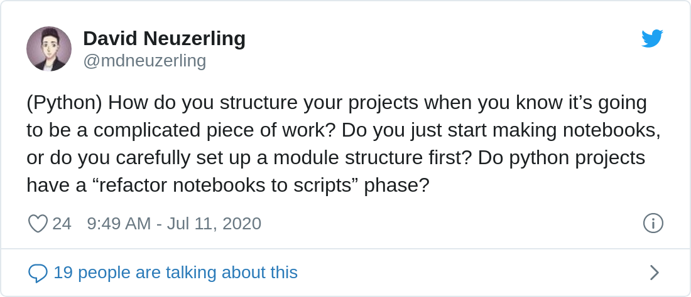

I'm obsessed with how to structure a data science project. The time I spend worrying about project structure would be better spent on actually writing code. Here's my preferred R workflow, and a few notes on Python as well.

The R package workflow
======================

In R, the package is ["the fundamental unit of shareable code"](http://r-pkgs.had.co.nz/intro.html).

At rstudio::conf 2020, Hadley gave a rule of thumb for when to create a package, which I'll paraphrase: "When you copy and paste a block of code three times, make a function. When you do that three times, make a package." My rule of thumb is stricter: if I might come back to this project tomorrow, it should be a package. I'm a big fan of this workflow, and I use it for just about everything.

People have told me that making a package seems like a massive learning curve. That's fair. Packages look strange from the outside, with a whole bunch of bizarre files. Code is lumped together into a single directory, except for the stuff in `inst/`, and it's hard to tell what's going on with `inst/`. Imagine being an R novice, and trying to find the code for your favourite function somewhere in a git repository. This stuff *is* hard, but there are tools out there that make the rewards greater than the costs.

### Packages are just a way to organise code

First thing's first: R packages exist independently of CRAN. The packages I make are specific to a project, and often specific to a single data set. They're never going to be submitted to CRAN. Most don't even make it onto GitHub. R packages can be just a way to organise code, nothing more. By following a certain structure and a few rules we get to benefit from a whole bunch of tools designed just for packages.

Package structure is thoroughly explained in [Hadley's book](http://r-pkgs.had.co.nz/package.html), but here are the simplified requirements:

-   All function code goes in R files in the `R/` directory. The functions in here will be available when the package is loaded.
-   Unit tests go in the `tests/` directory.
-   Package metadata goes in the `DESCRIPTION` file.
-   There's a `NAMESPACE` file and a `man/` directory, but these can be ignored; they're generated automatically from Roxygen strings.
-   There's a LICENSE file for the licence under which the package is released (if it is released).
-   Everything else --- exploratory analysis, stray bits of code, R markdown, or anything that isn't mentioned above --- goes into the `inst/` directory.

### The tricky parts of package development are automated

Most of the intricacies of package development can be outsourced to `devtools` and `usethis`. I never have to think about how to set up the structure of a package: I type [`usethis::create_package("packagename")`](https://usethis.r-lib.org/reference/create_package.html) and it's all set up for me. I never have to think about where to stick my test files: `usethis::create_test("file-name")` does it for me. The LICENSE requirement is a bit annoying, but [`usethis::use_mit_license()`](https://usethis.r-lib.org/reference/licenses.html) can immediately set me up with a permissive licence.[^1]

Maybe the end result of my project is an R Markdown report. Instead of filling the R Markdown file with helper functions, I put all of those functions in files in the `R/` directory. I put my R Markdown file in the `inst/` directory, and in it I load the functions of the package. I don't even need to install the package: I can use [`devtools::load_all()`](https://devtools.r-lib.org//reference/load_all.html) to make all of those functions available to me.

I'll repeat that: **a package workflow can be used without ever installing the package**. For almost all personal packages, [`devtools::load_all()`](https://devtools.r-lib.org//reference/load_all.html) is good enough.

### The benefits of a package workflow outweigh the extra effort

A package structure does require a bit more thought, but what you get in return makes it worthwhile. In exchange for following the structure and the rules, I get:

-   A very clear set of dependencies for my project. I have to declare which packages I'm using in my package (shortcut: [`usethis::use_package()`](https://usethis.r-lib.org/reference/use_package.html)) but in exchange I can see them listed all in one file, rather than being a bunch of `library` calls scattered throughout multiple files. [This is also one of the ways that `renv` can pick up on dependencies](https://rstudio.github.io/renv/index.html), to make reproducibility easier.
-   [Powerful function documentation through `Roxygen2`](https://roxygen2.r-lib.org/). By putting some special comments above my functions, I can generate proper R documentation. It's satisfying to type `?my_custom_function` and see help material. Even if I'm the only one who will use this code, that documentation make my life easier. Hint: use RStudio to generate Roxygen skeletons!
-   A convenient testing framework through `testthat`. Unit tests save time, and this is the hill I will die on. There's a bit of set-up involved, but it's all taken care of the first time a test is created with [`usethis::use_test()`](https://usethis.r-lib.org/reference/use_r.html).
-   An all-in-one package check. [`rcmdcheck::rcmdcheck()`](https://rdrr.io/pkg/rcmdcheck/man/rcmdcheck.html) (also available as a button in RStudio) not only runs my unit tests, but also looks for issues with portability, missing dependency declarations, misplaced characters, and much more. I often run this when I'm developing my functions, and I also set it up to [run automatically every time I push code to GitHub](/post/mlops-with-github-actions-and-r/). This is a big deal --- if I break a unit test or do something else wrong, I want to know about it!

### Package development shortcuts

I took note of every function and shortcut I use when following a package workflow. Every function below links to its documentation:

<table><colgroup><col style="width: 39%" /><col style="width: 35%" /><col style="width: 25%" /></colgroup><thead><tr class="header"><th>Operation</th><th>Function</th><th>Notes</th></tr></thead><tbody><tr class="odd"><td>Create a new package</td><td><a href="https://usethis.r-lib.org/reference/create_package.html"><code>usethis::create_package</code></a></td><td>Also creates an RStudio project if you’re using RStudio</td></tr><tr class="even"><td>Create a new function</td><td><a href="https://usethis.r-lib.org/reference/use_r.html"><code>usethis::use_r</code></a></td><td>If the file exists, will open it</td></tr><tr class="odd"><td>Create a new test file</td><td><a href="https://usethis.r-lib.org/reference/use_r.html"><code>usethis::use_test</code></a></td><td>File names are prefixed with “test-”. Will also set up test infrastructure if it doesn’t already exist.</td></tr><tr class="even"><td>Declare a dependency</td><td><a href="https://usethis.r-lib.org/reference/use_package.html"><code>usethis::use_package</code></a></td><td>Use the <code>type = "Suggests"</code> argument for suggested packages</td></tr><tr class="odd"><td>Source all functions</td><td><a href="https://devtools.r-lib.org/reference/load_all.html"><code>devtools::load_all</code></a></td><td>RStudio default keyboard shortcut: Ctrl/⌘ + Shift + L</td></tr><tr class="even"><td>Build documentation</td><td><a href="https://devtools.r-lib.org/reference/document.html"><code>devtools::document</code></a></td><td>RStudio default keyboard shortcut: Ctrl/⌘ + Shift + D</td></tr><tr class="odd"><td>Set up environment to pin package dependencies</td><td><a href="https://rstudio.github.io/renv/reference/init.html"><code>renv::init</code></a></td><td><a href="https://rstudio.github.io/renv/articles/renv.html">renv</a> is extremely important for any piece of work that needs to be reproducible</td></tr><tr class="even"><td>Capture or update package dependencies</td><td><a href="https://rstudio.github.io/renv/reference/snapshot.html"><code>renv::snapshot</code></a></td><td>This is in addition to the dependencies in the <code>DESCRIPTION</code> file, since it captures <em>all</em> required packages along with their installed versions</td></tr><tr class="odd"><td>Run tests</td><td><a href="https://devtools.r-lib.org/reference/test.html"><code>devtools::test</code></a></td><td>UI option: In RStudio, look for the “Test package” option below the “More” button in the “Build” tab. RStudio default keyboard shortcut: Ctrl/⌘ + Shift + T</td></tr><tr class="even"><td>Run tests in a specific file</td><td><a href="https://devtools.r-lib.org/reference/test.html"><code>devtools::test_file</code></a></td><td>By default, will test the active file, or a file path can be provided. UI option: he test file in RStudio and look for the “Run Tests” button above the editor.</td></tr><tr class="odd"><td>Run a full package check, including tests</td><td><a href="https://rdrr.io/cran/rcmdcheck/man/rcmdcheck.html"><code>rcmdcheck::rcmdcheck</code></a></td><td>UI option: In Rstudio, look for the “Check” button in the “Build” tab</td></tr></tbody></table>

### Package workflows and APIs

R code can be served as an API with [the `plumber` package](https://www.rplumber.io/), and this is compatible with a package workflow. James Blair gave [a great talk on *Practical Plumber Patterns* at rstudio::conf 2020](https://rstudio.com/resources/rstudioconf-2020/practical-plumber-patterns/) where he presented an R package combined with `plumber`. One of the functions in the package actually starts the API. [The source code is available on GitHub](https://github.com/blairj09-talks/ppp/)

The other language
==================

I use Python almost every day, but I hadn't given a lot of thought on how to structure a Python project. I reached out to Twitter to see if there was a standard.

[Thank you to everyone who responded to this!](https://twitter.com/mdneuzerling/status/1281737241610473472) I learnt a lot.

The responses are worth reading. There's a range of answers, but the general theme is about "promoting" code from an informal notebook to a formal module. Some people start with a module structure, which they install into their system, and then use notebooks for exploration. Some people start with notebooks, and eventually transition their work into something with more structure.

### Handy Python workflow tools

There are tools in Python that make projects a bit easier:

-   [Cookiecutter](https://cookiecutter.readthedocs.io) is a tool for creating projects in Python from templates. The package includes a few official templates (including a package template) but there are over 4000 templates supplied by members of the Python community.
-   [Poetry](https://python-poetry.org) is a build tool for Python packages with a heavy emphasis on dependency management.
-   `pip install -e` install an "editable" version of a local module. This means that changes to the local code are *immediately* reflected.
-   [nbdev](https://github.com/fastai/nbdev) makes it easier to develop in notebooks, by allowing easy promotion of code to a module with tags.

I'm particularly keen to check out Cookiecutter. It seems like it fills a purpose in Python similar to that of the `usethis` package in R.

### I struggle with notebooks

Personally, though, I still can't quite grok notebooks. I remember using them way back in the day when I was using [SageMath](https://www.sagemath.org/), but now they just don't click with me. The idea that I have to switch a cell to markdown still throws me off, and I find myself reaching for a repl that doesn't exist. Mentally I tell myself, "I'll create a cell which I'll use just for quick calculations", and my experience is that this is a recipe for a notebook filled with junk code.

I still use notebooks when I'm working in Python --- Python users tend to be wedded to them, and I don't want to be the one going against the grain instead of collaborating. In the past I've used Spyder or VSCode for Python development. Lately I've even be experimenting with RStudio as a Python IDE, and it does pretty well.

------------------------------------------------------------------------

<pre class='chroma'><code class='language-r' data-lang='r'>devtools::<a href='https://rdrr.io/pkg/sessioninfo/man/session_info.html'>session_info</a>()
#&gt; ─ Session info ───────────────────────────────────────────────────────────────
#&gt;  setting  value                       
#&gt;  version  R version 4.0.0 (2020-04-24)
#&gt;  os       Ubuntu 20.04 LTS            
#&gt;  system   x86_64, linux-gnu           
#&gt;  ui       X11                         
#&gt;  language en_AU:en                    
#&gt;  collate  en_AU.UTF-8                 
#&gt;  ctype    en_AU.UTF-8                 
#&gt;  tz       Australia/Melbourne         
#&gt;  date     2020-07-19                  
#&gt; 
#&gt; ─ Packages ───────────────────────────────────────────────────────────────────
#&gt;  package     * version    date       lib source                             
#&gt;  assertthat    0.2.1      2019-03-21 [1] CRAN (R 4.0.0)                     
#&gt;  backports     1.1.8      2020-06-17 [1] CRAN (R 4.0.0)                     
#&gt;  callr         3.4.3      2020-03-28 [1] CRAN (R 4.0.0)                     
#&gt;  chromote      0.0.0.9002 2020-07-13 [1] Github (rstudio/chromote@b706e21)  
#&gt;  cli           2.0.2      2020-02-28 [1] CRAN (R 4.0.0)                     
#&gt;  crayon        1.3.4      2017-09-16 [1] CRAN (R 4.0.0)                     
#&gt;  curl          4.3        2019-12-02 [1] CRAN (R 4.0.0)                     
#&gt;  desc          1.2.0      2018-05-01 [1] CRAN (R 4.0.0)                     
#&gt;  devtools      2.3.0      2020-04-10 [1] CRAN (R 4.0.0)                     
#&gt;  digest        0.6.25     2020-02-23 [1] CRAN (R 4.0.0)                     
#&gt;  ellipsis      0.3.1      2020-05-15 [1] CRAN (R 4.0.0)                     
#&gt;  evaluate      0.14       2019-05-28 [1] CRAN (R 4.0.0)                     
#&gt;  fansi         0.4.1      2020-01-08 [1] CRAN (R 4.0.0)                     
#&gt;  fastmap       1.0.1      2019-10-08 [1] CRAN (R 4.0.0)                     
#&gt;  fs            1.4.1      2020-04-04 [1] CRAN (R 4.0.0)                     
#&gt;  glue          1.4.1      2020-05-13 [1] CRAN (R 4.0.0)                     
#&gt;  htmltools     0.5.0      2020-06-16 [1] CRAN (R 4.0.0)                     
#&gt;  httr          1.4.1      2019-08-05 [1] CRAN (R 4.0.0)                     
#&gt;  hugodown      0.0.0.9000 2020-06-20 [1] Github (r-lib/hugodown@f7df565)    
#&gt;  jsonlite      1.7.0      2020-06-25 [1] CRAN (R 4.0.0)                     
#&gt;  knitr         1.29       2020-06-23 [1] CRAN (R 4.0.0)                     
#&gt;  later         1.1.0.1    2020-06-05 [1] CRAN (R 4.0.0)                     
#&gt;  magrittr      1.5        2014-11-22 [1] CRAN (R 4.0.0)                     
#&gt;  memoise       1.1.0.9000 2020-05-09 [1] Github (hadley/memoise@4aefd9f)    
#&gt;  pkgbuild      1.0.8      2020-05-07 [1] CRAN (R 4.0.0)                     
#&gt;  pkgload       1.1.0      2020-05-29 [1] CRAN (R 4.0.0)                     
#&gt;  prettyunits   1.1.1      2020-01-24 [1] CRAN (R 4.0.0)                     
#&gt;  processx      3.4.3      2020-07-05 [1] CRAN (R 4.0.0)                     
#&gt;  promises      1.1.1      2020-06-09 [1] CRAN (R 4.0.0)                     
#&gt;  ps            1.3.3      2020-05-08 [1] CRAN (R 4.0.0)                     
#&gt;  R6            2.4.1      2019-11-12 [1] CRAN (R 4.0.0)                     
#&gt;  Rcpp          1.0.5      2020-07-06 [1] CRAN (R 4.0.0)                     
#&gt;  remotes       2.1.1      2020-02-15 [1] CRAN (R 4.0.0)                     
#&gt;  rlang         0.4.7      2020-07-09 [1] CRAN (R 4.0.0)                     
#&gt;  rmarkdown     2.3.2      2020-07-12 [1] Github (rstudio/rmarkdown@ff1b279) 
#&gt;  rprojroot     1.3-2      2018-01-03 [1] CRAN (R 4.0.0)                     
#&gt;  sessioninfo   1.1.1      2018-11-05 [1] CRAN (R 4.0.0)                     
#&gt;  stringi       1.4.6      2020-02-17 [1] CRAN (R 4.0.0)                     
#&gt;  stringr       1.4.0      2019-02-10 [1] CRAN (R 4.0.0)                     
#&gt;  testthat      2.3.2      2020-03-02 [1] CRAN (R 4.0.0)                     
#&gt;  tweetrmd      0.0.8      2020-07-12 [1] Github (gadenbuie/tweetrmd@50bcdf8)
#&gt;  usethis       1.6.1      2020-04-29 [1] CRAN (R 4.0.0)                     
#&gt;  webshot2      0.0.0.9000 2020-07-13 [1] Github (rstudio/webshot2@f62e743)  
#&gt;  websocket     1.3.0      2020-07-05 [1] CRAN (R 4.0.0)                     
#&gt;  withr         2.2.0      2020-04-20 [1] CRAN (R 4.0.0)                     
#&gt;  xfun          0.15       2020-06-21 [1] CRAN (R 4.0.0)                     
#&gt;  yaml          2.2.1      2020-02-01 [1] CRAN (R 4.0.0)                     
#&gt; 
#&gt; [1] /home/mdneuzerling/R/x86_64-pc-linux-gnu-library/4.0
#&gt; [2] /usr/local/lib/R/site-library
#&gt; [3] /usr/lib/R/site-library
#&gt; [4] /usr/lib/R/library</code></pre>

[The image at the top of this page is in the public domain](https://www.pexels.com/photo/silver-metal-round-gears-connected-to-each-other-149387/).

[^1]: For closed-source packages, create a file that says "Proprietary. Property of <X>." Then put "License: file LICENSE" in the package `DESCRIPTION`.

