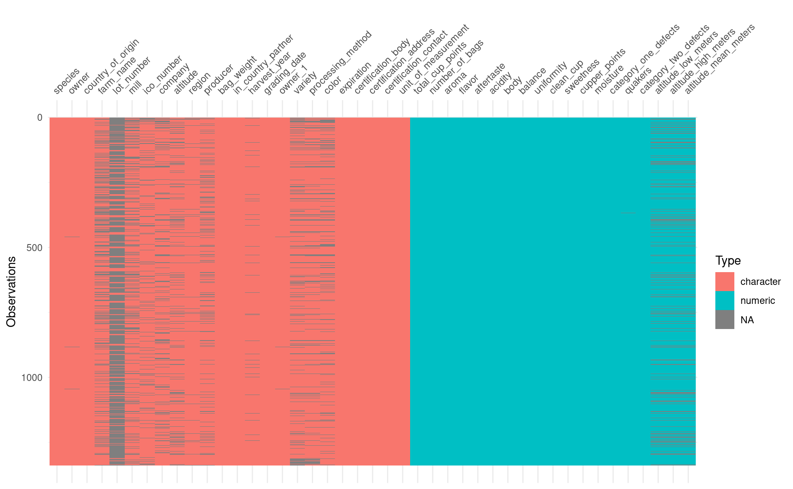
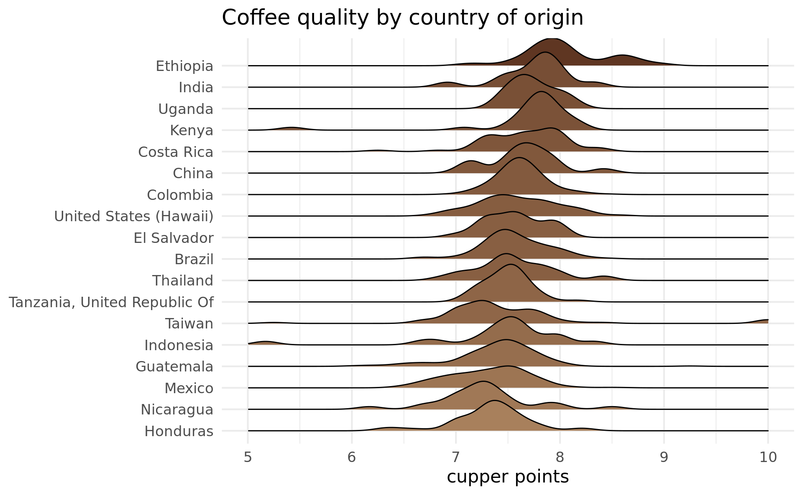
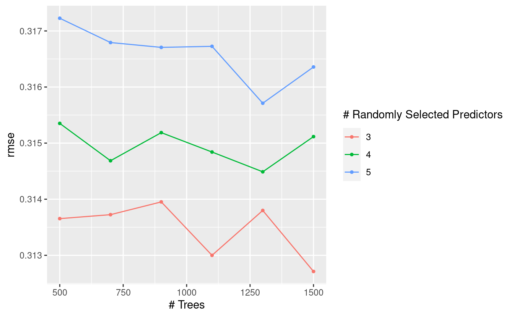

There's always a need for more `tidymodels` examples on the Internet. Here's a simple machine learning model using [the recent *coffee* Tidy Tuesday data set](https://github.com/rfordatascience/tidytuesday/blob/master/data/2020/2020-07-07/readme.md). The plot above gives the approach: I'll define some preprocessing and a model, optimise some hyperparameters, and fit and evaluate the result. And I'll piece all of the components together using `targets`, an experimental alternative to the `drake` package that I love so much.

As usual, I don't care too much about the model itself. I'm more interested in the process.

Exploratory data analysis
=========================

I'll start with some token data visualisation. I almost always start exploring new data with the `visdat` package. It lets me see at a glance the data types, as well as any missing data:

<pre class='chroma'><code class='language-r' data-lang='r'>visdat::<a href='http://visdat.njtierney.com//reference/vis_dat.html'>vis_dat</a>(coffee)
</code></pre>

I doubt very much I'll want to use all of these columns, especially since I only have 1339 rows of data. But some of the columns I do like the look of have missing values, and those will need to be dealt with.

I'll be looking at `cupper_points` as a measure of coffee quality, although I've seen some analyses on this data use `total_cup_points`. The `cupper_points` score ranges from 0 to 10, presumably with 10 being the best. I was curious which countries produce the best coffee, I made a ggplot that makes use of the `ggridges` package to produce density plots:

<pre class='chroma'><code class='language-r' data-lang='r'>coffee %&gt;% 
  <a href='https://rdrr.io/r/stats/filter.html'>filter</a>(!<a href='https://rdrr.io/r/base/NA.html'>is.na</a>(country_of_origin)) %&gt;%
  inner_join(
    coffee %&gt;%
      group_by(country_of_origin) %&gt;% 
      summarise(n = n(), average_cupper_points = <a href='https://rdrr.io/r/base/mean.html'>mean</a>(cupper_points)) %&gt;%
      <a href='https://rdrr.io/r/stats/filter.html'>filter</a>(n / <a href='https://rdrr.io/r/base/sum.html'>sum</a>(n) &gt; 0.01),
    by = "country_of_origin"
  ) %&gt;% 
  ggplot(aes(
    x = cupper_points,
    y = fct_reorder(country_of_origin, average_cupper_points),
    fill = average_cupper_points
  )) + 
  ggridges::<a href='https://rdrr.io/pkg/ggridges/man/geom_density_ridges.html'>geom_density_ridges</a>() +
  <a href='https://rdrr.io/r/graphics/plot.window.html'>xlim</a>(5, 10) +
  scale_fill_gradient(low = "#A8805C", high = "#5F3622") +
  ggtitle("Coffee quality by country of origin") +
  xlab("cupper points") +
  ylab(NULL) +
  theme_minimal(base_size = 16, base_family = "Montserrat") +
  theme(legend.position = "none")
</code></pre>

Modelling
=========

It's time to make a model! First I'll generate an 80/20 train/test split:

<pre class='chroma'><code class='language-r' data-lang='r'><a href='https://rdrr.io/r/base/Random.html'>set.seed</a>(123)
coffee_split &lt;- initial_split(coffee, prop = 0.8)
coffee_train &lt;- training(coffee_split)
coffee_test &lt;- testing(coffee_split)</code></pre>

The split between test and train is sacred. I start a model by splitting out the test data, and then I forget that it exists until it's time to evaluate my model. If I introduce any information from `coffee_test` into `coffee_train` then I can't trust my model metrics, since I would have no way of knowing if my model is overfitting. This is called *data leakage*.

It is very easy to accidentally leak data from test to train. Suppose I have some missing values that I want to impute with the mean. If I impute using the mean of the entire data set, then that's data leakage. Suppose I scale and centre my numeric variables. I use the mean and variance of the entire data set, then that's data leakage.

The usual methods of manipulating data often aren't suitable for preprocessing modelling data. It's easy enough to centre and scale a variable with `mutate()`, but data manipulation for machine learning requires tools that respect the split between test and train. That's what `recipes` are for.

Preprocessing with recipes
--------------------------

In `tidymodels`, [preprocessing is done with recipes](/post/user-recipes-for-data-processing/). There's a particular language for preprocessing with `recipes`, and it follows a common (and cute) theme. A `recipe` abstractly defines how to manipulate the data. It is then `prep`ared on a training set, and can be used to `bake` new data.

Recipes require an understanding of which variables are predictors and which are outcomes (it would make no sense to preprocess the outcome of the test set). Traditionally in R this is done with a formula, like `cupper_points ~ flavour + aroma`, or `cupper_points ~ .` if everything as a predictor. Instead, I'm going to use the "role" approach that `recipes` takes to declare some variables as predictors and `cupper_points` as an outcome. The rest will be "support" variables, some of which will be used in imputation. I like this approach, since it means that I don't need to maintain a list of variables to be fed to the `fit` function. Instead, the `fit` function will only use the variables with the "predictor" role.

The recipe I'll use defines the steps below. Just a heads up: I'm not claiming that this is *good* preprocessing. I haven't even seen what the impact of this preprocessing is on the resulting model. I'm just using this as an example of some preprocessing steps.

1.  Sets the roles of every variable in the data. A variable can have more than one role, but here we'll call everything either "outcome", "predictor", or "support". `tidymodels` treats "outcome" and "predictor" variables specially, but otherwise any string can be a role.
2.  Convert all strings to factors. You read that right.
3.  Impute `country_of_origin`, and then `altitude_mean_meters` using k-nearest-neighbours with a handful of other variables.
4.  Convert all missing varieties to an "unknown" value.
5.  Collapse `country_of_origin`, `processing_method` and `variety` levels so that infrequently occurring values are collapsed to "other".
6.  Centre and scale all numeric variables.

[Many thanks to Julia Silge for helping me define this recipe](https://stackoverflow.com/questions/63008228/tidymodels-tune-grid-cant-subset-columns-that-dont-exist-when-not-using-for)!

<pre class='chroma'><code class='language-r' data-lang='r'>coffee_recipe &lt;- recipe(coffee_train) %&gt;%
  update_role(<a href='https://tidyselect.r-lib.org/reference/everything.html'>everything</a>(), new_role = "support") %&gt;% 
  update_role(cupper_points, new_role = "outcome") %&gt;%
  update_role(
    variety, processing_method, country_of_origin,
    aroma, flavor, aftertaste, acidity, sweetness, altitude_mean_meters,
    new_role = "predictor"
  ) %&gt;%
  step_string2factor(all_nominal(), -all_outcomes()) %&gt;%
  step_knnimpute(country_of_origin,
                 impute_with = imp_vars(
                 in_country_partner, company, region, farm_name, certification_body
                 )
  ) %&gt;%
  step_knnimpute(altitude_mean_meters,
                 impute_with = imp_vars(
                 in_country_partner, company, region, farm_name, certification_body,
                 country_of_origin
                 )
  ) %&gt;%
  step_unknown(variety, processing_method, new_level = "unknown") %&gt;%
  step_other(country_of_origin, threshold = 0.01) %&gt;%
  step_other(processing_method, variety, threshold = 0.10) %&gt;% 
  step_normalize(all_numeric(), -all_outcomes())
coffee_recipe
#&gt; Data Recipe
#&gt; 
#&gt; Inputs:
#&gt; 
#&gt;       role #variables
#&gt;    outcome          1
#&gt;  predictor          9
#&gt;    support         33
#&gt; 
#&gt; Operations:
#&gt; 
#&gt; Factor variables from all_nominal(), -all_outcomes()
#&gt; K-nearest neighbor imputation for country_of_origin
#&gt; K-nearest neighbor imputation for altitude_mean_meters
#&gt; Unknown factor level assignment for variety, processing_method
#&gt; Collapsing factor levels for country_of_origin
#&gt; Collapsing factor levels for processing_method, variety
#&gt; Centering and scaling for all_numeric(), -all_outcomes()</code></pre>

I won't actually need to `prep` or `bake` anything here, since that's all handled for me behind the scenes in the `workflow` step below. But just to demonstrate, I'll briefly remember that the test data exists and bake it with this recipe. The baked test data below contains no missing `processing_method` values. It does, however, contain "unknown" and "Other".

<pre class='chroma'><code class='language-r' data-lang='r'>coffee_recipe %&gt;% 
  prep(coffee_train) %&gt;%
  bake(coffee_test) %&gt;%
  count(processing_method)
#&gt; # A tibble: 4 x 2
#&gt;   processing_method     n
#&gt;   &lt;fct&gt;             &lt;int&gt;
#&gt; 1 Natural / Dry        57
#&gt; 2 Washed / Wet        168
#&gt; 3 unknown              28
#&gt; 4 other                14</code></pre>

Model specification
-------------------

An issue with R's distributed package ecosystem is that the same variable can have multiple names across different packages. For example, `ranger` and `randomForest` are packages used to train random forests, but where `ranger` uses `num.trees` to define the number of trees in the forest, `randomForest` uses `ntree`. Under `tidymodels`, these names are standardised to `trees`. Moreover, the same standard name is used for other models where "number of trees" is a valid concept, such as boosted trees.

Note that I'm setting the hyperparameters with `tune()`, which means that I expect to fill these values in later. Think of `tune()` as a placeholder. Apart from `trees`, the other hyperparameter I'm looking at is `mtry`. When splitting a branch in a random forest, the algorithm doesn't have access to all of the variables. It's only provided with a certain number of randomly chosen variables, and it must select the best one to use to split the data. This number of random variables is `mtry`.

The "engine" here determines what will be used to fit the model. `tidymodels` wraps machine learning package, and it has no capacity to train a model by itself. I'm using the `ranger` package as the engine here, but I could also use the `randomForest` package.

<pre class='chroma'><code class='language-r' data-lang='r'>coffee_model &lt;- rand_forest(
    trees = tune(),
    mtry = tune()
  ) %&gt;%
  set_engine("ranger") %&gt;% 
  set_mode("regression")
coffee_model
#&gt; Random Forest Model Specification (regression)
#&gt; 
#&gt; Main Arguments:
#&gt;   mtry = tune()
#&gt;   trees = tune()
#&gt; 
#&gt; Computational engine: ranger</code></pre>

I haven't provided any data to the model specification. Just as in Python's `sklearn`, in `tidymodels` models are defined in a separate step to fitting. The above is just a *specification* for a model.

Workflows
---------

A `workflow` combines a preprocessing recipe and a model specification. By creating a workflow, all of the preprocessing will be handled for me when fitting the model and when generating new predictions.

<pre class='chroma'><code class='language-r' data-lang='r'>coffee_workflow &lt;- workflow() %&gt;% 
  add_recipe(coffee_recipe) %&gt;% 
  add_model(coffee_model)
coffee_workflow
#&gt; ══ Workflow ═════════════════════════════════════════════════════════════════════════════════════════════════
#&gt; Preprocessor: Recipe
#&gt; Model: rand_forest()
#&gt; 
#&gt; ── Preprocessor ─────────────────────────────────────────────────────────────────────────────────────────────
#&gt; 7 Recipe Steps
#&gt; 
#&gt; ● step_string2factor()
#&gt; ● step_knnimpute()
#&gt; ● step_knnimpute()
#&gt; ● step_unknown()
#&gt; ● step_other()
#&gt; ● step_other()
#&gt; ● step_normalize()
#&gt; 
#&gt; ── Model ────────────────────────────────────────────────────────────────────────────────────────────────────
#&gt; Random Forest Model Specification (regression)
#&gt; 
#&gt; Main Arguments:
#&gt;   mtry = tune()
#&gt;   trees = tune()
#&gt; 
#&gt; Computational engine: ranger</code></pre>

Hyperparameter tuning
---------------------

Earlier I set some hyperparameters with `tune()`, so I'll need to explore which values I can assign to them. I'll create a grid of values to explore. Most of these hyperparameters have sensible defaults, but I'll define my own to be explicit about what I'm doing.

<pre class='chroma'><code class='language-r' data-lang='r'>coffee_grid &lt;- expand_grid(mtry = 3:5, trees = <a href='https://rdrr.io/r/base/seq.html'>seq</a>(500, 1500, by = 200))</code></pre>

I'll use cross-validation on `coffee_train` to evaluate the performance of each combination of hyperparameters.

<pre class='chroma'><code class='language-r' data-lang='r'><a href='https://rdrr.io/r/base/Random.html'>set.seed</a>(123)
coffee_folds &lt;- vfold_cv(coffee_train, v = 5)
coffee_folds
#&gt; #  5-fold cross-validation 
#&gt; # A tibble: 5 x 2
#&gt;   splits            id   
#&gt;   &lt;list&gt;            &lt;chr&gt;
#&gt; 1 &lt;split [857/215]&gt; Fold1
#&gt; 2 &lt;split [857/215]&gt; Fold2
#&gt; 3 &lt;split [858/214]&gt; Fold3
#&gt; 4 &lt;split [858/214]&gt; Fold4
#&gt; 5 &lt;split [858/214]&gt; Fold5</code></pre>

Here's where I search through the hyperparameter space. With 5 folds and 18 combinations of hyperparameters to explore, R has to train and evaluate 90 models. In general, this sort of tuning takes a while. I could speed this up with parallel processing, but I'm not sure it's worth the hassle for such a small data set.

<pre class='chroma'><code class='language-r' data-lang='r'>coffee_grid_results &lt;- coffee_workflow %&gt;% 
  tune_grid(
    resamples = coffee_folds,
    grid = coffee_grid
  )</code></pre>

Now it's time to see how the models performed! I'll look at root mean squared error to evaluate this model:

<pre class='chroma'><code class='language-r' data-lang='r'>collect_metrics(coffee_grid_results) %&gt;%
    <a href='https://rdrr.io/r/stats/filter.html'>filter</a>(.metric == "rmse") %&gt;% 
    arrange(mean) %&gt;%
    <a href='https://rdrr.io/r/utils/head.html'>head</a>() %&gt;% 
    knitr::<a href='https://rdrr.io/pkg/knitr/man/kable.html'>kable</a>()
</code></pre>

|  mtry|  trees| .metric | .estimator |       mean|    n|   std\_err| .config |
|-----:|------:|:--------|:-----------|----------:|----:|----------:|:--------|
|     3|   1500| rmse    | standard   |  0.3127119|    5|  0.0565917| Model06 |
|     3|   1100| rmse    | standard   |  0.3129998|    5|  0.0563920| Model04 |
|     3|    500| rmse    | standard   |  0.3136543|    5|  0.0565772| Model01 |
|     3|    700| rmse    | standard   |  0.3137247|    5|  0.0565831| Model02 |
|     3|   1300| rmse    | standard   |  0.3137998|    5|  0.0564674| Model05 |
|     3|    900| rmse    | standard   |  0.3139521|    5|  0.0565038| Model03 |

`tidymodels` also comes with some nice auto-plotting functionality for model metrics:

<pre class='chroma'><code class='language-r' data-lang='r'>autoplot(coffee_grid_results, metric = "rmse")
</code></pre>

The goal is to minimise RMSE. I can take a look at the hyperparameter combinations that optimise this value:

<pre class='chroma'><code class='language-r' data-lang='r'>show_best(coffee_grid_results, metric = "rmse") %&gt;% knitr::<a href='https://rdrr.io/pkg/knitr/man/kable.html'>kable</a>()
</code></pre>

|  mtry|  trees| .metric | .estimator |       mean|    n|   std\_err| .config |
|-----:|------:|:--------|:-----------|----------:|----:|----------:|:--------|
|     3|   1500| rmse    | standard   |  0.3127119|    5|  0.0565917| Model06 |
|     3|   1100| rmse    | standard   |  0.3129998|    5|  0.0563920| Model04 |
|     3|    500| rmse    | standard   |  0.3136543|    5|  0.0565772| Model01 |
|     3|    700| rmse    | standard   |  0.3137247|    5|  0.0565831| Model02 |
|     3|   1300| rmse    | standard   |  0.3137998|    5|  0.0564674| Model05 |

The issue I have here is that 1500 trees is a lot[^1]. When I look at the plot above I can see that 500 trees does pretty well. It may not be the best, but it's one third as complex.

I think it's worth cutting back on accuracy a tiny bit if it means simplifying the model a lot. `tidymodels` contains a function that does just this. I'll ask for the combination of hyperparameters that minimises the number of trees in the random forest, while not being more than 5% away from the best combination overall:

<pre class='chroma'><code class='language-r' data-lang='r'>select_by_pct_loss(coffee_grid_results, metric = "rmse", limit = 5, trees) %&gt;%
  knitr::<a href='https://rdrr.io/pkg/knitr/man/kable.html'>kable</a>()
</code></pre>

|  mtry|  trees| .metric | .estimator |       mean|    n|   std\_err| .config |      .best|     .loss|
|-----:|------:|:--------|:-----------|----------:|----:|----------:|:--------|----------:|---------:|
|     5|    500| rmse    | standard   |  0.3172264|    5|  0.0549082| Model13 |  0.3127119|  1.443642|

Model fitting
-------------

I can't fit a model with undefined hyperparameters. I'll use the above combination to "finalise" the model. Every hyperparameter that I set to "tune" will be set to the result of `select_by_pct_loss`.

That's everything I need to fit a model. I have a preprocessing recipe, a model specification, and a nice set of hyperparameters. All that's left to call is `fit`:

<pre class='chroma'><code class='language-r' data-lang='r'>fitted_coffee_model &lt;- coffee_workflow %&gt;% 
  finalize_workflow(
    select_by_pct_loss(coffee_grid_results, metric = "rmse", limit = 5, trees)
  ) %&gt;% 
  fit(coffee_train)</code></pre>

Model evaluation
----------------

Now that I have a model I can remember that my test set exists. I'll look at a handful of metrics to see how the model performs. `metrics_set(rmse, mae, rsq)` is a function that returns a function that compares the true and predicted values. It returns the root mean squared error, mean absolute error, and R squared value.

I'm using some possibly non-idiomatic R code below. `metric_set(rmse, mae, rsq)` returns a function, so I can immediately call it as a function. This leads to two sets of parameters in brackets right next to each other. There's nothing *wrong* with this, but I don't know if it's good practice:

<pre class='chroma'><code class='language-r' data-lang='r'>fitted_coffee_model %&gt;%
  <a href='https://rdrr.io/r/stats/predict.html'>predict</a>(coffee_test) %&gt;%
  metric_set(rmse, mae, rsq)(coffee_test$cupper_points, .pred)
#&gt; # A tibble: 3 x 3
#&gt;   .metric .estimator .estimate
#&gt;   &lt;chr&gt;   &lt;chr&gt;          &lt;dbl&gt;
#&gt; 1 rmse    standard       0.293
#&gt; 2 mae     standard       0.174
#&gt; 3 rsq     standard       0.506</code></pre>

Targets
=======

There are a lot of steps involved in fitting and evaluating this model, so it would help to have a way to orchestrate the whole process. [Normally I would use the `drake` package for this](/post/upgrade-your-workflow-with-drake/) but Will Landau, its creator and maintainer, has been working on [an alternative called targets](https://github.com/wlandau/targets). This is an **experimental** package right now, but I thought I'd give it a go for this.

`targets` will look very familiar to users of `drake`. [Will has laid out some reasons for creating a separate package](https://wlandau.github.io/targets/articles/need.html). `drake` uses *plans*, which are R objects. `targets` takes a similar approach with its *pipelines*. However, `targets` requires that the pipeline be defined in a specific `_targets.R` file. This file can can also set up required functions and objects for the pipeline, and load necessary packages. The requirement is that it ends with a `targets` pipeline.

I've put all of the steps required to fit and evaluate this model into a `targets` pipeline. The recipe is lengthy, and likely to change often as I refine my preprocessing approach. It's best to create a function `define_coffee_recipe` and place it in a file somewhere in my project (probably the `R/` directory). I can then source it it within `_targets.R`. This way, I can change the preprocessing approach without changing the model pipeline. In a complicated project, it would be best to do this for most of the targets, especially the model definition and metrics.

A pipeline consists of a set of `tar_target`s. The first argument of each is a name for the target, and the second is the command that generates the target's output. Just as with `drake`, a pipieline should consist of pure functions: no side-effects, with each target defined only by its inputs and its output. This way, `targets` can automatically detect the dependencies of each target. A convenient consequence of this is that the order in which the targets are provided is irrelevant, as the package is able to work it out from the dependencies alone.

My `_targets.R` file with the pipeline is below. Note that the data retrieval step ("coffee") uses a "never" cue. Like `drake`, the `targets` package automatically works out when a step has been invalidated and needs to be rerun. The "never" cue tells `targets` to never run the "coffee" step unless the result isn't cached. I can do this because I'm confident that the TidyTuesday data will never change.

<pre class='chroma'><code class='language-r' data-lang='r'><a href='https://rdrr.io/r/base/library.html'>library</a>(<a href='https://wlandau.github.io/targets'>targets</a>)
<a href='https://rdrr.io/r/base/source.html'>source</a>("R/define_coffee_recipe.R")

<a href='https://rdrr.io/pkg/targets/man/tar_options.html'>tar_options</a>(packages = <a href='https://rdrr.io/r/base/c.html'>c</a>("tidyverse", "tidymodels"))

<a href='https://rdrr.io/pkg/targets/man/tar_pipeline.html'>tar_pipeline</a>(
  <a href='https://rdrr.io/pkg/targets/man/tar_target.html'>tar_target</a>(
    coffee,
    tidytuesdayR::<a href='https://rdrr.io/pkg/tidytuesdayR/man/tt_load.html'>tt_load</a>(2020, week = 28)$coffee,
    cue = <a href='https://rdrr.io/pkg/targets/man/tar_cue.html'>tar_cue</a>("never")
  ),
  <a href='https://rdrr.io/pkg/targets/man/tar_target.html'>tar_target</a>(coffee_split, initial_split(coffee, prop = 0.8)),
  <a href='https://rdrr.io/pkg/targets/man/tar_target.html'>tar_target</a>(coffee_train, training(coffee_split)),
  <a href='https://rdrr.io/pkg/targets/man/tar_target.html'>tar_target</a>(coffee_test, testing(coffee_split)),
  <a href='https://rdrr.io/pkg/targets/man/tar_target.html'>tar_target</a>(coffee_recipe, define_coffee_recipe(coffee_train)),
  <a href='https://rdrr.io/pkg/targets/man/tar_target.html'>tar_target</a>(
    coffee_model,
    rand_forest(
      trees = tune(),
      mtry = tune()
    ) %&gt;% set_engine("ranger") %&gt;% set_mode("regression")
  ),
  <a href='https://rdrr.io/pkg/targets/man/tar_target.html'>tar_target</a>(
    coffee_workflow,
    workflow() %&gt;% add_recipe(coffee_recipe) %&gt;% add_model(coffee_model)
  ),
  <a href='https://rdrr.io/pkg/targets/man/tar_target.html'>tar_target</a>(
    coffee_grid,
    expand_grid(mtry = 3:5, trees = <a href='https://rdrr.io/r/base/seq.html'>seq</a>(500, 1500, by = 200))
  ),
  <a href='https://rdrr.io/pkg/targets/man/tar_target.html'>tar_target</a>(
    coffee_grid_results,
    coffee_workflow %&gt;%
        tune_grid(resamples = vfold_cv(coffee_train, v = 5), grid = coffee_grid)
  ),
  <a href='https://rdrr.io/pkg/targets/man/tar_target.html'>tar_target</a>(
    hyperparameters,
    select_by_pct_loss(coffee_grid_results, metric = "rmse", limit = 5, trees)
  ),
  <a href='https://rdrr.io/pkg/targets/man/tar_target.html'>tar_target</a>(
    fitted_coffee_model,
    coffee_workflow %&gt;% finalize_workflow(hyperparameters) %&gt;% fit(coffee_train)
  ),
  <a href='https://rdrr.io/pkg/targets/man/tar_target.html'>tar_target</a>(
    metrics,
    fitted_coffee_model %&gt;%
      <a href='https://rdrr.io/r/stats/predict.html'>predict</a>(coffee_test) %&gt;%
      metric_set(rmse, mae, rsq)(coffee_test$cupper_points, .pred)
  )
)</code></pre>

As long as this `_targets.R` file exists in the working directory the `targets` package will be able to pick it up and use it. The graph at the top of this page was generated with [`tar_visnetwork()`](https://rdrr.io/pkg/targets/man/tar_visnetwork.html) (no argument necessary). The pipeline can be run with [`tar_make()`](https://rdrr.io/pkg/targets/man/tar_make.html).

What I love about this orchestration is that I can see where the dependencies are used. I can be sure that the test data isn't used for preprocessing, or hyperparameter tuning. And it's just such a pretty plot!

------------------------------------------------------------------------

<pre class='chroma'><code class='language-r' data-lang='r'>devtools::<a href='https://rdrr.io/pkg/sessioninfo/man/session_info.html'>session_info</a>()
#&gt; ─ Session info ───────────────────────────────────────────────────────────────
#&gt;  setting  value                       
#&gt;  version  R version 4.0.0 (2020-04-24)
#&gt;  os       Ubuntu 20.04 LTS            
#&gt;  system   x86_64, linux-gnu           
#&gt;  ui       X11                         
#&gt;  language en_AU:en                    
#&gt;  collate  en_AU.UTF-8                 
#&gt;  ctype    en_AU.UTF-8                 
#&gt;  tz       Australia/Melbourne         
#&gt;  date     2020-07-27                  
#&gt; 
#&gt; ─ Packages ───────────────────────────────────────────────────────────────────
#&gt;  package     * version    date       lib source                            
#&gt;  assertthat    0.2.1      2019-03-21 [1] CRAN (R 4.0.0)                    
#&gt;  backports     1.1.8      2020-06-17 [1] CRAN (R 4.0.0)                    
#&gt;  blob          1.2.1      2020-01-20 [1] CRAN (R 4.0.0)                    
#&gt;  broom       * 0.7.0      2020-07-09 [1] CRAN (R 4.0.0)                    
#&gt;  callr         3.4.3      2020-03-28 [1] CRAN (R 4.0.0)                    
#&gt;  cellranger    1.1.0      2016-07-27 [1] CRAN (R 4.0.0)                    
#&gt;  class         7.3-17     2020-04-26 [4] CRAN (R 4.0.0)                    
#&gt;  cli           2.0.2      2020-02-28 [1] CRAN (R 4.0.0)                    
#&gt;  codetools     0.2-16     2018-12-24 [4] CRAN (R 4.0.0)                    
#&gt;  colorspace    1.4-1      2019-03-18 [1] CRAN (R 4.0.0)                    
#&gt;  crayon        1.3.4      2017-09-16 [1] CRAN (R 4.0.0)                    
#&gt;  data.table    1.13.0     2020-07-24 [1] CRAN (R 4.0.0)                    
#&gt;  DBI           1.1.0      2019-12-15 [1] CRAN (R 4.0.0)                    
#&gt;  dbplyr        1.4.4      2020-05-27 [1] CRAN (R 4.0.0)                    
#&gt;  desc          1.2.0      2018-05-01 [1] CRAN (R 4.0.0)                    
#&gt;  devtools      2.3.0      2020-04-10 [1] CRAN (R 4.0.0)                    
#&gt;  dials       * 0.0.8      2020-07-08 [1] CRAN (R 4.0.0)                    
#&gt;  DiceDesign    1.8-1      2019-07-31 [1] CRAN (R 4.0.0)                    
#&gt;  digest        0.6.25     2020-02-23 [1] CRAN (R 4.0.0)                    
#&gt;  downlit       0.0.0.9000 2020-07-25 [1] Github (r-lib/downlit@ed969d0)    
#&gt;  dplyr       * 1.0.0      2020-05-29 [1] CRAN (R 4.0.0)                    
#&gt;  ellipsis      0.3.1      2020-05-15 [1] CRAN (R 4.0.0)                    
#&gt;  evaluate      0.14       2019-05-28 [1] CRAN (R 4.0.0)                    
#&gt;  fansi         0.4.1      2020-01-08 [1] CRAN (R 4.0.0)                    
#&gt;  farver        2.0.3      2020-01-16 [1] CRAN (R 4.0.0)                    
#&gt;  forcats     * 0.5.0      2020-03-01 [1] CRAN (R 4.0.0)                    
#&gt;  foreach       1.5.0      2020-03-30 [1] CRAN (R 4.0.0)                    
#&gt;  fs            1.4.2      2020-06-30 [1] CRAN (R 4.0.0)                    
#&gt;  furrr         0.1.0      2018-05-16 [1] CRAN (R 4.0.0)                    
#&gt;  future        1.17.0     2020-04-18 [1] CRAN (R 4.0.0)                    
#&gt;  generics      0.0.2      2018-11-29 [1] CRAN (R 4.0.0)                    
#&gt;  ggplot2     * 3.3.2.9000 2020-07-10 [1] Github (tidyverse/ggplot2@a11e098)
#&gt;  ggridges      0.5.2      2020-01-12 [1] CRAN (R 4.0.0)                    
#&gt;  globals       0.12.5     2019-12-07 [1] CRAN (R 4.0.0)                    
#&gt;  glue          1.4.1      2020-05-13 [1] CRAN (R 4.0.0)                    
#&gt;  gower         0.2.2      2020-06-23 [1] CRAN (R 4.0.0)                    
#&gt;  GPfit         1.0-8      2019-02-08 [1] CRAN (R 4.0.0)                    
#&gt;  gtable        0.3.0      2019-03-25 [1] CRAN (R 4.0.0)                    
#&gt;  hardhat       0.1.4      2020-07-02 [1] CRAN (R 4.0.0)                    
#&gt;  haven         2.2.0      2019-11-08 [1] CRAN (R 4.0.0)                    
#&gt;  highr         0.8        2019-03-20 [1] CRAN (R 4.0.0)                    
#&gt;  hms           0.5.3      2020-01-08 [1] CRAN (R 4.0.0)                    
#&gt;  htmltools     0.5.0      2020-06-16 [1] CRAN (R 4.0.0)                    
#&gt;  httr          1.4.2      2020-07-20 [1] CRAN (R 4.0.0)                    
#&gt;  hugodown      0.0.0.9000 2020-07-25 [1] Github (r-lib/hugodown@3980496)   
#&gt;  igraph        1.2.5      2020-03-19 [1] CRAN (R 4.0.0)                    
#&gt;  infer       * 0.5.3      2020-07-14 [1] CRAN (R 4.0.0)                    
#&gt;  ipred         0.9-9      2019-04-28 [1] CRAN (R 4.0.0)                    
#&gt;  iterators     1.0.12     2019-07-26 [1] CRAN (R 4.0.0)                    
#&gt;  jsonlite      1.7.0      2020-06-25 [1] CRAN (R 4.0.0)                    
#&gt;  knitr         1.29       2020-06-23 [1] CRAN (R 4.0.0)                    
#&gt;  labeling      0.3        2014-08-23 [1] CRAN (R 4.0.0)                    
#&gt;  lattice       0.20-41    2020-04-02 [4] CRAN (R 4.0.0)                    
#&gt;  lava          1.6.7      2020-03-05 [1] CRAN (R 4.0.0)                    
#&gt;  lhs           1.0.2      2020-04-13 [1] CRAN (R 4.0.0)                    
#&gt;  lifecycle     0.2.0      2020-03-06 [1] CRAN (R 4.0.0)                    
#&gt;  listenv       0.8.0      2019-12-05 [1] CRAN (R 4.0.0)                    
#&gt;  lubridate     1.7.8      2020-04-06 [1] CRAN (R 4.0.0)                    
#&gt;  magrittr      1.5        2014-11-22 [1] CRAN (R 4.0.0)                    
#&gt;  MASS          7.3-51.6   2020-04-26 [4] CRAN (R 4.0.0)                    
#&gt;  Matrix        1.2-18     2019-11-27 [4] CRAN (R 4.0.0)                    
#&gt;  memoise       1.1.0.9000 2020-05-09 [1] Github (hadley/memoise@4aefd9f)   
#&gt;  modeldata   * 0.0.2      2020-06-22 [1] CRAN (R 4.0.0)                    
#&gt;  modelr        0.1.6      2020-02-22 [1] CRAN (R 4.0.0)                    
#&gt;  munsell       0.5.0      2018-06-12 [1] CRAN (R 4.0.0)                    
#&gt;  nnet          7.3-14     2020-04-26 [4] CRAN (R 4.0.0)                    
#&gt;  parsnip     * 0.1.2      2020-07-03 [1] CRAN (R 4.0.0)                    
#&gt;  pillar        1.4.6      2020-07-10 [1] CRAN (R 4.0.0)                    
#&gt;  pkgbuild      1.0.8      2020-05-07 [1] CRAN (R 4.0.0)                    
#&gt;  pkgconfig     2.0.3      2019-09-22 [1] CRAN (R 4.0.0)                    
#&gt;  pkgload       1.1.0      2020-05-29 [1] CRAN (R 4.0.0)                    
#&gt;  plyr          1.8.6      2020-03-03 [1] CRAN (R 4.0.0)                    
#&gt;  prettyunits   1.1.1      2020-01-24 [1] CRAN (R 4.0.0)                    
#&gt;  pROC          1.16.2     2020-03-19 [1] CRAN (R 4.0.0)                    
#&gt;  processx      3.4.3      2020-07-05 [1] CRAN (R 4.0.0)                    
#&gt;  prodlim       2019.11.13 2019-11-17 [1] CRAN (R 4.0.0)                    
#&gt;  ps            1.3.3      2020-05-08 [1] CRAN (R 4.0.0)                    
#&gt;  purrr       * 0.3.4      2020-04-17 [1] CRAN (R 4.0.0)                    
#&gt;  R6            2.4.1      2019-11-12 [1] CRAN (R 4.0.0)                    
#&gt;  ranger        0.12.1     2020-01-10 [1] CRAN (R 4.0.0)                    
#&gt;  Rcpp          1.0.5      2020-07-06 [1] CRAN (R 4.0.0)                    
#&gt;  readr       * 1.3.1      2018-12-21 [1] CRAN (R 4.0.0)                    
#&gt;  readxl        1.3.1      2019-03-13 [1] CRAN (R 4.0.0)                    
#&gt;  recipes     * 0.1.13     2020-06-23 [1] CRAN (R 4.0.0)                    
#&gt;  remotes       2.1.1      2020-02-15 [1] CRAN (R 4.0.0)                    
#&gt;  reprex        0.3.0      2019-05-16 [1] CRAN (R 4.0.0)                    
#&gt;  rlang         0.4.7      2020-07-09 [1] CRAN (R 4.0.0)                    
#&gt;  rmarkdown     2.3.3      2020-07-25 [1] Github (rstudio/rmarkdown@204aa41)
#&gt;  rpart         4.1-15     2019-04-12 [4] CRAN (R 4.0.0)                    
#&gt;  rprojroot     1.3-2      2018-01-03 [1] CRAN (R 4.0.0)                    
#&gt;  rsample     * 0.0.7      2020-06-04 [1] CRAN (R 4.0.0)                    
#&gt;  rstudioapi    0.11       2020-02-07 [1] CRAN (R 4.0.0)                    
#&gt;  rvest         0.3.5      2019-11-08 [1] CRAN (R 4.0.0)                    
#&gt;  scales      * 1.1.1      2020-05-11 [1] CRAN (R 4.0.0)                    
#&gt;  sessioninfo   1.1.1      2018-11-05 [1] CRAN (R 4.0.0)                    
#&gt;  stringi       1.4.6      2020-02-17 [1] CRAN (R 4.0.0)                    
#&gt;  stringr     * 1.4.0      2019-02-10 [1] CRAN (R 4.0.0)                    
#&gt;  survival      3.1-12     2020-04-10 [4] CRAN (R 4.0.0)                    
#&gt;  targets     * 0.0.0.9000 2020-07-25 [1] Github (wlandau/targets@1455610)  
#&gt;  testthat      2.3.2      2020-03-02 [1] CRAN (R 4.0.0)                    
#&gt;  tibble      * 3.0.3      2020-07-10 [1] CRAN (R 4.0.0)                    
#&gt;  tidymodels  * 0.1.1      2020-07-14 [1] CRAN (R 4.0.0)                    
#&gt;  tidyr       * 1.1.0      2020-05-20 [1] CRAN (R 4.0.0)                    
#&gt;  tidyselect    1.1.0      2020-05-11 [1] CRAN (R 4.0.0)                    
#&gt;  tidyverse   * 1.3.0      2019-11-21 [1] CRAN (R 4.0.0)                    
#&gt;  timeDate      3043.102   2018-02-21 [1] CRAN (R 4.0.0)                    
#&gt;  tune        * 0.1.1      2020-07-08 [1] CRAN (R 4.0.0)                    
#&gt;  usethis       1.6.1      2020-04-29 [1] CRAN (R 4.0.0)                    
#&gt;  utf8          1.1.4      2018-05-24 [1] CRAN (R 4.0.0)                    
#&gt;  vctrs         0.3.2      2020-07-15 [1] CRAN (R 4.0.0)                    
#&gt;  visdat        0.5.3      2019-02-15 [1] CRAN (R 4.0.0)                    
#&gt;  withr         2.2.0      2020-04-20 [1] CRAN (R 4.0.0)                    
#&gt;  workflows   * 0.1.2      2020-07-07 [1] CRAN (R 4.0.0)                    
#&gt;  xfun          0.16       2020-07-24 [1] CRAN (R 4.0.0)                    
#&gt;  xml2          1.3.2      2020-04-23 [1] CRAN (R 4.0.0)                    
#&gt;  yaml          2.2.1      2020-02-01 [1] CRAN (R 4.0.0)                    
#&gt;  yardstick   * 0.0.7      2020-07-13 [1] CRAN (R 4.0.0)                    
#&gt; 
#&gt; [1] /home/mdneuzerling/R/x86_64-pc-linux-gnu-library/4.0
#&gt; [2] /usr/local/lib/R/site-library
#&gt; [3] /usr/lib/R/site-library
#&gt; [4] /usr/lib/R/library</code></pre>

[^1]: Adding more trees to a random forest doesn't make the model overfit, or have any other detriment on model performance. But additional trees do carry a computational cost, in both model training and prediction. It's good to keep the number as low as possible without harming model performance.

