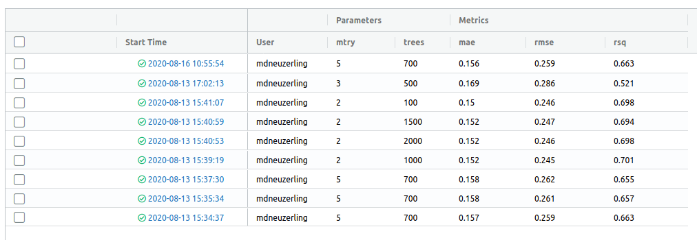
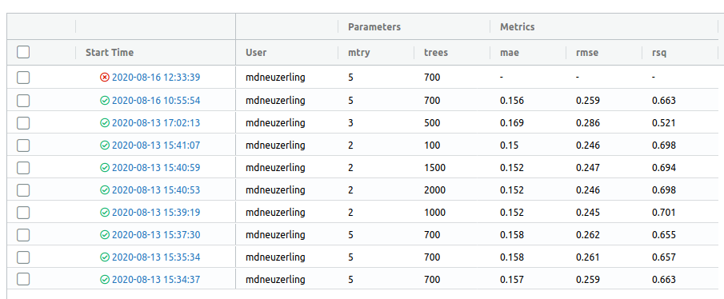
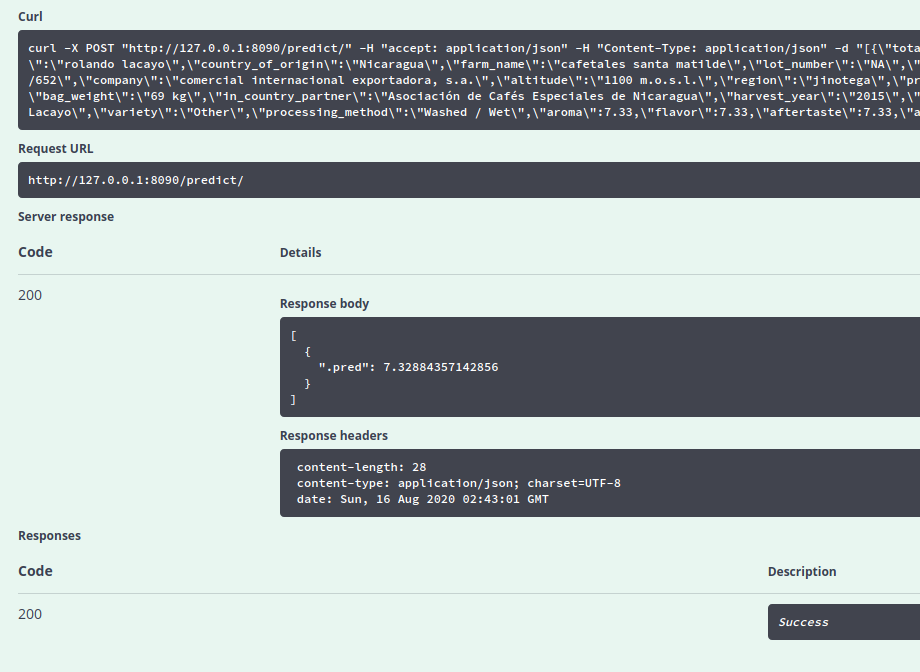

After I posted [my efforts to use MLflow to serve a model with R](/post/deploying-r-models-with-mlflow-and-docker/), I was worried that people may think I don't *like* MLflow. I want to declare this: MLflow is awesome. I'll showcase its model tracking features, and how to integrate them into a `tidymodels` model.

The Tracking component of MLflow can be used to record parameters, metrics and artifacts every time a model is trained. All of this information is presented in a very nice user interface. I'll also finish off here by demonstrating how to serve a model created with Tidymodels, which I find much easier than serving a model created with arbitrary code.

Prepare a model
---------------

I'll prepare a model using the recent TidyTuesday coffee data. This is the same process I followed in [my last post](/post/machine-learning-pipelines-with-tidymodels-and-targets/), except I'll stop short of fitting and evaluating the model so I can track those steps with MLflow.

<pre class='chroma'><code class='language-r' data-lang='r'>coffee &lt;- <a href='https://rdrr.io/r/base/invisible.html'>invisible</a>(tidytuesdayR::<a href='https://rdrr.io/pkg/tidytuesdayR/man/tt_load.html'>tt_load</a>(2020, week = 28)$coffee)
#&gt; 
#&gt;   Downloading file 1 of 1: `coffee_ratings.csv`
coffee_split &lt;- initial_split(coffee, prop = 0.8)
coffee_train &lt;- training(coffee_split)
coffee_test &lt;- testing(coffee_split)
coffee_recipe &lt;- recipe(coffee_train) %&gt;%
  update_role(everything(), new_role = "support") %&gt;% 
  update_role(cupper_points, new_role = "outcome") %&gt;%
  update_role(
    variety, processing_method, country_of_origin,
    aroma, flavor, aftertaste, acidity, sweetness, altitude_mean_meters,
    new_role = "predictor"
  ) %&gt;%
  step_string2factor(all_nominal(), -all_outcomes()) %&gt;%
  step_knnimpute(country_of_origin,
                 impute_with = imp_vars(
                   in_country_partner, company, region, farm_name, certification_body
                 )
  ) %&gt;%
  step_knnimpute(altitude_mean_meters,
                 impute_with = imp_vars(
                   in_country_partner, company, region, farm_name, certification_body,
                   country_of_origin
                 )
  ) %&gt;%
  step_unknown(variety, processing_method, new_level = "Unknown") %&gt;%
  step_other(country_of_origin, threshold = 0.01) %&gt;%
  step_other(processing_method, threshold = 0.10) %&gt;%
  step_other(variety, threshold = 0.10) %&gt;% 
  step_normalize(all_numeric(), -all_outcomes())
coffee_model &lt;- rand_forest(trees = tune(), mtry = tune()) %&gt;%
  set_engine("ranger") %&gt;%
  set_mode("regression")
coffee_workflow &lt;- workflows::<a href='https://workflows.tidymodels.org//reference/workflow.html'>workflow</a>() %&gt;%
  add_recipe(coffee_recipe) %&gt;%
  add_model(coffee_model)
coffee_grid &lt;- expand_grid(mtry = 3:5, trees = <a href='https://rdrr.io/r/base/seq.html'>seq</a>(500, 1500, by = 200))
coffee_grid_results &lt;- coffee_workflow %&gt;%
  tune_grid(resamples &lt;- vfold_cv(coffee_train, v = 5), grid = coffee_grid)
hyperparameters &lt;- coffee_grid_results %&gt;% 
  select_by_pct_loss(metric = "rmse", limit = 5, trees)</code></pre>

<pre class='chroma'><code class='language-r' data-lang='r'>coffee_workflow
#&gt; ══ Workflow ════════════════════════════════════════════════════════════════════════════════════════════════════════════
#&gt; Preprocessor: Recipe
#&gt; Model: rand_forest()
#&gt; 
#&gt; ── Preprocessor ────────────────────────────────────────────────────────────────────────────────────────────────────────
#&gt; 8 Recipe Steps
#&gt; 
#&gt; ● step_string2factor()
#&gt; ● step_knnimpute()
#&gt; ● step_knnimpute()
#&gt; ● step_unknown()
#&gt; ● step_other()
#&gt; ● step_other()
#&gt; ● step_other()
#&gt; ● step_normalize()
#&gt; 
#&gt; ── Model ───────────────────────────────────────────────────────────────────────────────────────────────────────────────
#&gt; Random Forest Model Specification (regression)
#&gt; 
#&gt; Main Arguments:
#&gt;   mtry = tune()
#&gt;   trees = tune()
#&gt; 
#&gt; Computational engine: ranger</code></pre>

Automatic tracking with workflows
=================================

MLflow tracking is organised around *experiments* and *runs*. Broadly speaking, an experiment is a *project*, whereas a run is a process in which a model is trained and evaluated. But these categories could be repurposed for anything[^1].

In each run the user can record *parameters* and *metrics*. Parameters and metrics are both arbitrary key-value pairs that could be used for anything. In my coffee example, I might have parameters `trees: 500` and `mtry: 3`. My metric might be `mae: 0.2`. I would log this information with [`mlflow_log_param("trees", 500)`](https://rdrr.io/pkg/mlflow/man/mlflow_log_param.html) or [`mlflow_log_metric("mae", 0.2)`](https://rdrr.io/pkg/mlflow/man/mlflow_log_metric.html). That's all I need to do, and MLflow takes care of the rest.

I'll be storing all of this information locally, with MLflow recording information in the `mlruns` directory in my working directory. Alternatively, [I could host my tracking information remotely, for example in a database](https://www.mlflow.org/docs/latest/tracking.html#where-runs-are-recorded).

Certain kinds of Python model *flavours*, such as Tensorflow, have *autotracking* in which parameters and metrics are automatically recorded. I'll try and implement a rough version of this for a Tidymodels `workflow`. I'm aiming for functions here that let me record parameters and metrics for any type of model implemented through as a Tidymodels `workflow`, so that I can change from a random forest to a linear model without adjusting my MLflow code.

I'll start with a function for logging model hyperparameters as MLflow parameters. This function will only log hyperparameters set by the user, since the default values have a `NULL` expression, but I think that this approach makes sense. It also passes on the input workflow unmodified, so it's pipe-friendly:

<pre class='chroma'><code class='language-r' data-lang='r'>log_workflow_parameters &lt;- function(workflow) {
  # Would help to have a check here: has this workflow been finalised?
  # It may be sufficient to check that the arg quosures carry no environments.
  spec &lt;- workflows::<a href='https://workflows.tidymodels.org//reference/workflow-extractors.html'>pull_workflow_spec</a>(workflow)
  parameter_names &lt;- <a href='https://rdrr.io/r/base/names.html'>names</a>(spec$args)
  parameter_values &lt;- <a href='https://rdrr.io/r/base/lapply.html'>lapply</a>(spec$args, rlang::<a href='https://rlang.r-lib.org/reference/set_expr.html'>get_expr</a>)
  for (i in <a href='https://rdrr.io/r/base/seq.html'>seq_along</a>(spec$args)) {
    parameter_name &lt;- parameter_names[[i]]
    parameter_value &lt;- parameter_values[[i]]
    if (!<a href='https://rdrr.io/r/base/NULL.html'>is.null</a>(parameter_value)) {
      <a href='https://rdrr.io/pkg/mlflow/man/mlflow_log_param.html'>mlflow_log_param</a>(parameter_name, parameter_value)
    }
  }
  workflow
}</code></pre>

Now I'll do the same for metrics. The input to this function will be a metrics tibble produced by the `yardstick` package, which is a component of `tidymodels`:

<pre class='chroma'><code class='language-r' data-lang='r'>log_metrics &lt;- function(metrics, estimator = "standard") {
  metrics %&gt;% <a href='https://rdrr.io/r/stats/filter.html'>filter</a>(.estimator == estimator) %&gt;% pmap(
    function(.metric, .estimator, .estimate) {
      <a href='https://rdrr.io/pkg/mlflow/man/mlflow_log_metric.html'>mlflow_log_metric</a>(.metric, .estimate)  
    }
  )
  metrics
}</code></pre>

Packaging workflows is pretty easy
----------------------------------

There's one last component I need to make this work. Apart from parameters and metrics, I can also store *artifacts* with each run. These are usually models, but could be anything. MLflow supports exporting models with the [`carrier::crate`](https://rdrr.io/pkg/carrier/man/crate.html) function. [This is a tricky function to use](/post/deploying-r-models-with-mlflow-and-docker/), since the user must comprehensively list their dependencies. For a `workflow` with a `recipe`, it's a lot easier. All of the preprocessing is contained within the recipe, and the fitted workflow object contains this.

<pre class='chroma'><code class='language-r' data-lang='r'># I haven't yet defined fitted_coffee_model, so I won't run this
crated_model &lt;- carrier::<a href='https://rdrr.io/pkg/carrier/man/crate.html'>crate</a>(
  function(x) workflows:::<a href='https://workflows.tidymodels.org//reference/predict-workflow.html'>predict.workflow</a>(fitted_coffee_model, x),
  fitted_coffee_model = fitted_coffee_model
)</code></pre>

MLflow tracks *artifacts* along with parameters and metrics. These are any files associated with the run, including models. I think the `mlflow_log_model` function should be used here, but it doesn't work for me. Instead I save the crated model with `mlflow_save_model` and log it with `mlflow_log_artifact`.

Tracking a model training run with MLflow
-----------------------------------------

I'll set my experiment as `coffee`. I only need to do this once per session:

<pre class='chroma'><code class='language-r' data-lang='r'><a href='https://rdrr.io/pkg/mlflow/man/mlflow_set_experiment.html'>mlflow_set_experiment</a>(experiment_name = "coffee")</code></pre>

To actually *do* an MLflow run, I wrap my model training and evaluation code in a [`with(mlflow_start_run(), ...)`](https://rdrr.io/r/base/with.html) block. I insert my logging functions into my training code:

<pre class='chroma'><code class='language-r' data-lang='r'><a href='https://rdrr.io/r/base/with.html'>with</a>(<a href='https://rdrr.io/pkg/mlflow/man/mlflow_start_run.html'>mlflow_start_run</a>(), {
  fitted_coffee_model &lt;- coffee_workflow %&gt;%
    finalize_workflow(hyperparameters) %&gt;%
    log_workflow_parameters() %&gt;%  
    fit(coffee_train)
  metrics &lt;- fitted_coffee_model %&gt;%
    <a href='https://rdrr.io/r/stats/predict.html'>predict</a>(coffee_test) %&gt;%
    metric_set(rmse, mae, rsq)(coffee_test$cupper_points, .pred) %&gt;% 
    log_metrics()
  crated_model &lt;- carrier::<a href='https://rdrr.io/pkg/carrier/man/crate.html'>crate</a>(
    function(x) workflows:::<a href='https://workflows.tidymodels.org//reference/predict-workflow.html'>predict.workflow</a>(fitted_coffee_model, x),
    fitted_coffee_model = fitted_coffee_model
  )
  <a href='https://rdrr.io/pkg/mlflow/man/mlflow_save_model.html'>mlflow_save_model</a>(crated_model, here::<a href='https://rdrr.io/pkg/here/man/here.html'>here</a>("models"))
  <a href='https://rdrr.io/pkg/mlflow/man/mlflow_log_artifact.html'>mlflow_log_artifact</a>(here::<a href='https://rdrr.io/pkg/here/man/here.html'>here</a>("models", "crate.bin"))
})
#&gt; 2020/08/17 09:09:28 INFO mlflow.store.artifact.cli: Logged artifact from local file /home/mdneuzerling/mdneuzerling.com/models/crate.bin to artifact_path=None
#&gt; 
#&gt; Root URI: /home/mdneuzerling/Documents/coffee/mlruns/1/d2bdcbdf3e9849598b393951fa69214c/artifacts</code></pre>

I can see all the run information, stored as plain text, appearing in my `mlruns` directory now:

<pre class='chroma'><code class='language-r' data-lang='r'>fs::<a href='http://fs.r-lib.org/reference/dir_tree.html'>dir_tree</a>("mlruns/1/f26b040f80244b00882d2925ebdc8396/")
#&gt; mlruns/1/f26b040f80244b00882d2925ebdc8396/
#&gt; ├── artifacts
#&gt; │   └── crate.bin
#&gt; ├── meta.yaml
#&gt; ├── metrics
#&gt; │   ├── mae
#&gt; │   ├── rmse
#&gt; │   └── rsq
#&gt; ├── params
#&gt; │   ├── mtry
#&gt; │   └── trees
#&gt; └── tags
#&gt;     ├── mlflow.source.name
#&gt;     ├── mlflow.source.type
#&gt;     └── mlflow.user</code></pre>

I have a quibble here: I create an experiment with a name, but MLflow identifies experiments with an integer ID. It would be great if I could write [`with(mlflow_start_run(experiment_name = "coffee"), ...)`](https://rdrr.io/r/base/with.html), but only the `experiment_id` is supported. It's a minor point, but I'm not a fan of having that separate `mlflow_set_experiment` function there because it's a state that I have to manage in a functional language. The other issue here is that while my collaborators and I might all be using the same `experiment_name`, we don't know that we'll be on the same `experiment_id`.

Viewing runs with the MLflow UI
-------------------------------

MLflow comes with a gorgeous user interface for exploring previous model runs. I can run it with `mlflow_ui` and view it in my browser:

A word of warning: the model hyperparameters in this UI are placed directly next to the model metrics. The dashboard makes it look like I should be selecting the hyperparameters which reduce my error metrics. I can't use the same test data to select my hyperparameters *and* evaluate my model, because this leaks information from the test set to the model. But the UI places the hyperparameters next to the metrics, making it look as though I should be selecting the hyperparameters with the best metrics.

This isn't a flaw of MLflow, though. One thing I could do here to make the data leakage trap easier to avoid is to log the "cross-validation RMSE" that was used to select the hyperparameters. If I include this is a column before the other metrics, it makes it clear what I used to select those `trees` and `mtry` values.

What I really like about this use of MLflow is that if there's an error in my model training run, MLflow will pick that up and record what it can, and label the run as an error in the UI:

Serving coffee
--------------

MLflow Models is the MLflow component used for serving exported models as APIs. I can serve my coffee model that I exported earlier with [`mlflow_rfunc_serve("models")`](https://rdrr.io/pkg/mlflow/man/mlflow_rfunc_serve.html). Since I'm overwriting this directory with each run (before I log the artifact with the run), this will be the last model to have been exported. This command will open up a Swagger UI, so I don't have to mess around with piecing together a HTTP request.

To test this, I can try to predict the results of a random data point in the test set. Note the `na = "string"` argument here, since missing values will be incorrectly represented without it:

<pre class='chroma'><code class='language-r' data-lang='r'>coffee_test %>% select(-cupper_points) %>% sample_n(1) %>% jsonlite::toJSON(na = "string")`
</code></pre>

It seems as though this method only serves one prediction at a time, even if multiple rows are provided.

I could also have served this model through the command line with `mlflow models serve -m models/`.

`tidymodels` works really well with MLflow
------------------------------------------

`tidymodels` presents an excellent opportunity to make life a bit easier for R users who want to take advantage of MLflow.

MLflow exports models through patterns known as *flavours*. [There are many flavour available for Python](https://www.mlflow.org/docs/latest/models.html#built-in-model-flavors), but only `crate` and `keras` for R. `crate` does have the advantage of supporting arbitrary R code, however.

A `tidymodels` flavour for workflows/parsnip models could be implemented through the `crate` flavour, as I've done above, or separately. This isn't as tricky as exporting arbitrary R code, since all of the preprocessing is done through the `recipes` package.

The `tidymodels` framework also opens up the possibility of autologging. I've implemented some functions above that accomplish this, but they're a little rough. With a bit of polish, users could take advantage of MLflow with very little effort.

------------------------------------------------------------------------

<pre class='chroma'><code class='language-r' data-lang='r'>devtools::<a href='https://rdrr.io/pkg/sessioninfo/man/session_info.html'>session_info</a>()
#&gt; ─ Session info ───────────────────────────────────────────────────────────────
#&gt;  setting  value                       
#&gt;  version  R version 4.0.0 (2020-04-24)
#&gt;  os       Ubuntu 20.04.1 LTS          
#&gt;  system   x86_64, linux-gnu           
#&gt;  ui       X11                         
#&gt;  language en_AU:en                    
#&gt;  collate  en_AU.UTF-8                 
#&gt;  ctype    en_AU.UTF-8                 
#&gt;  tz       Australia/Melbourne         
#&gt;  date     2020-08-17                  
#&gt; 
#&gt; ─ Packages ───────────────────────────────────────────────────────────────────
#&gt;  package     * version    date       lib source                            
#&gt;  askpass       1.1        2019-01-13 [1] CRAN (R 4.0.0)                    
#&gt;  assertthat    0.2.1      2019-03-21 [1] CRAN (R 4.0.0)                    
#&gt;  backports     1.1.8      2020-06-17 [1] CRAN (R 4.0.0)                    
#&gt;  base64enc     0.1-3      2015-07-28 [1] CRAN (R 4.0.0)                    
#&gt;  blob          1.2.1      2020-01-20 [1] CRAN (R 4.0.0)                    
#&gt;  broom       * 0.7.0      2020-07-09 [1] CRAN (R 4.0.0)                    
#&gt;  callr         3.4.3      2020-03-28 [1] CRAN (R 4.0.0)                    
#&gt;  carrier       0.1.0      2018-10-16 [1] CRAN (R 4.0.0)                    
#&gt;  cellranger    1.1.0      2016-07-27 [1] CRAN (R 4.0.0)                    
#&gt;  class         7.3-17     2020-04-26 [4] CRAN (R 4.0.0)                    
#&gt;  cli           2.0.2      2020-02-28 [1] CRAN (R 4.0.0)                    
#&gt;  codetools     0.2-16     2018-12-24 [4] CRAN (R 4.0.0)                    
#&gt;  colorspace    1.4-1      2019-03-18 [1] CRAN (R 4.0.0)                    
#&gt;  crayon        1.3.4      2017-09-16 [1] CRAN (R 4.0.0)                    
#&gt;  curl          4.3        2019-12-02 [1] CRAN (R 4.0.0)                    
#&gt;  DBI           1.1.0      2019-12-15 [1] CRAN (R 4.0.0)                    
#&gt;  dbplyr        1.4.4      2020-05-27 [1] CRAN (R 4.0.0)                    
#&gt;  desc          1.2.0      2018-05-01 [1] CRAN (R 4.0.0)                    
#&gt;  devtools      2.3.0      2020-04-10 [1] CRAN (R 4.0.0)                    
#&gt;  dials       * 0.0.8      2020-07-08 [1] CRAN (R 4.0.0)                    
#&gt;  DiceDesign    1.8-1      2019-07-31 [1] CRAN (R 4.0.0)                    
#&gt;  digest        0.6.25     2020-02-23 [1] CRAN (R 4.0.0)                    
#&gt;  downlit       0.0.0.9000 2020-07-25 [1] Github (r-lib/downlit@ed969d0)    
#&gt;  dplyr       * 1.0.1      2020-07-31 [1] CRAN (R 4.0.0)                    
#&gt;  ellipsis      0.3.1      2020-05-15 [1] CRAN (R 4.0.0)                    
#&gt;  evaluate      0.14       2019-05-28 [1] CRAN (R 4.0.0)                    
#&gt;  fansi         0.4.1      2020-01-08 [1] CRAN (R 4.0.0)                    
#&gt;  forcats     * 0.5.0      2020-03-01 [1] CRAN (R 4.0.0)                    
#&gt;  foreach       1.5.0      2020-03-30 [1] CRAN (R 4.0.0)                    
#&gt;  forge         0.2.0      2019-02-26 [1] CRAN (R 4.0.0)                    
#&gt;  fs            1.5.0      2020-07-31 [1] CRAN (R 4.0.0)                    
#&gt;  furrr         0.1.0      2018-05-16 [1] CRAN (R 4.0.0)                    
#&gt;  future        1.17.0     2020-04-18 [1] CRAN (R 4.0.0)                    
#&gt;  generics      0.0.2      2018-11-29 [1] CRAN (R 4.0.0)                    
#&gt;  ggplot2     * 3.3.2.9000 2020-08-07 [1] Github (tidyverse/ggplot2@6d91349)
#&gt;  git2r         0.27.1     2020-05-03 [1] CRAN (R 4.0.0)                    
#&gt;  globals       0.12.5     2019-12-07 [1] CRAN (R 4.0.0)                    
#&gt;  glue          1.4.1      2020-05-13 [1] CRAN (R 4.0.0)                    
#&gt;  gower         0.2.2      2020-06-23 [1] CRAN (R 4.0.0)                    
#&gt;  GPfit         1.0-8      2019-02-08 [1] CRAN (R 4.0.0)                    
#&gt;  gtable        0.3.0      2019-03-25 [1] CRAN (R 4.0.0)                    
#&gt;  hardhat       0.1.4      2020-07-02 [1] CRAN (R 4.0.0)                    
#&gt;  haven         2.2.0      2019-11-08 [1] CRAN (R 4.0.0)                    
#&gt;  here          0.1        2017-05-28 [1] CRAN (R 4.0.0)                    
#&gt;  hms           0.5.3      2020-01-08 [1] CRAN (R 4.0.0)                    
#&gt;  htmltools     0.5.0      2020-06-16 [1] CRAN (R 4.0.0)                    
#&gt;  httpuv        1.5.2      2019-09-11 [1] CRAN (R 4.0.0)                    
#&gt;  httr          1.4.2      2020-07-20 [1] CRAN (R 4.0.0)                    
#&gt;  hugodown      0.0.0.9000 2020-08-13 [1] Github (r-lib/hugodown@2af491d)   
#&gt;  infer       * 0.5.3      2020-07-14 [1] CRAN (R 4.0.0)                    
#&gt;  ini           0.3.1      2018-05-20 [1] CRAN (R 4.0.0)                    
#&gt;  ipred         0.9-9      2019-04-28 [1] CRAN (R 4.0.0)                    
#&gt;  iterators     1.0.12     2019-07-26 [1] CRAN (R 4.0.0)                    
#&gt;  jsonlite      1.7.0      2020-06-25 [1] CRAN (R 4.0.0)                    
#&gt;  knitr         1.29       2020-06-23 [1] CRAN (R 4.0.0)                    
#&gt;  later         1.1.0.1    2020-06-05 [1] CRAN (R 4.0.0)                    
#&gt;  lattice       0.20-41    2020-04-02 [4] CRAN (R 4.0.0)                    
#&gt;  lava          1.6.7      2020-03-05 [1] CRAN (R 4.0.0)                    
#&gt;  lhs           1.0.2      2020-04-13 [1] CRAN (R 4.0.0)                    
#&gt;  lifecycle     0.2.0      2020-03-06 [1] CRAN (R 4.0.0)                    
#&gt;  listenv       0.8.0      2019-12-05 [1] CRAN (R 4.0.0)                    
#&gt;  lubridate     1.7.9      2020-06-08 [1] CRAN (R 4.0.0)                    
#&gt;  magrittr      1.5        2014-11-22 [1] CRAN (R 4.0.0)                    
#&gt;  MASS          7.3-51.6   2020-04-26 [4] CRAN (R 4.0.0)                    
#&gt;  Matrix        1.2-18     2019-11-27 [4] CRAN (R 4.0.0)                    
#&gt;  memoise       1.1.0.9000 2020-05-09 [1] Github (hadley/memoise@4aefd9f)   
#&gt;  mlflow      * 1.10.0     2020-07-21 [1] CRAN (R 4.0.0)                    
#&gt;  modeldata   * 0.0.2      2020-06-22 [1] CRAN (R 4.0.0)                    
#&gt;  modelr        0.1.6      2020-02-22 [1] CRAN (R 4.0.0)                    
#&gt;  munsell       0.5.0      2018-06-12 [1] CRAN (R 4.0.0)                    
#&gt;  nnet          7.3-14     2020-04-26 [4] CRAN (R 4.0.0)                    
#&gt;  openssl       1.4.2      2020-06-27 [1] CRAN (R 4.0.0)                    
#&gt;  parsnip     * 0.1.2      2020-07-03 [1] CRAN (R 4.0.0)                    
#&gt;  pillar        1.4.6      2020-07-10 [1] CRAN (R 4.0.0)                    
#&gt;  pkgbuild      1.1.0      2020-07-13 [1] CRAN (R 4.0.0)                    
#&gt;  pkgconfig     2.0.3      2019-09-22 [1] CRAN (R 4.0.0)                    
#&gt;  pkgload       1.1.0      2020-05-29 [1] CRAN (R 4.0.0)                    
#&gt;  plyr          1.8.6      2020-03-03 [1] CRAN (R 4.0.0)                    
#&gt;  prettyunits   1.1.1      2020-01-24 [1] CRAN (R 4.0.0)                    
#&gt;  pROC          1.16.2     2020-03-19 [1] CRAN (R 4.0.0)                    
#&gt;  processx      3.4.3      2020-07-05 [1] CRAN (R 4.0.0)                    
#&gt;  prodlim       2019.11.13 2019-11-17 [1] CRAN (R 4.0.0)                    
#&gt;  promises      1.1.1      2020-06-09 [1] CRAN (R 4.0.0)                    
#&gt;  ps            1.3.4      2020-08-11 [1] CRAN (R 4.0.0)                    
#&gt;  purrr       * 0.3.4      2020-04-17 [1] CRAN (R 4.0.0)                    
#&gt;  R6            2.4.1      2019-11-12 [1] CRAN (R 4.0.0)                    
#&gt;  ranger        0.12.1     2020-01-10 [1] CRAN (R 4.0.0)                    
#&gt;  Rcpp          1.0.5      2020-07-06 [1] CRAN (R 4.0.0)                    
#&gt;  readr       * 1.3.1      2018-12-21 [1] CRAN (R 4.0.0)                    
#&gt;  readxl        1.3.1      2019-03-13 [1] CRAN (R 4.0.0)                    
#&gt;  recipes     * 0.1.13     2020-06-23 [1] CRAN (R 4.0.0)                    
#&gt;  remotes       2.1.1      2020-02-15 [1] CRAN (R 4.0.0)                    
#&gt;  reprex        0.3.0      2019-05-16 [1] CRAN (R 4.0.0)                    
#&gt;  reticulate    1.16       2020-05-27 [1] CRAN (R 4.0.0)                    
#&gt;  rlang         0.4.7      2020-07-09 [1] CRAN (R 4.0.0)                    
#&gt;  rmarkdown     2.3.3      2020-08-13 [1] Github (rstudio/rmarkdown@204aa41)
#&gt;  rpart         4.1-15     2019-04-12 [4] CRAN (R 4.0.0)                    
#&gt;  rprojroot     1.3-2      2018-01-03 [1] CRAN (R 4.0.0)                    
#&gt;  rsample     * 0.0.7      2020-06-04 [1] CRAN (R 4.0.0)                    
#&gt;  rstudioapi    0.11       2020-02-07 [1] CRAN (R 4.0.0)                    
#&gt;  rvest         0.3.5      2019-11-08 [1] CRAN (R 4.0.0)                    
#&gt;  scales      * 1.1.1      2020-05-11 [1] CRAN (R 4.0.0)                    
#&gt;  sessioninfo   1.1.1      2018-11-05 [1] CRAN (R 4.0.0)                    
#&gt;  stringi       1.4.6      2020-02-17 [1] CRAN (R 4.0.0)                    
#&gt;  stringr     * 1.4.0      2019-02-10 [1] CRAN (R 4.0.0)                    
#&gt;  survival      3.1-12     2020-04-10 [4] CRAN (R 4.0.0)                    
#&gt;  swagger       3.9.2      2018-03-23 [1] CRAN (R 4.0.0)                    
#&gt;  testthat      2.3.2      2020-03-02 [1] CRAN (R 4.0.0)                    
#&gt;  tibble      * 3.0.3      2020-07-10 [1] CRAN (R 4.0.0)                    
#&gt;  tidymodels  * 0.1.1      2020-07-14 [1] CRAN (R 4.0.0)                    
#&gt;  tidyr       * 1.1.1      2020-07-31 [1] CRAN (R 4.0.0)                    
#&gt;  tidyselect    1.1.0      2020-05-11 [1] CRAN (R 4.0.0)                    
#&gt;  tidyverse   * 1.3.0      2019-11-21 [1] CRAN (R 4.0.0)                    
#&gt;  timeDate      3043.102   2018-02-21 [1] CRAN (R 4.0.0)                    
#&gt;  tune        * 0.1.1      2020-07-08 [1] CRAN (R 4.0.0)                    
#&gt;  usethis       1.6.1      2020-04-29 [1] CRAN (R 4.0.0)                    
#&gt;  vctrs         0.3.2      2020-07-15 [1] CRAN (R 4.0.0)                    
#&gt;  withr         2.2.0      2020-04-20 [1] CRAN (R 4.0.0)                    
#&gt;  workflows   * 0.1.2      2020-07-07 [1] CRAN (R 4.0.0)                    
#&gt;  xfun          0.16       2020-07-24 [1] CRAN (R 4.0.0)                    
#&gt;  xml2          1.3.2      2020-04-23 [1] CRAN (R 4.0.0)                    
#&gt;  yaml          2.2.1      2020-02-01 [1] CRAN (R 4.0.0)                    
#&gt;  yardstick   * 0.0.7      2020-07-13 [1] CRAN (R 4.0.0)                    
#&gt;  zeallot       0.1.0      2018-01-28 [1] CRAN (R 4.0.0)                    
#&gt; 
#&gt; [1] /home/mdneuzerling/R/x86_64-pc-linux-gnu-library/4.0
#&gt; [2] /usr/local/lib/R/site-library
#&gt; [3] /usr/lib/R/site-library
#&gt; [4] /usr/lib/R/library</code></pre>

[^1]: Here's an idea: use MLflow to track reports! Every report is an experiment, and every production of a report is a run.

