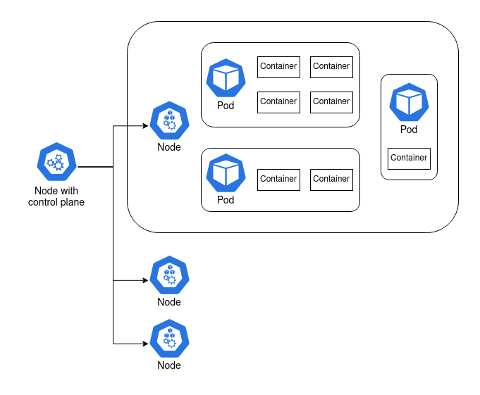
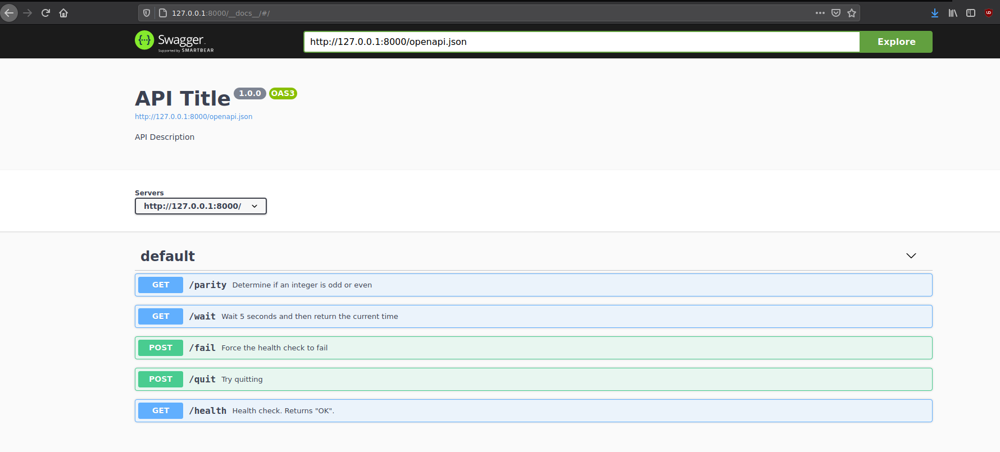
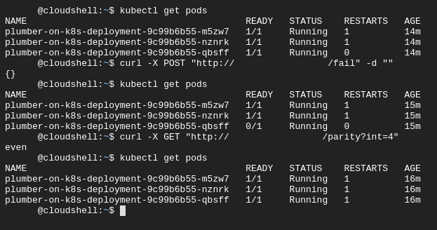
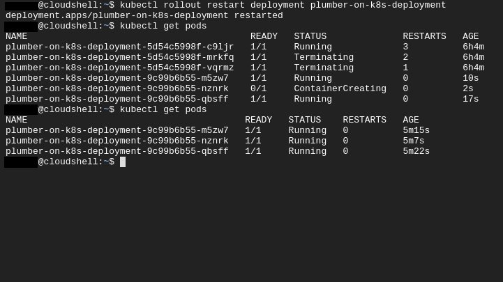

    
```{r setup, include=FALSE}
knitr::opts_chunk$set(eval = FALSE)
```

I've set myself an ambitious goal of building a Kubernetes cluster out of a couple of Raspberry Pis. This is pretty far out of my sphere of knowledge, so I have a lot to learn. I'll be writing some posts to publish my notes and journal my experience publicly. In this post I'll go through the basics of Kubernetes, and how I hosted a Plumber API in a Kubernetes cluster on Google Cloud Platform.

## The basic architecture

### Understand the container

The central concept of Kubernetes is the _container_. When I have an application that I want to deploy, I can bundle it up together with the software that it requires to run into a single blob called a container. That container can then be run on another machine that doesn't have the application or its dependencies installed. The _Rocker_ project, for example, provides containers with R or RStudio and all of their dependencies. I can run that container on another machine and access R or RStudio, without actually installing R or RStudio. The most common software for creating and running containers is called _Docker_.

Containers solve a lot of problems. I can bundle up an R script with the exact versions of the packages it uses to have a reproducible analysis. I can turn my R script into an API with `plumber` and put that in a container, so that running the container hosts the API. I can run multiple containers on the same machine, even if the applications are unrelated. If one of my applications requires version 3.6 of R, and another requires 4.0, then they can run side-by-side in containers.

### Now run 100 containers

There's complexity involved with running many containers, and it's this complexity Kubernetes targets. I provide Kubernetes with a description of what I want the system to look like. I might ask for "3 copies of container A, and 2 copies of container B at all times" and Kubernetes will do its best to make that a reality.

Kubernetes is almost always run on a _cluster_ of multiple machines. It can run copies of the same container (_replicas_) across multiple machines so that they can share a computational load, or so that if one falls over there's another container ready to pick up the slack. In fact, Kubernetes doesn't consider containers precious; they're treated as ephemeral and replaceable. This also makes it easier to scale if there's a spike in demand: just add more containers!^[I count at least three different ways to scale with Kubernetes. Adding more containers is just an example.]

It's not as simple as Kubernetes running containers, though. There are a few layers in between.

A _node_ is a machine. It can be a Raspberry Pi, an old laptop, or a server with a six-figure price tag. Or it can be a virtual machine like an AWS EC2 instance.

At least one of these nodes is special. It contains the _control plane_^[The deprecated term for the node with the control plane is the _master_ node. This is the only time I will refer to the node with this terminology.], and it's what coordinates the containers. The other nodes are called _worker_ nodes, and it's on these nodes that the containers are run.

There's another layer in between node and container, and it's the _pod_. Containers are grouped together in pods. Containers that rely on each other to perform a common goal are configured by the user to run in a pod together. A simple container that doesn't rely on anything else can run in a pod by itself. In practice, the user configures pods, not containers.



## Sticking a Plumber API in a container

### A simple Plumber API

I started by making a container that runs a simple Plumber API. The `plumber` package lets me turn R functions into API endpoints. I created a `plumber.R` file that defines a few simple functions that I can use for testing:

* `/parity` determines if a given integer is odd or even
* `/wait` waits 5 seconds, then returns the current time as a nicely formatted string
* `/fail` sets the `alive` global variable to `FALSE`.
* `/quit` runs `quit()`, exiting the R process that runs the API.
* `/health` returns "OK" if the `alive` global variable is `TRUE`, and throws an error otherwise.

Note the special `#*` comments. These tell the `plumber` package how to map the function to an API endpoint. I'm also using futures for asynchronous calls, [a feature introduced recently in Plumber 1.0.0](https://www.rplumber.io/news/). R is fundamentally a single-threaded language, and so an API like this would normally only be able to serve one request at a time. The `future` package overcomes this.

```{r plumber}
# plumber.R
alive <<- TRUE

#* Determine if an integer is odd or even
#* @serializer text
#* @param int Integer to test for parity
#* @get /parity
function(int) {
  future({
    if (as.integer(int) %% 2 == 0) "even" else "odd"
  })
}

#* Wait 5 seconds and then return the current time
#* @serializer json
#* @get /wait
function() {
  future({
    Sys.sleep(5)
    list(time = Sys.time())
  })
}

#* Force the health check to fail
#* @post /fail
function() {
  alive <<- FALSE
  NULL
}

#* Try quitting
#* @post /quit
function() {
  quit()
}

#* Health check. Returns "OK".
#* @serializer text
#* @get /health
function() {
  future({
    if (!alive) stop() else "OK"
  })
}

```

I needed one other file: something that sets up dependencies, sources `plumber.R`, and runs the API. I called it `entrypoint.R`:

```{r entrypoint}
# entrypoint.R
library(plumber)
library(promises)
library(future)
future::plan("multiprocess")

pr("plumber.R") %>% pr_run(host='0.0.0.0', port = 8000)
```

At this point I had enough to run my API. On my laptop I could run `Rscript entrypoint.R` and the API would be hosted locally, accessible only through my machine. By packaging it into a Docker container I could start to think about moving my API onto a different machine.

### Stick it in a container

To create a container^[There is a subtle difference here between a "container" and an "image", but it's a difference I'm going to disregard as it only confuses the situation without benefit.], I wrote out a "Dockerfile" that goes through the build process step-by-step. I can user Docker to _build_ this Dockerfile into an _image_, which can then be run on another machine. [The full Dockerfile is available here](https://raw.githubusercontent.com/mdneuzerling/plumber-on-k8s/4691f0ca34f8af9bb8258a61f8d113b169c6e8bb/Dockerfile), but I'll break it down below to make the process clearer.

Docker containers can build on one another. I start `FROM` the `rocker/r-ver:4.0.2`, [provided by the Rocker project](https://www.rocker-project.org/), which provides me with a Debian environment with R version 4.0.2 installed. 

```
# Dockerfile
FROM rocker/r-ver:4.0.2
```

Next I need to install some system dependencies required by `plumber`. [The RStudio Package Manager is a good resource for determining system dependencies](https://packagemanager.rstudio.com/client/#/repos/1/packages/plumber). Even though these system packages are already available on my laptop, they aren't necessarily available in the `rocker` parent image, so I have to install them.

```
RUN apt-get update -qq && apt-get -y --no-install-recommends install \
	make \
	libsodium-dev \
	libicu-dev \
	libcurl4-openssl-dev \
	libssl-dev
```

My API requires three R packages: `plumber`, `promises`, and `future`. I'll install them using [the precompiled binaries provided by the RStudio Package Manager](https://packagemanager.rstudio.com/client/#/repos/1/overview). This makes the build process much faster, and also lets me pin the packages to the versions available as of a given date --- in this case, 2020-10-01. I set the repository URL to an environment variable, which I then reference in R. An alternative approach here would be to add an `renv` lockfile to the image, and then `restore` it.

```
ENV CRAN_REPO https://packagemanager.rstudio.com/all/__linux__/focal/338
RUN Rscript -e 'install.packages(c("plumber", "promises", "future"), repos = c("CRAN" = Sys.getenv("CRAN_REPO")))'
```

Every command in the Dockerfile is, by default, run with administrative privileges. That's why I was able to run `apt-get install` without prefixing `sudo`. [Docker suggests changing the user to one without root privileges if possible](https://docs.docker.com/develop/develop-images/dockerfile_best-practices/#user), and my little Plumber API certainly doesn't need root privileges. I'll create a new `plumber` user, which I'll later switch to with the `USER` command.
```
RUN groupadd -r plumber && useradd --no-log-init -r -g plumber plumber
```

Now I'll add the files I need to run my API. I'll put them in the home directory of the `plumber` user I just created.
```
ADD plumber.R /home/plumber/plumber.R
ADD entrypoint.R /home/plumber/entrypoint.R
```

My API will be run through port 8000, but it will use port 8000 within the container. The `EXPOSE` command tells Docker that I intend to make this port available to the environment outside the container.
```
EXPOSE 8000
```

All of this setup makes the final steps fairly straightforward: change the working directory to the directory which contains my R files, switch to the `plumber` user, and run `entrypoint.R`.

```
WORKDIR /home/plumber
USER plumber
CMD Rscript entrypoint.R
```

### Building and running the container

To turn my Dockerfile into an image, I ran the following command in a shell:

```
docker build -t mdneuzerling/plumber-on-k8s <directory-with-files>
```

That last argument points to the directory containing `plumber.R` and `entrypoint.R`. If that's my working directory, I can instead use `.` as this value. The `-t` is a tag, which is a convenient way of identifying the resulting image. It could be anything, but I set it to match [the Github repository in which these files are hosted](https://github.com/mdneuzerling/plumber-on-k8s/).

It can take a while to build an image, but Docker uses some smart caching along the way. If I change any line of the Dockerfile, only that line and what comes after will be rebuilt. For this reason, it's generally good practice to put the stable time-consuming components of the Dockerfile (system dependencies, R package installations) towards the top of the file, and the components that are more likely to change towards the bottom.

To run my API, I use this command:

```
docker run -p 8000:8000 mdneuzerling/plumber-on-k8s
```

Containers have their own internal network of sorts. Earlier I exposed port 8000 in the container. Now I need to link port 8000 on my laptop to port 8000 within the container. This is what `-p 8000:8000` does.

Plumber APIs come with a pretty Swagger interface for testing the API. When I run the above command, I'm prompted to go to `http://127.0.0.1:8000/__docs__/` in my browser. And, sure enough, the API is there:



### Put the container somewhere

I needed to store my container somewhere accessible. A _Docker Registry_ stores built Docker images, and is kind of like git for containers. _Docker Hub_ is a registry provided by Docker itself, and offers a generous free tier.

I hadn't used Docker Hub to host an image before, but I found the process very straightforward. [I created a public repository for my image](https://hub.docker.com/repository/docker/mdneuzerling/plumber-on-k8s), and then linked it to [a GitHub repository of the same name](https://github.com/mdneuzerling/plumber-on-k8s/). With very little effort I had a workflow in place such that pushing changes to my GitHub repository automatically rebuilt the image on Docker Hub!

## Hosting the container with Kubernetes

With my Raspberry Pi cluster components still in the mail, I had two options for trying out Kubernetes:

1. Use `minikube`, which sets up a cluster running on my laptop
1. Use a hosted service through a cloud provider

I had some difficulty getting `minikube` to work, and I liked the idea of hosting my API in a publicly accessible location, so I went with a cloud provider. All three major providers offer hosted Kubernetes services, but I went with Google Kubernetes Engine on Google Cloud Platform There wasn't an in-depth comparison here; I went with the service that looked like it had friendlier documentation.

### My first cluster

A hosted Kubernetes service means that some of the complexity of managing a cluster is abstracted away. In the case of Google Kubernetes Engine (GKE), it means that the control plane is handled for me. Every node I create will be a worker node. A warning here: every node is a Compute VM instance that costs money, but my little API can get by on very cheap instances: I selected g1-small (1 vCPU, 1.7 GB memory) VMs.

I won't try to compete with [Google's GKE documentation](https://cloud.google.com/kubernetes-engine/docs/quickstart). Instead, here's a high-level overview of the steps I took to get my cluster up-and-running:

1. I created a new _project_ for the cluster.
1. I went to the Google Kubernetes Engine page, which activated the API after a short wait.
1. I went to create a cluster, and Google suggested a "My First Cluster" configuration. This instantly created 3 nodes for me.
1. In a Cloud Shell, I configured my project and region. I also used `get-credentials` to connect to the cluster.

From here on out I could use the `kubectl` command to configure and control my cluster from a Cloud Shell. I took note of the cluster's external IP address as well --- I would later use this to query my API.

The `kubectl` command contains everything I need to configure my cluster. I was using it so frequently that I was tempted to alias it to `k`. The big one is `get`, which lists all instances of the specified resource (I'll explain deployments and services in a moment):

```
kubectl get pods
kubectl get deployments
kubectl get services
```

The other big one is `apply`. Kubernetes is most commonly configured by providing `kubectl` with YAML configuration files that tell the cluster how things should be. To "activate" one of these YAML files, I would write:

```
kubectl apply -f <file-location>
```

The `-f` tag indicates a file, but `<file-location>` could also be the URL of a YAML file. This was convenient for me, because I could point it towards the files as they were hosted on Github. My workflow was:

1. Edit the YAML file on my laptop
1. Commit and push to Github
1. `kubectl apply`

### My first deployment

Pods, and the containers they hold, are created through a _deployment_. The YAML for a deployment specifies which pods to create and how many replicas to maintain, as well as various pieces of metadata. Here's the deployment I used for my API:

```
apiVersion: apps/v1
kind: Deployment
metadata:
  name: plumber-on-k8s-deployment
spec:
  replicas: 3
  selector:
    matchLabels:
      app: plumber-on-k8s
  template:
    metadata:
      labels:
        app: plumber-on-k8s
    spec:
      containers:
      - name: plumber-on-k8s
        image: mdneuzerling/plumber-on-k8s
        ports:
        - containerPort: 8000
        livenessProbe:
          httpGet:
            path: /health
            port: 8000
          initialDelaySeconds: 3
          periodSeconds: 3
        readinessProbe:
          httpGet:
            path: /health
            port: 8000
          initialDelaySeconds: 3
          periodSeconds: 3
```

There's a lot to unpack here, since not everything in this YAML is obvious:

* The `apiVersion` is used so that as the Kubernetes API updates and the expected format of these YAML files changes, the correct version can be used for the given configuration. I am unsure what "apps" means --- it isn't explained in any easily Google-able location.
* `replicas` refers to how many of the pods should be kept alive at all time. If a pod fails, Kubernetes will restart it to ensure that the number of available pods matches the specified number of `replicas`.
* The `selector` tells Kubernetes which pods are part of this deployment. In this case, the pods are created in the same YAML file as the deployment, so it may seem somewhat redundant. But this isn't always the case.
* The `template` is how pods are specified. We use the `mdneuzerling/plumber-on-k8s` image, which is assumed to be from Docker Hub. However, I could just as easily refer to an image in a different or even private Docker registry.
* The `containerPort` tells Kubernetes which ports are going to be used outside the container. I was confused at first by how often I have to specify port numbers! But given that there are so many _layers_ of networks here (container, pod, cluster, external), I can understand why it is so important to be specific.

The last two fields of interest are the probes. A `livenessProbe` provides a method for Kubernetes to determine if a container is alive and accepting traffic. In this case, I'm pointing it towards the `/health` endpoint I defined in `plumber.R`. I _believe_ that all that is required from the endpoint is a status code of 200, and that the actual content of the response is irrelevant, but I couldn't get a clear picture of this.

I also have a `readinessProbe`. While my container is simple and starts up pretty quickly, this isn't true of all containers. Imagine a container that hosts a complicated machine learning model --- it will take at least a few seconds to load the required model into memory. In this case, Kubernetes will wait until the `readinessProbe` succeeds before sending traffic to the pod.

In my case, the `livenessProbe` and `readinessProbe` both point towards the `/health` endpoint. This is because that endpoint will not be available until `plumber` has finished loading, so it serves the same purpose. This isn't always the case for every API. The advantage of defining both is that the `livenessProbe` is ignored until the container reports as ready, subject to a timeout period.

A deployment of an API is, by itself, not particularly useful. I now had three pods, each hosting an API on port 8000. This isn't possible on one network: in fact, each pod has a separate network. In order to get traffic flowing to this deployment, I needed to declare a _service_.

### My first service

Pods are ephemeral; they come and go. That's why a _service_ is required to describe how pods should be accessed. Here is the service I used:

```
apiVersion: v1
kind: Service
metadata:
  name: plumber-on-k8s-service
spec:
  selector:
    app: plumber-on-k8s
  ports:
    - protocol: TCP
      port: 8000
      targetPort: 8000
```

[Services have an integrated load balance that will attempt to spread traffic evenly across the pods](https://kubernetes.io/docs/tutorials/kubernetes-basics/scale/scale-intro/). If a pod fails (as indicated by its `livenessProbe`) then traffic will be seamlessly routed to the available nodes.

### My first ingress

In order to actually query my API, there's one last component I needed to put in place. An _ingress_ directs traffic from outside the cluster to a service inside the cluster.

I found it difficult to find a configuration that would work. I suspect that the ingress API is under development at the moment (note the beta in the `apiVersion`), and may have changed significantly in version 1.19 of Kubernetes.

```
apiVersion: networking.k8s.io/v1beta1
kind: Ingress
metadata:
  name: plumber-on-k8s-ingress
spec:
  rules:
  - http:
      paths:
      - path: /health
        backend:
          serviceName: plumber-on-k8s-service
          servicePort: 8000
      - path: /parity
        backend:
          serviceName: plumber-on-k8s-service
          servicePort: 8000
      - path: /wait
        backend:
          serviceName: plumber-on-k8s-service
          servicePort: 8000
      - path: /fail
        backend:
          serviceName: plumber-on-k8s-service
          servicePort: 8000
      - path: /quit
        backend:
          serviceName: plumber-on-k8s-service
          servicePort: 8000
```

Here I've specified five paths which are directed to the `plumber-on-k8s-service` I previously defined. I could make the `spec` more compact with regular expressions, or by passing on all traffic regardless of path, but I chose to be explicit here.

### Kubernetes does its thing

With a deployment, service and ingress defined, I now have everything in place to query my API. Using the external IP address (listed in the GCP console), I can send queries from my laptop:

```
curl -X GET http://<cluster-ip>/parity?int=15
odd
```

I can now also start to explore some of the features that come "for free" with using Kubernetes. Watch below what happens when I deliberately make a container fail its `livenessProbe` (I've censored some details in this screenshot):



It doesn't matter that one of the pods is temporarily unable to accept traffic --- the service routes all traffic to the remaining 2 available pods. Kubernetes notices that something is wrong: my `deployment.yaml` file asks for 3 replicas, but there are only 2 live pods. It then restarts the pod, so that reality reflects the configuration.

At one point I updated my Dockerfile, and I needed the deployment to fetch the new pods. I asked Kubernetes to do a "rolling restart". It brought up new pods and took the old ones offline systematically, so that the service remained uninterrupted:



***
```{r sessioninfo, eval = TRUE}
devtools::session_info()
```

[The Kubernetes icons used in the chart that appears at the top of this page, and further below in the article, are used here under a CC-BY-4.0 licence.](https://github.com/kubernetes/community/tree/master/icons)