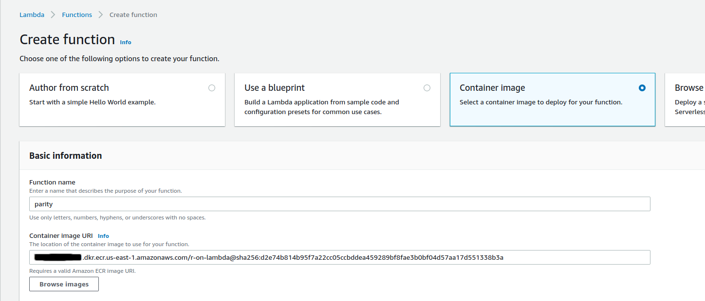
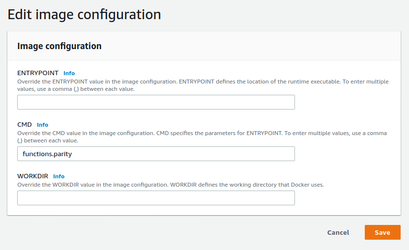
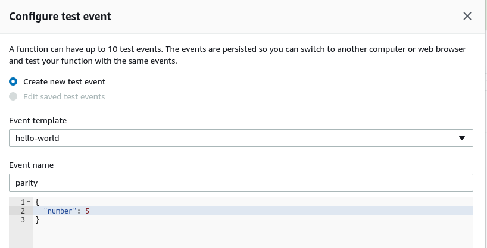
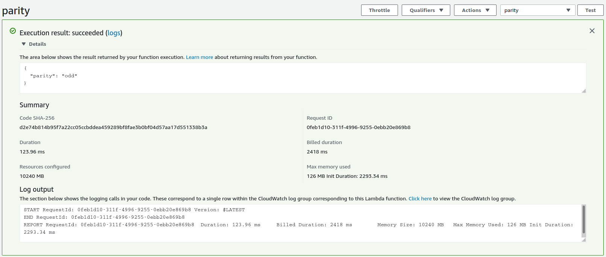

    
```{r setup, include=FALSE}
knitr::opts_chunk$set(eval = FALSE)
```

[AWS has announced support for container images](https://aws.amazon.com/blogs/aws/new-for-aws-lambda-container-image-support/) for their serverless computing platform _Lambda_. AWS doesn't provide an R runtime for Lambda, and this was the excuse I needed to finally try to make one.

An R runtime means that I can take advantage of AWS Lambda to put my R functions in the cloud. I don't have to worry about provisioning servers or spinning up containers --- the function itself is the star. And from the perspective of the service calling Lambda, it doesn't matter what language that function is written in.

Also, someone told me that you can't use R on Lambda, and I took that _personally_.

## I don't have to learn Lambda layers

"Container support" is potentially confusing here. To clarify, we can't take any container and expect Lambda to work with it. The container needs to provide a Lambda _runtime_, or use one of the available runtimes, in order to have Lambda communicate with the functions. Runtimes are provided for a handful of languages, but not for R.

I'm not the first person to put an R function on Lambda. [Previous attempts used Lambda _layers_](https://medium.com/bakdata/running-r-on-aws-lambda-9d40643551a6). But with container support I can disregard that layer stuff and use Dockerfiles, which is a concept I already have some experience with. And by writing the runtime in R itself I can share a single R session between subsequent requests, cutting down on execution time.

My goal here is to host a function written entirely in R --- in this case, a simple `parity` function that determines if an integer is odd or even. I stick this in a container, along with a Lambda runtime written entirely in R, and then I'm able to invoke the function on AWS.

I'll talk through the process below, but if you're the kind of person who likes to read the last page of a book first then [you can take a look at my git repository](https://github.com/mdneuzerling/r-on-lambda).

## How to make R and Lambda talk to each other

AWS provides [some documentation for creating a custom runtime](https://docs.aws.amazon.com/lambda/latest/dg/runtimes-custom.html#runtimes-custom-build), and it's pretty good. The rough idea is that the Lambda _event_ which initiates the function invocation sits at a HTTP endpoint. My R runtime needs to constantly query that endpoint. The eventual response has a body that contains the arguments that my R function needs. The R runtime has to run the function with those arguments and then send the results to a specific HTTP endpoint. Afterwards it checks the event endpoint again.

I'll need the `httr` package for sending requests to HTTP endpoints, and the `jsonlite` package to convert the response body from a JSON to an R list, and the function result from an R list to a JSON. It's all JSONS. That's why I build my `parity` function to return a list. The `jsonlite` package will take a result like `list(parity = "even")` and turn it into `{"parity": "even"}` which non-R services can understand.

```{r parity}
parity <- function(number) {
  list(parity = if (as.integer(number) %% 2 == 0) "even" else "odd")
}
```

My code does the following:

1. Load all necessary environment variables and determine the Lambda endpoints
1. Determine the source file and function from the _handler_
1. Source the file containing the code and check that the function is available
1. Listen for events until there's a response
1. Pull the request ID and other information from the response headers
1. Parse the body of the request into an R list
1. Call the function with the body as its arguments
1. Send the result to the endpoint for that specific event
1. Listen for more events

## Environment variables and headers

AWS Lambda sets a few environment variables that my code needs to be able to capture. The first is `LAMBDA_TASK_ROOT`, which is the path to the working directory for the function. In the Dockerfile, all of the R code will be copied here, where the runtime will look for it.

There's also the `_HANDLER`, which is a string of the form "file.function". I put the code for my `parity` function in a file called `functions.R`, so my handler will be "functions.parity"; I make my runtime automatically append the ".R" extension. I can set the handler either as the `CMD` of the Dockerfile or through the AWS Lambda console (which takes precedence). Afterwards, it is made available as an environment variable to my runtime.

The `AWS_LAMBDA_RUNTIME_API` is used to piece together the different HTTP endpoints needed to communicate with Lambda:

* The next invocation endpoint is used to get the next event.
* The initialisation error endpoint is where errors should be sent if there was a problem setting up the runtime.
* The invocation response endpoint is unique to each event. It's where a successful function result should be sent.
* The invocation error endpoint is where errors should be sent if there was a problem during function execution. It is also unique to each event.

Every event that comes through has a request ID header, named "lambda-runtime-aws-request-id"^[HTTP header names are supposedly case-insensitive, and the `httr` package appears to return lower-case names.]. This uniquely identifies the event, and is used to construct the event-specific HTTP endpoints.

Finally there's also a "lambda-runtime-trace-id" header. The AWS guide suggest setting this as the value of the `_X_AMZN_TRACE_ID` environment ID. Curiously, that seems to be the only action required. I was expecting to have to pass this header on in the response, but apparently not. It's used as part of AWS's _X-Ray SDK_.

## Turning JSON into something R can understand

The body of the `event`, which is the response from the next invocation endpoint, contains the arguments that my function needs. If the body is empty then there are no arguments and my function _should_ accept no arguments in this case. I interpret the body as an empty list. Otherwise, I use the `jsonlite` package to parse the JSON body into an R list. This is a particularly sensitive area of the runtime; JSON parsing is a fragile process.

```{r parse-event-body}
unparsed_content <- httr::content(event, "text", encoding = "UTF-8")
event_content <- if (unparsed_content == "") {
  list()
} else {
  jsonlite::fromJSON(unparsed_content)
}
```

From this point I can call the function with this list of arguments:

```{r call-function}
do.call(function_name, event_content)
```

The runtime sends the result to the appropriate HTTP endpoint and listens for the next event. And that's the runtime done.

## Stick it in a container

The Dockerfile starts with the AWS base image for Lambda^[I may be using an image here that is soon to be deprecated. The Amazon Linux 2 image would be a safer option.] that contains the bits and pieces needed to host the function. I install R as if it were a CentOS image, and remove the installer afterwards to save a little space. There are some path issues here: I need to append the location of the R binaries to the system PATH, and manually specify the CRAN repository when installing R packages.

In order to run my runtime, I need to provide the container with a _bootstrap_. This bootstrap isn't particularly complicated: it's an executable script that changes the working directory to the value of the `LAMBDA_TASK_ROOT` environment variable and runs the `runtime.R` file:

```{bash bootstrap}
#!/bin/sh
cd $LAMBDA_TASK_ROOT
Rscript runtime.R
```

I think such a small and simple script doesn't need to be a file, so I hardcode it within the Dockerfile itself. Here's the Dockerfile I end up with:

```{bash dockerfile}
FROM public.ecr.aws/lambda/provided

ENV R_VERSION=4.0.3

RUN yum -y install wget

RUN yum -y install https://dl.fedoraproject.org/pub/epel/epel-release-latest-7.noarch.rpm \
  && wget https://cdn.rstudio.com/r/centos-7/pkgs/R-${R_VERSION}-1-1.x86_64.rpm \
  && yum -y install R-${R_VERSION}-1-1.x86_64.rpm \
  && rm R-${R_VERSION}-1-1.x86_64.rpm

ENV PATH="${PATH}:/opt/R/${R_VERSION}/bin/"

# System requirements for R packages
RUN yum -y install openssl-devel

RUN Rscript -e "install.packages(c('httr', 'jsonlite', 'logger'), repos = 'https://cloud.r-project.org/')"

COPY runtime.R functions.R ${LAMBDA_TASK_ROOT}/
RUN chmod 755 -R ${LAMBDA_TASK_ROOT}/

RUN printf '#!/bin/sh\ncd $LAMBDA_TASK_ROOT\nRscript runtime.R' > /var/runtime/bootstrap \
  && chmod +x /var/runtime/bootstrap
```

I haven't set any entrypoint or command for this container. The default entrypoint for the parent image is a shell script for AWS Lambda, and I don't want to interfere with that. The command is the handler for the function. I could hardcode that here as with `CMD ["functions.parity"]`, but instead I configure it later within the AWS Lambda management console.

## Test the function locally

The Lambda base image lets me test my function locally by running the container and then querying a HTTP endpoint. I start by navigating to the project directory and building the image:

```{bash build-image}
docker build -t mdneuzerling/r-on-lambda .
```

I run the image by providing it with the handler as the command. Recall that I want to use the `parity` function from the `functions.R` file:

```{bash run-image}
docker run -p 9000:8080 mdneuzerling/r-on-lambda "functions.parity"
```

In a separate shell I query the endpoint:

```{bash query-image}
curl -X POST "http://localhost:9000/2015-03-31/functions/function/invocations" \
-d '{"number": 5}'
```

I receive the response `{"parity":"odd"}` which --- for the number 5 --- is correct^[Exercise left to reader.]. The STDOUT of the main window contains the log entries. There are some messages and warnings here that I choose to ignore:

```{bash run-image-stdout}
time="2020-12-05T21:56:04.914" level=info msg="exec '/var/runtime/bootstrap' (cwd=/var/task, handler=)"
time="2020-12-05T21:56:46.953" level=info msg="extensionsDisabledByLayer(/opt/disable-extensions-jwigqn8j) -> stat /opt/disable-extensions-jwigqn8j: no such file or directory"
time="2020-12-05T21:56:46.953" level=warning msg="Cannot list external agents" error="open /opt/extensions: no such file or directory"
START RequestId: ff9ed881-8874-48f6-b67f-6b271e9afd3c Version: $LATEST
logger: As the "glue" R package is not installed, using "sprintf" as the default log message formatter instead of "glue".
INFO [2020-12-05 21:56:47] Handler found: functions.parity
INFO [2020-12-05 21:56:47] Using function parity from functions.R
INFO [2020-12-05 21:56:47] Querying for events
END RequestId: ff9ed881-8874-48f6-b67f-6b271e9afd3c
REPORT RequestId: ff9ed881-8874-48f6-b67f-6b271e9afd3c	Init Duration: 0.43 ms	Duration: 332.66 ms	Billed Duration: 400 ms	Memory Size: 3008 MB	Max Memory Used: 3008 MB
```

## Push the image to AWS

The container image needs to be available on AWS in order for Lambda to use it. That is, the image needs to be hosted on AWS's [_Elastic Container Registry_](https://aws.amazon.com/ecr/). [The AWS announcement of container support provides some good instructions for pushing an image](https://aws.amazon.com/blogs/aws/new-for-aws-lambda-container-image-support/), but I'll briefly cover it here.

Container support isn't available for every region yet, so I switch to the _us-east-1_ region using the AWS CLI:

```{bash aws-set-region}
aws configure set region us-east-1
```

Then, following the instructions from the announcement, I create a repository for my image.

```{bash aws-create-repository}
aws ecr create-repository --repository-name r-on-lambda --image-scanning-configuration scanOnPush=true
```

This command gives me information about the repository, including a URI. In my case, the URI takes on the form "{AWS account number}.dkr.ecr.us-east-1.amazonaws.com". The next step involves re-tagging my image to include this URI, and then pushing the image to ECR:

```{bash aws-push-image}
docker tag mdneuzerling/r-on-lambda:latest {URI}/r-on-lambda:latest
aws ecr get-login-password | docker login --username AWS --password-stdin {URI}
docker push {URI}/r-on-lambda:latest
```

## Set up a Lambda function

From the AWS Management Console I change my region to "us-east-1". On the Lambda page I create a new function, and I see the new option to use a container image. I select the container I just uploaded and click "Create Function".



It takes a few seconds before I see the function configuration page. I need to make one change here. I didn't set a `CMD` in my Dockerfile, so I need to edit the image configuration to specify the handler. I want to use the `parity` function from the `functions.R` source file, so I override the `CMD` to "functions.parity".



Now I'll configure a test to check that my function is working. The "Test" button, towards the top-right of the console, prompts me define a test JSON payload:



Afterwards, I click the "Test" button again and see the results:



The function is working! As a final check I'll invoke the function through the AWS CLI:

```
aws lambda invoke --function-name parity \
  --invocation-type RequestResponse --payload '{"number": 8}' \
  /tmp/response.json
```

And, sure enough, the `response.json` file contains the expected `{"parity":"even"}` result.

The performance isn't fantastic. Each invocation takes about 120ms. The initalisation time is 7 seconds, reduced to 2.3 seconds if I increase the available memory to the maximum of 10GB. This seems slow to me, but then again I don't have a good baseline for container-based Lambda functions. The initialisation penalty is only incurred if the function hasn't been called for a while --- for requests in quick succession the image is kept alive.

### Update 2021-03-10
Thank you to @berkorbay for telling me that this invocation command doesn't work on the latest version of the AWS CLI. They suggested this instead:

```
aws lambda invoke --function-name parity \
  --invocation-type RequestResponse --payload '{"number": 8}' \
  /tmp/response.json --cli-binary-format raw-in-base64-out
```

## Logging is good

I had a lot of trouble getting this to work, and the main reason for that is that the errors that came from my code were often not the actual errors. I also had no way to step through the code. Logging really helped me with debugging. I've had a few people ask me to talk about logging, so I'll talk through it here.

Logs are records generated as the code runs that are saved to a file or otherwise captured to be stored after the program has finished. I might log the status of my program, the information it receives, or any errors or warnings that it encounters. There are a few packages that support logging and they all tend to follow the same conventions. I'm using the `logger` package by [Gergely Daróczi](https://twitter.com/daroczig?lang=en).

Logging has the potential to generate a lot of information, and a good way to simplify this is to take advantage of log _levels_. There are many levels, but the five common ones --- in increasing order of severity --- are: _debug_, _info_, _warn_, _error_, and _fatal_. By setting a _threshold_ I can encourage my logger to ignore entries below a certain level. In my runtime I set the threshold to _info_, but if I'm encountering errors and I want more detail than I can lower this to _debug_ so that all of the debug-level log entries come through.

Logs can be stored to files or simply printed to `STDOUT`. AWS's logging service, Cloudwatch, will capture the STDOUT logs. I didn't have to do anything to set this up, so I assume that it's automatic.

I'll give an example. I was having some trouble sourcing the file, and I wanted to make sure that my code was interpreting and splitting the handler. I used some _info_-level log entries to record the handler that the code discovers, and how it's split. If I'm debugging, I want to be more verbose about how I'm treating this information, so I also record that I'm about to check if the source file exists:

```{r handler}
handler <- Sys.getenv("_HANDLER")
log_info("Handler found:", handler)
handler_split <- strsplit(handler, ".", fixed = TRUE)[[1]]
file_name <- paste0(handler_split[1], ".R")
function_name <- handler_split[2]
log_info("Using function", function_name, "from", file_name)
log_debug("Checking if", file_name, "exists")
# ...
```

It's easy to log too much, or log useless information. Good logging takes into account how the log entries might be used. In my case, the logging that AWS Lambda does automatically is usually sufficient, so I introduce minimal information with my log entries. But since I can't step through the runtime, I rely on the debug-level logging to resolve bugs.

A smarter option here might even be to use an environment variable to configure the log threshold, since that way I wouldn't need to rebuild the container image to debug.

## Looking towards the `future`

I had a quick go at trying to introduce asynchronous programming using the `future` package. I didn't have much luck, because a new event wasn't available at the `next` endpoint before the current request was submitted. I suspect that there are some complexities to getting Lambda to run asynchronously with which I'm just not familiar.

But on the whole, I'm pretty happy with this! My runtime is generic enough that --- apart from the usual complexities of managing R dependencies --- I don't need to worry about changing it for each function. And managing R dependencies with Dockerfiles is a well-studied problem.

***
```{r sessioninfo, eval = TRUE}
devtools::session_info()
```

