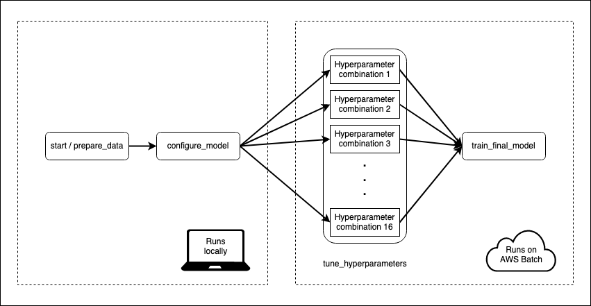

    
```{r setup, include=FALSE}
knitr::opts_chunk$set(eval = FALSE)
```

I have a machine learning model that takes some time to train. Data pre-processing and model fitting can take 15--20 minutes. That's not so bad, but I also want to tune my model to make sure I'm using the best hyper-parameters. With 16 different combinations of hyperparameters and 5-fold cross-validation, my 20 minutes can become a day or more.

Metaflow is an open-source tool from the folks at Netflix that can be used to make this process less painful. It lets me choose which parts of my model training _flow_ I want to execute on the cloud. To speed things up I'm going to ask Metaflow to spin up enough compute resources so that every hyperparameter combination can be evaluated in parallel in separate environments.

The best part is that my _flow_ is pure R code.

I'll go through the details below, but feel free to skip ahead to [the GitHub repository](https://github.com/mdneuzerling/NLPRMetaflow/).

## A toy example: popularity of Urban Dictionary definitions

My use case is a simple NLP project. I'll take around 2.5 million rows of [Urban Dictionary definitions](https://www.kaggle.com/therohk/urban-dictionary-words-dataset) and train an `xgboost` model to predict the popularity of a review, which I'm defining here as the sum of up- and down-votes. I can't say for sure that this model makes any sense or is of any use, but it's a good toy example. 

This data comes to around half a gigabyte, which is small enough for my laptop to handle, but large enough that I can make gains by scaling up or out. The pre-processing steps require tokenising and filtering the text before fitting it to a document-term matrix.

I'm using the `tidymodels` framework to put it all together. A `recipe` generated by my custom `generate_text_processing_recipe` function will handle the pre-processing. A `parsnip` model object will handle the `xgboost` modelling, while the `tune` package will handle hyperparameter tuning, and a `workflow` will combine everything:

```{r modelling-object}
model <- parsnip::boost_tree(
  mtry = tune::tune(),
  trees = tune::tune(),
  tree_depth = tune::tune(),
  sample_size = tune::tune()
) %>%
  parsnip::set_engine("xgboost", nthread = 4) %>%
  parsnip::set_mode("regression")

recipe <- generate_text_processing_recipe(
  interactions ~ definition,
  self$train,
  text_column = definition,
  min_times = 0.001
)

workflow <- workflows::workflow() %>%
  workflows::add_recipe(recipe) %>%
  workflows::add_model(model)
```

Pre-processing and model training has to be done for each fold and for each combination of hyperparameters. With 16 combinations, I'm looking at pre-processing and training 80 models on around 1.6 million rows of data each, with 20% of the data is reserved for evaluating a final model fit.

I'll be evaluating the following hyperparameters, but I haven't invested much thought into this. I'm not concerned at all with the final model, just the process of getting there, so please don't treat these hyperparameters as meaningful in any way.

```{r hyperparameter-grid}
tidyr::expand_grid(
    mtry = c(0.5, 1),
    trees = c(300, 500),
    tree_depth = c(6, 12),
    sample_size = c(0.8, 1.0)
  )
```

## Telling Metaflow what to do

I define a _flow_ which instructs Metaflow how to train my model. Flows are divided into steps, which can be run either locally or on AWS. Every flow must start with a `start` step and end with an `end` step. The `start` step in this flow loads the data from a CSV and splits it into `train` and `test`. The "end" step is a blank, so I've omitted it:



What I like here is that I start my flow locally using data on my laptop, and then seamlessly move into the cloud for the more computationally intensive steps. I don't have to deal with uploading anything to a remote datastore, since Metaflow handles all of that stuff behind the scenes. The cloud works best when I don't have to deal with the cloud myself.

Each step is defined by an `r_function`, which is a function of a single `self` argument. `self` is used to store the state of the execution. My function might set `self$x <- 3`, and then following steps will be able to access `self$x` to retrieve its value. All of my `r_function`s are custom functions stored in my project, so the actual flow code itself looks pretty lean:

```{r whole-plan}
metaflow("NLPRMetaflow") %>%
  step(
    step = "start",
    r_function = prepare_data,
    next_step = "configure_model"
  ) %>%
  step(
    step = "configure_model",
    r_function = configure_model,
    next_step = "tune_hyperparameters",
    foreach = "hyperparameter_indices"
  ) %>%
  step(
    step = "tune_hyperparameters",
    decorator("batch", memory = 15000, cpu = 3, image = ecr_repository),
    r_function = tune_hyperparameters,
    next_step = "train_final_model"
  ) %>%
  step(
    step = "train_final_model",
    join = TRUE,
    decorator("batch", memory = 30000, cpu = 3, image = ecr_repository),
    r_function = train_final_model,
    next_step="end") %>%
  step(step = "end")
```

Heads up: [step names need to be valid Python variable names](https://github.com/Netflix/metaflow/issues/414). I tripped over this a few times when trying to use hyphens.

The `tune_hyperparameters` step splits on the various combinations of hyperparameters, with one job/task per hyperparameter combination, all acting in parallel. This is the purpose of `foreach = "hyperparameter_indices"`. The next step has a `join = TRUE` argument, which tells Metaflow that this step will reconcile the results of the previous split.

Step execution is controlled by `decorator`s. I use a "batch" `decorator` to tell Metaflow that certain steps are to be executed on the cloud using AWS Batch. I also specify the resources I want to use for the computation, including the Docker image used to execute the step.

## There's always a Dockerfile

Metaflow will use `rocker/ml` as a default image for executions on the cloud, and this should cover a lot of machine learning use cases. My project, however, uses a Docker image which provides a reproducible environment for model training. It also provides the helper functions that are used by the Metaflow `flow` in the cloud. [The Dockerfile is available in the GitHub repository](https://github.com/mdneuzerling/NLPRMetaflow/blob/main/Dockerfile), but I'll explain the rough idea below.

I've structured my project as an R package called `NLPRMetaflow`. The dependencies are tracked through the DESCRIPTION file, and also through an `renv` lockfile. By installing the project as a package in the Docker image I can run `library(NLPRMetaflow)` and then the functions in the package will be available on every instance spawned by Metaflow.

The Dockerfile is generic enough that it should work with any DESCRIPTION file and `renv` lock file, subject to some hard-coded version numbers. I start the Dockerfile `FROM rocker/r-ver:4.0.3` so that I have an R installation ready to go. Metaflow uses a Python backend, so I need to make available a Python installation with a few necessary modules. Miniconda is a good choice for a minimal Python distribution. I use environment variables to fix the version numbers of the various Python components.

For the R component I first install system dependencies based on the project/package's DESCRIPTION file. Then I install package dependencies by restoring the `renv` lockfile. This is made substantially faster by using the pre-compiled binaries kindly provided by the [RStudio Package Manager](https://packagemanager.rstudio.com/client/#/). Finally I install the project/package itself, which ensures that all of my helper functions are available in the cloud.

Once the image is built I need to put it somewhere that AWS can find it. Docker Hub is a good choice, but AWS's [Elastic Container Registry](https://docs.aws.amazon.com/AmazonECR/latest/userguide/docker-push-ecr-image.html) is likely faster as it uses S3. I tag every image with the GIT commit hash (`github.sha`) so that Metaflow will always use the correct image.

```{r aws-configuration}
  # AWS configuration
  aws_region <- "ap-southeast-2"
  ecr_repository_name <- "nlprmetaflow"
  git_hash <- system("git rev-parse HEAD", intern = TRUE)
  ecr_repository <- glue(
    "{Sys.getenv('AWS_ACCOUNT_ID')}.dkr.ecr.{aws_region}.amazonaws.com/",
    "{ecr_repository_name}:{git_hash}"
  )
```

Any image location will work for Metaflow, though, as long as the the AWS resources can download it. Use the image location with the repository, that is, use "docker.io/user/image" rather than "user/image".

## Automate the Docker build and push

Building and pushing Docker images is boring, so I use a GitHub Actions workflow to do it for me whenever I `git push`. The workflow authenticates itself to AWS using an IAM role that is restricted to pushing images to AWS Elastic Container Registry. The authentication credentials (my AWS access key ID and secret key) are stored as repository secrets. After authentication the workflow will then build the docker image from my R project/package code, and push it to ECR.

I've stored `ECR_REPOSITORY` as a repository secret here, but that's just so I can use an identical workflow in different repositories. There's nothing secret about the repository name, and it could be hard-coded here.

```
build-and-push-image:
  runs-on: ubuntu-20.04
  name: build-and-push-image
  needs: R-CMD-check

  steps:
  - name: Checkout repository to package subdirectory
    uses: actions/checkout@v2
    with:
      path: package

  - name: Configure AWS credentials
    uses: aws-actions/configure-aws-credentials@v1
    with:
      aws-access-key-id: ${{ secrets.AWS_ACCESS_KEY_ID }}
      aws-secret-access-key: ${{ secrets.AWS_SECRET_ACCESS_KEY }}
      aws-region: ap-southeast-2

  - name: Login to Amazon ECR
    id: login-ecr
    uses: aws-actions/amazon-ecr-login@v1

  - name: Build, tag, and push image to Amazon ECR
    env:
      ECR_REGISTRY: ${{ steps.login-ecr.outputs.registry }}
      ECR_REPOSITORY: ${{ secrets.ECR_REPOSITORY }}
      IMAGE_TAG: ${{ github.sha }}
    run: |
      docker build -t $ECR_REGISTRY/$ECR_REPOSITORY:$IMAGE_TAG package
      docker push $ECR_REGISTRY/$ECR_REPOSITORY:$IMAGE_TAG
```

This job also has a dependency on a standard `R CMD check` job that will check the package and any unit tests it might contain. If there's a failure in that job, the image won't get a chance to build, and I'll receive an email from GitHub telling me that something has gone wrong.

## To the cloud

Metadata's documentation is comprehensive, and explains [the AWS services required to run Metadata flows on the cloud](https://docs.metaflow.org/metaflow-on-aws/metaflow-on-aws). A [CloudFormation template](https://admin-docs.metaflow.org/metaflow-on-aws/deployment-guide/aws-cloudformation-deployment) will set the required resources up quickly, or a [manual deployment](https://admin-docs.metaflow.org/metaflow-on-aws/deployment-guide/manual-deployment) can be used to customise the resources. I chose to manually deploy my cloud resources because I didn't wish to use the metadata component of Metaflow; this is useful for collaboration, but since it's just me I wanted to save money by not using Amazon RDS.

The following resources were needed for my setup:

* AWS S3 stores the results of each Metaflow step^[I put a lifecycle rule on my bucket so that all objects are deleted after 24 hours. I save money, but Metaflow has a shorter memory.].
* AWS EC2 instances provide the compute resources.
* AWS Elastic Container Registry is used to store the images that the Metaflow jobs run on. As I mention above, this isn't strictly necessary.
* AWS Batch is responsible for executing _jobs_ on EC2 instances that live only as long as necessary for the jobs to complete.
* A _Compute Environment_ defines the resources available to AWS Batch. I chose to use spot instances to save money.

I set everything up on AWS following the Metaflow instructions and ran `metaflow configure aws` in a terminal to link everything to my local machine. This part of the configuration was mostly painless. I ran into a few bumps with IAM roles: I'd advise caution when AWS offers to create IAM roles on your behalf --- if you run into problems, try creating your own roles manually.

## Use spot instances to save money

Spot instances can be a lot cheaper than on-demand instances, so I set up a compute environment that exclusively uses spot instances. At this point I was no longer following the Metaflow documentation and I was on my own. This was painful.

A compute environment relies on an "allocation strategy" to determine which instances to launch, but the available strategies are opaque. At times I would request a total of 48 vCPUs, but the compute environment would select instances that total 80 vCPUs. However, AWS accounts are limited by default to 64 vCPUs across all running spot instances. I had to request that this limit be increased to 80 on my account, otherwise my jobs would wait until resources were available.

Overall I found the compute environment setup frustrating. Many settings can't be changed once a compute environment has been created, so I found myself in a trial-and-error loop of creating and deleting environments until a configuration worked. Logs are helpful, if you can find them --- issues with a compute environment have log entries in automatically generated EC2 Auto Scaling Groups, at the bottom of a navigation pane, in a different service, under an "activity" tab.

But none of this is Metaflow's fault! It's a tangent I went down to save a couple of dollars. I got there in the end.

**UPDATE 2020-01-29**: [The latest version of Metaflow supports AWS Fargate as a compute backend to AWS Batch](https://docs.metaflow.org/introduction/release-notes#features). I haven't tried this myself yet, but it looks like an easier (and cheaper) alternative to spot instances. It looks like [a Fargate instance supports up to 4 vCPUs and 30GB of memory](https://docs.aws.amazon.com/AmazonECS/latest/userguide/task-cpu-memory-error.html).

## It's a terrible model

My flow is kept within a function in my project/package. Running the flow is a one-liner: `generate_flow() %>% metaflow::run()`. Log entries^[I started to use a proper logging package, but I noticed that timestamps and task details were automatically prepended by Metaflow. It suffices to log with `message` or `print`.] across all tasks are printed to the R console, and logs from cloud executions are saved to AWS CloudWatch as well, without any configuration on my behalf.

I give each hyperparameter tuning job 4 CPU cores and 15000MB of memory, with a little more memory for the final model train. `xgboost` is the only tool in my code that should be using more than 1 core. It  takes about 2 hours to evaluate a single combination of hyperparameters. Fortunately, this all happens in parallel, so 16 combinations is still about 2 hours. The whole thing finishes in about 3 hours.

The process to get results back from S3 is a little bit cumbersome, as I have to navigate the Metaflow hierarchy of flow -> run -> step -> task -> artifact, using Python-esque syntax.

```{r get-metrics}
flow <- flow_client$new("NLPRMetaflow")
latest_successful_run <- run_client$new(flow, run = flow$latest_successful_run)  
final_model_step <- latest_successful_run$step("end")
final_model_task <- final_model_step$task(task_id = 20) # The last task
metrics <- final_model_task$artifact("metrics")
metrics

#>  .metric .estimator    .estimate
#>  rmse    standard      9.491624e+02
#>  mae     standard      1.398124e+02
#>  rsq     standard      3.258213e-04
```

A root mean squared error of 949. That's bad. That's really bad. For context, the average `interactions` in my whole data set is a little over 100. It's a terrible model. But I can't blame Metaflow for my terrible model.

Determining AWS costs requires some advanced divination techniques, but it looks as though I paid around USD 2 to cover a single run using spot instances.

## Give Metaflow a go

Metaflow is the closest I've ever gotten to seeing the promise of the cloud fulfilled --- on-demand, scalable resources that exist only as long as needed. Once I got past the AWS hurdles I was able to seamlessly transition my machine learning workflow from my laptop to the cloud _halfway through a workflow_, with the complexities handled behind the scenes.

[The MLOps space is flourishing](https://huyenchip.com/2020/12/30/mlops-v2.html), and Metaflow ticks the most important boxes that I look for in tools like this:

* It executes arbitrary code, not frameworks. I don't have to worry about whether there exists a `parsnip` integration, I just write code that uses `parsnip`.
* It lets me use Python _or_ R.
* It's [**very** well-documented](https://docs.metaflow.org/v/r/) with [a number of tutorials that showcase its capabilities](https://docs.metaflow.org/v/r/getting-started/tutorials).
* The devs are friendly and awesome.

## A heads up: Metaflow and list-columns

There's a peculiarity with Metaflow in that it struggles to save with tibbles with list-columns, likely due to some restriction of `reticulate`/Python. These tibbles can appear within a step, but can't be saved to the `self` state variable.

This is a problem when using the `tidymodels` universe. The `rsample` package uses list-columns for cross-validation folds and the `tune` package relies on list-columns for its results. I work around this by using a seed to generate the folds so that I can always recreate them. I also use a custom function `select_best_hyperparameters` function for selecting optimal hyperparameters.

```{r hyperparameter-tuning}
folds <- withr::with_seed(20201225, rsample::vfold_cv(self$train, v = 5))

self$hyperparameter_results <- self$workflow %>%
 tune::tune_grid(
   resamples = folds,
   grid = hyperparameters_to_use
 ) %>% tune::collect_metrics()

# Later, in the train_final_model step
self$optimal_hyperparameters <- select_best_hyperparameters(
  self$collected_hyperparameter_results,
  metric = "rmse"
)
```

***
```{r sessioninfo, eval=TRUE}
devtools::session_info()
```