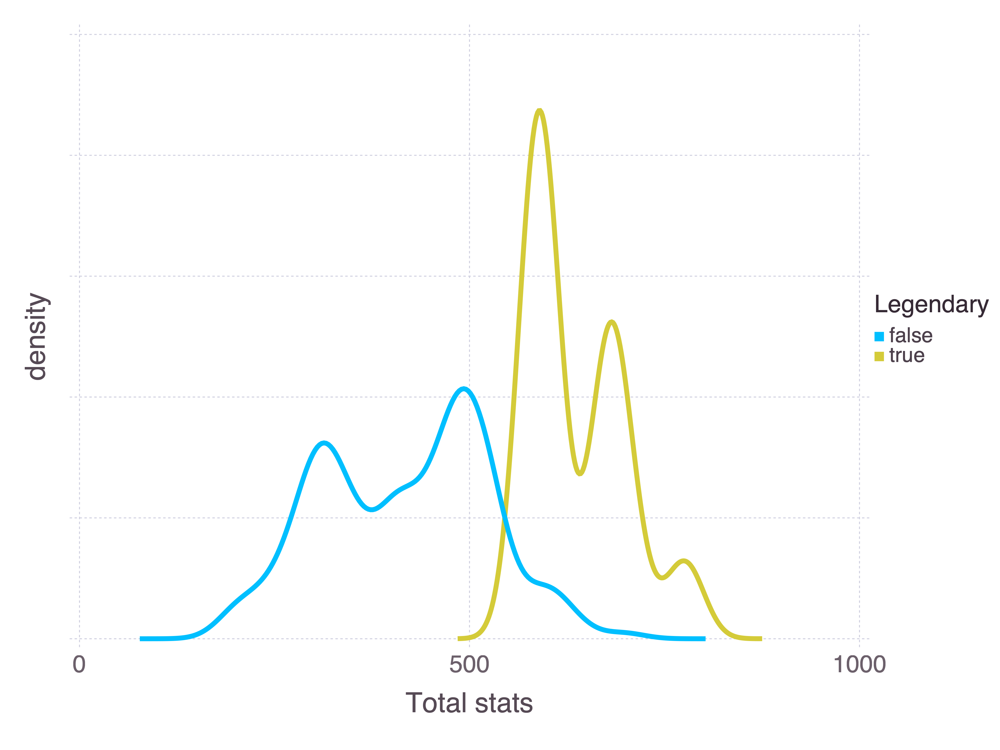
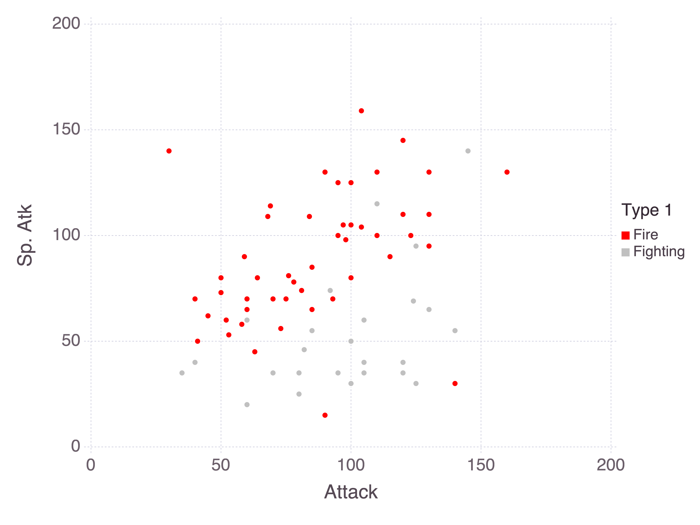
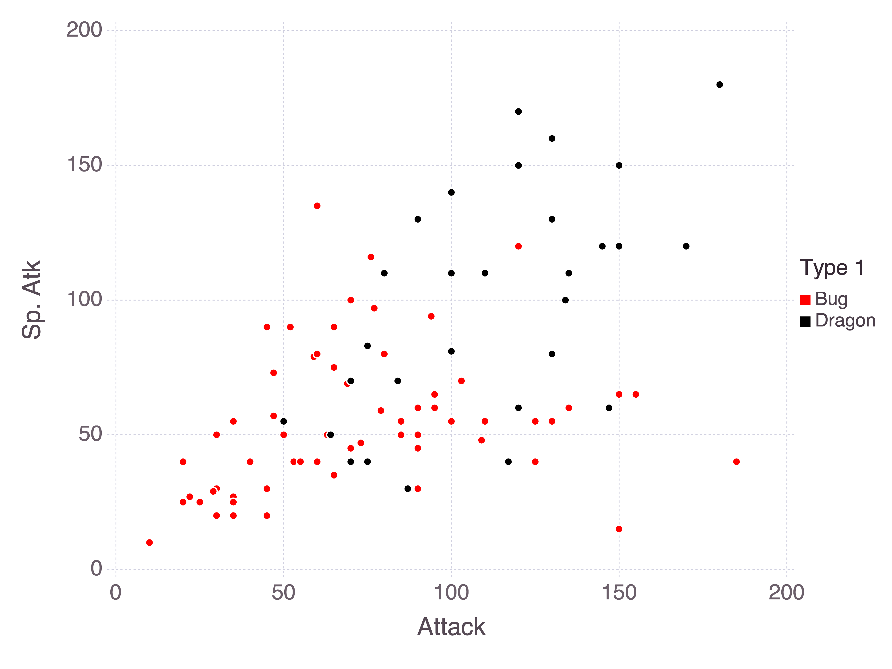
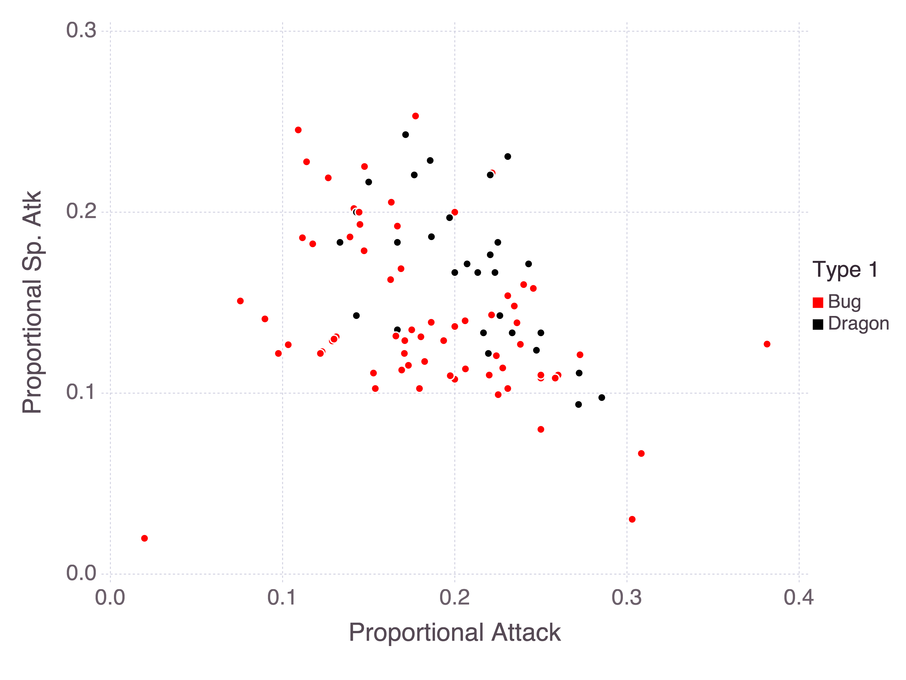

I have a simple machine learning workflow that I recreate whenever I'm testing something new. I take some interesting data and a target, throw in some pre-processing, tune hyperparameters with cross-validation, and train a random forest. It's all the basic ingredients for a machine learning model. Since I like Julia so much, I'll recreate my simple machine learning workflow with Julia's `MLJ` package.

`MLJ` is like R's `parsnip`, in that it unifies many machine learning packages with disparate APIs under a single syntactic umbrella. And, like Python's `sklearn`, it also supports pre-processing pipelines and hyperparameter optimisation.

## Creating a Julia project

I always give some thought to project workflow, so this was a good opportunity to explore *the Julia way of setting up a project*.

Just as in R, there's a strong tendency with Julia to create every project as a *package*. Julia's inbuilt package manager `Pkg` (a package itself) makes it easy to set up and `activate` a new package environment:

<div class="highlight">

<pre class='chroma'><code class='language-r' data-lang='r'>Pkg.generate("MyJuliaProject")
Pkg.activate("MyJuliaProject")
cd("MyJuliaProject") # change working directory</code></pre>

</div>

Julia uses environments, similar to Python's virtual environments, to keep track of dependencies and their versions. An environment has its own versioned packages, so that I don't need to worry if I need version 0.20 of `DataFrames` for one project and 0.10 for another project. If I try to load a package Julia will first look for the package in the "MyJuliaProject" environment, and if it's not available there then Julia will look into my base environment ("v1.5" for my installed version of Julia). Activating a package/project activates its environment, and I find that combining these two concepts into one is a good simplification. I can `add` packages to my project's environment:

```julia
Pkg.add(["DataFrames", "DataFramesMeta", "CSV", "Chain", "MLJ", "DecisionTree",
         "MLJDecisionTreeInterface", "Lathe", "Gadfly"])
```

Or I can use `Pkg.resolve()` to try to get things into alignment. I find that Julia is pretty good at catching if my project uses packages I haven't added.

Unlike Python, Julia's environments are built into the language. It's possible that this is why I find Julia's environments so easy I to use while I struggle with Python's virtual environments. I don't have to mess around with my PATH variable or worry about running a command *before* I start Julia, since everything is done within Julia's inbuilt `Pkg`, which is itself a Julia package.

My work above created a "MyJuliaProject" directory with two important metadata files:

-   Project.toml is similar to R's `DESCRIPTION` files, in that it tracks package metadata (author, name, etc.) and high-level dependencies.
-   Manifest.toml is similar to R's `renv.lock` or Python's `requirements.txt`, in that it tracks detailed dependency information. Just as with the analogues in other languages, this file should never be touched by a human being.

Together these two metadata files can recreate the project/package environment. Julia handles all the complexities about where the environments are stored on the disk, and makes sure that if two environments share a dependency then it isn't installed twice.

At this point I could lean into the package structure and start creating functions in a `src/` subdirectory and unit tests in the `tests/` subdirectory, but I don't believe that I'm writing enough code to justify that overhead. Instead I'll stick to a single script. In any case, if I ever return to this project on any system I can `activate` it and recover all of the dependencies I'm using today.

## A little bit of EDA

My data set consists of [800 Pokémon](https://www.kaggle.com/rounakbanik/pokemon). Pokémon can have one or two types which categorise what kind of Pokémon they are, according to their abilities or natural environments. For example, Charmander is a pure fire type Pokémon, whereas Charmander's final evolution Charizard is Fire/Flying. Pokémon also have attributes known as "stats" which quantify their traits, and these are loosely related to their types. For example, rock Pokémon tend to have high defence, whereas fighting Pokémon tend to have high attack.

A natural candidate for a model, then, is whether or not we can predict a Pokémon's first type from its stats. Let's start by loading the data, along with the Julia packages we'll need along the way:

```julia
using DataFrames
using DataFramesMeta
using Chain
using CSV
using MLJ
using Lathe.preprocess: TrainTestSplit
using Gadfly

# Roughly equivalent to ggplot themes
Gadfly.push_theme(
    style(
        background_color = colorant"white",
        line_width = 1mm,
        minor_label_font_size = 14pt,
        major_label_font_size = 16pt,
        key_title_font_size = 14pt,
        key_label_font_size = 12pt
    )
)
```

```julia
pokemon = CSV.read("data/pokemon.csv", DataFrame)
#> 800×13 DataFrame. Omitted printing of 7 columns
#> │ Row │ #     │ Name                  │ Type 1  │ Type 2  │ Total │ HP    │
#> │     │ Int64 │ String                │ String  │ String? │ Int64 │ Int64 │
#> ├─────┼───────┼───────────────────────┼─────────┼─────────┼───────┼───────┤
#> │ 1   │ 1     │ Bulbasaur             │ Grass   │ Poison  │ 318   │ 45    │
#> │ 2   │ 2     │ Ivysaur               │ Grass   │ Poison  │ 405   │ 60    │
#> │ 3   │ 3     │ Venusaur              │ Grass   │ Poison  │ 525   │ 80    │
#> │ 4   │ 3     │ VenusaurMega Venusaur │ Grass   │ Poison  │ 625   │ 80    │
#> │ 5   │ 4     │ Charmander            │ Fire    │ missing │ 309   │ 39    │
#> │ 6   │ 5     │ Charmeleon            │ Fire    │ missing │ 405   │ 58    │
#> │ 7   │ 6     │ Charizard             │ Fire    │ Flying  │ 534   │ 78    │
#> ⋮
#> │ 793 │ 716   │ Xerneas               │ Fairy   │ missing │ 680   │ 126   │
#> │ 794 │ 717   │ Yveltal               │ Dark    │ Flying  │ 680   │ 126   │
#> │ 795 │ 718   │ Zygarde50% Forme      │ Dragon  │ Ground  │ 600   │ 108   │
#> │ 796 │ 719   │ Diancie               │ Rock    │ Fairy   │ 600   │ 50    │
#> │ 797 │ 719   │ DiancieMega Diancie   │ Rock    │ Fairy   │ 700   │ 50    │
#> │ 798 │ 720   │ HoopaHoopa Confined   │ Psychic │ Ghost   │ 600   │ 80    │
#> │ 799 │ 720   │ HoopaHoopa Unbound    │ Psychic │ Dark    │ 680   │ 80    │
#> │ 800 │ 721   │ Volcanion             │ Fire    │ Water   │ 600   │ 80    │
```

One thing I really like about the way this `DataFrame` displays is that, since `Type 2` is allowed to be `missing`, the data type for the column has a question mark after `String`. This indicates that it's actually of type `Union{Missing, String}`, since `missing` has its own data type in Julia. It's a nice touch.

Certain Pokémon are *legendary*. They're unique, and can usually only be encountered through some specific plot line or event. They also tend to be much more powerful than other Pokémon. We can use the sum of a Pokémon's stats as a measure of how powerful it is:

```julia
plot(
    pokemon,
    x = "Total",
    color = "Legendary",
    Geom.density,
    Guide.yticks(label = false),
    Guide.xlabel("density"),
    Guide.xlabel("Total stats")
)
```



Pokémon stats are HP (health), attack, defence, special attack, special defence, and speed. There's a distinction here between special and non-special attack and defence, where "special" is roughly defined as "supernatural". For example, a kick is an attack, whereas a breath of fire is special. Comparing the attack attributes for fire and fighting Pokémon makes the distinction clear:

```julia
@chain pokemon begin
    @where in(["Fire", "Fighting"]).(:"Type 1")
    plot(
        x = "Attack",
        y = "Sp. Atk",
        color = "Type 1",
        Geom.point,
        Scale.color_discrete_manual("red", "silver")
    )
end
```



It's not always so easy to separate types. Both fire and psychic Pokémon rely heavily on special attacks, and so we would expect their special attack stats to be similar.

## Manipulating data in Julia

I want to be sure that the `Total` stat is genuinely the sum of all stats. I could instead choose to calculate the value myself rather than relying on the provided value, but I find that it's rarely a good idea to *silently* correct data. This is just a toy example, but in general if something is wrong with my data then I want to know about it. Besides, it's a good introduction to how data manipulation works in Julia.

Julia supports piping natively with `|>`, which is improved through the `Pipe` package, but an emerging alternative is `Chain`. With `Chain` every operation is placed on a new line, and the result of each line is piped through to the next:

```julia
@chain pokemon begin
    @with(:Total .== :HP .+ :Attack .+ :Defense .+ :"Sp. Atk" .+ :"Sp. Def" .+ :Speed)
    all
    @assert
end
```

The first line acts similarly to the `with` base function in R, in that it temporarily changes the environment such that I can refer to columns without referring to the `pokemon` data frame each time. The [`@`](https://rdrr.io/r/base/slotOp.html) signals that this is a *macro*, which means that I'm using metaprogramming, ie. manipulating the input before evaluating it. The [`:`](https://rdrr.io/r/base/Colon.html) character is used here to specify that these are symbols, here referring to column names. Overall I'm creating a vector of Boolean values, telling me for each Pokémon whether the `Total` stat is correct.

What stands out here for R and Python users is the dot before each operator[^1], such as `.==` and `.+`. This is a concept known as [*loop fusion*](https://julialang.org/blog/2017/01/moredots/). Recall that with Julia, I don't need to avoid `for` loops like I would with `numpy` or R, where vectorised functions implemented in C/C++ are generally preferred. The `.` modifier here tells Julia to evaluate this operation in a `for` loop and, moreover, to evaluate all of the operations together. This works because every row is independent, so it makes sense to sum all of the stats for a single Pokémon in one iteration of the `for` loop.

As a mental model, I can vectorise *any* operation or user-defined function in Julia with loop fusion. Sure, in other languages I can vectorise any function with `Vectorize` (R) or `numpy.vectorize` (Python), but there are performance considerations --- `Vectorize` is a wrapper for `mapply`, and `numpy.vectorize` effectively implements a `for` loop. Julia's `for` loops are (subject to conditions) performant, whereas the standard advice for R and `numpy` is to not iterate.

There's a learning curve here in terms of getting used to loop fusion. But the alternative is keeping a mental record of which functions are vectorised and which ones aren't. Or writing your own vectorised functions in C/C++. Or relying on package authors to have written performant vectorised operations. Or just taking the performance hit of iterating in R or Python. I'd much rather take the loop fusion learning curve!

The final steps of this chain are an `all` function, which collapses an array of Booleans to a singleton, and an `@assert` which confirms that the output of the `all` function is `true`.

## A straightforward random forest

I'll start by training a random forest with (mostly) default values. `MLJ` follows the Python tradition of separating out an `X` data frame of training data and a `y` target column. I don't think there's anything *wrong* with this approach, but I feel like I've been spoilt by R's use of formulae. It's nice to keep all of the data together and not have to track multiple variables per data set. It also makes sense to me that pulling out a column and treating it as a "target variable" is a property of the model, not the data. But I'm nitpicking here --- MLJ is *excellent*, and I shouldn't fault it for not having an R convenience that I'm used to.

I'll keep my `X` data set to just the stat columns and the `:Total`:

```julia
X = @select(pokemon, :Total, :HP, :Attack, :Defense, :"Sp. Atk", :"Sp. Def", :Speed)
y = pokemon[!, "Type 1"]
```

I couldn't find a function like [`dplyr::pull`](https://dplyr.tidyverse.org/reference/pull.html) in the `DataFrames` or `DataFramesMeta` packages. This function would be used to extract a column of a data frame as an array, rather than as a column. I instead use the `[!, "Type 1"]` syntax to pull the target values.

Recall that `MLJ` is a unified interface for disparate machine learning packages in Julia. I first need to `@load` a `RandomForestClassifier` from the `DecisionTree` package. From there I can define a classifier with 1000 trees.

```julia
rf_classifier = @load(RandomForestClassifier, pkg = "DecisionTree")
rf = rf_classifier(n_trees = 1000)
#> RandomForestClassifier(
#>     max_depth = -1,
#>     min_samples_leaf = 1,
#>     min_samples_split = 2,
#>     min_purity_increase = 0.0,
#>     n_subfeatures = -1,
#>     n_trees = 1000,
#>     sampling_fraction = 0.7,
#>     pdf_smoothing = 0.0) @140
```

I could move onto a `fit`/`predict` workflow here, but instead I'll just `evaluate` the model to get an idea of its performance. By default, `evaluate` will use 6-fold cross-validation to evaluate the model, but I could control this by manually specifying folds, asking for an evaluation on a hold-out set instead, or even providing my own [resampling strategy](https://alan-turing-institute.github.io/MLJ.jl/stable/evaluating_model_performance/#Custom-resampling-strategies-1).

Note as well that I'm passing `categorical(y)`, roughly equivalent to R's [`as.factor(y)`](https://rdrr.io/r/base/factor.html). I can choose the measures under which the model is evaluated --- in my case, I'm asking for simple classification `accuracy`. Normally the model would output an array of probabilities (one for each Pokémon type) but with the `predict_mode` operation I'm instead using the most probable type for my measure. There are other measures for evaluating accuracy, but nothing so easily interpretable as simple accuracy.

```julia
evaluate(rf, X, categorical(y), operation = predict_mode, measure = accuracy)
#> Evaluating over 6 folds: 100%[=========================] Time: 0:00:18
#> ┌───────────────┬───────────────┬────────────────────────────────────────────┐
#> │ _.measure     │ _.measurement │ _.per_fold                                 │
#> ├───────────────┼───────────────┼────────────────────────────────────────────┤
#> │ Accuracy @412 │ 0.216         │ [0.291, 0.201, 0.233, 0.241, 0.195, 0.135] │
#> └───────────────┴───────────────┴────────────────────────────────────────────┘
#> _.per_observation = [missing]
#> _.fitted_params_per_fold = [ … ]
#> _.report_per_fold = [ … ]</code></pre>
```

Given that there are 18 Pokémon types, 21.6% classification accuracy is pretty good. But let's see if we can improve that.

## Pre-processing in `MLJ`

`MLJ` developers [have clearly given a lot of thought to model composition](https://arxiv.org/abs/2012.15505). Similar to `sklearn`, *pipelines* can be used to link together transformers and models.

I'm going to implement a very simple pipeline with a single stateless transformer. For stateful transformers, that is, transformers with `fit` and `transform` functions, [the source code for the inbuilt `OneHotEncoder` looks to be a good template](https://github.com/alan-turing-institute/MLJModels.jl/blob/98618d7be53f72054de284fa1796c5292d9071bb/src/builtins/Transformers.jl#L1081). In general [I'm only scratching the surface of `MLJ`'s capacity to compose models](https://alan-turing-institute.github.io/MLJ.jl/dev/composing_models/).

In my random forest I included all stats along with the `Total` as predictors, but it would make more sense to view each stat as a proportion of the `Total`. This way the model can infer how much *weight* is given to each stat. Consider, for example, bug and dragon Pokémon with their attack and special attack stats:



As a rule of thumb, bug Pokémon tend to be weaker while dragon Pokémon tend to be stronger. So we could consider instead these stats as proportions of the sum of stats:



I don't know if this will help tease apart these classes, but it's worth a try. This (pure) function takes in a data frame and scales the stats. Notice that I need to use the special `cols` function to include spaces in column names. The R equivalent would be to wrap the column names in backticks, but there doesn't appear to be a general Julia solution. `cols` appears to be specific to the `DataFramesMeta` package.

```julia
function scale_stats(df::DataFrame)
    @select(df,
        HP = :HP ./ :Total,
        Attack = :Attack ./ :Total,
        Defencese = :Defense ./ :Total, 
        cols("Sp. Atk") = :"Sp. Atk" ./ :Total,
        cols("Sp. Def") = :"Sp. Def" ./ :Total,
        Speed = :Speed ./ :Total,
        Total = :Total
    )
end
```

I define a pipeline with the `@pipeline` macro and give it a nice name:

```julia
pipe = @pipeline(
    scale_stats,
    rf_classifier(n_trees = 1000),
    name = "random_forest_with_proportional_stats"
)
#> random_forest_with_proportional_stats(
#>     random_forest_classifier = RandomForestClassifier(
#>             max_depth = -1,
#>             min_samples_leaf = 1,
#>             min_samples_split = 2,
#>             min_purity_increase = 0.0,
#>             n_subfeatures = -1,
#>             n_trees = 1000,
#>             sampling_fraction = 0.7,
#>             pdf_smoothing = 0.0)) @548
```

## Self-tuning pipes

I might also eke out a little more performance by tuning my random forest. Two good candidate hyperparameters to tune in a random forest are `max_depth` (how deep the individual trees are allowed to grow) and `n_subfeatures` (how many randomly selected features are allowed as candidates for each split).

`MLJ` asks that I define a `range` for each hyperparameter I wish to tune. The input for each `range` is the pipeline that I'm intending to tune, along with the variable --- note that I'm choosing the `max_depth` parameter within the `random_forest_classifier` within the pipe. Finally I specify the values. I explicitly provide the values I wish to test, but [there are alternative methods](https://alan-turing-institute.github.io/MLJ.jl/stable/tuning_models/).

```julia
max_depth_range = range(
    pipe,
    :(random_forest_classifier.max_depth),
    values = [-1, 10, 20]
)
n_subfeatures_range = range(
    pipe,
    :(random_forest_classifier.n_subfeatures),
    values = [-1, 2]
)
```

With the ranges I can create a `TunedModel` from my pipeline. I'm specifying cross-validation as the resampling method, along with the same `operation` and `measure` as before.

```julia
tuned_pipe = TunedModel(
    model = pipe,
    resampling = CV(nfolds=5),
    tuning = Grid(),
    range = [max_depth_range, n_subfeatures_range],
    operation = predict_mode,
    measure = accuracy
)
#> ProbabilisticTunedModel(
#>     model = random_forest_with_proportional_stats(
#>             random_forest_classifier = RandomForestClassifier @267),
#>     tuning = Grid(
#>             goal = nothing,
#>             resolution = 10,
#>             shuffle = true,
#>             rng = Random._GLOBAL_RNG()),
#>     resampling = CV(
#>             nfolds = 5,
#>             shuffle = false,
#>             rng = Random._GLOBAL_RNG()),
#>     measure = Accuracy(),
#>     weights = nothing,
#>     operation = MLJModelInterface.predict_mode,
#>     range = MLJBase.NominalRange{Int64,N} where N[NominalRange{Int64,…} @519, NominalRange{Int64,…} @770],
#>     selection_heuristic = MLJTuning.NaiveSelection(nothing),
#>     train_best = true,
#>     repeats = 1,
#>     n = nothing,
#>     acceleration = CPU1{Nothing}(nothing),
#>     acceleration_resampling = CPU1{Nothing}(nothing),
#>     check_measure = true,
#>     cache = true) @253
```

A core concept of `MLJ` is a `machine`, which combines a model with data. A machine is what can be passed through `fit` and `predict`, and can store learned parameters. I'll define an `tuned_pipe_machine` from my `tuned_pipe`, along with `X` and `categorical(y)`. This is what MLJ refers to as a *self-tuning pipe* --- when I `fit!` this machine, it will (by default) first use cross-validation to tune the hyperparameters, and then it will use the best hyperparameters to train a final model on all available data. I'm going to pass a value to the `rows` argument to hold 30% of the data back for a final evaluation, following the general principle that it's a bad idea to validate on the same data used for model tuning.

## Fitting the final model

Note that the `fit!` function ends with [`!`](https://rdrr.io/r/base/Logic.html). This is a Julia convention that signals to the user that the function modifies at least one of its arguments in place (in this case, the `tuned_pipe_machine` is fit). [I've spoken about this before](https://mdneuzerling.com/post/first-impressions-of-julia-from-an-r-user/), but I maintain that this convention is hugely powerful for Julia. In other languages I'm often left trying to remember which functions manipulate their inputs, but with Julia I don't have to keep that mental record.

```julia
tuned_pipe_machine = machine(tuned_pipe, X_train, categorical(y_train))
train, test = partition(eachindex(y), 0.7, shuffle=true)
fit!(tuned_pipe_machine, rows = train)
#> [ Info: Training Machine{ProbabilisticTunedModel{Grid,…},…} @829.
#> [ Info: Attempting to evaluate 6 models.
#> Evaluating over 6 metamodels: 100%[=========================] Time: 0:00:14
#> Machine{ProbabilisticTunedModel{Grid,…},…} @829 trained 1 time; caches data
#>   args: 
#>     1:  Source @008 ⏎ `Table{AbstractArray{Count,1}}`
#>     2:  Source @553 ⏎ `AbstractArray{Multiclass{18},1}`
```

I can have a look at my fitted parameters with `fitted_params`. It's interesting to note that the best model didn't use the default parameters for the two ranges I provided. I have shallow trees and only 2 `n_subfeatures`.

```julia
fitted_params(tuned_pipe_machine).best_model
#> random_forest_with_proportional_stats(
#>     random_forest_classifier = RandomForestClassifier(
#>             max_depth = 10,
#>             min_samples_leaf = 1,
#>             min_samples_split = 2,
#>             min_purity_increase = 0.0,
#>             n_subfeatures = 2,
#>             n_trees = 1000,
#>             sampling_fraction = 0.7,
#>             pdf_smoothing = 0.0)) @654
```

I withheld 30% of my data for a final evaluation, so let's see it:

```julia
preds = predict_mode(tuned_pipe_machine, X[test, :])
accuracy(preds, categorical(y[test]))
#> 0.3583333333333333
```

36% is pretty good! But with a data set so small I wouldn't put too much faith in this. I imagine that if I were to run the process again I would likely see some very different numbers.

## Final thoughts on `MLJ`

I'm a big fan of `MLJ`. I feel like I've only scratched the surface of its capabilities. The unified interface to disparate models is very well thought out, and the pipelines are nice and easy to build. I wish I had chosen some data that warranted a custom stateful transformer, so I could implement my own `fit` and `transform` methods.

Coming from R, I do miss having the ability to define a model with a `formula`. It's a nice feature that I wish other languages would pick up. In my use case, I could pass a formula `:"Type 1" ~ :HP + :Attack + ...` and then I wouldn't need to split my data into X and y, or drop columns before feeding my data into the machine. But I'm nitpicking at this point.

What really struck me is how *mature* `MLJ` is. I keep being told that Julia shouldn't be used because it doesn't have the ecosystem that Python or R have. And while I'm sure that the number of Julia packages falls short of PyPI or CRAN, `MLJ` seems to cover most classical machine learning use cases and seems very extensible. Support for custom transformers, custom resampling, and custom metrics is all there. I would feel confident using `MLJ` for a "real" project.

Additionally, at one point I was struggling to understand the cross-validation approach that `MLJ` uses and so I reached out to the developers via Slack. They were very patient in explaining things to me, even when I was really struggling to understand. It's always a positive sign when the people behind a project are good. So thank you Anthony Blaom and Samuel Okon!

------------------------------------------------------------------------

<div class="highlight">

<pre class='chroma'><code class='language-r' data-lang='r'><span class='nf'>devtools</span><span class='nf'>::</span><span class='nf'><a href='https://rdrr.io/pkg/sessioninfo/man/session_info.html'>session_info</a></span><span class='o'>(</span><span class='o'>)</span>
<span class='c'>#&gt; ─ Session info ───────────────────────────────────────────────────────────────</span>
<span class='c'>#&gt;  setting  value                       </span>
<span class='c'>#&gt;  version  R version 4.0.3 (2020-10-10)</span>
<span class='c'>#&gt;  os       macOS Big Sur 10.16         </span>
<span class='c'>#&gt;  system   x86_64, darwin17.0          </span>
<span class='c'>#&gt;  ui       X11                         </span>
<span class='c'>#&gt;  language (EN)                        </span>
<span class='c'>#&gt;  collate  en_AU.UTF-8                 </span>
<span class='c'>#&gt;  ctype    en_AU.UTF-8                 </span>
<span class='c'>#&gt;  tz       Australia/Melbourne         </span>
<span class='c'>#&gt;  date     2021-03-02                  </span>
<span class='c'>#&gt; </span>
<span class='c'>#&gt; ─ Packages ───────────────────────────────────────────────────────────────────</span>
<span class='c'>#&gt;  package     * version     date       lib</span>
<span class='c'>#&gt;  assertthat    0.2.1       2019-03-21 [1]</span>
<span class='c'>#&gt;  callr         3.5.1       2020-10-13 [1]</span>
<span class='c'>#&gt;  cli           2.3.0       2021-01-31 [1]</span>
<span class='c'>#&gt;  crayon        1.4.0       2021-01-30 [1]</span>
<span class='c'>#&gt;  desc          1.2.0       2018-05-01 [1]</span>
<span class='c'>#&gt;  devtools      2.3.2       2020-09-18 [1]</span>
<span class='c'>#&gt;  digest        0.6.27      2020-10-24 [1]</span>
<span class='c'>#&gt;  downlit       0.2.1       2020-11-04 [1]</span>
<span class='c'>#&gt;  ellipsis      0.3.1       2020-05-15 [1]</span>
<span class='c'>#&gt;  evaluate      0.14        2019-05-28 [1]</span>
<span class='c'>#&gt;  fansi         0.4.2       2021-01-15 [1]</span>
<span class='c'>#&gt;  fs            1.5.0       2020-07-31 [1]</span>
<span class='c'>#&gt;  glue          1.4.2       2020-08-27 [1]</span>
<span class='c'>#&gt;  htmltools     0.5.1.1     2021-01-22 [1]</span>
<span class='c'>#&gt;  hugodown      0.0.0.9000  2021-02-05 [1]</span>
<span class='c'>#&gt;  JuliaCall     0.17.2.9000 2021-02-21 [1]</span>
<span class='c'>#&gt;  knitr         1.31        2021-01-27 [1]</span>
<span class='c'>#&gt;  lifecycle     0.2.0       2020-03-06 [1]</span>
<span class='c'>#&gt;  magrittr      2.0.1       2020-11-17 [1]</span>
<span class='c'>#&gt;  memoise       1.1.0       2017-04-21 [1]</span>
<span class='c'>#&gt;  pkgbuild      1.2.0       2020-12-15 [1]</span>
<span class='c'>#&gt;  pkgload       1.1.0       2020-05-29 [1]</span>
<span class='c'>#&gt;  prettyunits   1.1.1       2020-01-24 [1]</span>
<span class='c'>#&gt;  processx      3.4.5       2020-11-30 [1]</span>
<span class='c'>#&gt;  ps            1.5.0       2020-12-05 [1]</span>
<span class='c'>#&gt;  purrr         0.3.4       2020-04-17 [1]</span>
<span class='c'>#&gt;  R6            2.5.0       2020-10-28 [1]</span>
<span class='c'>#&gt;  Rcpp          1.0.6       2021-01-15 [1]</span>
<span class='c'>#&gt;  remotes       2.2.0       2020-07-21 [1]</span>
<span class='c'>#&gt;  rlang         0.4.10      2020-12-30 [1]</span>
<span class='c'>#&gt;  rmarkdown     2.7.1       2021-02-21 [1]</span>
<span class='c'>#&gt;  rprojroot     2.0.2       2020-11-15 [1]</span>
<span class='c'>#&gt;  sessioninfo   1.1.1       2018-11-05 [1]</span>
<span class='c'>#&gt;  stringi       1.5.3       2020-09-09 [1]</span>
<span class='c'>#&gt;  stringr       1.4.0       2019-02-10 [1]</span>
<span class='c'>#&gt;  testthat      3.0.1       2020-12-17 [1]</span>
<span class='c'>#&gt;  usethis       2.0.0       2020-12-10 [1]</span>
<span class='c'>#&gt;  vctrs         0.3.6       2020-12-17 [1]</span>
<span class='c'>#&gt;  withr         2.4.1       2021-01-26 [1]</span>
<span class='c'>#&gt;  xfun          0.21        2021-02-10 [1]</span>
<span class='c'>#&gt;  yaml          2.2.1       2020-02-01 [1]</span>
<span class='c'>#&gt;  source                                      </span>
<span class='c'>#&gt;  CRAN (R 4.0.2)                              </span>
<span class='c'>#&gt;  CRAN (R 4.0.2)                              </span>
<span class='c'>#&gt;  CRAN (R 4.0.2)                              </span>
<span class='c'>#&gt;  CRAN (R 4.0.2)                              </span>
<span class='c'>#&gt;  CRAN (R 4.0.2)                              </span>
<span class='c'>#&gt;  CRAN (R 4.0.2)                              </span>
<span class='c'>#&gt;  CRAN (R 4.0.2)                              </span>
<span class='c'>#&gt;  CRAN (R 4.0.2)                              </span>
<span class='c'>#&gt;  CRAN (R 4.0.2)                              </span>
<span class='c'>#&gt;  CRAN (R 4.0.1)                              </span>
<span class='c'>#&gt;  CRAN (R 4.0.2)                              </span>
<span class='c'>#&gt;  CRAN (R 4.0.2)                              </span>
<span class='c'>#&gt;  CRAN (R 4.0.2)                              </span>
<span class='c'>#&gt;  CRAN (R 4.0.2)                              </span>
<span class='c'>#&gt;  Github (r-lib/hugodown@4ed6e09)             </span>
<span class='c'>#&gt;  Github (Non-Contradiction/JuliaCall@2774ae5)</span>
<span class='c'>#&gt;  CRAN (R 4.0.2)                              </span>
<span class='c'>#&gt;  CRAN (R 4.0.2)                              </span>
<span class='c'>#&gt;  CRAN (R 4.0.2)                              </span>
<span class='c'>#&gt;  CRAN (R 4.0.2)                              </span>
<span class='c'>#&gt;  CRAN (R 4.0.2)                              </span>
<span class='c'>#&gt;  CRAN (R 4.0.2)                              </span>
<span class='c'>#&gt;  CRAN (R 4.0.2)                              </span>
<span class='c'>#&gt;  CRAN (R 4.0.2)                              </span>
<span class='c'>#&gt;  CRAN (R 4.0.2)                              </span>
<span class='c'>#&gt;  CRAN (R 4.0.2)                              </span>
<span class='c'>#&gt;  CRAN (R 4.0.2)                              </span>
<span class='c'>#&gt;  CRAN (R 4.0.2)                              </span>
<span class='c'>#&gt;  CRAN (R 4.0.2)                              </span>
<span class='c'>#&gt;  CRAN (R 4.0.2)                              </span>
<span class='c'>#&gt;  Github (rstudio/rmarkdown@f8c23b6)          </span>
<span class='c'>#&gt;  CRAN (R 4.0.2)                              </span>
<span class='c'>#&gt;  CRAN (R 4.0.2)                              </span>
<span class='c'>#&gt;  CRAN (R 4.0.2)                              </span>
<span class='c'>#&gt;  CRAN (R 4.0.2)                              </span>
<span class='c'>#&gt;  CRAN (R 4.0.2)                              </span>
<span class='c'>#&gt;  CRAN (R 4.0.2)                              </span>
<span class='c'>#&gt;  CRAN (R 4.0.2)                              </span>
<span class='c'>#&gt;  CRAN (R 4.0.2)                              </span>
<span class='c'>#&gt;  CRAN (R 4.0.2)                              </span>
<span class='c'>#&gt;  CRAN (R 4.0.2)                              </span>
<span class='c'>#&gt; </span>
<span class='c'>#&gt; [1] /Library/Frameworks/R.framework/Versions/4.0/Resources/library</span></code></pre>

</div>

[^1]: The `@.` macro can apply these dots automatically to every operation, which makes things much more readable. I'm avoiding it here because I want to make the dots more noticeable.

