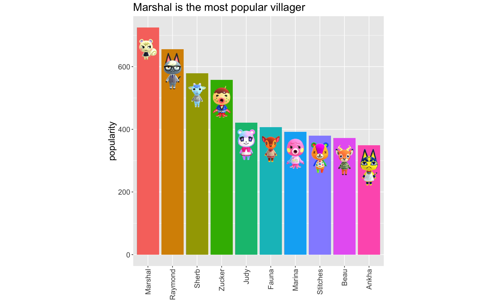
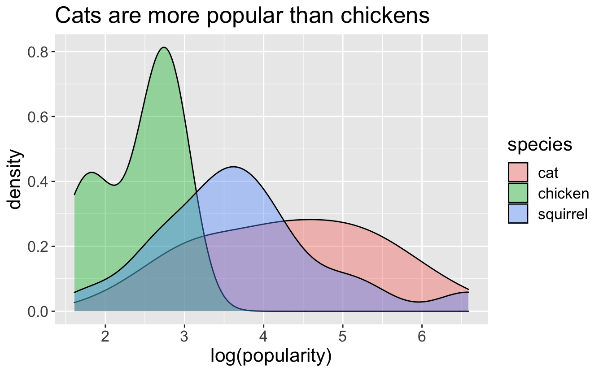
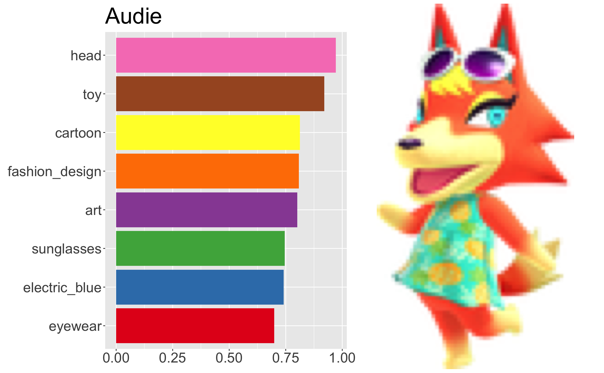
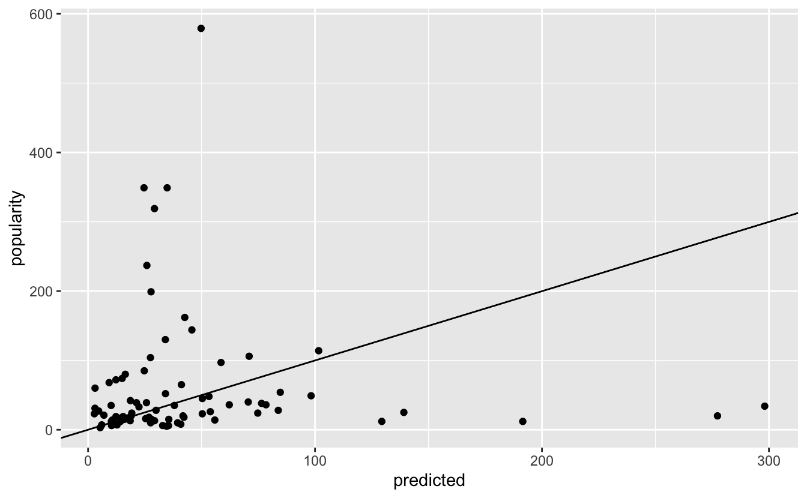
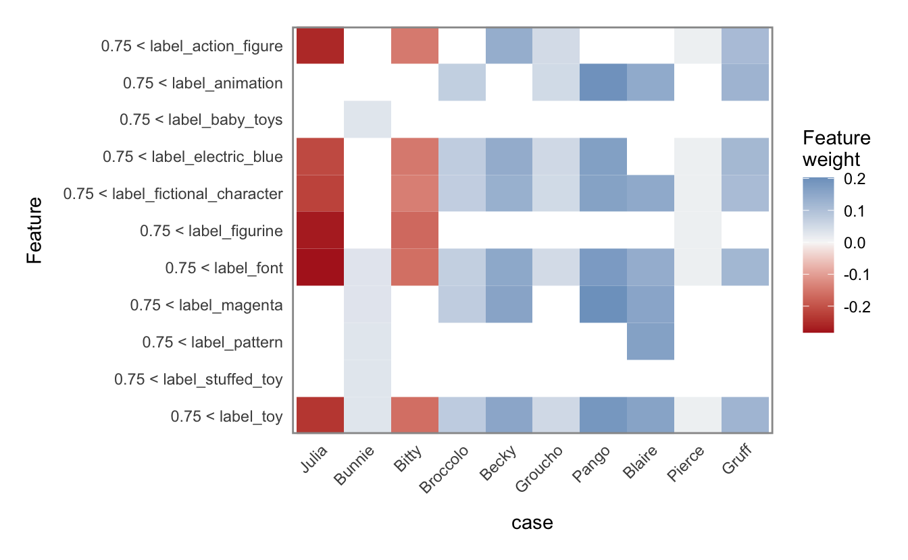

*Animal Crossing: New Horizons* kept me sane throughout the first Melbourne COVID lockdown. Now, in lockdown 4, it seems right that I should look back at this cheerful, relaxing game and do some data stuff. I'm going to take the *Animal Crossing* villagers in the [Tidy Tuesday Animal Crossing dataset](https://github.com/rfordatascience/tidytuesday/blob/master/data/2020/2020-05-05/readme.md) and combine it with survey data from the [Animal Crossing Portal](https://www.animalcrossingportal.com/games/new-horizons/guides/villager-popularity-list.php#/), giving each villager a measure of popularity. I'll use the [Google Cloud Vision API](https://cloud.google.com/vision) to annotate each of the villager thumbnails, and with these train a a (pretty poor) model of villager popularity.

<pre class='chroma'><code class='language-r' data-lang='r'><a href='https://rdrr.io/r/base/library.html'>library</a>(<a href='https://tidyverse.tidyverse.org'>tidyverse</a>)
<a href='https://rdrr.io/r/base/library.html'>library</a>(<a href='https://tidymodels.tidymodels.org'>tidymodels</a>)
<a href='https://rdrr.io/r/base/library.html'>library</a>(<a href='https://github.com/tidyverse/glue'>glue</a>)
<a href='https://rdrr.io/r/base/library.html'>library</a>(<a href='https://httr.r-lib.org/'>httr</a>)
<a href='https://rdrr.io/r/base/library.html'>library</a>(<a href='https://github.com/GuangchuangYu/ggimage'>ggimage</a>)
<a href='https://rdrr.io/r/base/library.html'>library</a>(<a href='https://patchwork.data-imaginist.com'>patchwork</a>)
<a href='https://rdrr.io/r/base/library.html'>library</a>(<a href='https://lime.data-imaginist.com'>lime</a>)</code></pre>

## Retrieve the villager popularity votes

The [Animal Crossing Portal](https://www.animalcrossingportal.com/) is a fan site that runs a monthly poll on favourite villagers. They keep historical data in publicly available Google Sheets, which makes a data scientist like me very happy.

The sheet is a list of votes, but two columns to the side tally the total votes for each villager. That leaves a lot of dangling empty rows. I'll grab those two columns and delete the empty rows.

<pre class='chroma'><code class='language-r' data-lang='r'>popularity_url &lt;- "https://docs.google.com/spreadsheets/d/1ADak5KpVYjeSRNN4qudYERMotPkeRP5n4rN_VpOQm4Y/edit#gid=0"
googlesheets4::<a href='https://rdrr.io/pkg/googlesheets4/man/gs4_deauth.html'>gs4_deauth</a>() # disable authentication for this public sheet

popularity &lt;- googlesheets4::<a href='https://rdrr.io/pkg/googlesheets4/man/range_read.html'>read_sheet</a>(popularity_url) %&gt;%
    transmute( # transmute combines mutate and select
        name = Villagers,
        popularity = Tally
    ) %&gt;%
    <a href='https://rdrr.io/r/stats/na.fail.html'>na.omit</a>()
#&gt; Reading from "April 2021 Poll Final Vote Count"
#&gt; Range "Sheet1"
#&gt; New names:
#&gt; * `` -&gt; ...7
#&gt; * `` -&gt; ...10

popularity %&gt;% arrange(-popularity) %&gt;% <a href='https://rdrr.io/r/utils/head.html'>head</a>()
#&gt; # A tibble: 6 x 2
#&gt;   name    popularity
#&gt;   &lt;chr&gt;        &lt;dbl&gt;
#&gt; 1 Marshal        725
#&gt; 2 Raymond        656
#&gt; 3 Sherb          579
#&gt; 4 Zucker         558
#&gt; 5 Judy           421
#&gt; 6 Fauna          407</code></pre>

## Retrieve the Tidy Tuesday villager data

I always come late to the Tidy Tuesday party. This is the dataset from 2020-05-05. It contains a data frame of every villager available in *Animal Crossing: New Horizons* (at the time), with their gender, species, and a few other attributes. It also contains a `url` column pointing to a thumbnail of the villager --- I'll use this later when I'm querying the Vision API.

<pre class='chroma'><code class='language-r' data-lang='r'>tidy_tuesday_data &lt;- tidytuesdayR::<a href='https://rdrr.io/pkg/tidytuesdayR/man/tt_load.html'>tt_load</a>("2020-05-05")
#&gt; 
#&gt;   Downloading file 1 of 4: `critic.tsv`
#&gt;   Downloading file 2 of 4: `items.csv`
#&gt;   Downloading file 3 of 4: `user_reviews.tsv`
#&gt;   Downloading file 4 of 4: `villagers.csv`
tidy_tuesday_villagers &lt;- tidy_tuesday_data$villagers
tidy_tuesday_villagers %&gt;% <a href='https://rdrr.io/r/utils/head.html'>head</a>()
#&gt; # A tibble: 6 x 11
#&gt;   row_n id     name   gender species birthday personality song   phrase full_id 
#&gt;   &lt;dbl&gt; &lt;chr&gt;  &lt;chr&gt;  &lt;chr&gt;  &lt;chr&gt;   &lt;chr&gt;    &lt;chr&gt;       &lt;chr&gt;  &lt;chr&gt;  &lt;chr&gt;   
#&gt; 1     2 admir… Admir… male   bird    1-27     cranky      Steep… aye a… village…
#&gt; 2     3 agent… Agent… female squirr… 7-2      peppy       DJ K.… sidek… village…
#&gt; 3     4 agnes  Agnes  female pig     4-21     uchi        K.K. … snuff… village…
#&gt; 4     6 al     Al     male   gorilla 10-18    lazy        Steep… Ayyee… village…
#&gt; 5     7 alfon… Alfon… male   alliga… 6-9      lazy        Fores… it'sa… village…
#&gt; 6     8 alice  Alice  female koala   8-19     normal      Surfi… guvnor village…
#&gt; # … with 1 more variable: url &lt;chr&gt;</code></pre>

Running assertions against datasets is a good idea. I'll check that I have a popularity score for every villager. There are villagers in the `popularity` data that aren't in the Tidy Tuesday data, but this is to be expected as new characters have been released in the time since the Tidy Tuesday data set was published. I'll also check that there are no missing values in columns that I care about --- there are missing values for the villagers' favourite songs, but I don't need that information.

<pre class='chroma'><code class='language-r' data-lang='r'>tidy_tuesday_villagers %&gt;%
  anti_join(popularity, by = "name") %&gt;%   
  &#123;assertthat::<a href='https://rdrr.io/pkg/assertthat/man/assert_that.html'>assert_that</a>(<a href='https://rdrr.io/r/base/nrow.html'>nrow</a>(.) == 0)&#125;
#&gt; [1] TRUE
tidy_tuesday_villagers %&gt;% 
  select(-song) %&gt;% 
  <a href='https://rdrr.io/r/stats/complete.cases.html'>complete.cases</a>() %&gt;% 
  <a href='https://rdrr.io/r/base/all.html'>all</a>() %&gt;% 
  assertthat::<a href='https://rdrr.io/pkg/assertthat/man/assert_that.html'>assert_that</a>()
#&gt; [1] TRUE</code></pre>

With those checks done, I can safely join:

<pre class='chroma'><code class='language-r' data-lang='r'>villagers &lt;- tidy_tuesday_villagers %&gt;% left_join(popularity, by = "name")</code></pre>

## This data is fun to plot

Those thumbnails add a bit of flair to any plot. It should come as no surprise to any *Animal Crossing* fan that Marshal is the favourite:

<pre class='chroma'><code class='language-r' data-lang='r'>villagers %&gt;% 
  arrange(-popularity) %&gt;% 
  <a href='https://rdrr.io/r/utils/head.html'>head</a>(10) %&gt;% 
  mutate(name = <a href='https://rdrr.io/r/base/factor.html'>factor</a>(name, levels = name)) %&gt;% 
  ggplot(aes(x = name, y = popularity, fill = name)) +
  geom_bar(stat = "identity") + 
  <a href='https://rdrr.io/pkg/ggimage/man/geom_image.html'>geom_image</a>(
    aes(x = name, y = popularity - 70, image = url),
    size = 0.07
  ) +
  ggtitle("Marshal is the most popular villager") +
  theme(
    text = element_text(size = 16),
    legend.position = "none",
    axis.title.x = element_blank(),
    axis.text.x = element_text(angle = 90, vjust = 0.5, hjust = 1),
    aspect.ratio = 1
  ) 
</code></pre>

*Animal Crossing* villagers are sorted into 35 different species. Some are more loved than others. The popularity densities have long tails, so taking the `log` here makes them plot a lot better:

<pre class='chroma'><code class='language-r' data-lang='r'>villagers %&gt;% 
    <a href='https://rdrr.io/r/stats/filter.html'>filter</a>(species %in% <a href='https://rdrr.io/r/base/c.html'>c</a>("cat", "chicken", "squirrel")) %&gt;% 
    ggplot(aes(x = <a href='https://rdrr.io/r/base/Log.html'>log</a>(popularity), group = species, fill = species)) + 
    geom_density(alpha = 0.4) +
    theme(text = element_text(size = 16)) +
    ggtitle("Cats are more popular than chickens")
</code></pre>

Octopuses are particularly loved, though. There are only 3 octopus villagers, but their mean popularity is 366, as opposed to the overall mean popularity of 57. People really like [Zucker](https://animalcrossing.fandom.com/wiki/Zucker)!

## Authenticating with Google Cloud

By this point I've already set up an account and project with the Google Cloud Platform (GCP), and enabled the relevant APIs. I won't go into that detail here, since the GCP documentation is pretty good. However, I still need to authenticate myself to the GCP before I can use any of its services.

There's no all-encompassing R SDK for the Google Cloud Platform. [A few services can be used with packages provided by the CloudyR project](https://cloudyr.github.io/packages/index.html), but there's nothing for the Vision API. I'm happy to use Google's HTTP APIs directly, but the authentication usually trips me up. Fortunately, the `gargle` package is *excellent*, and makes the authentication much simpler than it would be to do it manually.

[Following the instructions provided by Google](https://cloud.google.com/docs/authentication/production), I created a service account with read/write access to Cloud Storage and permissions to use the Vision API. The actual credentials are kept in a JSON. Within my `.Renviron` file (hint: [`usethis::edit_r_environ()`](https://usethis.r-lib.org/reference/edit.html) will open this in RStudio) I set the "GOOGLE_APPLICATION_CREDENTIALS" environment variable to the path of this JSON. Now, I can use the `gargle` package to create a token with the appropriate scopes:

<pre class='chroma'><code class='language-r' data-lang='r'>gcp_token &lt;- gargle::<a href='https://gargle.r-lib.org/reference/credentials_service_account.html'>credentials_service_account</a>(
  scopes = <a href='https://rdrr.io/r/base/c.html'>c</a>(
    "https://www.googleapis.com/auth/cloud-vision",
    "https://www.googleapis.com/auth/devstorage.read_write"
  ),
  path = <a href='https://rdrr.io/r/base/Sys.getenv.html'>Sys.getenv</a>("GOOGLE_APPLICATION_CREDENTIALS")
)</code></pre>

This token can be passed into `httr` verbs (in fact, it's a [`httr::TokenServiceAccount`](https://httr.r-lib.org/reference/Token-class.html)) where it will be used for authentication. `httr` handles all of the stuff I don't want to think about, like token refreshing and authentication headers.

## Uploading the images

I can query the Vision API with image data directly, but another option is to keep the thumbnails in a [Cloud Storage](https://cloud.google.com/storage) bucket. I created an `animal-crossing` bucket through the Google Cloud Platform console. I'll create a function for uploading villager images. I assume `villager` to be a single row of the `villagers` data frame, so that I can effectively treat it like a list. This function will:

1.  download `villager$url` to a temp file and use `on.exit` to clean up afterwards,
2.  define the name of the object I'm creating, using the villager's id,
3.  use [`httr::POST`](https://httr.r-lib.org/reference/POST.html) to post the image using my `gcp_token`, and finally
4.  check that the resulting status code is 200 (success)

<pre class='chroma'><code class='language-r' data-lang='r'>upload_villager_image &lt;- function(villager) &#123;
  temp &lt;- <a href='https://rdrr.io/r/base/tempfile.html'>tempfile</a>()
  <a href='https://rdrr.io/r/base/on.exit.html'>on.exit</a>(<a href='https://rdrr.io/r/base/unlink.html'>unlink</a>(temp))
  <a href='https://rdrr.io/r/utils/download.file.html'>download.file</a>(villager$url, temp)
  object_name &lt;- <a href='https://rdrr.io/r/base/paste.html'>paste0</a>(villager$id, ".png")

  response &lt;- <a href='https://httr.r-lib.org/reference/POST.html'>POST</a>(
    <a href='https://glue.tidyverse.org/reference/glue.html'>glue</a>("https://storage.googleapis.com/upload/storage/v1/b/animal-crossing/o?uploadType=media&amp;name=&#123;object_name&#125;"),
    body = <a href='https://httr.r-lib.org/reference/upload_file.html'>upload_file</a>(temp, type = "image/png"),
    <a href='https://httr.r-lib.org/reference/config.html'>config</a>(token = gcp_token)
  )
  if (<a href='https://httr.r-lib.org/reference/status_code.html'>status_code</a>(response) != 200) &#123;
    <a href='https://rdrr.io/r/base/stop.html'>stop</a>(<a href='https://glue.tidyverse.org/reference/glue.html'>glue</a>("Upload of &#123;villager$id&#125; failed with status code &#123;status_code(response)&#125;"))
  &#125;
&#125;</code></pre>

If I can upload a single villager image, I can upload them all. I use `purrr` to iterate through the rows of the `villagers` data frame, uploading each of the 391 villager images.

<pre class='chroma'><code class='language-r' data-lang='r'>walk(
  1:<a href='https://rdrr.io/r/base/nrow.html'>nrow</a>(villagers),
  function(row_index) &#123;
    villager &lt;- villagers[row_index,]
    upload_villager_image(villager)
  &#125;
)</code></pre>

A quick aside: I don't often see code that uses `purrr` to iterate through the *rows* of a data frame like this, which makes me think I'm doing something unconventional. A better option may be to pull out `villager$name` and `villager$url`, and pass those as arguments to a binary `upload_villager_image` function.

## Annotating the villagers

With the images uploaded to Cloud Storage, I can query the Cloud Vision API with the path to a given thumbnail. For example, I can give `gs://animal-crossing/tangy.png` as an argument to the `images:annotate` endpoint.

The response is a list of labels, each consisting of a `description` (the label itself), a confidence `score` and a `topicality` score. I'll flatten this to a one-row data frame (`tibble`) of confidence scores, with columns the labels. This will make it easier to later concatenate the labels with the `villagers` data frame.

Note also the potential for the API to return duplicate labels --- in this case, I take the maximum `score`.

<pre class='chroma'><code class='language-r' data-lang='r'>annotate &lt;- function(villager_id) &#123;
  json &lt;- jsonlite::<a href='https://rdrr.io/pkg/jsonlite/man/fromJSON.html'>toJSON</a>(
      <a href='https://rdrr.io/r/base/list.html'>list</a>(
          requests = <a href='https://rdrr.io/r/base/list.html'>list</a>(
              image = <a href='https://rdrr.io/r/base/list.html'>list</a>(
                  source = <a href='https://rdrr.io/r/base/list.html'>list</a>(
                      gcsImageUri = glue::<a href='https://glue.tidyverse.org/reference/glue.html'>glue</a>("gs://animal-crossing/&#123;villager_id&#125;.png")
                  )
              ),
              features = <a href='https://rdrr.io/r/base/list.html'>list</a>(<a href='https://rdrr.io/r/base/list.html'>list</a>(
                  maxResults = 50,
                  type = "LABEL_DETECTION"
              ))
          )
      ),
      auto_unbox = TRUE
  )
  
  response &lt;- <a href='https://httr.r-lib.org/reference/POST.html'>POST</a>(
      "https://vision.googleapis.com/v1/images:annotate",
      body = json,
      <a href='https://httr.r-lib.org/reference/config.html'>config</a>(token = gcp_token),
      <a href='https://httr.r-lib.org/reference/add_headers.html'>add_headers</a>(`Content-Type` = "application/json; charset=utf-8")
  )
  
  if (<a href='https://httr.r-lib.org/reference/status_code.html'>status_code</a>(response) != 200) &#123;
      <a href='https://rdrr.io/r/base/stop.html'>stop</a>("Error labelling ", villager)
  &#125;
  
  <a href='https://httr.r-lib.org/reference/content.html'>content</a>(response)$responses[[1]]$labelAnnotations %&gt;% 
    map(as_tibble) %&gt;% 
    reduce(bind_rows) %&gt;% 
    select(description, score) %&gt;% 
    pivot_wider(names_from = description, values_from = score, values_fn = max) %&gt;% 
    janitor::<a href='https://rdrr.io/pkg/janitor/man/clean_names.html'>clean_names</a>()
&#125;</code></pre>

I ask for 50 labels, but the API *appears* not return labels with a confidence score of less than 0.5, so I may get fewer:

<pre class='chroma'><code class='language-r' data-lang='r'>annotate("audie")
#&gt; # A tibble: 1 x 19
#&gt;    head   toy cartoon fashion_design   art sunglasses electric_blue eyewear
#&gt;   &lt;dbl&gt; &lt;dbl&gt;   &lt;dbl&gt;          &lt;dbl&gt; &lt;dbl&gt;      &lt;dbl&gt;         &lt;dbl&gt;   &lt;dbl&gt;
#&gt; 1 0.972 0.921   0.812          0.808 0.801      0.746         0.741   0.699
#&gt; # … with 11 more variables: magenta &lt;dbl&gt;, fictional_character &lt;dbl&gt;,
#&gt; #   goggles &lt;dbl&gt;, doll &lt;dbl&gt;, pattern &lt;dbl&gt;, entertainment &lt;dbl&gt;,
#&gt; #   figurine &lt;dbl&gt;, visual_arts &lt;dbl&gt;, performing_arts &lt;dbl&gt;, child_art &lt;dbl&gt;,
#&gt; #   painting &lt;dbl&gt;</code></pre>

This isn't very pretty to look at, so I'll make a nice plot:

<pre class='chroma'><code class='language-r' data-lang='r'>plot_villager &lt;- function(villager_id) &#123;
  villager &lt;- villagers %&gt;% <a href='https://rdrr.io/r/stats/filter.html'>filter</a>(id == villager_id)
  if (<a href='https://rdrr.io/r/base/nrow.html'>nrow</a>(villager) == 0) &#123;
    <a href='https://rdrr.io/r/base/stop.html'>stop</a>("Couldn't find villager with id ", villager_id)
  &#125;
  
  villager_plot &lt;- villager_id %&gt;% 
    annotate() %&gt;% 
    pivot_longer(everything(), names_to = "label", values_to = "score") %&gt;% 
    top_n(8, wt = score) %&gt;% 
    mutate(label = <a href='https://rdrr.io/r/base/factor.html'>factor</a>(label, levels = <a href='https://rdrr.io/r/base/rev.html'>rev</a>(.$label))) %&gt;% 
    ggplot(aes(x = label, y = score, fill = label)) +
    geom_bar(stat = "identity") +
    scale_fill_brewer(palette="Set1") +
    theme(
      legend.position = "none",
      axis.title.x = element_blank(),
      axis.title.y = element_blank(),
      axis.text = element_text(size = 20),
      plot.title = element_text(size = 32)
    ) +
    ggtitle(villager$name) +
    coord_flip()

  villager_image &lt;- png::<a href='https://rdrr.io/pkg/png/man/readPNG.html'>readPNG</a>(
    curl::<a href='https://rdrr.io/pkg/curl/man/curl_fetch.html'>curl_fetch_memory</a>(villager$url)$content,
    native = TRUE
  )
  
  villager_plot + villager_image
&#125;</code></pre>

<pre class='chroma'><code class='language-r' data-lang='r'>plot_villager("audie")
</code></pre>

# An attempt at machine learning

Readers of my blog should expect this by now, but I tend not to care about model accuracy in these posts. My interest is always in the process of building a model, rather than the model itself. A warning ahead: the model I'm about to train here will perform terribly.

I don't believe model tuning or trying different techniques would help here. The dataset is very sparse and wide, so there's not a lot of information to model.

## Label all villagers

I've defined a function for annotating a single villager, but I have 391 to label. [Google Cloud does have a batch annotation API](https://cloud.google.com/vision/docs/batch), but I decided to save the coding effort and just re-use my single-villager annotation function with `purrr`.

The following can take a few minutes. At times progress was stalling, and I suspect I was brushing up against some API limits. The [`Sys.sleep(0.5)`](https://rdrr.io/r/base/Sys.sleep.html) is intended to address that, but I'm only speculating.

<pre class='chroma'><code class='language-r' data-lang='r'>labels &lt;- map(villagers$id, function(x) &#123;<a href='https://rdrr.io/r/base/Sys.sleep.html'>Sys.sleep</a>(0.5); <a href='https://rdrr.io/r/base/list.html'>list</a>(annotate(x))&#125;) %&gt;% 
  reduce(bind_rows) %&gt;% 
  rename_all(~<a href='https://glue.tidyverse.org/reference/glue.html'>glue</a>("label_&#123;.x&#125;"))</code></pre>

I've prefixed every label with "label\_" so that I can identify these columns later in data pre-processing. Setting up a sensible column naming convention will let me use the powerful [`tidyselect::starts_with`](https://tidyselect.r-lib.org/reference/starts_with.html) selector.

`labels` is a wide data frame with 413 columns. But 94% entries are `NA`. This is because the Cloud Vision API returns only the labels it deems most relevant. It also seems to not return any labels with a "score" of less than 0.5. The end result of [`dplyr::bind_rows`](https://dplyr.tidyverse.org/reference/bind.html) is a wide, sparse data frame of floats and `NA`s.

I'll have to deal with this problem in pre-processing. For now I'll combine `labels` with the `villagers` data frame:

<pre class='chroma'><code class='language-r' data-lang='r'>villagers_labelled &lt;- <a href='https://rdrr.io/r/base/cbind.html'>cbind</a>(villagers, labels)
<a href='https://rdrr.io/r/base/dim.html'>dim</a>(villagers_labelled)
#&gt; [1] 391 425</code></pre>

## Pre-processing

I'll use the `recipes` package to pre-process the data before modelling. This is one of my favourite packages, and a real star of `tidymodels`. First I'll do a simple `train`/`test` split, since my pre-processing strategy can't depend on the `test` data:

<pre class='chroma'><code class='language-r' data-lang='r'>split &lt;- initial_split(villagers_labelled, prop = 0.8)
train &lt;- training(split)
<a href='https://rdrr.io/r/base/dim.html'>dim</a>(train)
#&gt; [1] 312 425
test &lt;- testing(split)
<a href='https://rdrr.io/r/base/dim.html'>dim</a>(test)
#&gt; [1]  79 425</code></pre>

To mitigate the impact of the sparsity, I'll remove any labels that are blank more than half the time in the training data. I'll make a note of these now:

<pre class='chroma'><code class='language-r' data-lang='r'>too_many_missing &lt;- train %&gt;%
  select(starts_with("label")) %&gt;% 
  select_if(~<a href='https://rdrr.io/r/base/sum.html'>sum</a>(<a href='https://rdrr.io/r/base/NA.html'>is.na</a>(.x))/<a href='https://rdrr.io/r/base/length.html'>length</a>(.x) &gt; 0.5) %&gt;% 
  <a href='https://rdrr.io/r/base/colnames.html'>colnames</a>()</code></pre>

I can't find documentation to confirm this, but it appears as though the Google Cloud Vision API won't return a label with a score of less than 0.5. One way to deal with the sparsity of these labels is to binarise them --- `TRUE` if the label is *present*, otherwise `FALSE`. This turns the labels into features that effectively say, "Did the Cloud Vision API detect this label?".

Species is also a difficult predictor here --- in the training set there are 35 different species amongst 312 villagers. I'll collapse the uncommon species into an "other" category.

The remaining pre-processing steps are fairly standard --- discarding unneeded columns, converting strings to factors, and applying one-hot encoding. I'll also keep using [`log(popularity)`](https://rdrr.io/r/base/Log.html) here, to deal with those long tails in the popularity scores.

<pre class='chroma'><code class='language-r' data-lang='r'>pre_processing &lt;- recipe(train, popularity ~ .) %&gt;%
  step_rm(row_n, id, name, birthday, song, phrase, full_id, url) %&gt;% 
  step_rm(one_of(too_many_missing)) %&gt;% 
  step_mutate_at(starts_with("label"), fn = ~<a href='https://rdrr.io/r/base/integer.html'>as.integer</a>(!<a href='https://rdrr.io/r/base/NA.html'>is.na</a>(.x))) %&gt;% 
  step_string2factor(has_type("character")) %&gt;% 
  step_other(species, threshold = 0.03) %&gt;% 
  step_dummy(all_nominal_predictors(), one_hot = TRUE) %&gt;% 
  step_log(popularity, skip = TRUE)</code></pre>

## An `xgboost` model

The processed `train` data has 37 columns, but is of (matrix) rank 34. Informally, this means that the training data is bigger than the information it contains. Linear models will throw warnings here. Tree-based methods will hide the problem, but there's no escaping the fact that any model trained on this data will be terrible.

I'll set up an `xgboost` model with the `parsnip` package, allowing for tuning the `tree_depth` and `mtry` parameters. Here, `mtry` refers to the number of predictors available to the model at each split. Finally, I'll combine the pre-processing and the model into a `workflow`.

<pre class='chroma'><code class='language-r' data-lang='r'>xgboost_model &lt;- boost_tree(trees = 200, mtry = tune(), tree_depth = tune()) %&gt;% 
  set_engine("xgboost") %&gt;% 
  set_mode("regression")

xgboost_workflow &lt;- workflow() %&gt;% 
  add_recipe(pre_processing) %&gt;% 
  add_model(xgboost_model)
xgboost_workflow
#&gt; ══ Workflow ════════════════════════════════════════════════════════════════════
#&gt; Preprocessor: Recipe
#&gt; Model: boost_tree()
#&gt; 
#&gt; ── Preprocessor ────────────────────────────────────────────────────────────────
#&gt; 7 Recipe Steps
#&gt; 
#&gt; • step_rm()
#&gt; • step_rm()
#&gt; • step_mutate_at()
#&gt; • step_string2factor()
#&gt; • step_other()
#&gt; • step_dummy()
#&gt; • step_log()
#&gt; 
#&gt; ── Model ───────────────────────────────────────────────────────────────────────
#&gt; Boosted Tree Model Specification (regression)
#&gt; 
#&gt; Main Arguments:
#&gt;   mtry = tune()
#&gt;   trees = 200
#&gt;   tree_depth = tune()
#&gt; 
#&gt; Computational engine: xgboost</code></pre>

I'll tune the model, relying on the default grid for `tree_depth` and `mtry`, and using 5-fold cross-validation:

<pre class='chroma'><code class='language-r' data-lang='r'>folds &lt;- vfold_cv(train, v = 5)
tune_results &lt;- tune_grid(xgboost_workflow, resamples = folds)
#&gt; i Creating pre-processing data to finalize unknown parameter: mtry</code></pre>

I'll use whichever `mtry` and `tree_depth` parameters minimise root mean-squared error to finalise my `workflow`, and fit it to the `train` data.

<pre class='chroma'><code class='language-r' data-lang='r'>fitted_xgboost_workflow &lt;- xgboost_workflow %&gt;% 
  finalize_workflow(select_best(tune_results, metric = "rmse")) %&gt;% 
  fit(train)</code></pre>

It's time to see just how bad this model is. Recall that I took the `log` of the popularity in the training data, so to truly evaluate the performance I have to take the `exp` of the predictions.

<pre class='chroma'><code class='language-r' data-lang='r'>test_performance &lt;- test %&gt;% 
  mutate(
    predicted =  <a href='https://rdrr.io/r/stats/predict.html'>predict</a>(fitted_xgboost_workflow, test)$.pred %&gt;% <a href='https://rdrr.io/r/base/Log.html'>exp</a>(),
    residual = popularity - predicted
  )
metric_set(rmse, mae)(test_performance, popularity, predicted)
#&gt; # A tibble: 2 x 3
#&gt;   .metric .estimator .estimate
#&gt;   &lt;chr&gt;   &lt;chr&gt;          &lt;dbl&gt;
#&gt; 1 rmse    standard       108. 
#&gt; 2 mae     standard        58.0</code></pre>

Oof, that model is pretty bad. I wonder if it's because the distribution of popularity isn't uniform? I'll compare the predicted and actual values to see if there's a difference at the extreme ends:

<pre class='chroma'><code class='language-r' data-lang='r'>test_performance %&gt;% 
  ggplot(aes(x = predicted, y = popularity)) + 
  geom_point() +
  geom_abline(intercept = 0, slope = 1)
</code></pre>

Sure enough, that seems to be the case. For values below about 50, the model seems to be *not too bad*, and certainly better than it performs for the more popular villagers.

## Model interpretability

I tried to use some model interpretability techniques to see what effect these labels were having on villager popularity. Unfortunately, I had trouble applying either LIME or SHAP:

-   The `lime` package throws many, many warnings. I'm not surprised. The inputs are rank-deficient matrices and the LIME technique uses on linear models.
-   The `shapr` package doesn't support explanations for more than 30 features.

I'll show the results of my `lime` analysis here, with the understanding that the results are almost certainly nonsense.

First I'll separate the pre-processing function and model object from the workflow, since `lime` (nor `shapr`) can't handle the in-built pre-processing of a `workflow` object:

<pre class='chroma'><code class='language-r' data-lang='r'>pre_processing_function &lt;- function(x) &#123;
  pull_workflow_prepped_recipe(fitted_xgboost_workflow) %&gt;% 
    bake(x) %&gt;% 
    select(-popularity)
&#125;

fitted_xgboost_model &lt;- pull_workflow_fit(fitted_xgboost_workflow)</code></pre>

Then I fit the explainer. The quantile binning approach just doesn't work with such sparse data, so I disable it.

<pre class='chroma'><code class='language-r' data-lang='r'>explainer &lt;- <a href='https://lime.data-imaginist.com/reference/lime.html'>lime</a>(
  pre_processing_function(train),
  fitted_xgboost_model,
  quantile_bins = FALSE
)</code></pre>

Now I'll explain a few test cases and plot the results. I'll suppress the warnings that would usually appear here.

<pre class='chroma'><code class='language-r' data-lang='r'>test_case &lt;- sample_n(test, 10)

explanations &lt;- <a href='https://rdrr.io/r/base/warning.html'>suppressWarnings</a>(
  <a href='https://lime.data-imaginist.com/reference/explain.html'>explain</a>(
    pre_processing_function(test_case),
    explainer,
    n_features = 6
  )
)

<a href='https://lime.data-imaginist.com/reference/plot_explanations.html'>plot_explanations</a>(explanations) + 
  scale_x_discrete(labels = test_case$name)
</code></pre>

------------------------------------------------------------------------

The *Animal Crossing* franchise and its fictional characters are the property of Nintendo. The thumbnail images of Animal Crossing villagers on this page are used for the purposes of study and commentary.

<pre class='chroma'><code class='language-r' data-lang='r'>devtools::<a href='https://rdrr.io/pkg/sessioninfo/man/session_info.html'>session_info</a>()
#&gt; ─ Session info ───────────────────────────────────────────────────────────────
#&gt;  setting  value                       
#&gt;  version  R version 4.1.0 (2021-05-18)
#&gt;  os       macOS Big Sur 11.3          
#&gt;  system   aarch64, darwin20           
#&gt;  ui       X11                         
#&gt;  language (EN)                        
#&gt;  collate  en_AU.UTF-8                 
#&gt;  ctype    en_AU.UTF-8                 
#&gt;  tz       Australia/Melbourne         
#&gt;  date     2021-06-07                  
#&gt; 
#&gt; ─ Packages ───────────────────────────────────────────────────────────────────
#&gt;  package      * version    date       lib source                         
#&gt;  askpass        1.1        2019-01-13 [1] CRAN (R 4.1.0)                 
#&gt;  assertthat     0.2.1      2019-03-21 [1] CRAN (R 4.1.0)                 
#&gt;  backports      1.2.1      2020-12-09 [1] CRAN (R 4.1.0)                 
#&gt;  BiocManager    1.30.15    2021-05-11 [1] CRAN (R 4.1.0)                 
#&gt;  broom        * 0.7.6      2021-04-05 [1] CRAN (R 4.1.0)                 
#&gt;  cachem         1.0.4      2021-02-13 [1] CRAN (R 4.1.0)                 
#&gt;  callr          3.7.0      2021-04-20 [1] CRAN (R 4.1.0)                 
#&gt;  cellranger     1.1.0      2016-07-27 [1] CRAN (R 4.1.0)                 
#&gt;  class          7.3-19     2021-05-03 [1] CRAN (R 4.1.0)                 
#&gt;  cli            2.5.0      2021-04-26 [1] CRAN (R 4.1.0)                 
#&gt;  codetools      0.2-18     2020-11-04 [1] CRAN (R 4.1.0)                 
#&gt;  colorspace     2.0-1      2021-05-04 [1] CRAN (R 4.1.0)                 
#&gt;  crayon         1.4.1      2021-02-08 [1] CRAN (R 4.1.0)                 
#&gt;  curl           4.3.1      2021-04-30 [1] CRAN (R 4.1.0)                 
#&gt;  data.table     1.14.0     2021-02-21 [1] CRAN (R 4.1.0)                 
#&gt;  DBI            1.1.1      2021-01-15 [1] CRAN (R 4.1.0)                 
#&gt;  dbplyr         2.1.1      2021-04-06 [1] CRAN (R 4.1.0)                 
#&gt;  desc           1.3.0      2021-03-05 [1] CRAN (R 4.1.0)                 
#&gt;  devtools       2.4.0      2021-04-07 [1] CRAN (R 4.1.0)                 
#&gt;  dials        * 0.0.9      2020-09-16 [1] CRAN (R 4.1.0)                 
#&gt;  DiceDesign     1.9        2021-02-13 [1] CRAN (R 4.1.0)                 
#&gt;  digest         0.6.27     2020-10-24 [1] CRAN (R 4.1.0)                 
#&gt;  downlit        0.2.1      2020-11-04 [1] CRAN (R 4.1.0)                 
#&gt;  dplyr        * 1.0.5      2021-03-05 [1] CRAN (R 4.1.0)                 
#&gt;  ellipsis       0.3.2      2021-04-29 [1] CRAN (R 4.1.0)                 
#&gt;  evaluate       0.14       2019-05-28 [1] CRAN (R 4.1.0)                 
#&gt;  fansi          0.4.2      2021-01-15 [1] CRAN (R 4.1.0)                 
#&gt;  farver         2.1.0      2021-02-28 [1] CRAN (R 4.1.0)                 
#&gt;  fastmap        1.1.0      2021-01-25 [1] CRAN (R 4.1.0)                 
#&gt;  forcats      * 0.5.1      2021-01-27 [1] CRAN (R 4.1.0)                 
#&gt;  foreach        1.5.1      2020-10-15 [1] CRAN (R 4.1.0)                 
#&gt;  fs             1.5.0      2020-07-31 [1] CRAN (R 4.1.0)                 
#&gt;  furrr          0.2.2      2021-01-29 [1] CRAN (R 4.1.0)                 
#&gt;  future         1.21.0     2020-12-10 [1] CRAN (R 4.1.0)                 
#&gt;  gargle         1.1.0      2021-04-02 [1] CRAN (R 4.1.0)                 
#&gt;  generics       0.1.0      2020-10-31 [1] CRAN (R 4.1.0)                 
#&gt;  ggimage      * 0.2.8      2020-04-02 [1] CRAN (R 4.1.0)                 
#&gt;  ggplot2      * 3.3.3      2020-12-30 [1] CRAN (R 4.1.0)                 
#&gt;  ggplotify      0.0.7      2021-05-11 [1] CRAN (R 4.1.0)                 
#&gt;  glmnet         4.1-1      2021-02-21 [1] CRAN (R 4.1.0)                 
#&gt;  globals        0.14.0     2020-11-22 [1] CRAN (R 4.1.0)                 
#&gt;  glue         * 1.4.2      2020-08-27 [1] CRAN (R 4.1.0)                 
#&gt;  gower          0.2.2      2020-06-23 [1] CRAN (R 4.1.0)                 
#&gt;  GPfit          1.0-8      2019-02-08 [1] CRAN (R 4.1.0)                 
#&gt;  gridGraphics   0.5-1      2020-12-13 [1] CRAN (R 4.1.0)                 
#&gt;  gtable         0.3.0      2019-03-25 [1] CRAN (R 4.1.0)                 
#&gt;  hardhat        0.1.5      2020-11-09 [1] CRAN (R 4.1.0)                 
#&gt;  haven          2.4.1      2021-04-23 [1] CRAN (R 4.1.0)                 
#&gt;  highr          0.9        2021-04-16 [1] CRAN (R 4.1.0)                 
#&gt;  hms            1.0.0      2021-01-13 [1] CRAN (R 4.1.0)                 
#&gt;  htmltools      0.5.1.1    2021-01-22 [1] CRAN (R 4.1.0)                 
#&gt;  httr         * 1.4.2      2020-07-20 [1] CRAN (R 4.1.0)                 
#&gt;  hugodown       0.0.0.9000 2021-05-16 [1] Github (r-lib/hugodown@97ea0cd)
#&gt;  infer        * 0.5.4      2021-01-13 [1] CRAN (R 4.1.0)                 
#&gt;  ipred          0.9-11     2021-03-12 [1] CRAN (R 4.1.0)                 
#&gt;  iterators      1.0.13     2020-10-15 [1] CRAN (R 4.1.0)                 
#&gt;  jsonlite       1.7.2      2020-12-09 [1] CRAN (R 4.1.0)                 
#&gt;  knitr          1.33       2021-04-24 [1] CRAN (R 4.1.0)                 
#&gt;  labeling       0.4.2      2020-10-20 [1] CRAN (R 4.1.0)                 
#&gt;  lattice        0.20-44    2021-05-02 [1] CRAN (R 4.1.0)                 
#&gt;  lava           1.6.9      2021-03-11 [1] CRAN (R 4.1.0)                 
#&gt;  lhs            1.1.1      2020-10-05 [1] CRAN (R 4.1.0)                 
#&gt;  lifecycle      1.0.0      2021-02-15 [1] CRAN (R 4.1.0)                 
#&gt;  lime         * 0.5.2      2021-02-24 [1] CRAN (R 4.1.0)                 
#&gt;  listenv        0.8.0      2019-12-05 [1] CRAN (R 4.1.0)                 
#&gt;  lubridate      1.7.10     2021-02-26 [1] CRAN (R 4.1.0)                 
#&gt;  magick         2.7.2      2021-05-02 [1] CRAN (R 4.1.0)                 
#&gt;  magrittr       2.0.1      2020-11-17 [1] CRAN (R 4.1.0)                 
#&gt;  MASS           7.3-54     2021-05-03 [1] CRAN (R 4.1.0)                 
#&gt;  Matrix         1.3-3      2021-05-04 [1] CRAN (R 4.1.0)                 
#&gt;  memoise        2.0.0      2021-01-26 [1] CRAN (R 4.1.0)                 
#&gt;  modeldata    * 0.1.0      2020-10-22 [1] CRAN (R 4.1.0)                 
#&gt;  modelr         0.1.8      2020-05-19 [1] CRAN (R 4.1.0)                 
#&gt;  munsell        0.5.0      2018-06-12 [1] CRAN (R 4.1.0)                 
#&gt;  nnet           7.3-16     2021-05-03 [1] CRAN (R 4.1.0)                 
#&gt;  openssl        1.4.4      2021-04-30 [1] CRAN (R 4.1.0)                 
#&gt;  parallelly     1.25.0     2021-04-30 [1] CRAN (R 4.1.0)                 
#&gt;  parsnip      * 0.1.6      2021-05-27 [1] CRAN (R 4.1.0)                 
#&gt;  patchwork    * 1.1.1      2020-12-17 [1] CRAN (R 4.1.0)                 
#&gt;  pillar         1.6.1      2021-05-16 [1] CRAN (R 4.1.0)                 
#&gt;  pkgbuild       1.2.0      2020-12-15 [1] CRAN (R 4.1.0)                 
#&gt;  pkgconfig      2.0.3      2019-09-22 [1] CRAN (R 4.1.0)                 
#&gt;  pkgload        1.2.1      2021-04-06 [1] CRAN (R 4.1.0)                 
#&gt;  plyr           1.8.6      2020-03-03 [1] CRAN (R 4.1.0)                 
#&gt;  prettyunits    1.1.1      2020-01-24 [1] CRAN (R 4.1.0)                 
#&gt;  pROC           1.17.0.1   2021-01-13 [1] CRAN (R 4.1.0)                 
#&gt;  processx       3.5.2      2021-04-30 [1] CRAN (R 4.1.0)                 
#&gt;  prodlim        2019.11.13 2019-11-17 [1] CRAN (R 4.1.0)                 
#&gt;  ps             1.6.0      2021-02-28 [1] CRAN (R 4.1.0)                 
#&gt;  purrr        * 0.3.4      2020-04-17 [1] CRAN (R 4.1.0)                 
#&gt;  R6             2.5.0      2020-10-28 [1] CRAN (R 4.1.0)                 
#&gt;  Rcpp           1.0.6      2021-01-15 [1] CRAN (R 4.1.0)                 
#&gt;  readr        * 1.4.0      2020-10-05 [1] CRAN (R 4.1.0)                 
#&gt;  readxl         1.3.1      2019-03-13 [1] CRAN (R 4.1.0)                 
#&gt;  recipes      * 0.1.16     2021-04-16 [1] CRAN (R 4.1.0)                 
#&gt;  remotes        2.3.0      2021-04-01 [1] CRAN (R 4.1.0)                 
#&gt;  reprex         2.0.0      2021-04-02 [1] CRAN (R 4.1.0)                 
#&gt;  rlang          0.4.11     2021-04-30 [1] CRAN (R 4.1.0)                 
#&gt;  rmarkdown      2.8        2021-05-07 [1] CRAN (R 4.1.0)                 
#&gt;  rpart          4.1-15     2019-04-12 [1] CRAN (R 4.1.0)                 
#&gt;  rprojroot      2.0.2      2020-11-15 [1] CRAN (R 4.1.0)                 
#&gt;  rsample      * 0.1.0      2021-05-08 [1] CRAN (R 4.1.0)                 
#&gt;  rstudioapi     0.13       2020-11-12 [1] CRAN (R 4.1.0)                 
#&gt;  rvcheck        0.1.8      2020-03-01 [1] CRAN (R 4.1.0)                 
#&gt;  rvest          1.0.0      2021-03-09 [1] CRAN (R 4.1.0)                 
#&gt;  scales       * 1.1.1      2020-05-11 [1] CRAN (R 4.1.0)                 
#&gt;  sessioninfo    1.1.1      2018-11-05 [1] CRAN (R 4.1.0)                 
#&gt;  shape          1.4.6      2021-05-19 [1] CRAN (R 4.1.0)                 
#&gt;  stringi        1.6.1      2021-05-10 [1] CRAN (R 4.1.0)                 
#&gt;  stringr      * 1.4.0      2019-02-10 [1] CRAN (R 4.1.0)                 
#&gt;  survival       3.2-11     2021-04-26 [1] CRAN (R 4.1.0)                 
#&gt;  testthat       3.0.2      2021-02-14 [1] CRAN (R 4.1.0)                 
#&gt;  tibble       * 3.1.2      2021-05-16 [1] CRAN (R 4.1.0)                 
#&gt;  tidymodels   * 0.1.3      2021-04-19 [1] CRAN (R 4.1.0)                 
#&gt;  tidyr        * 1.1.3      2021-03-03 [1] CRAN (R 4.1.0)                 
#&gt;  tidyselect     1.1.1      2021-04-30 [1] CRAN (R 4.1.0)                 
#&gt;  tidyverse    * 1.3.1      2021-04-15 [1] CRAN (R 4.1.0)                 
#&gt;  timeDate       3043.102   2018-02-21 [1] CRAN (R 4.1.0)                 
#&gt;  tune         * 0.1.5      2021-04-23 [1] CRAN (R 4.1.0)                 
#&gt;  usethis        2.0.1      2021-02-10 [1] CRAN (R 4.1.0)                 
#&gt;  utf8           1.2.1      2021-03-12 [1] CRAN (R 4.1.0)                 
#&gt;  vctrs          0.3.8      2021-04-29 [1] CRAN (R 4.1.0)                 
#&gt;  withr          2.4.2      2021-04-18 [1] CRAN (R 4.1.0)                 
#&gt;  workflows    * 0.2.2      2021-03-10 [1] CRAN (R 4.1.0)                 
#&gt;  workflowsets * 0.0.2      2021-04-16 [1] CRAN (R 4.1.0)                 
#&gt;  xfun           0.22       2021-03-11 [1] CRAN (R 4.1.0)                 
#&gt;  xgboost        1.4.1.1    2021-04-22 [1] CRAN (R 4.1.0)                 
#&gt;  xml2           1.3.2      2020-04-23 [1] CRAN (R 4.1.0)                 
#&gt;  yaml           2.2.1      2020-02-01 [1] CRAN (R 4.1.0)                 
#&gt;  yardstick    * 0.0.8      2021-03-28 [1] CRAN (R 4.1.0)                 
#&gt; 
#&gt; [1] /Library/Frameworks/R.framework/Versions/4.1-arm64/Resources/library</code></pre>

