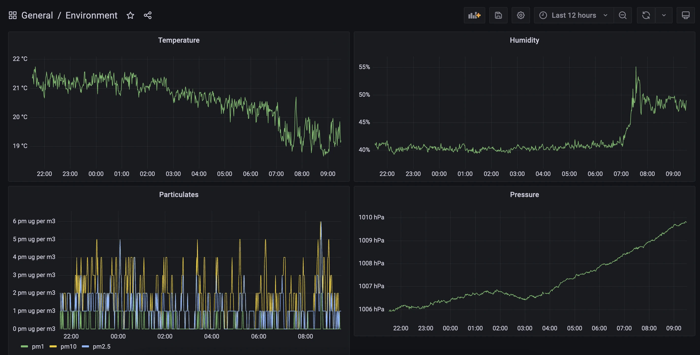
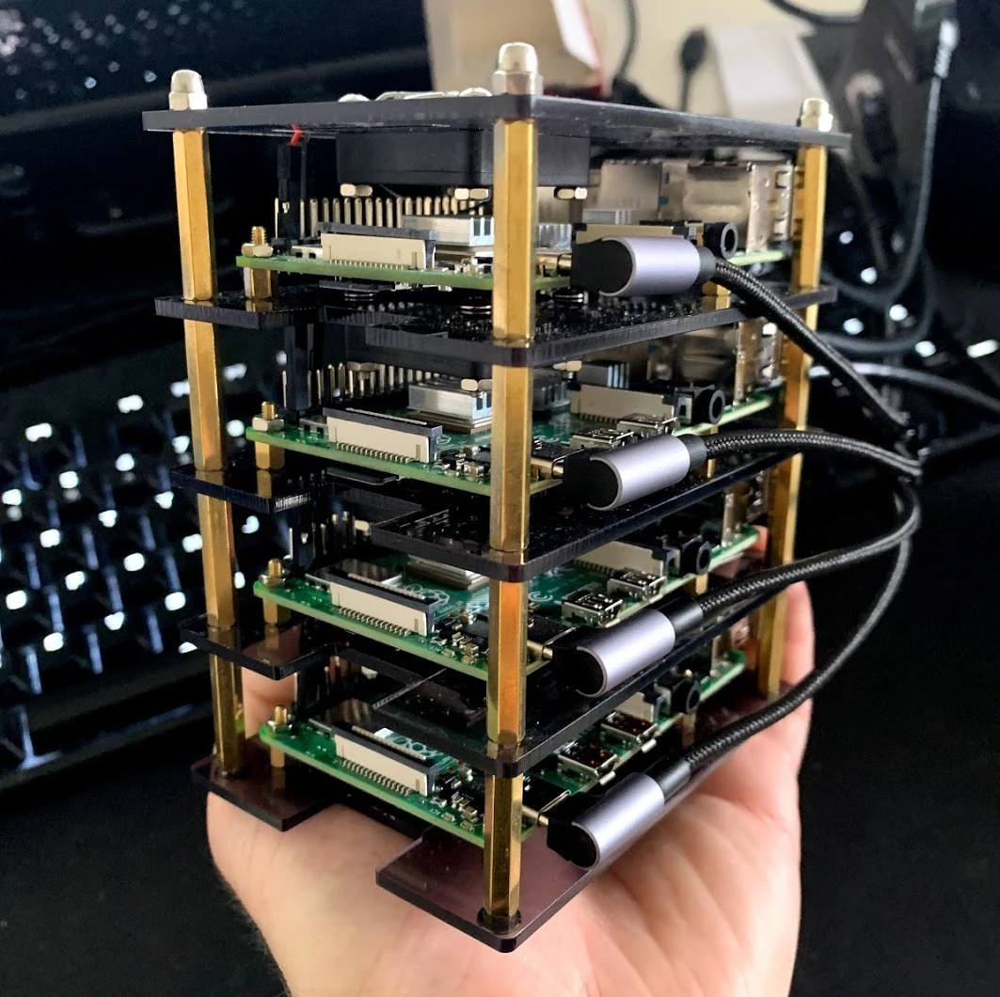
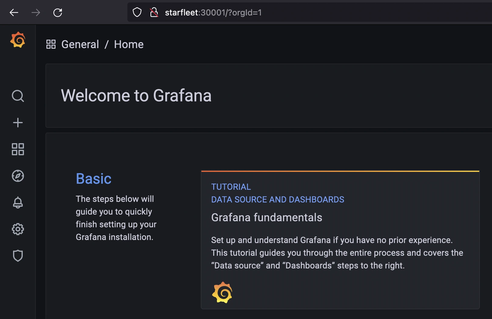
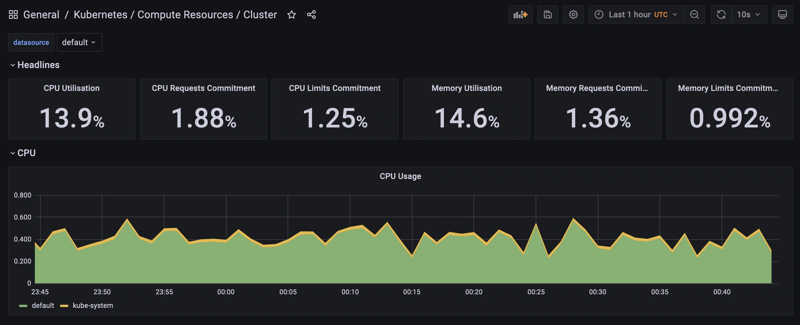
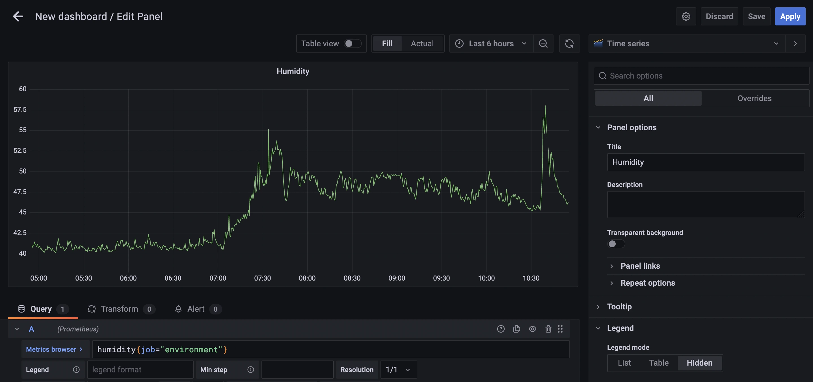

One of the joys of keeping a personal blog is that I don't have to justify a post. If I want to hook up 4 Raspberry Pis into a Kubernetes cluster just to monitor the humidity of my living room, then I can.

And it's pretty cool to open up a browser and go to `starfleet:30001` to see this:



[I've explored Kubernetes once before, when I used it to host an R API made with Plumber](/post/hosting-a-plumber-api-with-kubernetes/). In that post I used a cluster hosted on Google Cloud Platform. This time I'm cobbling the cluster together myself.

## The setup

The full cluster has 16 cores and 28 GB of memory. It's silent and doesn't take much power. My Pis each have a little fan which can be run on low- or high-power settings. At low-power settings, I can't hear the cluster from a metre away.

The Pi on top (which I call _Starfleet_) with 4GB of memory is the main node running the _control plane_. The other three Pis (_Intrepid_, _Defiant_, and _Sovereign_) each have 8GB of memory and are the worker nodes.



The components:

* Raspberry Pi 4B (4GB)
* 3x Raspberry Pi 4B (8GB)
* GeeekPi Raspberry Pi Cluster Case
* 3x 128GB MicroSD cards
* Kingston SA400 SSD (120GB)
* Kingston SA400 SSD (480GB)
* Wavlink USB 3.0 to SATA, Dual Bay External Hard Drive Docking Station 
* ES5500G EDIMAX 5 Port Giga Desktop Switch
* BlitzWolf® BW-S16 75W 6-Port USB PD Charger
* USB-C cables as needed 
* 30cm CAT 7 cables as needed

There are a lot of cables here, so it can get messy. A few pieces of advice:

* The Raspberry Pi USB-C port is on the side (long edge), so go for cables with a right-angled connector
* There exist 5-port switches powered by 1A USB connections. Run super-short patch cables from the Pis to the switch, and then a single longer cable to the router.
* Stick to one charger if possible --- my single USB-C charger was enough to power all four Pis and the switch, taking up just a single power point.
* [Learn how to organise cables with zip ties](https://www.diyphotography.net/diy-organize-messy-cords-cables-using-zip-ties/).

### Setting up the operating system

At the time I was setting up this cluster, the Raspberry Pi operating system was only available as a 32-bit version, save for an experimental 64-bit version. A 32-bit operating system wouldn't be able to make full use of 8GB of memory. I opted instead for Ubuntu.

Raspberry Pis usually boot from MicroSD cards. I picked up a few 128GB MicroSD cards, although in retrospect I think I could have gotten away with less storage. I needed to _image_ these cards with Ubuntu.

On my laptop I downloaded the excellent [Raspberry Pi Imager](https://www.raspberrypi.org/blog/raspberry-pi-imager-imaging-utility/). This supports imaging a variety of operating systems, including 64 bit Ubuntu Server. A heads up: it can be a little slow to image the cards sometimes.

While I had the MicroSD cards in my computer, I also set the _hostnames_ for the Pis. Kubernetes needs these to be configured, and to be unique for each node. Configuring them involves two steps:

1. Altering the top section of `/etc/hosts` to look like this (where _intrepid_ is the host name for this particular node):
```
127.0.0.1 localhost
127.0.1.1 intrepid
```
1. Changing the value set in `/etc/hostname` to the desired hostname (the default is ubuntu).

I also hard-coded the IP addresses in the `etc/hosts` file of my local machine, so that I could run commands like `ssh intrepid` instead of remembering IP addresses. This means that I had to plug Raspberry Pis in one at a time and assign them each a static IP address through my router configuration tool.

### Booting from USB (optional)

MicroSD is not a great choice of media for a bootable drive. They're slow and flimsy --- occasionally failing within months. For the worker nodes this high failure rate is only an annoyance: I would be able to get a new card, copy the contents from another worker node, and off I go. But for the primary node with the control plane, I wanted a bit more stability.

A better option is to boot from an external SSD connected via USB. The Raspberry Pi Imager can flash an SSD just as easily as it can a MicroSD.

A Raspberry Pi 4 can output a total of 1.4A through its USB ports, which is _probably_ enough for one SSD, but _probably not_ two. I wanted to use a second SSD for persistent storage for the cluster, so I ended up buying a dual-bay dock with its own power supply to overcome this restriction.

Support for booting from USB is fairly new, and requires doing some weird stuff, like decompressing the Linux kernel. I followed [this guide](https://jamesachambers.com/raspberry-pi-4-ubuntu-20-04-usb-mass-storage-boot-guide/) to get it working.

### Firewalls

I'm not an expert on Kubernetes security, and I can't quickly become one. My security model is simple: keep it all on the LAN. And that means configuring firewalls.

It's worth noting that there are multiple layers of firewalls here. The device firewalls, configured with `ufw`, sit behind firewalls on my router. Beyond that, ISPs tend to frown upon open ports for home internet plans. The redundancy here isn't a bad thing. 

I had a lot of firewall trouble when I was setting up various services on the cluster --- [trouble that could have been saved had I just read the manual](https://rancher.com/docs/rancher/v2.5/en/installation/requirements/ports/). If I could go back in time, I would tell myself the following:

* Open up the SSH port (22/TCP) on all nodes
* Open up the Flannel VXLAN port (8472/UDP) on all nodes
* Open up the metrics server port (10250/TCP) on all nodes
* Open up the Kubernetes port (6443/TCP) on the server node only
* Open up the NFS (Network File System) port (2049) on the server node only

I keep my Raspberry Pis on a separate VLAN and subnet.

* In general, devices on my home network are assigned IP addresses from 192.168.1.0/24
* The Raspberry Pis in the Kubernetes cluster are assigned IP addresses from 192.168.2.0/24
* The two together are included in the 192.168.0.0/22 range

This is specific to my home network setup, and so I wouldn't expect my firewall settings to work in general. I present them here as a guide. After creating the rules enable the configuration with `sudo ufw enable`.

On all nodes, including the main node:

```bash
sudo ufw allow from 192.168.1.0/22 to any port ssh
sudo ufw allow from 192.168.2.0/24 to any port 8472 proto udp
sudo ufw allow from 192.168.2.0/24 to any port 10250 proto tcp
```

On the main node only:

```bash
sudo ufw allow from 192.168.0.0/22 to any port 6443 proto tcp
sudo ufw allow from 192.168.2.0/24 to any port nfs
```

Later on I'll need to open up some additional ports from the main node. I'll also need that `nfs` port for the cluster storage.

### Storage

I'm using the 120GB SSD for _Starfleet's_ operating system, which leaves the 480GB SSD as general storage for the cluster.

To make this storage accessible to the entire cluster, I need to set it up as a _Network File System_ (NFS). This isn't a Kubernetes concept; it's a protocol for sharing storage space across a network.

There are plenty of guides available for setting up an NFS server. I'm particularly fond of [the DigitalOcean guide](https://www.digitalocean.com/community/tutorials/how-to-set-up-an-nfs-mount-on-ubuntu-20-04). I doubt I could create something better here.

I use the _Starfleet_ node as the NFS server, but this isn't necessary. I could attach the hard drive to any other machine on the network, whether or not it's part of the cluster. I mount the server at `/media/cargo_bay` in the _Starfleet_ node.

The drive itself is also not used for any Kubernetes installations --- it's only ever used for _persistent storage_ required by applications running on the cluster. Simply having an NFS server available on the network doesn't make it so that Kubernetes can use that storage. Once my cluster is up and running I'll need to make it so that my cluster can make use of the space.

I'm particularly concerned about the security of the cluster when it comes to this NFS server. I'm sure I should be using finer permissions, or some sort of disk encryption. I hope my LAN-only approach makes up for this!

### Installing Kubernetes

Standard Kubernetes is a bit big for a Raspberry Pi. [K3s is a lightweight Kubernetes distribution offered by Rancher](https://k3s.io/). [It requires only 512MB of memory per node, and is a bit easier on the CPU requirements as well](https://rancher.com/docs/k3s/latest/en/installation/installation-requirements/).

There are a million guides to installing Kubernetes, and plenty of them focus on Raspberry Pi installations. I'm not sure there's much more I can add here, especially since [the k3s quick-start guide](https://rancher.com/docs/k3s/latest/en/quick-start/) is so friendly (one-line installation!).

After installing k3s on all of the nodes, [I set up `kubeconfig` on my personal machine](https://rancher.com/docs/k3s/latest/en/cluster-access/).

Using Kubernetes means typing `kubectl` a lot. Running `alias k=kubectl` saves a lot of keystrokes.

## The sensor

I don't know enough about electronics to set up analogue sensors. Fortunately, Pimoroni sells [a sensor board for a Raspberry Pi Zero](https://shop.pimoroni.com/products/enviro?variant=31155658457171), and even provides a Python module for using it. It measures temperature, humidity, pressure, light, and noise, and comes with an extra sensor for gas particulates (pollution).


I don't care about 32- or 64-bit operating systems here, so I imaged the standard Raspberry Pi OS.

### Exposing the environment metrics 

I need to turn those sensor readings into metrics that can be fed into my Kubernetes cluster. I do this with a python script, `environment.py`. This script exposes the metrics so that I can later use _Prometheus_ to pick them up. 

Prometheus is a tool for monitoring and alerting. I expose the sensor metrics through a HTTP endpoint. The `prometheus_client` module will gather and format the metrics, and `flask` will expose them as an API. Later, when I've set it up on the cluster, the Prometheus server will periodically reach out to this endpoint to fetch updated metrics.

[The full `environment.py` file for running the metrics endpoint is available on GitHub](https://github.com/mdneuzerling/starfleet/blob/d3d77c52c944265742aec5556f7f0fa8a2fdeff2/environment/environment.py). I'm using Prometheus `Gauge`s here, which are used for metrics that can go up and down (as opposed to, say, counters). I create a series of functions like the `update_particulates` function below:

```python
from prometheus_client import Gauge, generate_latest
from pms5003 import PMS5003

particulates = Gauge("particulates", "particulates in µg/m³", ["diameter"])

def update_particulates():
    data = pms5003_measure.read()
    particulates.labels(diameter="1.0").set(data.pm_ug_per_m3(1.0))
    particulates.labels(diameter="2.5").set(data.pm_ug_per_m3(2.5))
    particulates.labels(diameter="10").set(data.pm_ug_per_m3(10))
```

The final function, served via `flask` at the `/metrics` endpoint, will run all of these functions to update the metrics. It will then return the most recent observations.

```python
@app.route("/metrics", methods=["GET"])
def return_metrics():
    update_weather()
    update_light()
    update_noise()
    update_gas()
    update_particulates()
    
    return Response(
        generate_latest(),
        mimetype="text/plain; charset=utf-8"
    )
```

I configure the hostname for the Pi Zero as `environment`. When I run `curl environment/metrics`, I receive a large list of plain-text metrics. The particulates data is formatted like this:

```
# HELP particulates particulates in µg/m³
# TYPE particulates gauge
particulates{diameter="1.0"} 13.0
particulates{diameter="2.5"} 14.0
particulates{diameter="10"} 14.0
```

This the format expected by the Prometheus server.

### Running the environment metrics script

I assume that my Raspberry Pis will be powered off and on regularly, and I don't want to have to SSH into the Pi Zero every time this happens so that I can start `environment.py`. I want the Pi Zero to run this script automatically whenever it boots.

There are many ways to make the Raspberry Pi run a Python script automatically on startup. My method involved creating a file `~/.config/autostart/environment.desktop` with the following contents:

```bash
[Desktop Entry]
Encoding=UTF-8
Type=Application
Name=environment
Comment=
Exec=authbind --deep python3 /home/.pi/starfleet/environment/environment.py
```

That location is actually in my cloned `starfleet` git repository --- editing Python scripts on a Raspberry Pi Zero can be a slow experience, so I edit the script elsewhere and use `git` to pull the changes.

Note the use of `authbind` here --- the server runs on port 80, which is usually protected, but `authbind` allows its use. The following command configures `authbind`:

```bash
sudo touch /etc/authbind/byport/80
```

I only want to be able to access the server from within my local network. The below command sets up a firewall rule that allows this. The `192.168.0.0/22` range works for me, but may need to be adjusted for individual networks to cover the range of IP addresses offered by the router.

```bash
sudo ufw allow from 192.168.0.0/22 to any port 80 proto tcp
```

Another rule might exist on port 22, to allow for SSH access. Otherwise, the intention is that this device is locked down and serves only a single purpose.

By default, UFW blocks all incoming connections and allows all outgoing connections. One option here, to lock the Pi down even further, would be to block all outgoing connections. This would disconnect the device from the internet (and also from updates). I'm not convinced that this is necessary, but the command is:

```bash
sudo ufw default deny outgoing
```

## So much YAML

I'm using [Helm](https://helm.sh/) to install software on the Cluster. Most of my Helm deployments are configured with YAML files that [I keep on GitHub](https://github.com/mdneuzerling/starfleet). I can pass the URLs for these files directly through to Helm.

### My apps need storage

I want my metrics to persist when I restart the Prometheus deployment or unplug the cluster. That means I need _persistent storage_ so that Prometheus can maintain its time series database somewhere permanent, like the NFS server I prepared earlier.

Fortunately, Prometheus already supports using persistent storage. I had initially tried to connect an external time series database (InfluxDB) but an update broke the connection, so I decided to stick with Prometheus's internal storage mechanism.

Prometheus will make a _persistent volume claim_, which is a request for space. The Kubernetes cluster will try to match the claim with an available _persistent volume_. If successful, the persistent volume claim is _bound_ to the persistent volume, and my metrics won't disappear when the Raspberry Pis are unplugged.

My initial attempt used _local persistent volumes_; I would manually create a persistent volume of a size matching the intended claim, and then Kubernetes would do the binding. This was annoying. It meant that every time I deleted a deployment I had to manually clean up the persistent volume and recreate it.

A better option is to go with _dynamic volume provisioning_. If a persistent volume claim is created, then a _provisioner_ will **create** a persistent volume for it. If a persistent volume claim is deleted, the _provisioner_ will clean up.

Most of the time these dynamically provisioned volumes use cloud services, like S3. Fortunately, there exists an **NFS external provisioner** that will allow me to do the same thing with my NFS server! It is itself a Kubernetes deployment installed with Helm. I provide it with the IP address of my NFS server and location of the mount:

```bash
helm repo add nfs-subdir-external-provisioner \
    https://kubernetes-sigs.github.io/nfs-subdir-external-provisioner/
helm repo update

helm install nfs-subdir-external-provisioner \        
    nfs-subdir-external-provisioner/nfs-subdir-external-provisioner \
        --set nfs.server=192.168.2.50 \
        --set nfs.path=/media/cargoba
```

I can now create persistent volume claims without having to think about persistent volumes! I do have to keep in mind that 480 GB storage limit, but for such a small hobby deployment I don't think that will be a constraint.

To confirm that the deployment is up and running, I use the below command:

```bash
kubectl get all --selector=app=nfs-subdir-external-provisioner
```

```bash
NAME                                                   READY   STATUS    RESTARTS   AGE
pod/nfs-subdir-external-provisioner-58dc47958c-pl56z   1/1     Running   0          39h

NAME                                              READY   UP-TO-DATE   AVAILABLE   AGE
deployment.apps/nfs-subdir-external-provisioner   1/1     1            1           39h

NAME                                                         DESIRED   CURRENT   READY   AGE
replicaset.apps/nfs-subdir-external-provisioner-58dc47958c   1         1         1       39h
```

I wouldn't be able to guess that selector value. I use `kubectl describe` to get the metadata of something related to the provisioner, and then I use that in the `kubectl get` command.

### Prometheus and friends

I decided to install Prometheus as part of the `kube-prometheus-stack` --- a deployment that includes elements for monitoring the cluster itself. That is, metrics about Kubernetes and the nodes are fed into Prometheus. It also includes the Prometheus Alertmanager (which I'm not using yet) and the Grafana dashboard tool (which I will use).

[My configuration YAML for Prometheus and friends](https://github.com/mdneuzerling/starfleet/blob/d3d77c52c944265742aec5556f7f0fa8a2fdeff2/prometheus/kube-prometheus-stack.yaml) is too large to put here in full. There are two parts I'll highlight.

The first is the persistent storage, so that I can use the provisioner I set up. 50GB is generous here, but I'm not using my storage otherwise. Note the "nfs-client" storage class, which was created by the NFS external provisioner installation.

```yaml
    storageSpec: 
      volumeClaimTemplate:
        spec:
          storageClassName: "nfs-client"
          accessModes: ["ReadWriteOnce"]
          resources:
            requests:
              storage: 50G
```

The second part I'll highlight is the additional scrape endpoint for the environment metrics. I've configured my router to make the IP address below static for the Rasperry Pi Zero. There's no need to specify the `metrics` endpoint here, since that's expected by Prometheus:

```yaml
    additionalScrapeConfigs:
      - job_name: "environment"
        scrape_interval: 10s
        static_configs:
        - targets: ["192.168.1.149:80"] 
```

I use Helm to install the stack:

```bash
helm repo add prometheus-community https://prometheus-community.github.io/helm-charts
helm repo update

helm install \
    -f https://raw.githubusercontent.com/mdneuzerling/starfleet/main/prometheus/kube-prometheus-stack.yaml \
    kube-prometheus-stack prometheus-community/kube-prometheus-stack
```

And then I confirm that it's running, using the same `kubectl describe` trick to get the selector label:

```bash
kubectl get all --selector=release=kube-prometheus-stack
```

```bash
NAME                                                       READY   STATUS    RESTARTS   AGE
pod/kube-prometheus-stack-prometheus-node-exporter-k97bq   1/1     Running   0          38h
pod/kube-prometheus-stack-prometheus-node-exporter-h24zs   1/1     Running   0          38h
pod/kube-prometheus-stack-prometheus-node-exporter-4kjf6   1/1     Running   0          38h
pod/kube-prometheus-stack-operator-5cb45d7fcf-697zl        1/1     Running   0          38h
pod/kube-prometheus-stack-prometheus-node-exporter-d9qmc   1/1     Running   0          38h

NAME                                                     TYPE        CLUSTER-IP     EXTERNAL-IP   PORT(S)    AGE
service/kube-prometheus-stack-prometheus                 ClusterIP   10.43.204.91   <none>        9090/TCP   38h
service/kube-prometheus-stack-operator                   ClusterIP   10.43.16.13    <none>        8080/TCP   38h
service/kube-prometheus-stack-alertmanager               ClusterIP   10.43.139.32   <none>        9093/TCP   38h
service/kube-prometheus-stack-prometheus-node-exporter   ClusterIP   10.43.23.169   <none>        9100/TCP   38h

NAME                                                            DESIRED   CURRENT   READY   UP-TO-DATE   AVAILABLE   NODE SELECTOR   AGE
daemonset.apps/kube-prometheus-stack-prometheus-node-exporter   4         4         4       4            4           <none>          38h

NAME                                             READY   UP-TO-DATE   AVAILABLE   AGE
deployment.apps/kube-prometheus-stack-operator   1/1     1            1           38h

NAME                                                        DESIRED   CURRENT   READY   AGE
replicaset.apps/kube-prometheus-stack-operator-5cb45d7fcf   1         1         1       38h

NAME                                                               READY   AGE
statefulset.apps/alertmanager-kube-prometheus-stack-alertmanager   1/1     38h
statefulset.apps/prometheus-kube-prometheus-stack-prometheus       1/1     38h
```

And I can check the persistent volume claim is bound (although at least one of the above pods would not be marked as "READY" if it wasn't):

```bash
kubectl get persistentvolumeclaims 
```

```bash
NAME                                                                                           STATUS   VOLUME                                     CAPACITY   ACCESS MODES   STORAGECLASS   AGE
prometheus-kube-prometheus-stack-prometheus-db-prometheus-kube-prometheus-stack-prometheus-0   Bound    pvc-b5dbcbfb-3b7e-48b8-945f-44cf2a5c2422   50G        RWO            nfs-client     38h
```

An alternative here would be to deploy the stack into a separate "monitoring" namespace, to group all similar apps together.

### Grafana

Grafana comes as part of `kube-prometheus-stack`. It's a dashboard tool accessible through a browser. It's particularly useful for displaying metrics collected and stored by Prometheus.

The stack includes a _ClusterIP_ for Grafana, which exposes the service to nodes in the cluster. I want to be able to access Grafana from any device on the network. For this I define a _NodePort_ service, which I set to 30001. This means that, for any node in the network, I can type `{node}:30001` in my browser and I'll be taken to Grafana.

This is a valid option for my LAN-only cluster, but for cloud-hosted clusters there are other services like load balancers. For now, though, NodePorts are a simple solution.

[I define my service as a YAML file](https://github.com/mdneuzerling/starfleet/blob/d3d77c52c944265742aec5556f7f0fa8a2fdeff2/prometheus/grafana-nodeport.yaml):

```yaml
apiVersion: v1
kind: Service
metadata:
  name: grafana-nodeport
  namespace: default
spec:
  type: NodePort
  ports:
  - port: 31001
    nodePort: 30001
    targetPort: 3000
    name: http
    protocol: TCP
  selector:
    app.kubernetes.io/instance: kube-prometheus-stack
    app.kubernetes.io/name: grafana
```

The multiple port values here are confusing. `targetPort` is the port used by Grafana containers. The `nodePort` is what I'm going to use to access Grafana. So `starfleet:30001` will take me to Grafana. There's also the `port` value, which I don't care about but which seems to be necessary.

Again, there's no way I could have guessed those values for the `selector`. Fortunately, the `kube-prometheus-stack` sets up a `ClusterIP` service for accessing Grafana from within the cluster. I can use the following command to print the YAML config for that service, and copy its `selector` values:

```bash
kubectl get service kube-prometheus-stack-grafana -o yaml
```

I activate the configuration for this service with `kubeconfig`:

```bash
kubectl apply -f \
    https://raw.githubusercontent.com/mdneuzerling/starfleet/main/prometheus/grafana-nodeport.yaml
```

Recall that my firewall configuration earlier will block attempts to access this port. I need to open it up to the local network. I can do this on any or all nodes, since they should all point me towards Grafana:

```bash 
sudo ufw allow from 192.168.0.0/22 to any port 30001 proto tcp
```

If I go to `starfleet:30001` in my browser I see Grafana! I log in with the default username and password (`admin`/`prom-operator`) and I'm ready to make a dashboard.



The `kube-prometheus-stack` includes a number of dashboards for monitoring the cluster itself. This is useful if I want to see how close I am to using up all of the CPU and memory of my Raspberry Pis. As it turns out, I'm not close at all:



It's worth remarking here just how poor the security of this set-up is. There's no SSL for the page, and I'm using default credentials. I'm really leaning on the firewalls here, to prevent the page from being accessed outside my local network.

## The environment dashboard

Those who have used a visual dashboard editor like Tableau or PowerBI probably wouldn't have much trouble with Grafana. It has a rich interface for creating new dashboards, with each dashboard consisting of a grid of _panels_.



The `kube-prometheus-stack` already configures Prometheus as a data source for Grafana, so I don't need to do any work to connect the two. In fact, all I need to do is select Prometheus as the data source for my panel and then enter a query for the metrics I want.

Prometheus uses its own query language, `PromQL`. I don't need to go into any detailed queries here. In `environment.py` I called my metrics simple things like "temperature" and "humidity". So if I want to query the humidity, for example, I use this query:

```promql
humidity{job="environment"}
```

This is saying, "give me the _humidity_ metric from the _environment_ job".

I tweak the dashboard a little more, like hiding the legend where necessary, or renaming elements to be more succinct. The dashboard took about 15--20 minutes to complete.


### Persist the dashboard

When (not if) the Grafana pod is restarted, my beautiful environment dashboard will disappear. I need to persist it. The solution here isn't persistent storage, but to save the dashboard as a `ConfigMap`.

The underlying represntation of a Grafana dashboard is a (lengthy) JSONs. Once I finished editing my dashboard I go to its settings page and extract the JSON Model.


I then define a new ConfigMap YAML ([also in GitHub](https://github.com/mdneuzerling/starfleet/blob/d3d77c52c944265742aec5556f7f0fa8a2fdeff2/prometheus/environment-dashboard.yaml)) and paste the JSON at the bottom (not shown here):

```yaml
apiVersion: v1
kind: ConfigMap
metadata:
  labels:
    grafana_dashboard: "1"
  name: environment
data:
  environment.json: |-
    # JSON goes here. The indenting matters!
```

Once again I activate the configuration with `kubeconfig`:

```bash
kubectl apply -f \
    https://raw.githubusercontent.com/mdneuzerling/starfleet/main/prometheus/environment-dashboard.yaml
```

Now if my cluster restarts, my dashboard will persist!

## Over-engineering is good

There are simpler ways I can do this. I could have put the sensor, metrics gathering logic, and dashboard server on a single Raspberry Pi with no Kubernetes at all.

But then I wouldn't have gotten experience with:

* firewall configuration
* subnets, IP addresses, host names, and VLANs
* cabling and physically installing multiple machines
* setting up an NFS server
* exposing and collecting metrics to a server
* gathering sensor data
* Helm and kubectl
* dynamic provision of persistent volumes

Writing for a personal blog means freedom. I don't need to worry about financial benefits, or comparing value with effort. The only justification I need is to think, "oh that's interesting", and off I go.

And Raspberry Pi clusters are _cool_.
