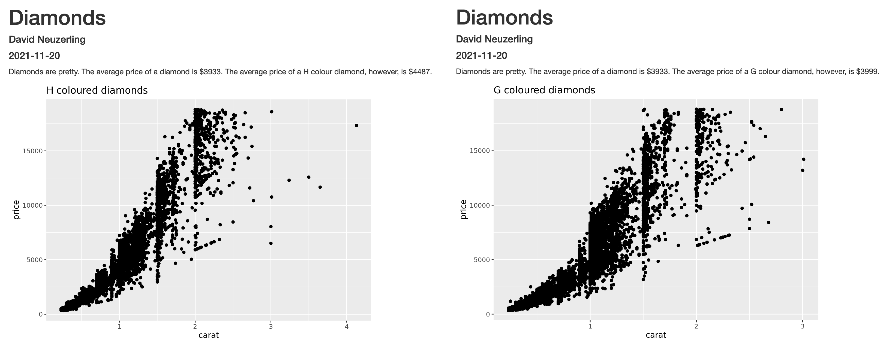
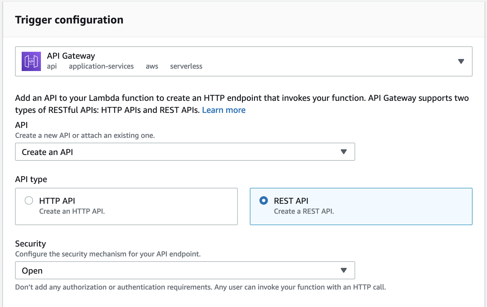
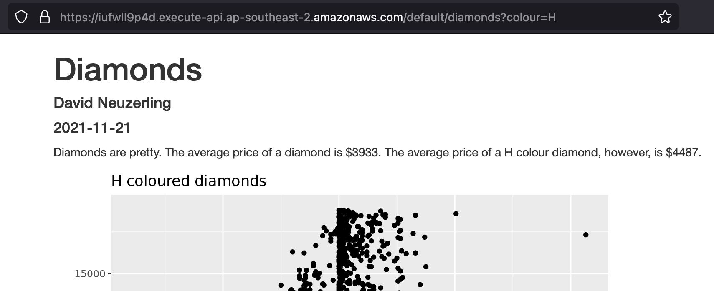

```{r setup, include=FALSE, eval=TRUE}
knitr::opts_chunk$set(eval = TRUE, cache = FALSE)
library(dplyr)
```

I have a URL with a `colour` parameter, like "https://example.com/diamonds?colour=H". When I go to this URL in my browser, an [_AWS Lambda_](https://aws.amazon.com/lambda/) instance takes that parameter and passes it to `rmarkdown::render`, which knits a customised R Markdown report. My Lambda returns the knitted report as HTML, which my browser displays. If I change the parameter to "colour=G", I get a different report, knitted on-demand.



This is all serverless, so I only pay each time a report is requested (around $0.00014 per report). And it's possible because of my recently published [`lambdr`](https://lambdr.mdneuzerling.com) package.

I'll go through the components in detail, but [the `runtime.R`, Dockerfile, and R Markdown template are available on GitHub](https://github.com/mdneuzerling/diamonds-via-lambda).

## An R runtime for _AWS Lambda_ with `lambdr`

An R runtime for _AWS Lambda_ lets me put my R functions on the cloud without having to think about setting up a server to host them. My new package, [`lambdr`](https://lambdr.mdneuzerling.com), can be used to containerise functions with an R runtime for _Lambda_.

The intention here is to create a function that takes a parameter from a Lambda invocation and uses it to knit a parametrised R Markdown report, which the function then returns as a string which can be interpreted as HTML. I can wrap this with an API Gateway so that the whole thing can be called from a browser, as if I were visiting any other web page. Except behind that web page my Lambda container is knitting the report on-demand.

The core function of [`lambdr`](https://lambdr.mdneuzerling.com) is [`start_lambda`](https://lambdr.mdneuzerling.com/reference/start_lambda.html), which kicks off the runtime with an infinite cycle of waiting for an event to occur and then handling it as it comes. For basic purposes this is enough:

1. In a file, `runtime.R`, define or source the _handler function_, which is the R function that handles invocations of the Lambda. This file should end by running [`start_lambda()`](https://lambdr.mdneuzerling.com/reference/start_lambda.html)
1. Containerise the `runtime.R` with the necessary components to serve the Lambda.
1. Either in the Dockerfile or the _AWS Lambda_ console, declare the _handler function_.

Along with the what I'm doing here, [I have a basic example in a vignette](https://lambdr.mdneuzerling.com/articles/lambda-runtime-in-container.html).

`lambdr` attempts to handle the complexities of converting the invocation into arguments that can be passed to the handler function, and converting the response into something that _Lambda_ expects. If this fails there is the option of providing a [`lambda_config`](https://lambdr.mdneuzerling.com/reference/lambda_config.html) to [`start_lambda`](https://lambdr.mdneuzerling.com/reference/start_lambda.html), which allows for a custom `deserialiser` and `serialiser`.

The example in this post uses the [`html_response`](https://lambdr.mdneuzerling.com/reference/html_response.html) function which allows me to send a response tailored for an API Gateway. I need this to set the content type of the return as "text/html". This function isn't yet available in the version of `lambdr` on CRAN, but is available in the development version at [mdneuzerling/lambdr](https://github.com/mdneuzerling/lambdr/).

## Parametrised R Markdown

The handler function relies on an R Markdown template to knit. [I use a fairly simple R Markdown template](https://raw.githubusercontent.com/mdneuzerling/diamonds-via-lambda/main/diamond-report.Rmd). It consists of a paragraph of dynamic text, comparing the mean price of diamonds of the requested colour with the mean price in general, based on the `diamonds` dataset in the `ggplot2` package. The scatterplot shows price versus carat for diamonds of the given colour.

One thing to note is that the template is _parametrised_, that is, it accepts a `colour` parameter. This parameter can be passed to the template during knitting through the `rmarkdown::render` function.

## The runtime and handler function

The handler function I'm using here, `diamonds`, takes a `colour` argument that I expect to appear as a parameter in the URL request for the API. It then knits the file from the R Markdown template, loads the result as a string, and returns it as a [`html_response`](https://lambdr.mdneuzerling.com/reference/html_response.html).

One catch here: the _only_ directory that the Lambda can write to is `/tmp`. In the Dockerfile I set the "TMPDIR" environment variable to `/tmp`, and which I then call on here (with "/tmp" as a backup just in case). When I knit I use this directory as the `intermediates_dir`, which is where all of the temporary files generated during knitting are stored. Without this I'm likely to encounter "cannot open connection" errors.

Note also the use of logging here. Lambdas are tough to debug, and logging helps! The `logger::formatter_paste` formatter is also a bit friendlier when logging content with braces, such as JSONs.

```r
# We need a writeable directory, usually /tmp
temporary_directory <- Sys.getenv("TMPDIR", "/tmp")

diamonds <- function(colour) {
  
  outfile <- file.path(
    temporary_directory,
    paste0("diamonds_", colour, "_", as.integer(Sys.time()), ".html")
  )
  on.exit(unlink(outfile)) # delete file when we're done
  
  logger::log_debug("Rendering", outfile)
  rmarkdown::render(
    "/lambda/diamond-report.Rmd",
    params = list(colour = colour),
    envir = new.env(),
    intermediates_dir = temporary_directory,
    output_file = outfile
  )
  logger::log_debug("Rendering complete for", outfile)
  
  html_string <- readChar(outfile, file.info(outfile)$size)
  
  lambdr::html_response(html_string, content_type = "text/html")
}

logger::log_formatter(logger::formatter_paste)
logger::log_threshold(logger::DEBUG)

lambdr::start_lambda()
```

## The Dockerfile

The Dockerfile starts with the AWS base image for Lambda2 that contains the bits and pieces needed to host the function. I install R as if it were a CentOS image, and remove the installer afterwards to save a little space. There are some path issues here: I need to append the location of the R binaries to the system `PATH`, and manually specify the CRAN repository when installing R packages.

I also install the system dependencies needed to use those packages, of `rmarkdown` has a few. [The RStudio Package Manager](https://packagemanager.rstudio.com/client/#/repos/1/packages/rmarkdown) is an excellent resource for identifying system dependencies.

In order to run my runtime, I need to provide the container with a bootstrap. This bootstrap isn’t particularly complicated: it’s an executable script that changes the working directory to the value of the `LAMBDA_TASK_ROOT` environment variable and runs the `runtime.R` file:

```bash
#!/bin/sh
cd $LAMBDA_TASK_ROOT
Rscript runtime.R
```

I think such a small and simple script doesn’t need to be a file, so I hardcode it within the Dockerfile itself.

Finally I have `CMD ["diamonds"]`, which identifies the _handler function_ that the Lambda actually runs. There are three ways I could have configured this. In order of priority, they are:

1. In the AWS Lambda console
1. as the `CMD` in the Dockerfile as below
1. as an argument passed to [`lambda_config`](https://lambdr.mdneuzerling.com/reference/lambda_config.html) (only recommended for debugging)

Here’s the Dockerfile I end up with:

```dockerfile
FROM public.ecr.aws/lambda/provided

ENV R_VERSION=4.0.3

RUN yum -y install wget git tar

RUN yum -y install https://dl.fedoraproject.org/pub/epel/epel-release-latest-7.noarch.rpm \
  && wget https://cdn.rstudio.com/r/centos-7/pkgs/R-${R_VERSION}-1-1.x86_64.rpm \
  && yum -y install R-${R_VERSION}-1-1.x86_64.rpm \
  && rm R-${R_VERSION}-1-1.x86_64.rpm

ENV PATH="${PATH}:/opt/R/${R_VERSION}/bin/"

# System requirements for R packages
RUN yum -y install openssl-devel libicu-devel epel-release pandoc

RUN Rscript -e "install.packages(c('httr', 'jsonlite', 'logger', 'remotes', 'rmarkdown', 'dplyr', 'ggplot2'), repos = 'https://packagemanager.rstudio.com/all/__linux__/centos7/latest')"
RUN Rscript -e "remotes::install_github('mdneuzerling/lambdr')"

RUN mkdir /lambda
# required or else Pandoc will complain
ENV HOME /lambda
# writeable directory in Lambda
ENV TMPDIR /tmp

COPY runtime.R diamond-report.Rmd /lambda/
RUN chmod 755 -R /lambda

RUN printf '#!/bin/sh\ncd /lambda\nRscript runtime.R' > /var/runtime/bootstrap \
  && chmod +x /var/runtime/bootstrap

CMD ["diamonds"]
```

After this I build the container, test its functionality locally, upload it to the Elastic Container Regsitry, and set up the Lambda. Refer to [my previous post on R and AWS Lambda](/post/r-on-aws-lambda-with-containers/) for more detailed instructions. The handler here doesn't need to be configured in the console because it's already set in the Dockerfile.

## Setting up the API Gateway

Once the Lambda is set up there's only a little configuration required to put an API Gateway in front of it. The API Gateway translates HTML requests to Lambda invocations, and then the Lambda responses to HTML responses.

In the _AWS Lambda_ console there's a big button that says "Add trigger". Clicking on that gives me the option of adding an API Gateway. I went with a REST API, which was an arbitrary decision: the HTML API would probably work just as well.



I've gone with no authentication here, which means that anyone who has access to my API's URL will have access to this Lambda. There are no privacy concerns with this simple example, but I pay for every invocation. I'll delete this API when I'm done, but alternatives would be to restrict access via IAM roles or API keys.

There is one last bit of configuration I need. It takes a few seconds to knit a report, and the default timeout for a Lambda is 3 seconds. In the "General configuration" section under the "Configuration" tab I allow a timeout of 30 seconds, and I also give the Lambda 1024MB of memory. CPU resources scale with memory, so this will speed the Lambda up a little.

## Querying the API

In the "Triggers" section under the "Configuration" tab of my Lambda, I can see the API endpoint. I copy and paste this endpoint into a browser and add the "?colour=H" parameter. Sure enough, my report pops up in a few seconds:



## Restrictions

This isn't a perfect way to host R Markdown reports:

* It can take several seconds for a report to be knitted and returned.
* A Lambda can run for up to 15 minutes, but a browser likely won't wait this long. A reasonable maximum runtime is 30 seconds. (There might be a way around this...)
* It can be difficult to configure connectivity and authentication to data sources. I'm using a data source from an R package, so that isn't an issue here. The easiest situation is probably when all data is contained in AWS and accessible through IAM roles.
* Error messages from R are displayed to the end-user. This is actually something I configured in `lambdr`, following (as well as I could) the expectations of a Lambda runtime. But there could be security issues in showing arbitrary error messages.

An ideal use case would be an infrequently accessed internal report that doesn't take too long to knit.

And there are benefits to using the API Gateway. SSL comes for free, and API keys and throttling can be configured through the Gateway rather than trying to set up such a thing in R.

***

The `lambdr` hex logo was created by Phizz Telford.

```{r sessioninfo, eval=TRUE}
devtools::session_info()
```