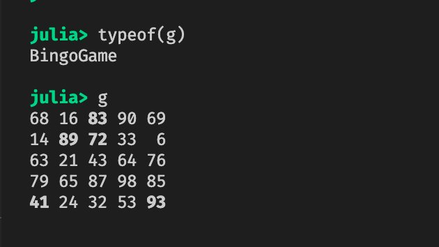

[Advent of Code](https://adventofcode.com/) is an advent calendar for programming puzzles. I decided to tackle this year's set of 50 puzzles in Julia and journal my experiences along the way. I'm a beginner in Julia so I thought this would help me improve my skills.

This post covers days 1 through 8. All of my solutions are [available on GitHub](https://github.com/mdneuzerling/advent_of_code/tree/main/AOC2021).

## [Day 1: Increasing sequences](https://adventofcode.com/2021/day/1)

> Count the number of times a depth measurement increases from the previous measurement

What a great little puzzle to start on. I went very functional and array-focused here, using the `lag` function from the `ShiftedArrays` package:

```julia
function part1()
    @chain input begin
        parse.(Int32, _)  # convert strings to integers
        _ .- lag(_) # compute difference with previous value
        _[2:end] # remove first element, which will be missing
        filter(x -> x > 0, _) # filter to the increases in value
        length # now count
    end
end
```

I like it but the underscores are hard to read. The `@chain` macro here is equivalent to piping each line into the next, with the underscore indicating where the result of the previous line should go. Where there is no underscore, such as with `length`, then the previous result is piped into the first argument.

One annoyance I do have with Julia is that the `map` and `filter` functions take the function first and data second, which makes them harder to use with pipes. A consistent principle of the tidyverse in R is that the first argument of a function should, wherever possible, be the "data" argument. I wish that were followed in Julia.

My coding style seems to default to "use arrays, `map` and `filter`". I don't know if this is a bad thing, as long as my toolset isn't limited by it.

One option I didn't know about at the time was the `diff` difference operator. It could have made my solution a bit simpler:

```julia
julia> diff([1, 4, 5, 5, 1])
4-element Vector{Int64}:
  3
  1
  0
 -4
```

## [Day 2: Submarine manoeuvres](https://adventofcode.com/2021/day/2)

> Calculate the horizontal position and depth you would have after following the planned course.

Both parts of this puzzle were about calculating the position of a submarine after a long sequence of commands like `up 5`, `forward 6`, or `down 7`. I made a point of using Julia's structs and multiple dispatch here. The location of the submarine stood out to me as a `mutable struct` and the manoeuvres could be functions.

The functions I needed to implement here were `up!`, `forward!`, `down!`. The exclamation mark is a Julia convention for functions that modify their inputs. Parts 1 and 2 use different logic, so implemented structs `Location1` and `Location2`. This means that I could have a `forward!` function that behaved differently for `Location1` and `Location2`, using Julia's multiple dispatch.

```julia
function forward!(loc::Location1, x::Int64)
    loc.horizontal += x
end
function forward!(loc::Location2, x::Int64)
    loc.horizontal += x
    loc.depth += loc.aim * x
end
```

The final step was a bit of hacky code to convert a string like "forward 5" into a function `forward!(location, 5)`. The `manouevre!` function, the same for both parts 1 and 2, took care of this:

```julia
function manoeuvre!(loc::Location, command::String)
    command_split = split(command, " ")
    manoeuvre_direction = command_split[1]
    manoeuvre_function = getfield(@__MODULE__, Symbol(manoeuvre_direction * "!"))
    manoeuvre_amount = parse(Int64, command_split[2])
    manoeuvre_function(loc, manoeuvre_amount)
end
```

That `getfield` function takes a string like "forward", suffixes it with "!", and then looks for something named "forward!" in the namespace of the module. This made the actual solution straightforward, and similar for both parts:

```julia
function part2()
    l2 = Location2()
    for command in input
        manoeuvre!(l2, command)
    end
    aoc_answer(l2)
end
```

## Intermission: A little refactoring

Between days 2 and 3 I decided to clean up the entire project. I refactored everything into a proper Julia package with separate modules like `Day01`, `Day02`, and so on. I also implemented the `solve` function:

```julia
function solve(day::Int64, part::Int64)
    module_string = "Day" * lpad(day, 2, "0")
    part_string = string(part)
    module_and_part_string = module_string * ".part" * part_string * "()"
    eval(Meta.parse(module_and_part_string))
end
```

Here `solve(2, 1)` will evaluate `Day02.part1()`. So for each day/module, I need to provide `part1` and `part2` functions, and `export` them.

Refactoring into a package also lets me take advantage of Julia's _excellent_ package manager. It captures the exact versions of any dependencies in my project in case I decide to revisit this code later on.

## [Day 3: Most frequent bits](https://adventofcode.com/2021/day/3)

> You need to use the binary numbers in the diagnostic report to generate two new binary numbers (called the gamma rate and the epsilon rate)

This was the first puzzle that stumped me. 1000 binary numbers, each 12 bits long, and I had to calculate the most popular bit in each _column_. 

For part 2 my array-based approach simply failed. I have a reluctance to use mutable state, which was fine for part 1 because I don't modify the input. For part 2, where I had to remove rows from the input, it just didn't work. Once I let myself use a `while` loop with a mutable state it started to click. The key component was this `while` loop:

```julia
while size(gas_matrix)[1] > 1
    average_value = mean(gas_matrix[:, column])
    target_bit = rounding_function(average_value)
    row_indices_to_keep = filter(i -> gas_matrix[i, column] == target_bit, 1:size(gas_matrix)[1])
    gas_matrix = gas_matrix[row_indices_to_keep, :]
    column += 1
end
```

The `gas_matrix = gas_matrix[row_indices_to_keep, :]` line removes rows from the input if they have the target bit in the column under investigation. The above code meant that I could use a different rounding function for O2 and CO2 and it would still work:

```julia
    oxygen = gas_rate(
        input,
        x -> round(Int, x, RoundNearestTiesUp)
    )
    co2 = gas_rate(
        input,
        x -> round(Int, (1 - x), RoundNearest) # will round down
    )
```

I like how explicit Julia is with rounding here. Straight away I know what `RoundNearestTiesUp` means.

## Intermission: I'm fighting with Julia's matrix creation

An initial point of difficulty for me was getting the input into a format that I can easily work with --- a matrix. But converting a vector of vectors into a matrix in Julia is tricky. The `vcat` function looks right at first glance, but it returns a vector of vectors rather than a matrix. The code that works is:

```julia
Matrix(transpose(hcat(vectors...)))
```

Weird, right? `hcat`, presumably short for horizontal concatenation, is the starting point (`...` splats the arguments) but then the matrix needed to be transposed to treat every vector as a row. Transposing a matrix changes the type to `LinearAlgebra.Transpose`, so I need to wrap it with `Matrix` to fix that. I found the whole thing bizarre, since interpreting a vector of equally-sized vectors as a matrix _should_ be easy. In fact, I half-expected `Matrix(vector_of_vectors)` to just work.

## [Day 4: Bingo](https://adventofcode.com/2021/day/4)

> What you can see, however, is a giant squid that has attached itself to the outside of your submarine. Maybe it wants to play bingo?

I went overboard with structs. I didn't need to create a special `BingoBoard` struct but I did. And the custom print method was totally unnecessary but fun:



The structs did let me define some neat functions, like `update!`:

```julia
function update!(game::BingoGame, number::Int64)
    match_coords = findfirst(x -> x == number, game.board.definition)
    if !isnothing(match_coords)
        game.state[match_coords] = true
    end
end
```

Both parts of the solution then involved playing each number and checking for winning games. The first part looked for the first winning game.I encountered an off-by-one error here. I had to move the `number_index += 1` line to the top of the `while` loop. Otherwise I was using the bingo number that came _after_ the number that triggered the win.

Part 2 was a bit quicker, arguably because I had the `has_won(game::BingoGame)` function ready-to-go. The key component was this snippet that removed winning games from consideration after each number was called:

```julia
games = games[(!has_won).(games)]
```

Note that I'm negating `has_won`, and then vectorising it with the period so that `(!has_won).(games)` returns a Boolean array that I can then use to filter `games` to include only the games that are yet to win. Then, when there are no games left to consider, the last game to have won is returned.

A handy function here was `score(game::BingoGame, number::Int64)`, which scores a winning game:

```julia
function score(game::BingoGame, number::Int64)
    negated_state = ones(Bool, size(game.state)...) - game.state
    unmarked_numbers_only = negated_state .* game.board.definition # Hadamard product
    sum_unmarked_numbers = sum(unmarked_numbers_only)
    number * sum_unmarked_numbers
end
```

## [Day 05 - Finding points on a line](https://adventofcode.com/2021/day/5)

> You come across a field of hydrothermal vents on the ocean floor! These vents constantly produce large, opaque clouds, so it would be best to avoid them if possible.

This puzzle was just fun. The core task was determining the points on a line in 2-dimensional space.

I didn't struggle much with this one, apart from discovering that `5:1` in Julia yields no points. I implemented a `sequence` function that automatically used a `-1` step for this case:

```julia
function sequence(i, j)
    if i > j
        range(i, j, step = -1)
    else
        range(i, j, step = 1)
    end
end
```

One of the patterns I'm falling into to help with parsing the Advent of Code input is to implement a `struct` and bespoke function designed for the input format. The idea here is that if a line is represented in the input as "1,5 -> 3,8" then I should be able to turn it into a `Line` with `Line("1,5 -> 3,8")`. 

To do this, I start with the points, which are represented like "1,5":

```julia
struct Point
    x::Int64
    y::Int64
end

function Point(point_defn::AbstractString)
    x_string, y_string = split(point_defn, ",")
    x, y = parse(Int64, x_string), parse(Int64, y_string)
    Point(x, y)
end
```

So now `Point(1, 5)` gives me a point, but so does `Point("1,5")`. I can extend this to a concept of `Line`:

```julia
struct Line
    a::Point
    b::Point
end

function Line(line_defn::AbstractString)
    point_defns = split(line_defn, " -> ")
    a_string, b_string = point_defns[1], point_defns[2]
    a, b = Point(a_string), Point(b_string)
    Line(a, b)
end
```

Initially I was asking `point_defn` and `line_defn` to be of type `String` rather than `AbstractString`. This was messy because `split` yields a vector of type `SubString`, which I had to convert. In line with [the Julia style guide](https://docs.julialang.org/en/v1/manual/style-guide/#Avoid-writing-overly-specific-types) it's better to use abstract types rather than be overly specific, and both `String <: AbstractString` and `SubString <: AbstractString`.

## [Day 6 - Counting lanternfish](https://adventofcode.com/2021/day/6)

> A massive school of glowing lanternfish swims past. They must spawn quickly to reach such large numbers - maybe exponentially quickly? You should model their growth rate to be sure.

Exponential growth is a hint here that the number of fish is going to get very large very quickly and --- perhaps --- large enough for computational complexity to matter. If I were to model each fish individually it would likely be a very slow and memory-intensive count. However, the only distinguishing feature it the fish's age, which is one of seven values.

In my first attempt I modelled the number of fish as a dictionary, specifically a `Dict{Int8, Int64}`, and used an `age` function with some messy logic. It gave me the correct answer and --- since I don't have 6 terabytes of RAM in my laptop --- I assume that the code was efficient enough.

I later realised that this was a matrix problem! This allowed me to simplify my code substantially:

```julia
const age_matrix = [
    0 1 0 0 0 0 0 0 0
    0 0 1 0 0 0 0 0 0
    0 0 0 1 0 0 0 0 0
    0 0 0 0 1 0 0 0 0
    0 0 0 0 0 1 0 0 0
    0 0 0 0 0 0 1 0 0
    1 0 0 0 0 0 0 1 0
    0 0 0 0 0 0 0 0 1
    1 0 0 0 0 0 0 0 0]

function age(days_to_spawn::Vector{Int64}, days::Int64 = 1)
    age_matrix^days * days_to_spawn
end
```

## Intermission: unit tests

It was also on day 6 that I decided to implement unit tests, and to go back to days 1 -- 5 and do the same. Advent of Code provides a short example for every problem, and these make _perfect_ unit tests.

```
     Testing Running tests...
Test Summary: | Pass  Total
Day 01        |    2      2
Test Summary: | Pass  Total
Day 02        |    2      2
Test Summary: | Pass  Total
Day 03        |    2      2
Test Summary: | Pass  Total
Day 04        |    2      2
Test Summary: | Pass  Total
Day 05        |    2      2
Test Summary: | Pass  Total
Day 06        |    2      2
     Testing AOC2021 tests passed 
```

I couldn't get these to work in GitHub Actions. My workflow couldn't find the `Day01`, `Day02`, etc. submodules I set up to separate the code for each day. I was stumped, so [I reached out to the Julia Discourse forum for help](https://discourse.julialang.org/t/unit-tests-pass-locally-but-fail-through-github-actions/72641). Someone named "Rikh" not only answered my question but submitted a pull request to fix the issue! The Julia community is pretty great.

## [Day 7 - Crab submarines](https://adventofcode.com/2021/day/7)

> The crab submarines all need to be aligned before they'll have enough power to blast a large enough hole for your submarine to get through... There's one major catch - crab submarines can only move horizontally.

I was so sure that my first attempt for this problem would never finish processing that I even named my search function `brute_force`. It searched through all possible positions that the crab could align to, from the minimum position to the maximum, and evaluated the fuel cost for each. Hardly elegant.

It turns out that the median position is optimal for part 1 and either ⌈mean⌉ or ⌊mean⌋ is optimal for part 2. I never implemented this because the brute force approach ended up working just fine, even for part 2.

It was for the second part that I added a `fuel_cost_function`, which translates a positive movement value to a fuel cost. Part 1 used a `fuel_cost_function` of `identity`, such that the fuel cost was equal to the movement. I solved part 2 with what I called an _arithmetic_ fuel cost --- so called because it sums an arithmetic sequence `1:movement`:

```julia
arithmetic_fuel_cost(movement::Int64) = movement(movement + 1) / 2
```

I use one of my favourite features of Julia in my implementation of `fuel_to_align`, which calculates the fuel required to move all crab submarines to a given position. The dots in my code below represent Julia's [loop fusion](https://julialang.org/blog/2017/01/moredots/), which allows me to vectorise arbitrary functions. I vectorise `abs`, subtraction, and even the arbitrary `fuel_cost_function`.

```julia
function fuel_to_align(
    positions::Vector{Int64},
    target::Integer,
    fuel_cost_function::Function = identity
)
    absolute_movements = abs.(positions .- target)
    fuel_costs = fuel_cost_function.(absolute_movements)
    sum(fuel_costs)
end
```

## [Day 8: 7-segment displays](https://adventofcode.com/2021/day/8)

> the signals which control the segments have been mixed up on each display... the wire/segment connections are mixed up separately for each four-digit display!

This puzzle had a cryptography feel to it and I loved that. In my first attempt I identified which segments mapped to which. It worked, but it made my code much more complicated than it needed to be. I only need to be able to identify the digits represented by each display, and realising that allowed me to simplify my code.

A true gems of Julia syntax shone through here: mathematical notation as function names. I represented my symbols as sets of segments, and so I was able to use set operations such as ⊆ and ⊈. Note also the use of ∉ as "not in":

```julia
# There are three 6-segment elements: six, nine, zero
patterns_of_length_6 = patterns_of_length(patterns, 6)
# four is a subset of nine but not six or zero
nine = filter(s -> four ⊆ s, patterns_of_length_6) |> first
# six is the only 6-segment digit that is not a superset of one
six = filter(s -> one ⊈ s, patterns_of_length_6) |> first
# and by process of elimination
zero = filter(s -> s ∉ [six, nine], patterns_of_length_6) |> first
```

There's some subjectivity here. Some people despise seeing mathematical notation in their code. But as a former mathematician it makes me happy. All of this is base Julia as well --- I didn't have to define any of the set functions. And in VSCode I can type `\subseteq` and it will autocomplete to ⊆.

Strangely enough, `⊂` isn't defined in base Julia. The distinction between proper and non-proper subsetting isn't relevant for my code, though.

I'm also piping into the `first` function which takes the first element of these sets (they're all singletons, so the first element is also the only element). Julia's native pipe is fairly basic, supporting only unary functions. More complicated piping can be achieved with the `Pipe` package, or the `Chain` package I used in day 1.

---

[The image at the top of this page is by Jessica Lynn Lewis](https://www.pexels.com/photo/white-notebook-and-pen-606539/) and is used under the terms of the [the Pexels License](https://www.pexels.com/license/).
