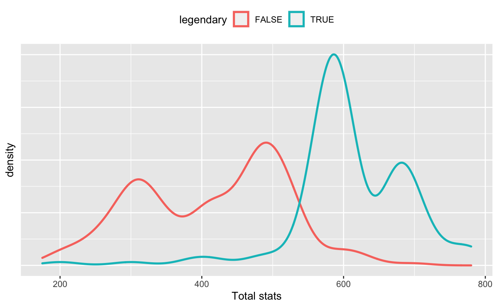
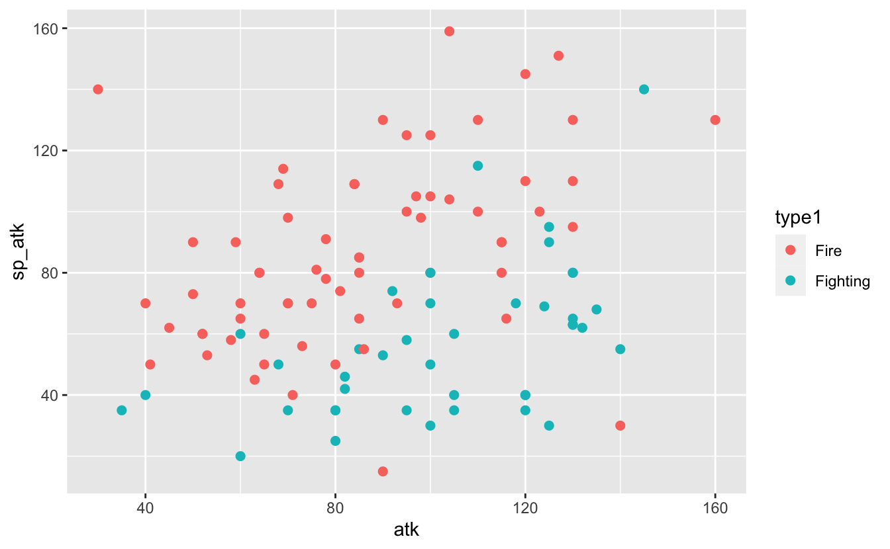
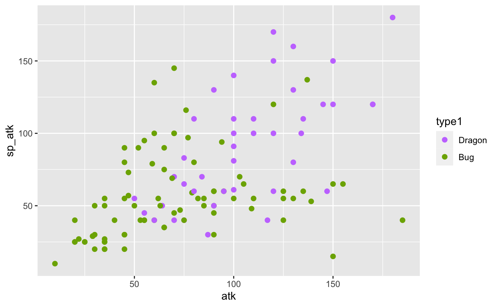
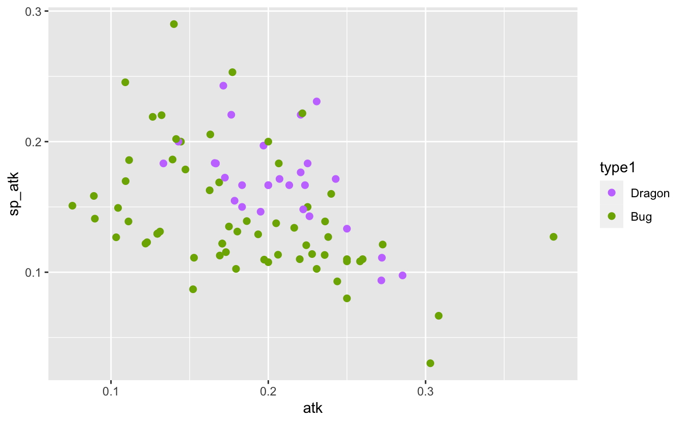
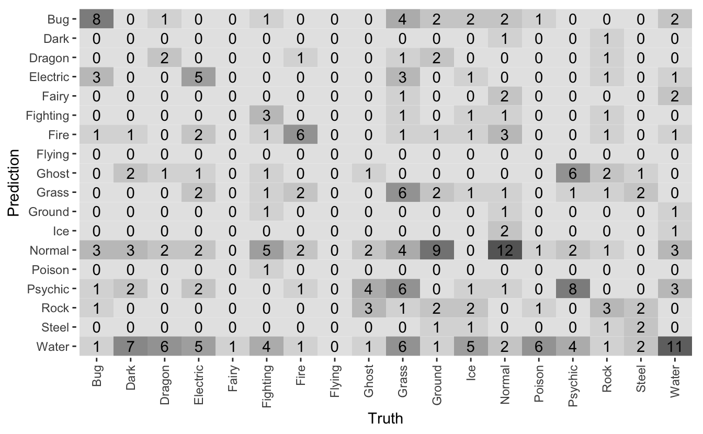

When I train a machine learning model in a blog post, I edit out all the mistakes. I make it seem like I had the perfect data I needed from the very start, and I never add a useless feature. This time, I want to train a model with all the mistakes and fruitless efforts included.

My goal here is to describe *my process of creating a model* rather than just presenting the final code.

The material in this post is adapted from a presentation I gave to [the Deakin Girl Geeks student society of Deakin University](https://www.dusa.org.au/clubs/deakin-girl-geeks-dgg).

## One of my favourite datasets: Pokémon

This Pokémon data comes from [a gist prepared by GitHub user simsketch](https://gist.github.com/simsketch/1a029a8d7fca1e4c142cbfd043a68f19). I manually corrected the last few rows as suggested in the comments/

<pre class='chroma'><code class='language-r' data-lang='r'><a href='https://rdrr.io/r/base/library.html'>library</a>(<a href='https://tidyverse.tidyverse.org'>tidyverse</a>)

pokemon &lt;- <a href='https://readr.tidyverse.org/reference/read_delim.html'>read_csv</a>("data/pokemon.csv") <a href='https://magrittr.tidyverse.org/reference/pipe.html'>%&gt;%</a> 
  janitor::<a href='https://rdrr.io/pkg/janitor/man/clean_names.html'>clean_names</a>() <a href='https://magrittr.tidyverse.org/reference/pipe.html'>%&gt;%</a> 
  <a href='https://dplyr.tidyverse.org/reference/mutate.html'>mutate</a>(
    type1 = <a href='https://rdrr.io/r/base/factor.html'>as.factor</a>(type1),
    type2 = <a href='https://rdrr.io/r/base/factor.html'>as.factor</a>(type2),
    legendary = <a href='https://rdrr.io/r/base/logical.html'>as.logical</a>(legendary)
  )

pokemon <a href='https://magrittr.tidyverse.org/reference/pipe.html'>%&gt;%</a> colnames
#&gt;  [1] "number"         "code"           "serial"         "name"          
#&gt;  [5] "type1"          "type2"          "color"          "ability1"      
#&gt;  [9] "ability2"       "ability_hidden" "generation"     "legendary"     
#&gt; [13] "mega_evolution" "height"         "weight"         "hp"            
#&gt; [17] "atk"            "def"            "sp_atk"         "sp_def"        
#&gt; [21] "spd"            "total"</code></pre>

Pokémon have *types* describing the elements or categories with which they are most closely affiliated. Charmander, for example, is a lizard with a perpetual flame on its tail and so is a *Fire* Pokémon. There are 18 types in total.

Pokémon also have *stats* --- attributes that describe their strengths and weaknesses. These are usually abbreviated:

-   **hp**: *hit points*, a numerical representation of how much *health* the Pokémon has
-   **atk**: determines how much *physical damage* the Pokémon can deal
-   **sp. atk**: determines how much *special damage* the Pokémon can deal. Some abilities (or *moves*) are more supernatural in nature, like a breath of fire or a bolt of thunder, and so are considered *special*.
-   **def**: *defence*, a Pokémon's capacity to resist physical damage.
-   **sp. def**: *special defence*, a Pokémon's capacity to resist special damage.
-   **spd**: *speed*, how quickly a Pokémon can attack.

It makes sense then that a Fighting-type Pokémon might have stronger **atk** than a Fire-type Pokémon, whose moves are more likely to be *special*. The question is: from a Pokémon's stats or other features, can we determine its type?

## The advanced technique of actually looking at the data

I'm not proud of this, but I often find myself writing many lines of exploratory code before I actually *look* at the data. Due to its rarity, I call this an *advanced* technique.

Now that I have a question I'm trying to answer, the first step is to *look at the data*.

<pre class='chroma'><code class='language-r' data-lang='r'>pokemon <a href='https://magrittr.tidyverse.org/reference/pipe.html'>%&gt;%</a>
  <a href='https://dplyr.tidyverse.org/reference/select.html'>select</a>(number, name, type1, type2, hp:total, color) <a href='https://magrittr.tidyverse.org/reference/pipe.html'>%&gt;%</a>
  <a href='https://rdrr.io/r/utils/head.html'>head</a>() <a href='https://magrittr.tidyverse.org/reference/pipe.html'>%&gt;%</a>
  knitr::<a href='https://rdrr.io/pkg/knitr/man/kable.html'>kable</a>("html")
</code></pre>
<table>
<thead>
<tr>
<th style="text-align:right;">
number
</th>
<th style="text-align:left;">
name
</th>
<th style="text-align:left;">
type1
</th>
<th style="text-align:left;">
type2
</th>
<th style="text-align:right;">
hp
</th>
<th style="text-align:right;">
atk
</th>
<th style="text-align:right;">
def
</th>
<th style="text-align:right;">
sp_atk
</th>
<th style="text-align:right;">
sp_def
</th>
<th style="text-align:right;">
spd
</th>
<th style="text-align:right;">
total
</th>
<th style="text-align:left;">
color
</th>
</tr>
</thead>
<tbody>
<tr>
<td style="text-align:right;">
1
</td>
<td style="text-align:left;">
Bulbasaur
</td>
<td style="text-align:left;">
Grass
</td>
<td style="text-align:left;">
Poison
</td>
<td style="text-align:right;">
45
</td>
<td style="text-align:right;">
49
</td>
<td style="text-align:right;">
49
</td>
<td style="text-align:right;">
65
</td>
<td style="text-align:right;">
65
</td>
<td style="text-align:right;">
45
</td>
<td style="text-align:right;">
318
</td>
<td style="text-align:left;">
Green
</td>
</tr>
<tr>
<td style="text-align:right;">
2
</td>
<td style="text-align:left;">
Ivysaur
</td>
<td style="text-align:left;">
Grass
</td>
<td style="text-align:left;">
Poison
</td>
<td style="text-align:right;">
60
</td>
<td style="text-align:right;">
62
</td>
<td style="text-align:right;">
63
</td>
<td style="text-align:right;">
80
</td>
<td style="text-align:right;">
80
</td>
<td style="text-align:right;">
60
</td>
<td style="text-align:right;">
405
</td>
<td style="text-align:left;">
Green
</td>
</tr>
<tr>
<td style="text-align:right;">
3
</td>
<td style="text-align:left;">
Venusaur
</td>
<td style="text-align:left;">
Grass
</td>
<td style="text-align:left;">
Poison
</td>
<td style="text-align:right;">
80
</td>
<td style="text-align:right;">
82
</td>
<td style="text-align:right;">
83
</td>
<td style="text-align:right;">
100
</td>
<td style="text-align:right;">
100
</td>
<td style="text-align:right;">
80
</td>
<td style="text-align:right;">
525
</td>
<td style="text-align:left;">
Green
</td>
</tr>
<tr>
<td style="text-align:right;">
3
</td>
<td style="text-align:left;">
Mega Venusaur
</td>
<td style="text-align:left;">
Grass
</td>
<td style="text-align:left;">
Poison
</td>
<td style="text-align:right;">
80
</td>
<td style="text-align:right;">
100
</td>
<td style="text-align:right;">
123
</td>
<td style="text-align:right;">
122
</td>
<td style="text-align:right;">
120
</td>
<td style="text-align:right;">
80
</td>
<td style="text-align:right;">
625
</td>
<td style="text-align:left;">
Green
</td>
</tr>
<tr>
<td style="text-align:right;">
4
</td>
<td style="text-align:left;">
Charmander
</td>
<td style="text-align:left;">
Fire
</td>
<td style="text-align:left;">
NA
</td>
<td style="text-align:right;">
39
</td>
<td style="text-align:right;">
52
</td>
<td style="text-align:right;">
43
</td>
<td style="text-align:right;">
60
</td>
<td style="text-align:right;">
50
</td>
<td style="text-align:right;">
65
</td>
<td style="text-align:right;">
309
</td>
<td style="text-align:left;">
Red
</td>
</tr>
<tr>
<td style="text-align:right;">
5
</td>
<td style="text-align:left;">
Charmeleon
</td>
<td style="text-align:left;">
Fire
</td>
<td style="text-align:left;">
NA
</td>
<td style="text-align:right;">
58
</td>
<td style="text-align:right;">
64
</td>
<td style="text-align:right;">
58
</td>
<td style="text-align:right;">
80
</td>
<td style="text-align:right;">
65
</td>
<td style="text-align:right;">
80
</td>
<td style="text-align:right;">
405
</td>
<td style="text-align:left;">
Red
</td>
</tr>
</tbody>
</table>

### Always ask: what does one row of the data represent?

This is incredibly important --- if I don't know what one row of the data is, I can't progress any further. Those with database experience might ask a related question: what is the *primary key*?

A reasonable assumption is that every row is a Pokémon, and this would be wrong.

The Pokémon `number` seems like a good candidate here, but I can see that Venusaur and Mega Venusaur share a `number`. A mega evolution is a temporary transformation of a Pokémon. It seems that in the data I have here (and in the Pokémon universe more generally), mega evolutions are seen as variations of existing Pokémon.

The question that follows is whether I should include these mega evolutions or discard them. I'm going to keep them for now, since I think they're still relevant to the hypothesis.

I might then ask if `name` is a unique identifier, but this turns out to be false:

<pre class='chroma'><code class='language-r' data-lang='r'>pokemon <a href='https://magrittr.tidyverse.org/reference/pipe.html'>%&gt;%</a>
  <a href='https://dplyr.tidyverse.org/reference/filter.html'>filter</a>(name == "Darmanitan") <a href='https://magrittr.tidyverse.org/reference/pipe.html'>%&gt;%</a>
  <a href='https://dplyr.tidyverse.org/reference/select.html'>select</a>(number, name, type1, type2, hp:total, color) <a href='https://magrittr.tidyverse.org/reference/pipe.html'>%&gt;%</a>
  knitr::<a href='https://rdrr.io/pkg/knitr/man/kable.html'>kable</a>("html")
</code></pre>
<table>
<thead>
<tr>
<th style="text-align:right;">
number
</th>
<th style="text-align:left;">
name
</th>
<th style="text-align:left;">
type1
</th>
<th style="text-align:left;">
type2
</th>
<th style="text-align:right;">
hp
</th>
<th style="text-align:right;">
atk
</th>
<th style="text-align:right;">
def
</th>
<th style="text-align:right;">
sp_atk
</th>
<th style="text-align:right;">
sp_def
</th>
<th style="text-align:right;">
spd
</th>
<th style="text-align:right;">
total
</th>
<th style="text-align:left;">
color
</th>
</tr>
</thead>
<tbody>
<tr>
<td style="text-align:right;">
555
</td>
<td style="text-align:left;">
Darmanitan
</td>
<td style="text-align:left;">
Fire
</td>
<td style="text-align:left;">
NA
</td>
<td style="text-align:right;">
105
</td>
<td style="text-align:right;">
140
</td>
<td style="text-align:right;">
55
</td>
<td style="text-align:right;">
30
</td>
<td style="text-align:right;">
55
</td>
<td style="text-align:right;">
95
</td>
<td style="text-align:right;">
480
</td>
<td style="text-align:left;">
Red
</td>
</tr>
<tr>
<td style="text-align:right;">
555
</td>
<td style="text-align:left;">
Darmanitan
</td>
<td style="text-align:left;">
Fire
</td>
<td style="text-align:left;">
Psychic
</td>
<td style="text-align:right;">
105
</td>
<td style="text-align:right;">
30
</td>
<td style="text-align:right;">
105
</td>
<td style="text-align:right;">
140
</td>
<td style="text-align:right;">
105
</td>
<td style="text-align:right;">
55
</td>
<td style="text-align:right;">
540
</td>
<td style="text-align:left;">
White
</td>
</tr>
<tr>
<td style="text-align:right;">
555
</td>
<td style="text-align:left;">
Darmanitan
</td>
<td style="text-align:left;">
Ice
</td>
<td style="text-align:left;">
NA
</td>
<td style="text-align:right;">
105
</td>
<td style="text-align:right;">
140
</td>
<td style="text-align:right;">
55
</td>
<td style="text-align:right;">
30
</td>
<td style="text-align:right;">
55
</td>
<td style="text-align:right;">
95
</td>
<td style="text-align:right;">
480
</td>
<td style="text-align:left;">
White
</td>
</tr>
<tr>
<td style="text-align:right;">
555
</td>
<td style="text-align:left;">
Darmanitan
</td>
<td style="text-align:left;">
Ice
</td>
<td style="text-align:left;">
Fire
</td>
<td style="text-align:right;">
105
</td>
<td style="text-align:right;">
160
</td>
<td style="text-align:right;">
55
</td>
<td style="text-align:right;">
30
</td>
<td style="text-align:right;">
55
</td>
<td style="text-align:right;">
135
</td>
<td style="text-align:right;">
540
</td>
<td style="text-align:left;">
White
</td>
</tr>
</tbody>
</table>

This happens because Darmanitan has multiple *forms*. Some of these have different stats, but some have identical stats and different types. A natural question might be if name, types, and stats are enough to make each row unique. This is wrong:

<pre class='chroma'><code class='language-r' data-lang='r'>pokemon <a href='https://magrittr.tidyverse.org/reference/pipe.html'>%&gt;%</a>
  <a href='https://dplyr.tidyverse.org/reference/filter.html'>filter</a>(name == "Burmy") <a href='https://magrittr.tidyverse.org/reference/pipe.html'>%&gt;%</a>
  <a href='https://dplyr.tidyverse.org/reference/select.html'>select</a>(number, name, type1, type2, hp:total, color) <a href='https://magrittr.tidyverse.org/reference/pipe.html'>%&gt;%</a>
  knitr::<a href='https://rdrr.io/pkg/knitr/man/kable.html'>kable</a>("html")
</code></pre>
<table>
<thead>
<tr>
<th style="text-align:right;">
number
</th>
<th style="text-align:left;">
name
</th>
<th style="text-align:left;">
type1
</th>
<th style="text-align:left;">
type2
</th>
<th style="text-align:right;">
hp
</th>
<th style="text-align:right;">
atk
</th>
<th style="text-align:right;">
def
</th>
<th style="text-align:right;">
sp_atk
</th>
<th style="text-align:right;">
sp_def
</th>
<th style="text-align:right;">
spd
</th>
<th style="text-align:right;">
total
</th>
<th style="text-align:left;">
color
</th>
</tr>
</thead>
<tbody>
<tr>
<td style="text-align:right;">
412
</td>
<td style="text-align:left;">
Burmy
</td>
<td style="text-align:left;">
Bug
</td>
<td style="text-align:left;">
NA
</td>
<td style="text-align:right;">
40
</td>
<td style="text-align:right;">
29
</td>
<td style="text-align:right;">
45
</td>
<td style="text-align:right;">
29
</td>
<td style="text-align:right;">
45
</td>
<td style="text-align:right;">
36
</td>
<td style="text-align:right;">
224
</td>
<td style="text-align:left;">
Green
</td>
</tr>
<tr>
<td style="text-align:right;">
412
</td>
<td style="text-align:left;">
Burmy
</td>
<td style="text-align:left;">
Bug
</td>
<td style="text-align:left;">
NA
</td>
<td style="text-align:right;">
40
</td>
<td style="text-align:right;">
29
</td>
<td style="text-align:right;">
45
</td>
<td style="text-align:right;">
29
</td>
<td style="text-align:right;">
45
</td>
<td style="text-align:right;">
36
</td>
<td style="text-align:right;">
224
</td>
<td style="text-align:left;">
Brown
</td>
</tr>
<tr>
<td style="text-align:right;">
412
</td>
<td style="text-align:left;">
Burmy
</td>
<td style="text-align:left;">
Bug
</td>
<td style="text-align:left;">
NA
</td>
<td style="text-align:right;">
40
</td>
<td style="text-align:right;">
29
</td>
<td style="text-align:right;">
45
</td>
<td style="text-align:right;">
29
</td>
<td style="text-align:right;">
45
</td>
<td style="text-align:right;">
36
</td>
<td style="text-align:right;">
224
</td>
<td style="text-align:left;">
Red
</td>
</tr>
</tbody>
</table>

These forms usually have a different appearance, hence the difference in colour for these entries for Burmy. Indeed, this turns out to be the explanation I'm looking for. This has to be verified manually, by using the [`janitor::get_dupes`](https://rdrr.io/pkg/janitor/man/get_dupes.html) function to investigate the dupes and looking up the Pokémon on [Bulbapedia](https://bulbapedia.bulbagarden.net).

I'll keep all of these rows as. Different forms of the same Pokémon can sometimes have different stats so it makes sense to treat each form as a separate Pokémon.

### Missing data and consistency

I want to take another look at the data now to consider any missing values, and if there are any obvious errors in the values.

<table>
<thead>
<tr>
<th style="text-align:right;">
number
</th>
<th style="text-align:left;">
name
</th>
<th style="text-align:left;">
type1
</th>
<th style="text-align:left;">
type2
</th>
<th style="text-align:right;">
hp
</th>
<th style="text-align:right;">
atk
</th>
<th style="text-align:right;">
def
</th>
<th style="text-align:right;">
sp_atk
</th>
<th style="text-align:right;">
sp_def
</th>
<th style="text-align:right;">
spd
</th>
<th style="text-align:right;">
total
</th>
<th style="text-align:left;">
color
</th>
</tr>
</thead>
<tbody>
<tr>
<td style="text-align:right;">
1
</td>
<td style="text-align:left;">
Bulbasaur
</td>
<td style="text-align:left;">
Grass
</td>
<td style="text-align:left;">
Poison
</td>
<td style="text-align:right;">
45
</td>
<td style="text-align:right;">
49
</td>
<td style="text-align:right;">
49
</td>
<td style="text-align:right;">
65
</td>
<td style="text-align:right;">
65
</td>
<td style="text-align:right;">
45
</td>
<td style="text-align:right;">
318
</td>
<td style="text-align:left;">
Green
</td>
</tr>
<tr>
<td style="text-align:right;">
2
</td>
<td style="text-align:left;">
Ivysaur
</td>
<td style="text-align:left;">
Grass
</td>
<td style="text-align:left;">
Poison
</td>
<td style="text-align:right;">
60
</td>
<td style="text-align:right;">
62
</td>
<td style="text-align:right;">
63
</td>
<td style="text-align:right;">
80
</td>
<td style="text-align:right;">
80
</td>
<td style="text-align:right;">
60
</td>
<td style="text-align:right;">
405
</td>
<td style="text-align:left;">
Green
</td>
</tr>
<tr>
<td style="text-align:right;">
3
</td>
<td style="text-align:left;">
Venusaur
</td>
<td style="text-align:left;">
Grass
</td>
<td style="text-align:left;">
Poison
</td>
<td style="text-align:right;">
80
</td>
<td style="text-align:right;">
82
</td>
<td style="text-align:right;">
83
</td>
<td style="text-align:right;">
100
</td>
<td style="text-align:right;">
100
</td>
<td style="text-align:right;">
80
</td>
<td style="text-align:right;">
525
</td>
<td style="text-align:left;">
Green
</td>
</tr>
<tr>
<td style="text-align:right;">
3
</td>
<td style="text-align:left;">
Mega Venusaur
</td>
<td style="text-align:left;">
Grass
</td>
<td style="text-align:left;">
Poison
</td>
<td style="text-align:right;">
80
</td>
<td style="text-align:right;">
100
</td>
<td style="text-align:right;">
123
</td>
<td style="text-align:right;">
122
</td>
<td style="text-align:right;">
120
</td>
<td style="text-align:right;">
80
</td>
<td style="text-align:right;">
625
</td>
<td style="text-align:left;">
Green
</td>
</tr>
<tr>
<td style="text-align:right;">
4
</td>
<td style="text-align:left;">
Charmander
</td>
<td style="text-align:left;">
Fire
</td>
<td style="text-align:left;">
NA
</td>
<td style="text-align:right;">
39
</td>
<td style="text-align:right;">
52
</td>
<td style="text-align:right;">
43
</td>
<td style="text-align:right;">
60
</td>
<td style="text-align:right;">
50
</td>
<td style="text-align:right;">
65
</td>
<td style="text-align:right;">
309
</td>
<td style="text-align:left;">
Red
</td>
</tr>
<tr>
<td style="text-align:right;">
5
</td>
<td style="text-align:left;">
Charmeleon
</td>
<td style="text-align:left;">
Fire
</td>
<td style="text-align:left;">
NA
</td>
<td style="text-align:right;">
58
</td>
<td style="text-align:right;">
64
</td>
<td style="text-align:right;">
58
</td>
<td style="text-align:right;">
80
</td>
<td style="text-align:right;">
65
</td>
<td style="text-align:right;">
80
</td>
<td style="text-align:right;">
405
</td>
<td style="text-align:left;">
Red
</td>
</tr>
</tbody>
</table>

There are two things I notice here:

-   `type2` can be missing, but `type1` *appears* to be present all the time (based on this very small sample). Are there any Pokémon without a type *at all*?
-   There's a `total` value, which I assume is the sum of all six stats. Is my assumption correct?

### Validating data assumptions makes me feel safer

I'll implement a quick function to validate this data, answering my two questions above.

<pre class='chroma'><code class='language-r' data-lang='r'>validate_pokemon &lt;- function(pokemon_data) &#123;
  total_mismatch &lt;- <a href='https://rdrr.io/r/base/with.html'>with</a>(
    pokemon_data, 
    total != hp + atk + def + sp_atk + sp_def + spd
  )
  
  important_columns &lt;- pokemon_data <a href='https://magrittr.tidyverse.org/reference/pipe.html'>%&gt;%</a> <a href='https://dplyr.tidyverse.org/reference/select.html'>select</a>(type1, hp:atk)
  
  !<a href='https://rdrr.io/r/base/any.html'>any</a>(total_mismatch) &amp;&amp; !<a href='https://rdrr.io/r/base/any.html'>any</a>(<a href='https://rdrr.io/r/base/NA.html'>is.na</a>(important_columns))
&#125;

validate_pokemon(pokemon)
#&gt; [1] TRUE</code></pre>

Looks good! In a "real" situation I would go into much more detail, looking for as many potential problems as I can think of (for example, is `color` always present?). But combining all that logic into a single validation function is a good step, because I can insert this into any pipelines as a necessary step.

## Plot the data. Always.

Exploratory Data Analysis is about getting comfortable with the data. There's no algorithm for it. While I'm making only two graphs here, in a "real" situation this would be dozens of graphs (each with multiple failed attempts).

### Does more stats mean more powerful?

I'll consider the `total` stat amount, and determine if it actually does represent a Pokémon's strength. Certain Pokémon are considered "legendary" --- rare and more powerful than the average Pokémon. It makes sense that legendary Pokémon would have, on average, a higher `total` stat. And sure enough:

<pre class='chroma'><code class='language-r' data-lang='r'>pokemon <a href='https://magrittr.tidyverse.org/reference/pipe.html'>%&gt;%</a> 
  <a href='https://ggplot2.tidyverse.org/reference/ggplot.html'>ggplot</a>(
    <a href='https://ggplot2.tidyverse.org/reference/aes.html'>aes</a>(
      x = total,
      color = legendary
    )
  ) +
  <a href='https://ggplot2.tidyverse.org/reference/geom_density.html'>geom_density</a>(size = 1) +
  <a href='https://ggplot2.tidyverse.org/reference/labs.html'>xlab</a>("Total stats") +
  <a href='https://ggplot2.tidyverse.org/reference/theme.html'>theme</a>(
    axis.text.y = <a href='https://ggplot2.tidyverse.org/reference/element.html'>element_blank</a>(),
    axis.ticks.y = <a href='https://ggplot2.tidyverse.org/reference/element.html'>element_blank</a>(),
    legend.position = "top"
  )
</code></pre>

Sure enough, more stats means more powerful.

### Does the hypothesis make sense?

If my hypothesis is that stats matter to predict type, I should be able to plot something to show that this *makes sense*. I'm not looking for incontrovertible proof here. But if I can't find *something*, I may as well stop here.

Hypotheses don't come out of no where. Somewhere there's a anecdote or a feeling that a relationship exists before it's been formally investigated. In businesses that often comes from a domain expert --- someone who isn't necessarily an expert on data, but who knows the domain of the data better than any data scientist.

In this case, I've played enough Pokémon to know that Fire Pokémon tend to favour special attack and Fighting Pokémon favour (physical) attack.

<pre class='chroma'><code class='language-r' data-lang='r'>pokemon <a href='https://magrittr.tidyverse.org/reference/pipe.html'>%&gt;%</a> 
  <a href='https://dplyr.tidyverse.org/reference/filter.html'>filter</a>(
    type1 <a href='https://rdrr.io/r/base/match.html'>%in%</a> <a href='https://rdrr.io/r/base/c.html'>c</a>(
      "Fire", "Fighting"
    )
  ) <a href='https://magrittr.tidyverse.org/reference/pipe.html'>%&gt;%</a> 
  <a href='https://ggplot2.tidyverse.org/reference/ggplot.html'>ggplot</a>(<a href='https://ggplot2.tidyverse.org/reference/aes.html'>aes</a>(
      x = atk,
      y = sp_atk,
      color = type1
  )) +
  <a href='https://ggplot2.tidyverse.org/reference/geom_point.html'>geom_point</a>(size = 2) + 
  <a href='https://ggplot2.tidyverse.org/reference/scale_manual.html'>scale_color_manual</a>(
    values = <a href='https://rdrr.io/r/base/c.html'>c</a>(
      "Fire" = "#F8766D",
      "Fighting" = "#00BFC4"
    )
  )
</code></pre>

There's a nice separation here that strongly suggests that --- for these two types, at least --- it's possible to use a Pokémon's stats to guess its primary type. I imagine drawing a in between the two groups as best I can, noting that there's no way to perfectly separate them. Depending on which side of the line the stats of a particular Pokémon falls I can classify it as either Fire or Fighting.

## Recap: What do I know?

I haven't given much thought to modelling yet. I've identified a question based on the data's *domain*, and then I explored the data by asking questions and validating assumptions. Modelling comes into the process late.

Here's what I know so far:

-   Pokémon have one or two types --- the primary (first) type is never missing
-   None of the stats are missing
-   `total` stats is a good measure of a Pokémon's strength
-   There's some relationship between primary type and stats

It's not time to model just yet. First I need to...

## Define a target metric

**Before** I start training any models, I need to know the *target metric* under which they'll be evaluated.

This question is impossible to answer here; my model is never going to be *used* for anything, so the choice of target metric can't be judged. So I'll keep it simple: under a candidate model, what percentage of type predictions are correct?

In a "real" situation, I would have other concerns. I would be asking about what happens when I get the prediction wrong, and what the benefits are when I get it right. These questions have no meaning here (there is no cost and no benefit to a model that is never put into practice), but they're crucial in real-life data science.

For example, consider a model that predicts the probability that it will rain. If I predict rain and get it wrong, I leave the house carrying an umbrella that I don't need --- no big deal. If I get it right, I get to keep my clothes dry. The cost of a false positive is small and the benefits of a true positive are high, so I might undervalue false negatives (by, say, carrying an umbrella at a 25% chance of rain instead of a 50% chance of rain).

### What makes a model *good enough*?

Now that I have my target metric, I need to know what counts as a good enough model. There's never a situation in which I have unlimited time to train the perfect model --- if nothing else, I'd get bored eventually. I need a stopping criterion.

Sometimes this is defined by the problem itself. For example, I might be required to demonstrate a certain financial benefit. Or I might have a time constraint and so I need to base my decisions on the best model I'm able to train in a given time.

Otherwise, for classification problems, I find it helps to consider a *naive algorithm* which predicts the most common class every time. The proportion of the most common class is also known as the *no-information rate*.

I need to calculate this rate *after* I split my data, and base it on the training data alone. This prevents me from making judgments based on the test data, and lets me compare my model's performance to the no-information rate of the data it was trained on.

The following function will calculate the no-information rate. The most common type is almost always Water, but this function doesn't assume that.

<pre class='chroma'><code class='language-r' data-lang='r'>no_information_rate &lt;- function(pokemon_data) &#123;
  pokemon_data <a href='https://magrittr.tidyverse.org/reference/pipe.html'>%&gt;%</a>
    <a href='https://dplyr.tidyverse.org/reference/count.html'>count</a>(type1) <a href='https://magrittr.tidyverse.org/reference/pipe.html'>%&gt;%</a>
    <a href='https://dplyr.tidyverse.org/reference/mutate.html'>mutate</a>(proportion = n / <a href='https://rdrr.io/r/base/sum.html'>sum</a>(n)) <a href='https://magrittr.tidyverse.org/reference/pipe.html'>%&gt;%</a>
    <a href='https://dplyr.tidyverse.org/reference/top_n.html'>top_n</a>(1, proportion) <a href='https://magrittr.tidyverse.org/reference/pipe.html'>%&gt;%</a>
    <a href='https://dplyr.tidyverse.org/reference/pull.html'>pull</a>(proportion)
&#125;</code></pre>

I should aim to beat this metric (preferably by a few percent) to be be convinced that my model has actually learnt *something*.

There are other criteria I need to pay attention too, though. I want to make sure that my predictions aren't concentrated on only one or two types. But with 18 types and 1048 rows, this may be tough. At some point I need to confront the problem I've been ignoring up until now: the number of classes is very small compared to the number of data points!

## Let's train a model!

*Now* I've done enough foundational work that I can train a model. I'm going to use the `tidymodels` meta-package, a favourite of mine:

<pre class='chroma'><code class='language-r' data-lang='r'><a href='https://rdrr.io/r/base/library.html'>library</a>(<a href='https://tidymodels.tidymodels.org'>tidymodels</a>)</code></pre>

I love random forests so that's what I'll use. A "proper" approach here would be to use a technique like cross-validation or train-validate-test split to compare multiple models, including multiple hyperparameter configurations for each model type. But I'm glossing over that for this post.

First, a simple train-test split. I'll train my model on `pokemon_train` and validate it on `pokemon_test`.

<pre class='chroma'><code class='language-r' data-lang='r'><a href='https://rdrr.io/r/base/Random.html'>set.seed</a>(12345)
pokemon_split &lt;- initial_split(pokemon, strata = "type1", prop = 0.7)
pokemon_train &lt;- training(pokemon_split)
pokemon_test &lt;- testing(pokemon_split)

<a href='https://rdrr.io/r/base/nrow.html'>nrow</a>(pokemon_train)
#&gt; [1] 733

<a href='https://rdrr.io/r/base/nrow.html'>nrow</a>(pokemon_test)
#&gt; [1] 315</code></pre>

I now have a training set with 733 rows and a test set with 315 rows. I can use the function I prepared earlier to calculate the no-information rate.

<pre class='chroma'><code class='language-r' data-lang='r'>no_information_rate(pokemon_train)
#&gt; [1] 0.1323329</code></pre>

This serves as a benchmark for my model. Here's the definition of the model, created with the `parsnip` package:

<pre class='chroma'><code class='language-r' data-lang='r'>pokemon_model &lt;- rand_forest(
    trees = 200,
    mtry = 3
  ) <a href='https://magrittr.tidyverse.org/reference/pipe.html'>%&gt;%</a>
  set_engine("ranger") <a href='https://magrittr.tidyverse.org/reference/pipe.html'>%&gt;%</a> 
  set_mode("classification")

pokemon_model
#&gt; Random Forest Model Specification (classification)
#&gt; 
#&gt; Main Arguments:
#&gt;   mtry = 3
#&gt;   trees = 200
#&gt; 
#&gt; Computational engine: ranger</code></pre>

At this point the model hasn't been fitted, so I had better fit it.

## First attempt - a failure that looks like a success

Data science is a string of failures and hopefully (but not always) a successful result. But I have to start with *a model* so that I can iterate. So I'll fit my model and see how it performs:

<pre class='chroma'><code class='language-r' data-lang='r'>fitted_pokemon_model &lt;- pokemon_model <a href='https://magrittr.tidyverse.org/reference/pipe.html'>%&gt;%</a> fit(
  type1 ~ hp + atk + def + sp_atk + sp_def + spd,
  data = pokemon_train
)

first_attempt_accuracy &lt;- pokemon_test <a href='https://magrittr.tidyverse.org/reference/pipe.html'>%&gt;%</a> 
  <a href='https://dplyr.tidyverse.org/reference/mutate.html'>mutate</a>(
    predicted_type1 = <a href='https://rdrr.io/r/stats/predict.html'>predict</a>(
      fitted_pokemon_model,
      pokemon_test
    )$.pred_class
  ) <a href='https://magrittr.tidyverse.org/reference/pipe.html'>%&gt;%</a>
  accuracy(type1, predicted_type1) <a href='https://magrittr.tidyverse.org/reference/pipe.html'>%&gt;%</a> 
  <a href='https://dplyr.tidyverse.org/reference/pull.html'>pull</a>(.estimate)

first_attempt_accuracy
#&gt; [1] 0.2031746</code></pre>

What a great result! 20.3% accuracy is better than the no-information rate of 13.2%. I'm clearly a great data scientist, and I can finally stop feeling insecure about my abilities.

### Except that's not a good result

A little pessimism is a good thing, and a good model should be met with scepticism. Doubly so if the model is a first attempt.

*Data leakage* is a situation in which data from the test set influences the training set, and so the model gets a peak into the test data that it shouldn't have. It can lead to *overfitting*, and it's sometimes extraordinarily difficult to detect.

Do you remember when you trained your first stock market model and got 99% accuracy? You imagined your life on your private island? And then you realised (or someone told you) that you needed to split your data into into two time periods so that the model couldn't see the future? That was data leakage causing over-fitting. There's no judgment from me here --- everyone has made this mistake, and most of us (myself included) continue to do so.

There are no time columns in my data; the source of the data leakage is more subtle than that. Pokémon belong to *families*. Charmander, upon reaching certain conditions, permanently changes into Charmeleon through a process known as *evolution*. Charmeleon eventually becomes Charizard. All three of these Pokémon belong to the "Charmander" family. It's reasonable to assume that the relationship between stats is similar for Pokémon in the same family.

Is my model learning that certain stat values are associated with certain types? Or is it learning to identify which Pokémon belong to which family, and then assuming that they all have the same type? That might be a fine model, but it detracts from my hypothesis.

### Finding new data:

My model doesn't contain information on Pokémon families. This is very common part of data science --- thinking I have all the data but then needing to find more. I used [the table from the Pokémon fandom wiki](https://pokemon.fandom.com/wiki/List_of_Pok%C3%A9mon_by_evolution) to associate a "family" with each Pokémon. The logic for these joins and some other minor corrections is stored [as a gist](https://gist.github.com/mdneuzerling/78a955dfa37087b90b6094911c9d03d5). The result is a CSV named "pokemon_with_families.csv".

<pre class='chroma'><code class='language-r' data-lang='r'>pokemon &lt;- readr::<a href='https://readr.tidyverse.org/reference/read_delim.html'>read_csv</a>("data/pokemon_with_families.csv") <a href='https://magrittr.tidyverse.org/reference/pipe.html'>%&gt;%</a> 
  janitor::<a href='https://rdrr.io/pkg/janitor/man/clean_names.html'>clean_names</a>() <a href='https://magrittr.tidyverse.org/reference/pipe.html'>%&gt;%</a> 
  <a href='https://dplyr.tidyverse.org/reference/mutate.html'>mutate</a>(
    type1 = <a href='https://rdrr.io/r/base/factor.html'>as.factor</a>(type1),
    type2 = <a href='https://rdrr.io/r/base/factor.html'>as.factor</a>(type2),
    legendary = <a href='https://rdrr.io/r/base/logical.html'>as.logical</a>(legendary)
  )
#&gt; Rows: 1041 Columns: 14
#&gt; ── Column specification ────────────────────────────────────────────────────────
#&gt; Delimiter: ","
#&gt; chr (5): name, type1, type2, family, color
#&gt; dbl (8): number, hp, atk, def, sp_atk, sp_def, spd, total
#&gt; lgl (1): legendary
#&gt; 
#&gt; ℹ Use `spec()` to retrieve the full column specification for this data.
#&gt; ℹ Specify the column types or set `show_col_types = FALSE` to quiet this message.</code></pre>

### Grouped train-test split

I'll re-split the data, this time ensuring that if a Pokémon from a given family is in `pokemon_train`, then *all* Pokémon in that family are in `pokemon_train`, and similarly for `pokemon_test`:

<pre class='chroma'><code class='language-r' data-lang='r'><a href='https://rdrr.io/r/base/Random.html'>set.seed</a>(12345)

train_families &lt;- pokemon <a href='https://magrittr.tidyverse.org/reference/pipe.html'>%&gt;%</a> <a href='https://dplyr.tidyverse.org/reference/distinct.html'>distinct</a>(family) <a href='https://magrittr.tidyverse.org/reference/pipe.html'>%&gt;%</a> 
  <a href='https://dplyr.tidyverse.org/reference/sample_n.html'>sample_frac</a>(0.7) <a href='https://magrittr.tidyverse.org/reference/pipe.html'>%&gt;%</a> <a href='https://dplyr.tidyverse.org/reference/pull.html'>pull</a>(family)

pokemon_train &lt;- pokemon <a href='https://magrittr.tidyverse.org/reference/pipe.html'>%&gt;%</a> <a href='https://dplyr.tidyverse.org/reference/filter.html'>filter</a>(family <a href='https://rdrr.io/r/base/match.html'>%in%</a> train_families)
pokemon_test &lt;- pokemon <a href='https://magrittr.tidyverse.org/reference/pipe.html'>%&gt;%</a> <a href='https://dplyr.tidyverse.org/reference/filter.html'>filter</a>(!(family <a href='https://rdrr.io/r/base/match.html'>%in%</a> train_families))</code></pre>

This is a new training data set, so I have a new no-information rate:

<pre class='chroma'><code class='language-r' data-lang='r'>no_information_rate(pokemon_train)
#&gt; [1] 0.14361</code></pre>

I'll try re-fitting the model on this newly split data:

<pre class='chroma'><code class='language-r' data-lang='r'>fitted_pokemon_model &lt;- pokemon_model <a href='https://magrittr.tidyverse.org/reference/pipe.html'>%&gt;%</a> fit(
  type1 ~ hp + atk + def + sp_atk + sp_def + spd,
  data = pokemon_train
)

second_attempt_accuracy &lt;- pokemon_test <a href='https://magrittr.tidyverse.org/reference/pipe.html'>%&gt;%</a> 
  <a href='https://dplyr.tidyverse.org/reference/mutate.html'>mutate</a>(
    predicted_type1 = <a href='https://rdrr.io/r/stats/predict.html'>predict</a>(
      fitted_pokemon_model,
      pokemon_test
    )$.pred_class
  ) <a href='https://magrittr.tidyverse.org/reference/pipe.html'>%&gt;%</a>
  accuracy(type1, predicted_type1) <a href='https://magrittr.tidyverse.org/reference/pipe.html'>%&gt;%</a> 
  <a href='https://dplyr.tidyverse.org/reference/pull.html'>pull</a>(.estimate)

second_attempt_accuracy
#&gt; [1] 0.141844</code></pre>

14.2% is not so impressive when the no-information rate is 14.4%. Data leakage can make a huge difference!

## A little bit of feature engineering

Feature engineering is the process of refining existing features or creating new ones to improve the accuracy of a model. Informally, it lets models use features the way a human being might see them.

I know that some Pokémon types are stronger than others. For example, Dragon Pokémon tend to be stronger than bug Pokémon. I can see that in the comparison of their `atk` and `sp_atk` below:

<pre class='chroma'><code class='language-r' data-lang='r'>plot_dragon_bug &lt;- function(pokemon_data) &#123;
  pokemon_data <a href='https://magrittr.tidyverse.org/reference/pipe.html'>%&gt;%</a> 
  <a href='https://dplyr.tidyverse.org/reference/filter.html'>filter</a>(
    type1 <a href='https://rdrr.io/r/base/match.html'>%in%</a> <a href='https://rdrr.io/r/base/c.html'>c</a>(
      "Bug", "Dragon"
    )
  ) <a href='https://magrittr.tidyverse.org/reference/pipe.html'>%&gt;%</a> 
  <a href='https://ggplot2.tidyverse.org/reference/ggplot.html'>ggplot</a>(<a href='https://ggplot2.tidyverse.org/reference/aes.html'>aes</a>(
      x = atk,
      y = sp_atk,
      color = type1
  )) +
  <a href='https://ggplot2.tidyverse.org/reference/geom_point.html'>geom_point</a>(size = 2) + 
  <a href='https://ggplot2.tidyverse.org/reference/scale_manual.html'>scale_color_manual</a>(
    values = <a href='https://rdrr.io/r/base/c.html'>c</a>(
      "Dragon" = "#C77CFF",
      "Bug" = "#7CAE00"
    )
  )
&#125;

pokemon <a href='https://magrittr.tidyverse.org/reference/pipe.html'>%&gt;%</a> plot_dragon_bug()
</code></pre>

It's possible that rather than considering absolute stats I need to consider *proportional* stats. That is, the proportion of attack, speed, etc. relative to a Pokémon's total stats. If this helps to separate the types I might be able to see that separation in a plot:

<pre class='chroma'><code class='language-r' data-lang='r'>pokemon_train <a href='https://magrittr.tidyverse.org/reference/pipe.html'>%&gt;%</a>
  <a href='https://dplyr.tidyverse.org/reference/mutate.html'>mutate</a>(<a href='https://dplyr.tidyverse.org/reference/across.html'>across</a>(hp:spd, function(x) x / total)) <a href='https://magrittr.tidyverse.org/reference/pipe.html'>%&gt;%</a>
  plot_dragon_bug()
</code></pre>

It's not a very convincing change. If a difference is there, it's a minor one. Still, I think it's enough to proceed with another attempt a model.

I need to introduce a preprocessing *recipe* using the `recipes` package, part of the `tidymodels` universe. This recipe tells R how to manipulate my data before modelling. Recipes are prepared based on the training data and applied to the test data to prevent data leakage that might occur from steps such as imputation and normalisation.

<pre class='chroma'><code class='language-r' data-lang='r'>preprocessing &lt;- recipe(
  type1 ~ hp + atk + def + sp_atk + sp_def + spd + total,
  data = pokemon_train
) <a href='https://magrittr.tidyverse.org/reference/pipe.html'>%&gt;%</a>
  step_mutate(
    hp = hp / total,
    atk = atk / total,
    def = def / total,
    sp_atk = sp_atk / total,
    sp_def = sp_def / total,
    spd = spd / total
  ) <a href='https://magrittr.tidyverse.org/reference/pipe.html'>%&gt;%</a> 
  step_normalize(total)</code></pre>

The last step, which scales and centres the data, isn't strictly necessary for tree-based models. It may, however, make it easier to interpret stats.

In `tidymodels`, a `workflow` is a combination of a model and a recipe. It lets me combine my preprocessing and modelling steps into a single object that can be fit in one step.

<pre class='chroma'><code class='language-r' data-lang='r'>pokemon_workflow &lt;- workflow() <a href='https://magrittr.tidyverse.org/reference/pipe.html'>%&gt;%</a>
  add_recipe(preprocessing) <a href='https://magrittr.tidyverse.org/reference/pipe.html'>%&gt;%</a> 
  add_model(pokemon_model)</code></pre>

I can now see if this extra bit of feature engineering will pay off:

<pre class='chroma'><code class='language-r' data-lang='r'>fitted_pokemon_workflow &lt;- pokemon_workflow <a href='https://magrittr.tidyverse.org/reference/pipe.html'>%&gt;%</a> fit(pokemon_train)

third_attempt_accuracy &lt;- pokemon_test <a href='https://magrittr.tidyverse.org/reference/pipe.html'>%&gt;%</a> 
  <a href='https://dplyr.tidyverse.org/reference/mutate.html'>mutate</a>(
    predicted_type1 = <a href='https://rdrr.io/r/stats/predict.html'>predict</a>(
      fitted_pokemon_workflow,
      pokemon_test
    )$.pred_class
  ) <a href='https://magrittr.tidyverse.org/reference/pipe.html'>%&gt;%</a>
  accuracy(type1, predicted_type1) <a href='https://magrittr.tidyverse.org/reference/pipe.html'>%&gt;%</a> 
  <a href='https://dplyr.tidyverse.org/reference/pull.html'>pull</a>(.estimate)
third_attempt_accuracy
#&gt; [1] 0.1347518</code></pre>

That's an accuracy of 13.5% compared to a no-information rate is 14.4%. That's disappointing! It looks like this scaling didn't do anything.

## MORE DATA

At this point I'm willing to give up on my hypothesis. I don't think that stats alone are enough to predict type. It may be a valid hypothesis for a smaller group of types, like Fire and Fighting, but the relationship doesn't seem to be there for the whole data set.

Giving up on a hypothesis means getting to try new hypotheses. I want to try adding `color`. It shouldn't come as a surprise that Grass Pokémon are often green and Fire Pokémon are often red. I'll redefine my preprocessing recipe and workflow to include `color` (here given its unfortunate US spelling):

<pre class='chroma'><code class='language-r' data-lang='r'>preprocessing &lt;- recipe(
  type1 ~ hp + atk + def + sp_atk + sp_def + spd + total + color,
  data = pokemon_train
) <a href='https://magrittr.tidyverse.org/reference/pipe.html'>%&gt;%</a>
  step_mutate(
    hp = hp / total,
    atk = atk / total,
    def = def / total,
    sp_atk = sp_atk / total,
    sp_def = sp_def / total,
    spd = spd / total
  ) <a href='https://magrittr.tidyverse.org/reference/pipe.html'>%&gt;%</a> 
  step_normalize(total)

pokemon_workflow &lt;- workflow() <a href='https://magrittr.tidyverse.org/reference/pipe.html'>%&gt;%</a>
  add_recipe(preprocessing) <a href='https://magrittr.tidyverse.org/reference/pipe.html'>%&gt;%</a> 
  add_model(pokemon_model)</code></pre>

Hopefully this information, along with stats, should be enough to learn something about Pokémon types.

<pre class='chroma'><code class='language-r' data-lang='r'>fitted_pokemon_workflow &lt;- pokemon_workflow <a href='https://magrittr.tidyverse.org/reference/pipe.html'>%&gt;%</a> fit(pokemon_train)

fourth_attempt_accuracy &lt;- pokemon_test <a href='https://magrittr.tidyverse.org/reference/pipe.html'>%&gt;%</a> 
  <a href='https://dplyr.tidyverse.org/reference/mutate.html'>mutate</a>(
    predicted_type1 = <a href='https://rdrr.io/r/stats/predict.html'>predict</a>(
      fitted_pokemon_workflow,
      pokemon_test
    )$.pred_class
  ) <a href='https://magrittr.tidyverse.org/reference/pipe.html'>%&gt;%</a>
  accuracy(type1, predicted_type1) <a href='https://magrittr.tidyverse.org/reference/pipe.html'>%&gt;%</a> 
  <a href='https://dplyr.tidyverse.org/reference/pull.html'>pull</a>(.estimate)</code></pre>

That's an accuracy of 23.8% compared to a no-information rate is 14.4%. Finally, a result that isn't terrible!

## Dig into the results and ask questions

I've made another mistake: I've reduced my model performance to a single metric. It's much more complicated than that. I need to gather some intuition about how my model performs, and a confusion matrix is a good visualisation for that:

<pre class='chroma'><code class='language-r' data-lang='r'>pokemon_test <a href='https://magrittr.tidyverse.org/reference/pipe.html'>%&gt;%</a> 
  <a href='https://dplyr.tidyverse.org/reference/mutate.html'>mutate</a>(
    predicted = <a href='https://rdrr.io/r/stats/predict.html'>predict</a>(
      fitted_pokemon_workflow,
      pokemon_test
      )$.pred_class
  ) <a href='https://magrittr.tidyverse.org/reference/pipe.html'>%&gt;%</a> 
  conf_mat(type1, predicted) <a href='https://magrittr.tidyverse.org/reference/pipe.html'>%&gt;%</a> 
  <a href='https://ggplot2.tidyverse.org/reference/autoplot.html'>autoplot</a>(type = "heatmap") + 
  <a href='https://ggplot2.tidyverse.org/reference/theme.html'>theme</a>(
    axis.text.x = <a href='https://ggplot2.tidyverse.org/reference/element.html'>element_text</a>(
      angle = 90,
      vjust = 0.5,
      hjust = 1
    )
  )
</code></pre>

What I want to see is a lot of dark squares along the diagonal. The diagonal squares are the *correct* predictions, with everything else a misprediction.

The model seems to have learnt something about bug and psychic proble, so it's not completely terrible. It's making a lot of mistakes around Water and Normal Pokémon. These are the most common types, so it makes sense that the model would bias them and then get it wrong.

I can also see that some types are rare. For example, there are no Flying Pokémon in the test data! This is because many Flying Pokémon actually have Flying as their *secondary* type, and so there are very few example of *primary* Flying Pokémon.

## Modelling strategy

What I've created here isn't a useful model, because we already know the types of all the Pokémon. What I've outlined is a *process* for training a model. That process is:

1.  work out what you're trying to answer
2.  look at your data
3.  define a metric
4.  decide what makes a model good enough
5.  split your data --- watch out for data leakage!
6.  get more data if you need it
7.  train and evaluate --- including visualisations!

And above all, recognise that data science is an iterative process in which success can only come after a long, disappointing chain of failures.

## Bonus: `vetiver`, a new approach for deploying R models

[Julia Silge](https://juliasilge.com/) of the [tidymodels](https://www.tidymodels.org/) team recently announced a new package for model deployment in R: [`vetiver`](https://vetiver.tidymodels.org). I have a model here and it's already a `tidymodels` workflow, so I thought this would be a good chance to quickly explore `vetiver`.

I'm going to need three more packages here: `vetiver` itself, the `pins` package for storing model artefacts, and `plumber` for hosting models as an API.

<pre class='chroma'><code class='language-r' data-lang='r'><a href='https://rdrr.io/r/base/library.html'>library</a>(<a href='https://vetiver.tidymodels.org/'>vetiver</a>)
<a href='https://rdrr.io/r/base/library.html'>library</a>(<a href='https://pins.rstudio.com/'>pins</a>)
<a href='https://rdrr.io/r/base/library.html'>library</a>(<a href='https://www.rplumber.io'>plumber</a>)</code></pre>

I've already got a workflow, so it's straightforward to turn it into a `vetiver` model:

<pre class='chroma'><code class='language-r' data-lang='r'>v &lt;- <a href='https://vetiver.tidymodels.org/reference/vetiver_model.html'>vetiver_model</a>(fitted_pokemon_workflow, "pokemon_rf")
v
#&gt; 
#&gt; ── pokemon_rf ─ &lt;butchered_workflow&gt; model for deployment 
#&gt; A ranger classification modeling workflow using 8 features</code></pre>

I'm going to host the model in a separate R process so that it can serve predictions to data in my current R process. For that I'll need somewhere to save the model so that I can access it between separate R processes. The local board from the `pins` package is suitable. This is a storage location that's local to my computer. If I wanted to save the model artefact to a particular location I would use `board_folder` instead, but in this case I don't care where the model is saved.

<pre class='chroma'><code class='language-r' data-lang='r'><a href='https://pins.rstudio.com/reference/board_folder.html'>board_local</a>() <a href='https://magrittr.tidyverse.org/reference/pipe.html'>%&gt;%</a> <a href='https://vetiver.tidymodels.org/reference/vetiver_pin_write.html'>vetiver_pin_write</a>(v)
#&gt; Creating new version '20220124T201636Z-f3f19'
#&gt; Writing to pin 'pokemon_rf'
#&gt; 
#&gt; Create a Model Card for your published model
#&gt; * Model Cards provide a framework for transparent, responsible reporting
#&gt; * Use the vetiver `.Rmd` template as a place to start
#&gt; This message is displayed once per session.</code></pre>

I create the `start_plumber` function that loads the necessary packages and the model artefact, and starts serving it as an API using the `plumber` package. A heads up here that I'm being quite eager to load massive metapackages like `tidyverse` and `tidymodels`. This is generally a bad idea in production situations. If I were doing this "for real" I would want my start-up to be as lean as possible, so I would only load the bare minimum packages I need.

<pre class='chroma'><code class='language-r' data-lang='r'>start_plumber &lt;- function() &#123;
  <a href='https://rdrr.io/r/base/library.html'>library</a>(<a href='https://tidyverse.tidyverse.org'>tidyverse</a>)
  <a href='https://rdrr.io/r/base/library.html'>library</a>(<a href='https://tidymodels.tidymodels.org'>tidymodels</a>)
  <a href='https://rdrr.io/r/base/library.html'>library</a>(<a href='https://vetiver.tidymodels.org/'>vetiver</a>)
  <a href='https://rdrr.io/r/base/library.html'>library</a>(<a href='https://pins.rstudio.com/'>pins</a>)
  <a href='https://rdrr.io/r/base/library.html'>library</a>(<a href='https://www.rplumber.io'>plumber</a>)
    
  v &lt;- <a href='https://vetiver.tidymodels.org/reference/vetiver_pin_write.html'>vetiver_pin_read</a>(<a href='https://pins.rstudio.com/reference/board_folder.html'>board_local</a>(), "pokemon_rf")
    
  <a href='https://www.rplumber.io/reference/pr.html'>pr</a>() <a href='https://magrittr.tidyverse.org/reference/pipe.html'>%&gt;%</a> <a href='https://vetiver.tidymodels.org/reference/vetiver_pr_predict.html'>vetiver_pr_predict</a>(v) <a href='https://magrittr.tidyverse.org/reference/pipe.html'>%&gt;%</a> <a href='https://www.rplumber.io/reference/pr_run.html'>pr_run</a>(port = 8088)
&#125;</code></pre>

Look at how straightforward it is to host a model with `vetiver` and `plumber`! I can actually take my model and start hosting a prediction endpoint in a single line of code. That's wonderful.

Now I need to serve the API. I'm going to use the `callr` package to create an R process in the background that will call this function and start waiting for invocations. This R process will exist until it either errors or I kill it.

<!-- For some reason, this doesn't work in R Markdown, but it works in RStudio. I don't want to troubleshoot this, so I'm going to fudge the cell outputs. -->

<pre class='chroma'><code class='language-r' data-lang='r'>plumber_process &lt;- callr::<a href='https://callr.r-lib.org/reference/r_bg.html'>r_bg</a>(start_plumber)</code></pre>

From within R I can use `vetiver_endpoint` to create an object that can be used with the `predict` generic, as if the endpoint were a model itself.

<pre class='chroma'><code class='language-r' data-lang='r'>endpoint &lt;- <a href='https://vetiver.tidymodels.org/reference/vetiver_endpoint.html'>vetiver_endpoint</a>("http://127.0.0.1:8088/predict")
pokemon_test <a href='https://magrittr.tidyverse.org/reference/pipe.html'>%&gt;%</a> 
  <a href='https://rdrr.io/r/utils/head.html'>head</a>(5) <a href='https://magrittr.tidyverse.org/reference/pipe.html'>%&gt;%</a> 
  <a href='https://rdrr.io/r/stats/predict.html'>predict</a>(endpoint, .)
#&gt; # A tibble: 5 × 1
#&gt;   .pred_class
#&gt;   &lt;chr&gt;      
#&gt; 1 Bug        
#&gt; 2 Bug        
#&gt; 3 Psychic    
#&gt; 4 Bug        
#&gt; 5 Bug  </code></pre>

Of course, I can also query this endpoint outside of R. Here I'm going to use the `jsonlite` package to convert the first 5 rows of `pokemon_test` into a JSON, and the `httr` package to `POST` that JSON to the prediction endpoint. I'll then convert the JSON back into a tibble (data frame).

<pre class='chroma'><code class='language-r' data-lang='r'>response &lt;- httr::<a href='https://httr.r-lib.org/reference/POST.html'>POST</a>(
    "http://127.0.0.1:8088/predict",
    body = pokemon_test <a href='https://magrittr.tidyverse.org/reference/pipe.html'>%&gt;%</a> <a href='https://rdrr.io/r/utils/head.html'>head</a>(5) <a href='https://magrittr.tidyverse.org/reference/pipe.html'>%&gt;%</a> jsonlite::<a href='https://rdrr.io/pkg/jsonlite/man/fromJSON.html'>toJSON</a>()
)
httr::<a href='https://httr.r-lib.org/reference/content.html'>content</a>(response, as = "text", encoding = "UTF-8") <a href='https://magrittr.tidyverse.org/reference/pipe.html'>%&gt;%</a>
    jsonlite::<a href='https://rdrr.io/pkg/jsonlite/man/fromJSON.html'>fromJSON</a>() <a href='https://magrittr.tidyverse.org/reference/pipe.html'>%&gt;%</a> 
    <a href='https://tibble.tidyverse.org/reference/as_tibble.html'>as_tibble</a>()
#&gt; # A tibble: 5 × 1
#&gt;   .pred_class
#&gt;   &lt;chr&gt;      
#&gt; 1 Bug        
#&gt; 2 Bug        
#&gt; 3 Psychic    
#&gt; 4 Bug        
#&gt; 5 Bug  </code></pre>

I could have submitted that `POST` request from anywhere on my local machine. I could query my API from a Python kernel running in Jupyter, or from the terminal.

As a clean-up step, I need to kill that Plumber process:

<pre class='chroma'><code class='language-r' data-lang='r'>plumber_process$kill()</code></pre>

I've only scratched the surface here but so far it looks like `vetiver` is a wonderful package. It accomplishes so much with an extraordinarily simple API. Thank you to Julia and the `tidymodels` team for their contribution to the R MLOps ecosystem!

------------------------------------------------------------------------

[The image at the top of this page is by George Becker](https://www.pexels.com/photo/1-1-3-text-on-black-chalkboard-374918/) and is used under the terms of [the Pexels License](https://www.pexels.com/license/).

<pre class='chroma'><code class='language-r' data-lang='r'>devtools::<a href='https://r-lib.github.io/sessioninfo/reference/session_info.html'>session_info</a>()
#&gt; ─ Session info ───────────────────────────────────────────────────────────────
#&gt;  setting  value
#&gt;  version  R version 4.1.0 (2021-05-18)
#&gt;  os       macOS Big Sur 11.3
#&gt;  system   aarch64, darwin20
#&gt;  ui       X11
#&gt;  language (EN)
#&gt;  collate  en_AU.UTF-8
#&gt;  ctype    en_AU.UTF-8
#&gt;  tz       Australia/Melbourne
#&gt;  date     2022-01-25
#&gt;  pandoc   2.11.4 @ /Applications/RStudio.app/Contents/MacOS/pandoc/ (via rmarkdown)
#&gt; 
#&gt; ─ Packages ───────────────────────────────────────────────────────────────────
#&gt;  package      * version    date (UTC) lib source
#&gt;  assertthat     0.2.1      2019-03-21 [1] CRAN (R 4.1.0)
#&gt;  backports      1.4.1      2021-12-13 [1] CRAN (R 4.1.1)
#&gt;  bit            4.0.4      2020-08-04 [1] CRAN (R 4.1.0)
#&gt;  bit64          4.0.5      2020-08-30 [1] CRAN (R 4.1.0)
#&gt;  brio           1.1.3      2021-11-30 [1] CRAN (R 4.1.1)
#&gt;  broom        * 0.7.11     2022-01-03 [1] CRAN (R 4.1.1)
#&gt;  butcher        0.1.5      2021-06-28 [1] CRAN (R 4.1.0)
#&gt;  cachem         1.0.6      2021-08-19 [1] CRAN (R 4.1.1)
#&gt;  callr          3.7.0      2021-04-20 [1] CRAN (R 4.1.0)
#&gt;  cellranger     1.1.0      2016-07-27 [1] CRAN (R 4.1.0)
#&gt;  class          7.3-20     2022-01-13 [1] CRAN (R 4.1.1)
#&gt;  cli            3.1.1      2022-01-20 [1] CRAN (R 4.1.0)
#&gt;  codetools      0.2-18     2020-11-04 [1] CRAN (R 4.1.0)
#&gt;  colorspace     2.0-2      2021-06-24 [1] CRAN (R 4.1.1)
#&gt;  crayon         1.4.2      2021-10-29 [1] CRAN (R 4.1.1)
#&gt;  DBI            1.1.2      2021-12-20 [1] CRAN (R 4.1.1)
#&gt;  dbplyr         2.1.1      2021-04-06 [1] CRAN (R 4.1.0)
#&gt;  desc           1.4.0      2021-09-28 [1] CRAN (R 4.1.1)
#&gt;  devtools       2.4.3      2021-11-30 [1] CRAN (R 4.1.1)
#&gt;  dials        * 0.0.10     2021-09-10 [1] CRAN (R 4.1.1)
#&gt;  DiceDesign     1.9        2021-02-13 [1] CRAN (R 4.1.0)
#&gt;  digest         0.6.29     2021-12-01 [1] CRAN (R 4.1.1)
#&gt;  downlit        0.4.0      2021-10-29 [1] CRAN (R 4.1.1)
#&gt;  dplyr        * 1.0.7      2021-06-18 [1] CRAN (R 4.1.0)
#&gt;  ellipsis       0.3.2      2021-04-29 [1] CRAN (R 4.1.0)
#&gt;  evaluate       0.14       2019-05-28 [1] CRAN (R 4.1.0)
#&gt;  fansi          1.0.2      2022-01-14 [1] CRAN (R 4.1.1)
#&gt;  farver         2.1.0      2021-02-28 [1] CRAN (R 4.1.0)
#&gt;  fastmap        1.1.0      2021-01-25 [1] CRAN (R 4.1.0)
#&gt;  forcats      * 0.5.1      2021-01-27 [1] CRAN (R 4.1.0)
#&gt;  foreach        1.5.1      2020-10-15 [1] CRAN (R 4.1.0)
#&gt;  fs             1.5.2      2021-12-08 [1] CRAN (R 4.1.1)
#&gt;  furrr          0.2.3      2021-06-25 [1] CRAN (R 4.1.0)
#&gt;  future         1.23.0     2021-10-31 [1] CRAN (R 4.1.1)
#&gt;  future.apply   1.8.1      2021-08-10 [1] CRAN (R 4.1.1)
#&gt;  generics       0.1.1      2021-10-25 [1] CRAN (R 4.1.1)
#&gt;  ggplot2      * 3.3.5      2021-06-25 [1] CRAN (R 4.1.1)
#&gt;  globals        0.14.0     2020-11-22 [1] CRAN (R 4.1.0)
#&gt;  glue           1.6.1      2022-01-22 [1] CRAN (R 4.1.0)
#&gt;  gower          0.2.2      2020-06-23 [1] CRAN (R 4.1.0)
#&gt;  GPfit          1.0-8      2019-02-08 [1] CRAN (R 4.1.0)
#&gt;  gtable         0.3.0      2019-03-25 [1] CRAN (R 4.1.0)
#&gt;  hardhat        0.1.6      2021-07-14 [1] CRAN (R 4.1.0)
#&gt;  haven          2.4.3      2021-08-04 [1] CRAN (R 4.1.1)
#&gt;  highr          0.9        2021-04-16 [1] CRAN (R 4.1.0)
#&gt;  hms            1.1.1      2021-09-26 [1] CRAN (R 4.1.1)
#&gt;  htmltools      0.5.2      2021-08-25 [1] CRAN (R 4.1.1)
#&gt;  httr           1.4.2      2020-07-20 [1] CRAN (R 4.1.0)
#&gt;  hugodown       0.0.0.9000 2021-09-18 [1] Github (r-lib/hugodown@168a361)
#&gt;  infer        * 1.0.0      2021-08-13 [1] CRAN (R 4.1.1)
#&gt;  ipred          0.9-12     2021-09-15 [1] CRAN (R 4.1.1)
#&gt;  iterators      1.0.13     2020-10-15 [1] CRAN (R 4.1.0)
#&gt;  janitor        2.1.0      2021-01-05 [1] CRAN (R 4.1.0)
#&gt;  jsonlite       1.7.3      2022-01-17 [1] CRAN (R 4.1.0)
#&gt;  knitr          1.37       2021-12-16 [1] CRAN (R 4.1.1)
#&gt;  labeling       0.4.2      2020-10-20 [1] CRAN (R 4.1.0)
#&gt;  later          1.3.0      2021-08-18 [1] CRAN (R 4.1.1)
#&gt;  lattice        0.20-45    2021-09-22 [1] CRAN (R 4.1.1)
#&gt;  lava           1.6.10     2021-09-02 [1] CRAN (R 4.1.1)
#&gt;  lhs            1.1.3      2021-09-08 [1] CRAN (R 4.1.1)
#&gt;  lifecycle      1.0.1      2021-09-24 [1] CRAN (R 4.1.1)
#&gt;  listenv        0.8.0      2019-12-05 [1] CRAN (R 4.1.0)
#&gt;  lubridate      1.8.0      2021-10-07 [1] CRAN (R 4.1.1)
#&gt;  magrittr       2.0.1      2020-11-17 [1] CRAN (R 4.1.0)
#&gt;  MASS           7.3-55     2022-01-13 [1] CRAN (R 4.1.1)
#&gt;  Matrix         1.4-0      2021-12-08 [1] CRAN (R 4.1.1)
#&gt;  memoise        2.0.1      2021-11-26 [1] CRAN (R 4.1.1)
#&gt;  modeldata    * 0.1.1      2021-07-14 [1] CRAN (R 4.1.0)
#&gt;  modelr         0.1.8      2020-05-19 [1] CRAN (R 4.1.0)
#&gt;  munsell        0.5.0      2018-06-12 [1] CRAN (R 4.1.0)
#&gt;  nnet           7.3-17     2022-01-13 [1] CRAN (R 4.1.1)
#&gt;  parallelly     1.30.0     2021-12-17 [1] CRAN (R 4.1.1)
#&gt;  parsnip      * 0.1.7.9000 2021-10-11 [1] Github (tidymodels/parsnip@d1451da)
#&gt;  pillar         1.6.4      2021-10-18 [1] CRAN (R 4.1.1)
#&gt;  pins         * 1.0.1      2021-12-15 [1] CRAN (R 4.1.1)
#&gt;  pkgbuild       1.3.1      2021-12-20 [1] CRAN (R 4.1.1)
#&gt;  pkgconfig      2.0.3      2019-09-22 [1] CRAN (R 4.1.0)
#&gt;  pkgload        1.2.4      2021-11-30 [1] CRAN (R 4.1.1)
#&gt;  plumber      * 1.1.0      2021-03-24 [1] CRAN (R 4.1.0)
#&gt;  plyr           1.8.6      2020-03-03 [1] CRAN (R 4.1.0)
#&gt;  prettyunits    1.1.1      2020-01-24 [1] CRAN (R 4.1.0)
#&gt;  pROC           1.18.0     2021-09-03 [1] CRAN (R 4.1.1)
#&gt;  processx       3.5.2      2021-04-30 [1] CRAN (R 4.1.0)
#&gt;  prodlim        2019.11.13 2019-11-17 [1] CRAN (R 4.1.0)
#&gt;  promises       1.2.0.1    2021-02-11 [1] CRAN (R 4.1.0)
#&gt;  ps             1.6.0      2021-02-28 [1] CRAN (R 4.1.0)
#&gt;  purrr        * 0.3.4      2020-04-17 [1] CRAN (R 4.1.0)
#&gt;  R6             2.5.1      2021-08-19 [1] CRAN (R 4.1.1)
#&gt;  ranger         0.13.1     2021-07-14 [1] CRAN (R 4.1.0)
#&gt;  rappdirs       0.3.3      2021-01-31 [1] CRAN (R 4.1.0)
#&gt;  Rcpp           1.0.8      2022-01-13 [1] CRAN (R 4.1.1)
#&gt;  readr        * 2.1.1      2021-11-30 [1] CRAN (R 4.1.1)
#&gt;  readxl         1.3.1      2019-03-13 [1] CRAN (R 4.1.0)
#&gt;  recipes      * 0.1.17     2021-09-27 [1] CRAN (R 4.1.1)
#&gt;  remotes        2.4.2      2021-11-30 [1] CRAN (R 4.1.1)
#&gt;  reprex         2.0.1      2021-08-05 [1] CRAN (R 4.1.1)
#&gt;  rlang          0.4.12     2021-10-18 [1] CRAN (R 4.1.1)
#&gt;  rmarkdown      2.11       2021-09-14 [1] CRAN (R 4.1.1)
#&gt;  rpart          4.1-15     2019-04-12 [1] CRAN (R 4.1.0)
#&gt;  rprojroot      2.0.2      2020-11-15 [1] CRAN (R 4.1.0)
#&gt;  rsample      * 0.1.1      2021-11-08 [1] CRAN (R 4.1.1)
#&gt;  rstudioapi     0.13       2020-11-12 [1] CRAN (R 4.1.0)
#&gt;  rvest          1.0.2      2021-10-16 [1] CRAN (R 4.1.1)
#&gt;  scales       * 1.1.1      2020-05-11 [1] CRAN (R 4.1.0)
#&gt;  sessioninfo    1.2.2      2021-12-06 [1] CRAN (R 4.1.1)
#&gt;  snakecase      0.11.0     2019-05-25 [1] CRAN (R 4.1.0)
#&gt;  stringi        1.7.6      2021-11-29 [1] CRAN (R 4.1.1)
#&gt;  stringr      * 1.4.0      2019-02-10 [1] CRAN (R 4.1.0)
#&gt;  survival       3.2-13     2021-08-24 [1] CRAN (R 4.1.1)
#&gt;  swagger        3.33.1     2020-10-02 [1] CRAN (R 4.1.0)
#&gt;  testthat       3.1.2      2022-01-20 [1] CRAN (R 4.1.0)
#&gt;  tibble       * 3.1.6      2021-11-07 [1] CRAN (R 4.1.1)
#&gt;  tidymodels   * 0.1.4      2021-10-01 [1] CRAN (R 4.1.1)
#&gt;  tidyr        * 1.1.4      2021-09-27 [1] CRAN (R 4.1.1)
#&gt;  tidyselect     1.1.1      2021-04-30 [1] CRAN (R 4.1.0)
#&gt;  tidyverse    * 1.3.1      2021-04-15 [1] CRAN (R 4.1.0)
#&gt;  timeDate       3043.102   2018-02-21 [1] CRAN (R 4.1.0)
#&gt;  tune         * 0.1.6      2021-07-21 [1] CRAN (R 4.1.0)
#&gt;  tzdb           0.2.0      2021-10-27 [1] CRAN (R 4.1.1)
#&gt;  usethis        2.1.5      2021-12-09 [1] CRAN (R 4.1.1)
#&gt;  utf8           1.2.2      2021-07-24 [1] CRAN (R 4.1.0)
#&gt;  vctrs          0.3.8      2021-04-29 [1] CRAN (R 4.1.0)
#&gt;  vetiver      * 0.1.1.9000 2022-01-24 [1] Github (tidymodels/vetiver@7876706)
#&gt;  vroom          1.5.7      2021-11-30 [1] CRAN (R 4.1.1)
#&gt;  webutils       1.1        2020-04-28 [1] CRAN (R 4.1.0)
#&gt;  withr          2.4.3      2021-11-30 [1] CRAN (R 4.1.1)
#&gt;  workflows    * 0.2.4      2021-10-12 [1] CRAN (R 4.1.1)
#&gt;  workflowsets * 0.1.0      2021-07-22 [1] CRAN (R 4.1.1)
#&gt;  xfun           0.29       2021-12-14 [1] CRAN (R 4.1.1)
#&gt;  xml2           1.3.3      2021-11-30 [1] CRAN (R 4.1.1)
#&gt;  yaml           2.2.1      2020-02-01 [1] CRAN (R 4.1.0)
#&gt;  yardstick    * 0.0.9      2021-11-22 [1] CRAN (R 4.1.1)
#&gt; 
#&gt;  [1] /Library/Frameworks/R.framework/Versions/4.1-arm64/Resources/library
#&gt; 
#&gt; ──────────────────────────────────────────────────────────────────────────────</code></pre>

