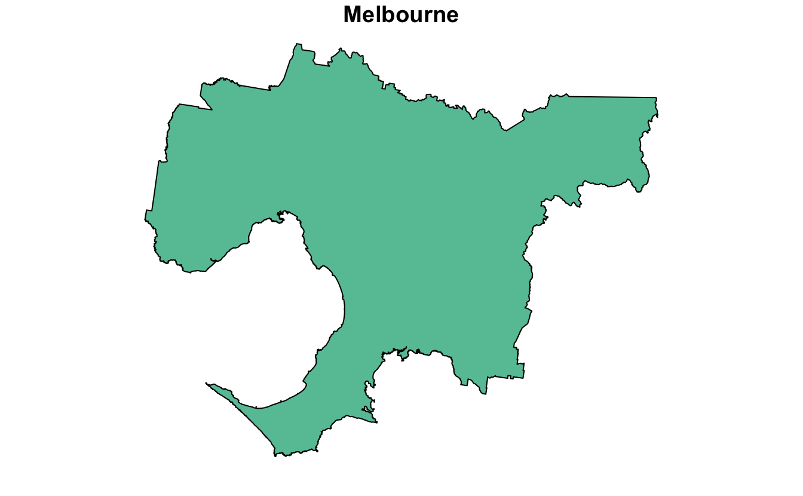
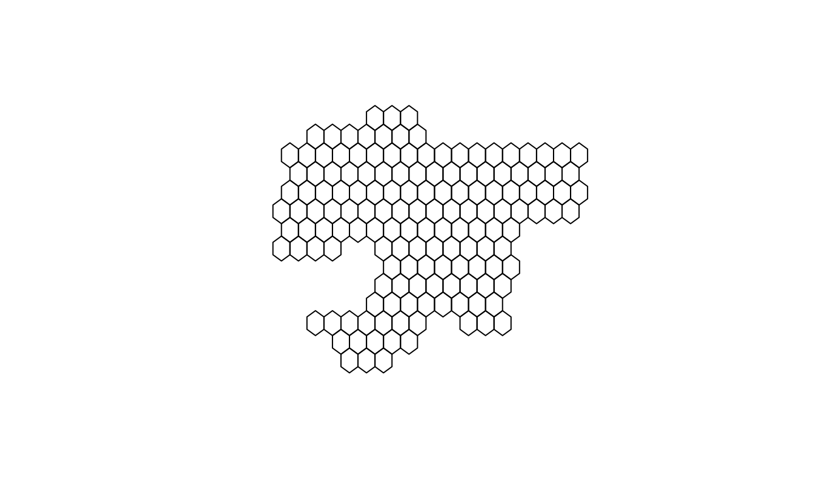

I'm house-hunting, and while I'd love to buy a 5-bedroom house with a pool 10 minutes walk from Flinders Street Station I probably can't afford that. So I need to take a broader look at Melbourne.

One of the main constraints is commute time. I built a choropleth of commute times to the University of Melbourne and put it on top of a map of Melbourne.

The rough idea is to create a fine hexagonal grid across the city using the `sf` package, and then to pass the centre of each hexagon through the Google Maps Directions Matrix API with the help of the (Melbourne-made) `googleway` package. The results are plotted with `leaflet` and [hosted for free on Netlify](https://unimelb-commutes.netlify.app/):

<iframe src="https://unimelb-commutes.netlify.app/" height="500px" width="100%" data-external="1"></iframe>

A warning if you want to recreate this for your own commute: the Distance Matrix API can end up costing a fair bit if you exceed the free tier. The above plot uses roughly 16K hexagons, although this can be adjusted by making the hexagons larger or querying fewer suburbs. Be sure to [review the API pricing](https://mapsplatform.google.com/pricing/). I'm not responsible for any API charges you incur.

I am grateful to Belinda Maher, from whom I stole this idea.

## Shape files and grids

The starting point a shape file for the Melbourne metropolitan area which I obtained from [Plan Melbourne](https://www.planmelbourne.vic.gov.au/maps/spatial-data). It's a simple polygon that outlines the region.

<pre class='chroma'><code class='language-r' data-lang='r'>metro &lt;- sf::<a href='https://r-spatial.github.io/sf/reference/st_read.html'>read_sf</a>("Administrative/Metropolitan region_region.shp")
<a href='https://rdrr.io/r/graphics/plot.default.html'>plot</a>(metro, main = "Melbourne")
</code></pre>

The next step is to lay a grid of hexagons over the area. The centre of each hexagon will be used to determine commute time. More polygons means more granularity, but also a greater API cost.

<pre class='chroma'><code class='language-r' data-lang='r'>sf::<a href='https://r-spatial.github.io/sf/reference/st_make_grid.html'>st_make_grid</a>(metro, cellsize = 0.1, square = FALSE)[metro] <a href='https://magrittr.tidyverse.org/reference/pipe.html'>%&gt;%</a> <a href='https://rdrr.io/r/graphics/plot.default.html'>plot</a>()
#&gt; st_as_s2(): dropping Z and/or M coordinate
</code></pre>

These hexagons are a little too large for a useful map. I'll go with something much smaller. This covers the Melbourne metropolitan area with 170,000 hexagons:

<pre class='chroma'><code class='language-r' data-lang='r'>metro_grid &lt;- sf::<a href='https://r-spatial.github.io/sf/reference/st_make_grid.html'>st_make_grid</a>(metro, cellsize = 0.0025, square = FALSE)[metro]
#&gt; st_as_s2(): dropping Z and/or M coordinate
metro_grid
#&gt; Geometry set for 170661 features 
#&gt; Geometry type: POLYGON
#&gt; Dimension:     XY
#&gt; Bounding box:  xmin: 144.4428 ymin: -38.50138 xmax: 146.1941 ymax: -37.38781
#&gt; Geodetic CRS:  GDA94
#&gt; First 5 geometries:
#&gt; POLYGON ((144.4441 -37.86485, 144.4428 -37.8641...
#&gt; POLYGON ((144.4441 -37.86052, 144.4428 -37.8598...
#&gt; POLYGON ((144.4453 -37.86268, 144.4441 -37.8619...
#&gt; POLYGON ((144.4453 -37.85835, 144.4441 -37.8576...
#&gt; POLYGON ((144.4453 -37.85402, 144.4441 -37.8533...
</code></pre>

There are three ways to go from here:

1.  if your budget is unlimited, calculate the commute time for each suburb in
2.  a search method. Starting with the hexagon containing the commute destination, calculate commute time. Then calculate the commute time for the neighbouring hexagons of that hexagon. When a hexagon has a commute time over a certain limit (say, 1 hour), stop computing the commute times of its neighbours.
3.  a suburb-by-suburb method. Using a shape file of suburbs, calculate commute time for the hexagons in each suburb one at a time, manually.

I went with the suburb-by-suburb option here because I wanted to explore and get an idea of where I should be house-hunting. I used [Melbourne localities provided by data.gov.au](https://data.gov.au/data/dataset/af33dd8c-0534-4e18-9245-fc64440f742e) (the GDA94 version matches that of the Melbourne metro shape file). A quick function helps me get the hexagons in `metro_grid` that overlap any part of a suburb:

<pre class='chroma'><code class='language-r' data-lang='r'>localities &lt;- sf::<a href='https://r-spatial.github.io/sf/reference/st_read.html'>read_sf</a>("vic_localities/vic_localities.shp")

suburb_grid &lt;- function(metro_grid, localities, suburb) &#123;
  assertthat::<a href='https://rdrr.io/pkg/assertthat/man/assert_that.html'>assert_that</a>(suburb <a href='https://rdrr.io/r/base/match.html'>%in%</a> localities$LOC_NAME)
  suburb_shp &lt;- localities <a href='https://magrittr.tidyverse.org/reference/pipe.html'>%&gt;%</a> dplyr::<a href='https://dplyr.tidyverse.org/reference/filter.html'>filter</a>(LOC_NAME == suburb)
  grid_in_suburb &lt;- metro_grid[suburb_shp]
  assertthat::<a href='https://rdrr.io/pkg/assertthat/man/assert_that.html'>assert_that</a>(<a href='https://rdrr.io/r/base/length.html'>length</a>(grid_in_suburb) &gt; 0)
  grid_in_suburb
&#125;</code></pre>

The idea of taking a main set of hexagons (`metro_grid`) and then finding its intersection with a particular suburb is so that the hexagons in neighbouring suburbs tessellate.

## Querying the Distance Matrix API

For each hexagon I take its centre and use it as the origin of a Google Maps Distance Matrix query. The destination is a fixed location that represents the input of my commute. Each query uses only public transport and asks for an arrival before 9am on a Monday to capture the typical workday commute. I'm using the following constants:

<pre class='chroma'><code class='language-r' data-lang='r'>workplace &lt;- <a href='https://rdrr.io/r/base/c.html'>c</a>(144.9580, -37.8000)
monday_morning &lt;- <a href='https://rdrr.io/r/base/as.POSIXlt.html'>as.POSIXct</a>("2023-01-30 09:00:00", tz = "Australia/Melbourne")</code></pre>

I also need a helper function that converts a given set of hexagons into a matrix containing the coordinates of their centroids.

<pre class='chroma'><code class='language-r' data-lang='r'>polygon_centroids &lt;- function(polygons) &#123;
  polygons <a href='https://magrittr.tidyverse.org/reference/pipe.html'>%&gt;%</a> sf::<a href='https://r-spatial.github.io/sf/reference/geos_unary.html'>st_centroid</a>() <a href='https://magrittr.tidyverse.org/reference/pipe.html'>%&gt;%</a> sf::<a href='https://r-spatial.github.io/sf/reference/st_coordinates.html'>st_coordinates</a>()
&#125;</code></pre>

I use the `googleway` package to query the Distance Matrix API. I have a "GOOGLE_MAPS_API_KEY" environment variable defined with my API key. Follow [the instructions provided by Google](https://developers.google.com/maps/documentation/javascript/get-api-key), and be sure to enable the Distance Matrix API.

There's an annoyance here in that Google expect latitude and longitude in a different order to the polygons I'm using. In my function I have a little hack for calculating `rev_origin`, which is the given `origin` but flipped. The origin is either a matrix of coordinates given by `polygon_centroids` or a vector representing a single origin point.

<pre class='chroma'><code class='language-r' data-lang='r'>query_distance_matrix &lt;- function(
    origin,
    destination = workplace,
    arrival_time = monday_morning
) &#123;
  rev_origin &lt;- if (<a href='https://rdrr.io/r/base/matrix.html'>is.matrix</a>(origin) &amp;&amp; <a href='https://rdrr.io/r/base/nrow.html'>nrow</a>(origin) == 1) &#123;
    <a href='https://rdrr.io/r/base/c.html'>c</a>(origin[1,2], origin[1,1])
  &#125; else if (<a href='https://rdrr.io/r/base/matrix.html'>is.matrix</a>(origin)) &#123;
    <a href='https://rdrr.io/r/base/as.data.frame.html'>as.data.frame</a>(origin[, <a href='https://rdrr.io/r/base/c.html'>c</a>(2, 1)])
  &#125; else &#123;
    <a href='https://rdrr.io/r/base/rev.html'>rev</a>(origin)
  &#125;
  response &lt;- googleway::<a href='https://rdrr.io/pkg/googleway/man/google_distance.html'>google_distance</a>(
    origins = rev_origin,
    destinations = <a href='https://rdrr.io/r/base/rev.html'>rev</a>(destination),
    mode = "transit",
    arrival_time = arrival_time,
    units = "metric",
    key = <a href='https://rdrr.io/r/base/Sys.getenv.html'>Sys.getenv</a>("GOOGLE_MAPS_API_KEY")
  )
  if (response$status != "OK") &#123;
    <a href='https://rdrr.io/r/base/stop.html'>stop</a>(response$error_message)
  &#125;
  response
&#125;</code></pre>

I also need some helper functions for extracting useful information from the raw response. These provide `NA` values when Google cannot find a route, which is likely to happen for hexagons that fall on areas like airport runways.

<pre class='chroma'><code class='language-r' data-lang='r'>dm_origin_address &lt;- function(response) response$origin_addresses
dm_matrix_response &lt;- function(response) response$rows$elements
dm_distance &lt;- function(response) &#123;
  response <a href='https://magrittr.tidyverse.org/reference/pipe.html'>%&gt;%</a> dm_matrix_response() <a href='https://magrittr.tidyverse.org/reference/pipe.html'>%&gt;%</a> purrr::<a href='https://purrr.tidyverse.org/reference/map.html'>map_int</a>(
    function(x) <a href='https://rdrr.io/r/base/ifelse.html'>ifelse</a>(x$status == "OK", x$distance$value, NA_integer_)
  )
&#125;
dm_time &lt;- function(response) &#123;
  response <a href='https://magrittr.tidyverse.org/reference/pipe.html'>%&gt;%</a> dm_matrix_response() <a href='https://magrittr.tidyverse.org/reference/pipe.html'>%&gt;%</a> purrr::<a href='https://purrr.tidyverse.org/reference/map.html'>map_int</a>(
    function(x) <a href='https://rdrr.io/r/base/ifelse.html'>ifelse</a>(x$status == "OK", x$duration$value, NA_integer_)
  )
&#125;</code></pre>

## Gathering commute data

A single query to the Distance Matrix API can contain at most 25 origins, so this function must batch the requests. Each batch of 25 (or fewer) is queried against the API. The results are turned into a data frame alongside the original hexagons, the coordinates of their centres, and the data from the helper functions I've defined.

<pre class='chroma'><code class='language-r' data-lang='r'>commute_facts &lt;- function(polygons, destination = workplace) &#123;
  batch_size &lt;- 25
  n_polys &lt;- polygons <a href='https://magrittr.tidyverse.org/reference/pipe.html'>%&gt;%</a> <a href='https://rdrr.io/r/base/length.html'>length</a>()
  batches &lt;- <a href='https://rdrr.io/r/base/Round.html'>ceiling</a>(n_polys / batch_size)

  query_batch_number &lt;- function(batch_number) &#123;
    batch_start &lt;- batch_size * (batch_number - 1) + 1
    batch_end &lt;- <a href='https://rdrr.io/r/base/Extremes.html'>min</a>(batch_start + batch_size - 1, n_polys)
    polygons_in_batch &lt;- polygons[batch_start:batch_end]
    coords_in_batch &lt;- polygons_in_batch <a href='https://magrittr.tidyverse.org/reference/pipe.html'>%&gt;%</a> polygon_centroids()
    response &lt;- query_distance_matrix(coords_in_batch, destination = destination)

    dplyr::<a href='https://tibble.tidyverse.org/reference/as_tibble.html'>as_tibble</a>(polygons_in_batch) <a href='https://magrittr.tidyverse.org/reference/pipe.html'>%&gt;%</a>
      <a href='https://rdrr.io/r/base/cbind.html'>cbind</a>(coords_in_batch) <a href='https://magrittr.tidyverse.org/reference/pipe.html'>%&gt;%</a>
      dplyr::<a href='https://dplyr.tidyverse.org/reference/mutate.html'>mutate</a>(
        origin = dm_origin_address(response),
        commute_distance_m = dm_distance(response),
        commute_time_s = dm_time(response),
        commute_time = <a href='https://rdrr.io/r/base/paste.html'>paste</a>(<a href='https://rdrr.io/r/base/Round.html'>round</a>(commute_time_s / 60, 1), "minutes")
      ) <a href='https://magrittr.tidyverse.org/reference/pipe.html'>%&gt;%</a>
      dplyr::<a href='https://tibble.tidyverse.org/reference/as_tibble.html'>as_tibble</a>()
  &#125;

  purrr::<a href='https://purrr.tidyverse.org/reference/map_dfr.html'>map_dfr</a>(<a href='https://rdrr.io/r/base/seq.html'>seq</a>(batches), query_batch_number) <a href='https://magrittr.tidyverse.org/reference/pipe.html'>%&gt;%</a> dplyr::<a href='https://dplyr.tidyverse.org/reference/distinct.html'>distinct</a>()
&#125;</code></pre>

And here is the function in action for Brunswick:

<pre class='chroma'><code class='language-r' data-lang='r'>grid_in_brunswick &lt;- suburb_grid(metro_grid, localities, "Brunswick")
brunswick_commute_facts &lt;- commute_facts(grid_in_brunswick)
brunswick_commute_facts
#&gt; # A tibble: 121 × 7
#&gt;                              geometry     X     Y origin commu…¹ commu…² commu…³
#&gt;                         &lt;POLYGON [°]&gt; &lt;dbl&gt; &lt;dbl&gt; &lt;chr&gt;    &lt;int&gt;   &lt;int&gt; &lt;chr&gt;  
#&gt;  1 ((144.9478 -37.77175, 144.9466 -3…  145. -37.8 5 Fod…    4629    1459 24.3 m…
#&gt;  2 ((144.9491 -37.77825, 144.9478 -3…  145. -37.8 Park …    3651    1110 18.5 m…
#&gt;  3 ((144.9491 -37.77392, 144.9478 -3…  145. -37.8 14/19…    4221    1247 20.8 m…
#&gt;  4 ((144.9491 -37.76959, 144.9478 -3…  145. -37.8 30 Pe…    4733    1518 25.3 m…
#&gt;  5 ((144.9491 -37.76526, 144.9478 -3…  145. -37.8 95A P…    5557    1856 30.9 m…
#&gt;  6 ((144.9491 -37.76093, 144.9478 -3…  145. -37.8 28 Ha…    6528    2003 33.4 m…
#&gt;  7 ((144.9503 -37.77608, 144.9491 -3…  145. -37.8 26 He…    4007    1304 21.7 m…
#&gt;  8 ((144.9503 -37.77175, 144.9491 -3…  145. -37.8 Grant…    4501    1326 22.1 m…
#&gt;  9 ((144.9503 -37.76742, 144.9491 -3…  145. -37.8 460 V…    5394    1745 29.1 m…
#&gt; 10 ((144.9503 -37.76309, 144.9491 -3…  145. -37.8 118 P…    5917    2124 35.4 m…
#&gt; # … with 111 more rows, and abbreviated variable names ¹​commute_distance_m,
#&gt; #   ²​commute_time_s, ³​commute_time
#&gt; # ℹ Use `print(n = ...)` to see more rows
</code></pre>

## Avoiding repetition

If I try to calculate commute times for two adjacent suburbs, I'm going to have some overlap at the boundaries. API calls are expensive so it's worth making sure I don't query the same hexagon twice. The below function takes an existing data frame of commutes (like `brunswick_commute_facts` above) and adds commute facts from another suburb, being sure not to query data for any polygon I already know about.

I'm not proud of my method for detecting overlaps here. I resort to several lines of `dplyr` but it feels like there must be an easier way,

<pre class='chroma'><code class='language-r' data-lang='r'>expand_commute_facts &lt;- function(polygons, existing = NULL, destination = workplace) &#123;
  if (<a href='https://rdrr.io/r/base/NULL.html'>is.null</a>(existing)) &#123;
    <a href='https://rdrr.io/r/base/function.html'>return</a>(commute_facts(polygons, destination = destination))
  &#125;

  polygon_df &lt;- dplyr::<a href='https://tibble.tidyverse.org/reference/as_tibble.html'>as_tibble</a>(polygon_centroids(polygons))
  existing_df &lt;- existing[<a href='https://rdrr.io/r/base/c.html'>c</a>("X", "Y")] <a href='https://magrittr.tidyverse.org/reference/pipe.html'>%&gt;%</a> dplyr::<a href='https://dplyr.tidyverse.org/reference/mutate.html'>mutate</a>(exists = TRUE)
  existing_index &lt;- polygon_df <a href='https://magrittr.tidyverse.org/reference/pipe.html'>%&gt;%</a>
    dplyr::<a href='https://dplyr.tidyverse.org/reference/mutate-joins.html'>left_join</a>(existing_df, by = <a href='https://rdrr.io/r/base/c.html'>c</a>("X", "Y")) <a href='https://magrittr.tidyverse.org/reference/pipe.html'>%&gt;%</a>
    dplyr::<a href='https://dplyr.tidyverse.org/reference/mutate.html'>mutate</a>(exists = <a href='https://rdrr.io/r/base/ifelse.html'>ifelse</a>(<a href='https://rdrr.io/r/base/NA.html'>is.na</a>(exists), FALSE, exists)) <a href='https://magrittr.tidyverse.org/reference/pipe.html'>%&gt;%</a>
    dplyr::<a href='https://dplyr.tidyverse.org/reference/pull.html'>pull</a>(exists)
  new_polygons &lt;- polygons[!existing_index]

  <a href='https://rdrr.io/r/base/cbind.html'>rbind</a>(
    existing,
    commute_facts(new_polygons, destination = destination)
  )
&#125;</code></pre>

I would then be able to add new commute facts like so:

<pre class='chroma'><code class='language-r' data-lang='r'>fitzroy_and_brunswick_commute_facts &lt;- expand_commute_facts(
    suburb_grid(metro_grid, localities, "Fitzroy"),
    existing = brunswick_commute_facts
)
fitzroy_and_brunswick_commute_facts
#&gt; # A tibble: 162 × 7
#&gt;                              geometry     X     Y origin commu…¹ commu…² commu…³
#&gt;                         &lt;POLYGON [°]&gt; &lt;dbl&gt; &lt;dbl&gt; &lt;chr&gt;    &lt;int&gt;   &lt;int&gt; &lt;chr&gt;  
#&gt;  1 ((144.9478 -37.77175, 144.9466 -3…  145. -37.8 5 Fod…    4629    1459 24.3 m…
#&gt;  2 ((144.9491 -37.77825, 144.9478 -3…  145. -37.8 Park …    3651    1110 18.5 m…
#&gt;  3 ((144.9491 -37.77392, 144.9478 -3…  145. -37.8 14/19…    4221    1247 20.8 m…
#&gt;  4 ((144.9491 -37.76959, 144.9478 -3…  145. -37.8 30 Pe…    4733    1518 25.3 m…
#&gt;  5 ((144.9491 -37.76526, 144.9478 -3…  145. -37.8 95A P…    5557    1856 30.9 m…
#&gt;  6 ((144.9491 -37.76093, 144.9478 -3…  145. -37.8 28 Ha…    6528    2003 33.4 m…
#&gt;  7 ((144.9503 -37.77608, 144.9491 -3…  145. -37.8 26 He…    4007    1304 21.7 m…
#&gt;  8 ((144.9503 -37.77175, 144.9491 -3…  145. -37.8 Grant…    4501    1326 22.1 m…
#&gt;  9 ((144.9503 -37.76742, 144.9491 -3…  145. -37.8 460 V…    5394    1745 29.1 m…
#&gt; 10 ((144.9503 -37.76309, 144.9491 -3…  145. -37.8 118 P…    5917    2124 35.4 m…
#&gt; # … with 152 more rows, and abbreviated variable names ¹​commute_distance_m,
#&gt; #   ²​commute_time_s, ³​commute_time
#&gt; # ℹ Use `print(n = ...)` to see more rows
</code></pre>

## Map colours

Before I get to visualising the hexagons I want to define the colour legend. Everyone has different tolerances for commuting, but in my case I decided to set everything above 1 hour as the same colour as that used for 1 hour. I also set everything below 20 minutes as the same colour as that used for 20 minutes. This means that --- for the purpose of the colour scale --- I need to "clamp" my commute times to between 20 and 60 minutes. That is, values below 20 minutes will be raised to 20 and values above 60 minutes will be lowered to 60. These limits will be passed to my plotting function as `min_value` and `max_value` arguments.

<pre class='chroma'><code class='language-r' data-lang='r'># I wish this function was in base R
clamp_values &lt;- function(values, min_value = NULL, max_value = NULL) &#123;
  if (<a href='https://rdrr.io/r/base/NULL.html'>is.null</a>(min_value)) min_value &lt;- <a href='https://rdrr.io/r/base/Extremes.html'>min</a>(values, na.rm = TRUE)
  if (<a href='https://rdrr.io/r/base/NULL.html'>is.null</a>(max_value)) max_value &lt;- <a href='https://rdrr.io/r/base/Extremes.html'>max</a>(values, na.rm = TRUE)

  clamped_values &lt;- values
  clamped_values[values &gt; max_value] &lt;- max_value
  clamped_values[values &lt; min_value] &lt;- min_value

  clamped_values
&#125;</code></pre>

I can then define my colours using `leaflet`'s colour palette functions. I have the option of reversing the palette, which I default to `TRUE` because I have the "spectral" palette in mind. Without reversing, red would represent lower values and blue would represent higher values, which defies convention.

<pre class='chroma'><code class='language-r' data-lang='r'>clamped_palette_function &lt;- function(palette, values, min_value = NULL, max_value = NULL, reverse_palette = TRUE) &#123;
  clamped_values &lt;- clamp_values(values, min_value, max_value)

  leaflet::<a href='https://rdrr.io/pkg/leaflet/man/colorNumeric.html'>colorNumeric</a>(
    palette,
    reverse = reverse_palette,
    domain = <a href='https://rdrr.io/r/base/Extremes.html'>min</a>(clamped_values):<a href='https://rdrr.io/r/base/Extremes.html'>max</a>(clamped_values)
  )
&#125;</code></pre>

## Map title

Leaflet doesn't support titles out of the box (at least not through the R package, as far as I know). I adapted this solution from [StackOverflow](https://stackoverflow.com/a/72058737/8456369). It requires the creation of a CSS class for the title which can then be added to the Leaflet plot.

<pre class='chroma'><code class='language-r' data-lang='r'>leaflet_title_class &lt;- htmltools::<a href='https://rstudio.github.io/htmltools/reference/builder.html'>tags</a>$style(htmltools::<a href='https://rstudio.github.io/htmltools/reference/HTML.html'>HTML</a>("
  .leaflet-control.map-title &#123;
    transform: translate(-50%,20%);
    position: fixed !important;
    left: 38%;
    max-width: 50%;
    text-align: center;
    padding-left: 5px;
    padding-right: 5px;
    background: rgba(255,255,255,0.75);
    font-weight: bold;
    font-size: 1.0em;
  &#125;
"))

leaflet_title &lt;- htmltools::<a href='https://rstudio.github.io/htmltools/reference/builder.html'>tags</a>$div(
  leaflet_title_class,
  htmltools::<a href='https://rstudio.github.io/htmltools/reference/HTML.html'>HTML</a>("Public transport commute time to University of Melbourne&lt;br&gt;by David Neuzerling")
)</code></pre>

## Leaflet plot

With all of the pieces in place I can now define my `plot_commutes` function. The layers are built up:

1.  I first create the empty plot and add the title
2.  I add the actual map of Melbourne from OpenStreetMap
3.  I centre the map on the commute destination and set the zoom level
4.  I add the hexagon plot with the colour scale I defined earlier. By setting `weight = 0` I can remove the borders around each hexagon so that the colours blend a little. The labels will show the actual commute time when the user hovers over a hexagon (if on desktop) or taps on a hexagon (if on mobile).
5.  I add the legend, formatting the commute time (which is in seconds) as minutes

<pre class='chroma'><code class='language-r' data-lang='r'>plot_commutes &lt;- function(
    polygons,
    colour_by,
    destination = workplace,
    min_value = 20 * 60,
    max_value = 60 * 60
) &#123;
  non_na_polygons &lt;- dplyr::<a href='https://dplyr.tidyverse.org/reference/filter.html'>filter</a>(polygons, !<a href='https://rdrr.io/r/base/NA.html'>is.na</a>(commute_time_s))

  leaflet::<a href='https://rdrr.io/pkg/leaflet/man/leaflet.html'>leaflet</a>() <a href='https://magrittr.tidyverse.org/reference/pipe.html'>%&gt;%</a>
    leaflet::<a href='https://rdrr.io/pkg/leaflet/man/map-layers.html'>addControl</a>(leaflet_title, position = "topleft", className = "map-title") <a href='https://magrittr.tidyverse.org/reference/pipe.html'>%&gt;%</a>
    leaflet::<a href='https://rdrr.io/pkg/leaflet/man/addProviderTiles.html'>addProviderTiles</a>("OpenStreetMap") <a href='https://magrittr.tidyverse.org/reference/pipe.html'>%&gt;%</a>
    leaflet::<a href='https://rdrr.io/pkg/leaflet/man/map-methods.html'>setView</a>(lng = destination[1], lat = destination[2], zoom = 11) <a href='https://magrittr.tidyverse.org/reference/pipe.html'>%&gt;%</a>
    leaflet::<a href='https://rdrr.io/pkg/leaflet/man/map-layers.html'>addPolygons</a>(
      data = sf::<a href='https://r-spatial.github.io/sf/reference/st_transform.html'>st_transform</a>(non_na_polygons$geometry, "+proj=longlat +datum=WGS84"),
      fillColor = clamped_palette(
        "Spectral",
        non_na_polygons$commute_time_s,
        min_value = min_value,
        max_value = max_value
      ),
      fillOpacity = 0.4,
      weight = 0,
      label = non_na_polygons$commute_time
    ) <a href='https://magrittr.tidyverse.org/reference/pipe.html'>%&gt;%</a>
    leaflet::<a href='https://rdrr.io/pkg/leaflet/man/addLegend.html'>addLegend</a>(
      title = "commute time",
      pal = clamped_palette_function(
        "Spectral",
        non_na_polygons$commute_time_s,
        min_value = min_value,
        max_value = max_value
      ),
      values = clamp_values(non_na_polygons$commute_time_s, min_value, max_value),
      labFormat = leaflet::<a href='https://rdrr.io/pkg/leaflet/man/addLegend.html'>labelFormat</a>(
        suffix = " min",
        transform = function(x) <a href='https://rdrr.io/r/base/Round.html'>round</a>(x / 60)
      )
    )
&#125;</code></pre>

## Saving the widget

I use the `htmlwidgets` package to export the `leaflet` plot as a HTML site. Before doing so I need to define the "viewport" that allows mobile devices to properly display the map. Without this they would attempt to render the plot as if viewing on a desktop computer which would make the text far too small to read.

<pre class='chroma'><code class='language-r' data-lang='r'>viewport &lt;- htmltools::<a href='https://rstudio.github.io/htmltools/reference/builder.html'>tags</a>$meta(
  name = "viewport",
  content = "width=device-width, initial-scale=1.0"
)

save_commute_plot &lt;- function(commute_plot, file_path) &#123;
  commute_plot <a href='https://magrittr.tidyverse.org/reference/pipe.html'>%&gt;%</a>
    htmlwidgets::<a href='https://rdrr.io/pkg/htmlwidgets/man/prependContent.html'>prependContent</a>(viewport) <a href='https://magrittr.tidyverse.org/reference/pipe.html'>%&gt;%</a>
    htmlwidgets::<a href='https://rdrr.io/pkg/htmlwidgets/man/saveWidget.html'>saveWidget</a>(file_path)
&#125;</code></pre>

The resulting directory can be uploaded to any web server or static site hosting service, such as [Netlify](https://app.netlify.com).

------------------------------------------------------------------------

<pre class='chroma'><code class='language-r' data-lang='r'>devtools::<a href='https://r-lib.github.io/sessioninfo/reference/session_info.html'>session_info</a>()
#&gt; ─ Session info ───────────────────────────────────────────────────────────────
#&gt;  setting  value
#&gt;  version  R version 4.2.1 (2022-06-23)
#&gt;  os       macOS Big Sur 11.3
#&gt;  system   aarch64, darwin20
#&gt;  ui       X11
#&gt;  language (EN)
#&gt;  collate  en_AU.UTF-8
#&gt;  ctype    en_AU.UTF-8
#&gt;  tz       Australia/Melbourne
#&gt;  date     2023-02-12
#&gt;  pandoc   2.18 @ /Applications/RStudio.app/Contents/MacOS/quarto/bin/tools/ (via rmarkdown)
#&gt; 
#&gt; ─ Packages ───────────────────────────────────────────────────────────────────
#&gt;  package     * version    date (UTC) lib source
#&gt;  assertthat    0.2.1      2019-03-21 [1] CRAN (R 4.2.0)
#&gt;  cachem        1.0.6      2021-08-19 [1] CRAN (R 4.2.0)
#&gt;  callr         3.7.1      2022-07-13 [1] CRAN (R 4.2.0)
#&gt;  class         7.3-20     2022-01-16 [1] CRAN (R 4.2.1)
#&gt;  classInt      0.4-7      2022-06-10 [1] CRAN (R 4.2.0)
#&gt;  cli           3.6.0      2023-01-09 [1] CRAN (R 4.2.0)
#&gt;  crayon        1.5.2      2022-09-29 [1] CRAN (R 4.2.0)
#&gt;  crosstalk     1.2.0      2021-11-04 [1] CRAN (R 4.2.0)
#&gt;  curl          5.0.0      2023-01-12 [1] CRAN (R 4.2.0)
#&gt;  DBI           1.1.3      2022-06-18 [1] CRAN (R 4.2.0)
#&gt;  devtools      2.4.4      2022-07-20 [1] CRAN (R 4.2.0)
#&gt;  digest        0.6.31     2022-12-11 [1] CRAN (R 4.2.0)
#&gt;  downlit       0.4.2      2022-07-05 [1] CRAN (R 4.2.0)
#&gt;  dplyr       * 1.0.9      2022-04-28 [1] CRAN (R 4.2.0)
#&gt;  e1071         1.7-11     2022-06-07 [1] CRAN (R 4.2.0)
#&gt;  ellipsis      0.3.2      2021-04-29 [1] CRAN (R 4.2.0)
#&gt;  evaluate      0.20       2023-01-17 [1] CRAN (R 4.2.0)
#&gt;  fansi         1.0.4      2023-01-22 [1] CRAN (R 4.2.0)
#&gt;  fastmap       1.1.0      2021-01-25 [1] CRAN (R 4.2.0)
#&gt;  fs            1.6.0      2023-01-23 [1] CRAN (R 4.2.0)
#&gt;  generics      0.1.3      2022-07-05 [1] CRAN (R 4.2.0)
#&gt;  glue          1.6.2      2022-02-24 [1] CRAN (R 4.2.0)
#&gt;  googleway     2.7.6      2022-01-24 [1] CRAN (R 4.2.0)
#&gt;  highr         0.10       2022-12-22 [1] CRAN (R 4.2.0)
#&gt;  htmltools     0.5.4      2022-12-07 [1] CRAN (R 4.2.0)
#&gt;  htmlwidgets   1.5.4      2021-09-08 [1] CRAN (R 4.2.0)
#&gt;  httpuv        1.6.5      2022-01-05 [1] CRAN (R 4.2.0)
#&gt;  hugodown      0.0.0.9000 2023-01-26 [1] Github (r-lib/hugodown@f6f23dd)
#&gt;  jsonlite      1.8.4      2022-12-06 [1] CRAN (R 4.2.0)
#&gt;  KernSmooth    2.23-20    2021-05-03 [1] CRAN (R 4.2.1)
#&gt;  knitr         1.42       2023-01-25 [1] CRAN (R 4.2.0)
#&gt;  later         1.3.0      2021-08-18 [1] CRAN (R 4.2.0)
#&gt;  leaflet       2.1.1      2022-03-23 [1] CRAN (R 4.2.0)
#&gt;  lifecycle     1.0.3      2022-10-07 [1] CRAN (R 4.2.0)
#&gt;  magrittr      2.0.3      2022-03-30 [1] CRAN (R 4.2.0)
#&gt;  memoise       2.0.1      2021-11-26 [1] CRAN (R 4.2.0)
#&gt;  mime          0.12       2021-09-28 [1] CRAN (R 4.2.0)
#&gt;  miniUI        0.1.1.1    2018-05-18 [1] CRAN (R 4.2.0)
#&gt;  pillar        1.8.0      2022-07-18 [1] CRAN (R 4.2.1)
#&gt;  pkgbuild      1.3.1      2021-12-20 [1] CRAN (R 4.2.0)
#&gt;  pkgconfig     2.0.3      2019-09-22 [1] CRAN (R 4.2.0)
#&gt;  pkgload       1.3.0      2022-06-27 [1] CRAN (R 4.2.0)
#&gt;  prettyunits   1.1.1      2020-01-24 [1] CRAN (R 4.2.0)
#&gt;  processx      3.8.0      2022-10-26 [1] CRAN (R 4.2.0)
#&gt;  profvis       0.3.7      2020-11-02 [1] CRAN (R 4.2.0)
#&gt;  promises      1.2.0.1    2021-02-11 [1] CRAN (R 4.2.0)
#&gt;  proxy         0.4-27     2022-06-09 [1] CRAN (R 4.2.0)
#&gt;  ps            1.7.2      2022-10-26 [1] CRAN (R 4.2.0)
#&gt;  purrr         1.0.1      2023-01-10 [1] CRAN (R 4.2.0)
#&gt;  R6            2.5.1      2021-08-19 [1] CRAN (R 4.2.0)
#&gt;  Rcpp          1.0.10     2023-01-22 [1] CRAN (R 4.2.0)
#&gt;  remotes       2.4.2      2021-11-30 [1] CRAN (R 4.2.0)
#&gt;  rlang         1.0.6      2022-09-24 [1] CRAN (R 4.2.0)
#&gt;  rmarkdown     2.20       2023-01-19 [1] CRAN (R 4.2.0)
#&gt;  rstudioapi    0.14       2022-08-22 [1] CRAN (R 4.2.0)
#&gt;  s2            1.1.0      2022-07-18 [1] CRAN (R 4.2.0)
#&gt;  sessioninfo   1.2.2      2021-12-06 [1] CRAN (R 4.2.0)
#&gt;  sf            1.0-9      2022-11-08 [1] CRAN (R 4.2.0)
#&gt;  shiny         1.7.2      2022-07-19 [1] CRAN (R 4.2.0)
#&gt;  stringi       1.7.12     2023-01-11 [1] CRAN (R 4.2.0)
#&gt;  stringr       1.5.0      2022-12-02 [1] CRAN (R 4.2.0)
#&gt;  tibble        3.1.8      2022-07-22 [1] CRAN (R 4.2.0)
#&gt;  tidyselect    1.1.2      2022-02-21 [1] CRAN (R 4.2.0)
#&gt;  units         0.8-0      2022-02-05 [1] CRAN (R 4.2.0)
#&gt;  urlchecker    1.0.1      2021-11-30 [1] CRAN (R 4.2.0)
#&gt;  usethis       2.1.6      2022-05-25 [1] CRAN (R 4.2.0)
#&gt;  utf8          1.2.2      2021-07-24 [1] CRAN (R 4.2.0)
#&gt;  vctrs         0.5.2      2023-01-23 [1] CRAN (R 4.2.0)
#&gt;  withr         2.5.0      2022-03-03 [1] CRAN (R 4.2.0)
#&gt;  wk            0.6.0      2022-01-03 [1] CRAN (R 4.2.0)
#&gt;  xfun          0.36       2022-12-21 [1] CRAN (R 4.2.0)
#&gt;  xtable        1.8-4      2019-04-21 [1] CRAN (R 4.2.0)
#&gt;  yaml          2.3.7      2023-01-23 [1] CRAN (R 4.2.0)
#&gt; 
#&gt;  [1] /Library/Frameworks/R.framework/Versions/4.2-arm64/Resources/library
#&gt; 
#&gt; ──────────────────────────────────────────────────────────────────────────────
</code></pre>

