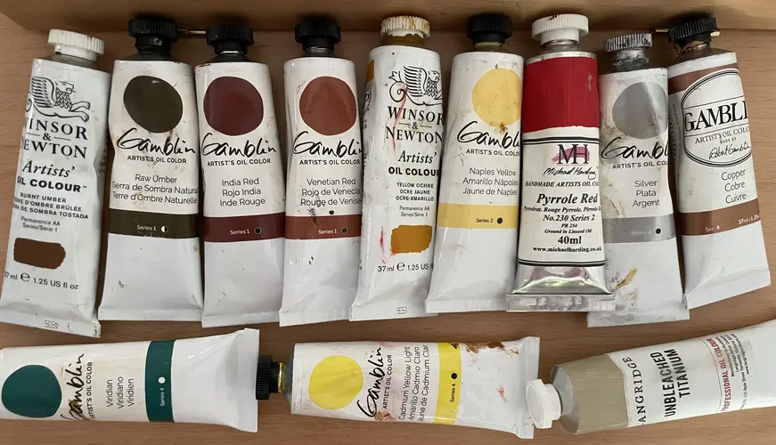
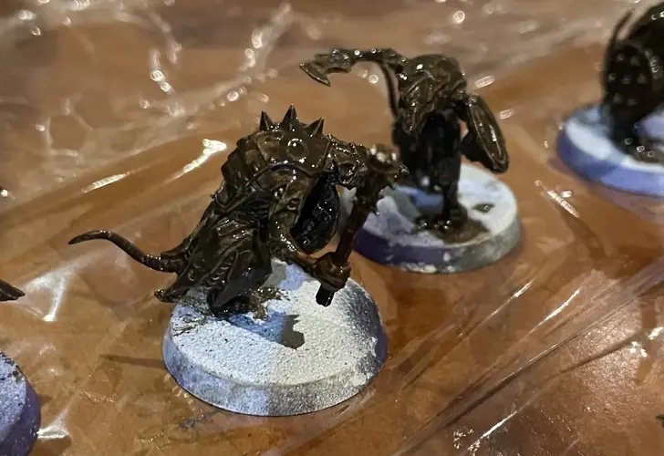
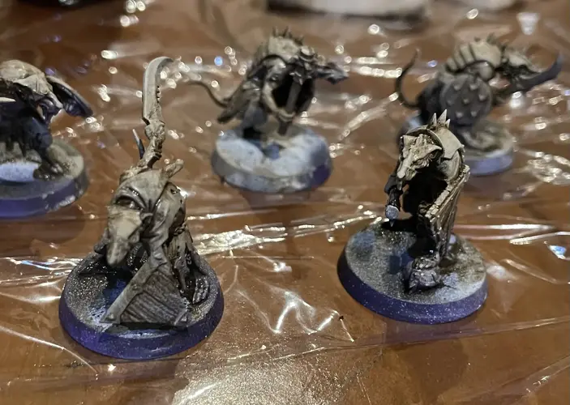
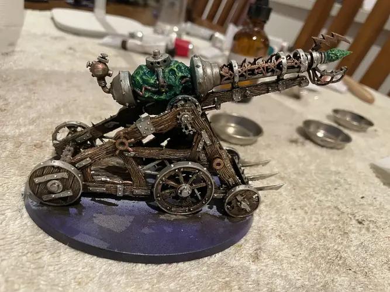
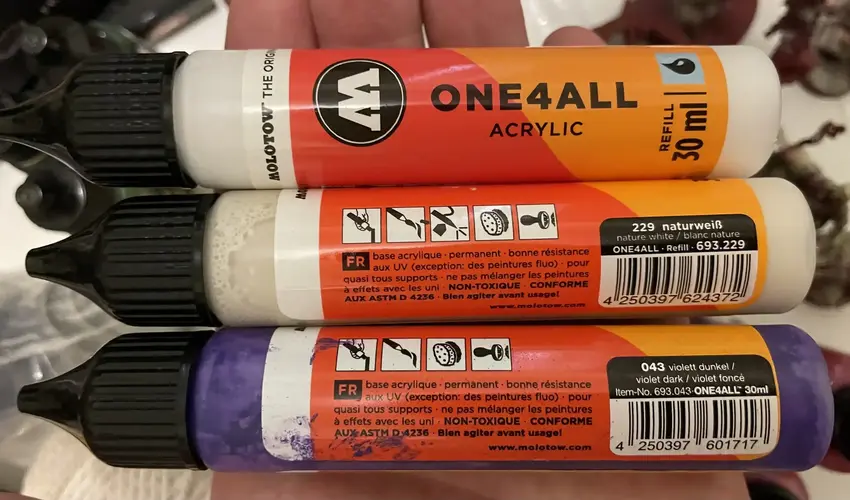
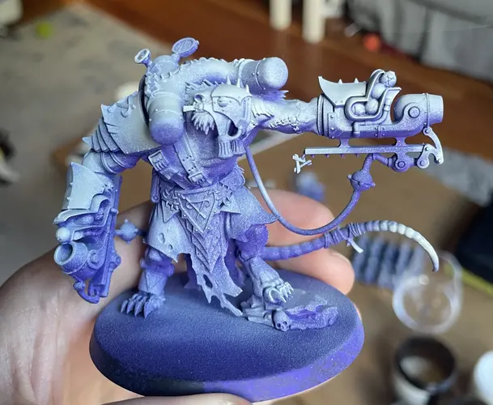
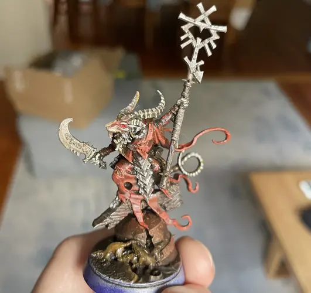

My local wargaming club was hosting a _Warhammer: Age of Sigmar_ Spearhead tournament with a twist: if you could paint your entire army between the time the tournament was announced and when the tournament took place (about 2 months), your entry fee was waived.

I loved the idea. I wanted to try something new and different, and that was to paint the army using only oil paints on acrylic primers. I love the feel of oil paints, more like scraping butter than applying a liquid paint, and the ease with which pigments mix. 

# Skaven: cheerful little adventurers

I took the challenge on with a new army of Skaven, which are adorable rats. Sigmarite propaganda would have you believe that Skaven are megalomaniacal vermin, intent on bringing ruin to the world. Do not believe this slander. Skaven are kind-hearted adventurers who only want to explore the world. They're just little guys.

::: marginalia
Spearhead armies are smaller than regular armies, roughly 1/4 to 1/3 the size.
:::

Mechanically, Skaven are a "horde" army, which means they emphasise quantity over quality. That's not exactly ideal for a timed painting challenge, but I was committed. I chose the [Warpspark Clawpack](https://www.warhammer.com/en-US/shop/spearhead-skaven-2024), which consists of:

* A Grey Seer, a larger horned rat acting as leadership
* 20 Clanrats, small hunched over rat troops
* 3 Stormfiends, towering mutated rats fused with metallic weaponry
* An artillery piece in the form of a Warp Lightning Cannon

There are a good amount of materials to paint here. The Clanrats and Grey Seer are covered in tattered cloth with a mixture of metallic and wood weaponry. The Stormfiends are giant mutated rats with a decent amount of metal. The Warp Lightning Cannon is mostly wood, with a large green magic rock at the centre.

# Painting scheme

I wanted my skaven to look gritty and dirty. I decided to favour warm, desaturated colours. Saturation, like other visual properties, is relative --- my iron oxide reds would appear desaturated in other schemes, but show up here as saturated because they're placed against dull browns.

There are two exceptions to this low-saturation; I allowed myself brighter colours for magical effects, and a bright red for the eyes. My inspiration for this was _Elden Ring_, which has a generally desaturated colour scheme but with vibrancy allowed for certain elements such as collectables and magic effects. The bright red eyes against a dark, desaturated colour scheme also makes for a creepy look.

My prime will be a stark contrast from a dark violet in shadows to a warm white on top:

* Molotow ONE4ALL Violet Dark
* Molotow ONE4ALL Natural White

The oil paints in play are:

* Burnt umber
* Raw umber
* Yellow ochre
* Naples yellow
* Viridian
* Cadmium yellow light
* Pyrrole red
* Gamblin Venetian Red 
* Gamblin Indian Red
* Gamblin metallic copper
* Gamblin metallic silver
* (optional) Unbleached titanium white

I've tried to avoid mentioning brand names for the oil paints except for where it matters. For the most part, one brand's yellow ochre will match that of another brand. The exceptions are the Gamblin metallics, which are quite unique, and the two iron oxide reds. Both use pigment PR101, but that varies quite a bit, and so the end result is dependent on brand. For Gamblin specifically, the Venetian red is lighter, so I use that for the high points and Indian red for the mid-tones.

<figure>

<figcaption>Oil paints used in the painting scheme.</figcaption>
</figure>

::: marginalia
When you realise that painting Warhammer is equivalent to putting make-up on war dollies, the possibilities open up. Beauty blenders are _fantastic_ for removing oil paints from 3-dimensional surfaces. Makeup brushes are superb for drybrushing. Embrace it.
:::

All models start with an _imprimatura_ of burnt umber. This is a thinned down coat of dark neutral brown paint, which goes all over the model. One of the best things about oil paints is that they take so long to dry that you can remove them whenever you want. This makes the imprimatura especially powerful. It will look terrible at first, and all detail will be obliterated.

<figure>

<figcaption>Imprimatura will look terrible at first. Trust the process!</figcaption>
</figure>

I use a makeup sponge to remove the paint from the highest points, leaving only a stain. This takes advantage of the 3D model, and gives me nice light and dark values "for free". The other pigments will blend into this, keeping the shadows dark and desaturated.

<figure>

<figcaption>The same Clanrats with imprimatura removed. Only a stain remains on the highest points</figcaption>
</figure>

Think of imprimatura as applying a consistent tone across the models, pulling any new paints back towards that burnt umber in the recesses.

::: marginalia
Naples yellow is my favourite pigment. It's a gorgeous pale yellow, like a warm but muted sunshine on a foggy day. Traditionally it's made from lead antimonate which is highly toxic. Modern paints will use an imitation blend. If you're willing to disregard safety entirely, specialty paint stores will sell you an authentic pigment.
:::

The rest of the paints are applied selectively. I allow the recesses of skin and fur to remain burnt umber. The mid-tones are mostly yellow ochre, with a hint of Naples yellow as a highlight. This gives the Skaven a sickly appearance.

The cloth is Venetian red blended with Indian red. The imprimatura does a lot of the shading work for the cloth, which is modelled with folds and ripples.

All wooden components are painted with raw umber, and then a generous amount is scraped away using a cotton bud. Raw umber is a cool brown, and along with the scratchy effect of the cotton bud this makes the wood look old and rotten. I imagined that Skaven contraptions are built with scavenged wood, so I wanted to avoid making it look too clean.

Optionally, if anything needs a final highlight on select areas, unbleached titanium white is a good choice. It's an impure white, with impurities that give it a slight yellow tint.

For the metallic parts of the models, I use Gamblin silver or copper depending on whether I want the component to be steel or bronze. These two metallic paints are far too bright to use as is, so I dull them with burnt umber to age and corrode them.

Warpstone is a magic rock. I paint it with Viridian, and blend in some cadmium yellow light on the highest points. The yellow blends to green, but provides a different value. This is the most saturated part of the model. Finally I apply a touch of bright pyrrole red to the eyes. The red eyes and green magic stones are the most saturated parts of the models.

<figure>

<figcaption>A Skaven Warp Lightning Cannon painted with oils. The paint is still glossy and wet. The metallic elements here will need some burnt umber to make them look less &quot;clean&quot;.</figcaption>
</figure>

# Zenithal prime

Just like acrylics, oils won't adhere to bare plastic --- they need something to "bite" onto. I'll prime my models with something that sticks to the plastic, and allows oil paints to stick to it.

::: marginalia
All credit to [Marco Frisoni](https://www.youtube.com/MarcoFrisoniNJM) whose Youtube guides got me started with Molotow paints.
:::

I use Molotow ONE4ALL refills as primer. This acrylic paint is intended to be used for markers, but its off-label use amongst miniature painters is that it can go straight into an airbrush and be used to prime a model. Because it comes in a range of colours, it can be used to skip a basing step, allowing models to be primed with a starting colour that isn't just black or grey.

<figure>

<figcaption>Molotow ONE4ALL refill tubes</figcaption>
</figure>

I start with a coat of the dark violet all over. Then, from above, I prime with the natural white, which is a warm white. My airbrush settings weren't quite right here, and the warm white came out spotty, but none of that was visible in the end product.

<figure>

<figcaption>A primed Skaven Stormfiend, with dark violet from below and warm white from above.</figcaption>
</figure>

If you wish to tackle this yourself, **do not feel the need to cover every bit of the primer**, especially the shadows. It's not a bad thing if some of this dark violet shows through in the deepest recesses of a model. No one will see a dark violet shadow and think it unnatural.

# Working with oils

Oil paints need a specialty thinner, called _white spirit_. What water is to acrylic paints, white spirit is to oil paints. Without exception, spend the extra dollars on an **odorless** white spirit. Odorless doesn't mean "non-toxic", it just means "less toxic than the regular stuff". So keep a window open nearby.

Don't pour white spirit down the sink. For the small quantities used in miniature painting, it can be absorbed with paper towel and put in the bin.

Oil paint consistency is highly personal. Some painters love thick goopy paints. For miniatures, I prefer thinner paints, with only the final highlights being used straight out of the tube. There is no substitute for experience, so if you are interested in using oils the best thing you can do is grab a test model and _just give it a go_.

Use a tiny amount of oil from the tube. For miniature painters, the smaller tubes (37mL, sometimes 40mL) will last a long time.

While you can paint miniatures with multiple coats of oil paint, allowing them to dry in between, it's not necessary. It's especially not necessary when there's a deadline! I painted everything _alla prima_, which is to say, I put all paints at once without waiting for anything to dry. I did, however, wait for the models to be touch dry before basing them.

People avoid oil paints because they have a reputation of being slow to dry. This is true, but it's no where near as bad as people claim. Oil paints on a canvas will take weeks to dry. _Impasto_ oil paints, where a 3-dimensional texture is left on the canvas, will take months. Thinned down oil paints applied in small quantities to miniatures will take days. I found that my Skaven were touch-dry in 1--2 days. It's slower than acrylics, sure, but it's not unreasonable.

::: marginalia
Oil painting feels like reaching back into time, using a form of artwork that's existed for over a thousand years. I found myself reading books about oil painting that had never considered miniatures, and thinking "oh I can use that!"
:::

The slow-drying nature of oil paints is what makes them _fun_. There's no rush to work before the paint on the brush dries. Mistakes can be erased with a bit of white spirits. Once you try painting miniatures with oils, acrylics will seem rushed and frenetic.  My favourite part is freely moving the paint around while it's still on the model. When I paint with oils I feel like a kid playing with art supplies.

To the side of my palette I had two shallow pots of white spirit. If I needed to clean a brush I would wash it in the first, and then the second, so that the second cleaner pot stayed mostly clear. I also kept two similarly sized filbert brushes: an application brush and a blender brush. The blender brush never touched white spirit, and was only used to blend paint already on the model. At the end of a painting session I would fully clean my brushes by removing as much paint as possible with the white spirit, and then giving them a proper clean with soap and water.

You'll be surprised at how quickly and easily oil paints blend. Acrylic painters have to try all manner of tricks to blend, like adding glycerin or glazing 10 times. Oil paints blend together so easily it actually introduces a new risk: overblending, where paints are blended so much that they become muddy. Blend less than you think you need. And if you don't like the result, just use a bit of white spirit and try again.

One other piece of advice: wear gloves. If you get oil paints on your hands, and accidentally brush your clothes, that outfit will become your painting outfit.

<figure>

<figcaption>The various reds on the cloth blend easily into one another thanks to the oils.</figcaption>
</figure>

# Basing

I wish I had more time for the basing, but at this point I was running up against the deadline. I went to the model train store and picked up some fine black ballast, which I stuck to the bases using PVA glue. Using an acrylic grey paint, I drybrushed the ballast, emphasising the area closest to the model --- I wanted the effect you see in video games, where light emanates from a character model.

Had I a bit more time, I would have experimented with some green slime effects, or made it seem that the Skaven were standing upon trash. But the ballast approach had a good outcome-to-effort ratio.

# I didn't win the tournament

But I had fun.

And now I have a fully-painted Skaven spearhead. If I can be bothered to paint another 100 Clanrats I reckon I'd be well on the way to a full army.

If you're interested in giving oils a go, I'd say: just do it. If you want to test the waters before committing fully, go with a half-half approach: base your model with acrylics, and apply oil paints where you want to blend colours, or apply an oil stain similar to my imprimatura here. Oils are _fun_, and painting should be _fun_.